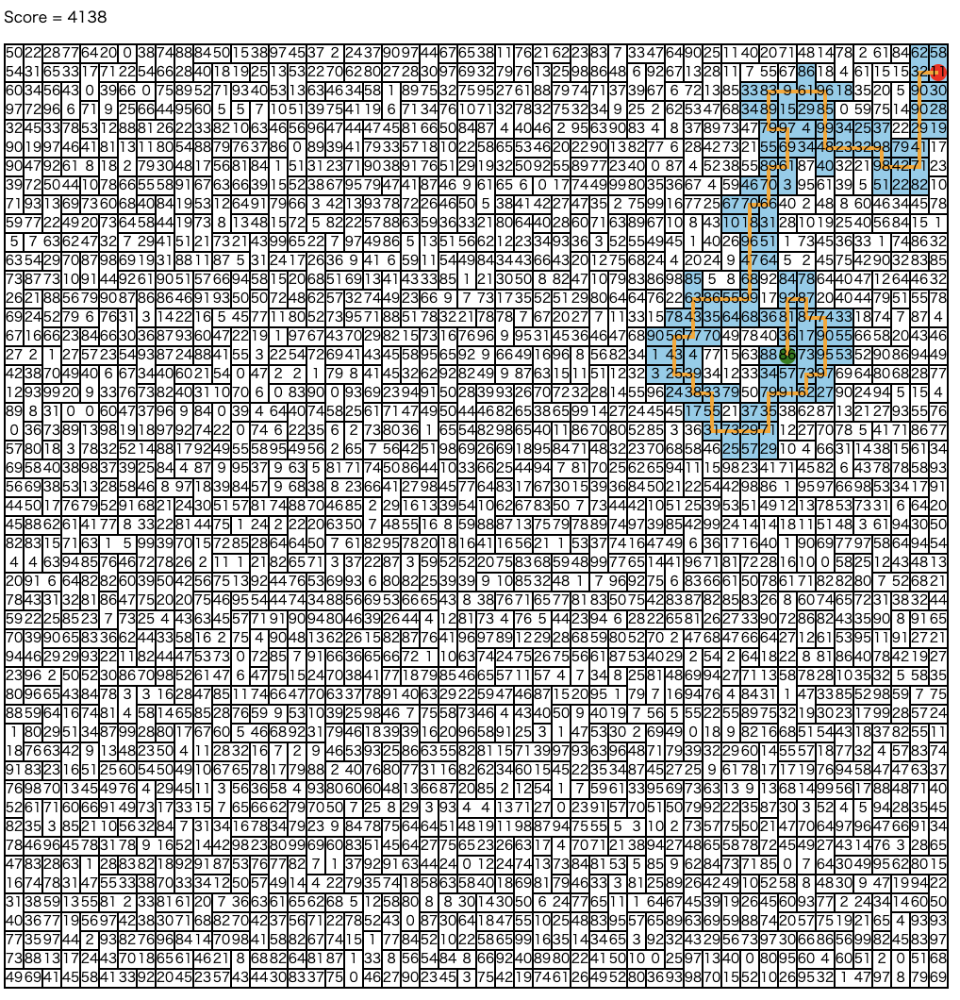

# AtCoder Heuristic Contest 002

[TOC]

## 問題概要

- https://atcoder.jp/contests/ahc002
- 50 \* 50 マスの床に 1x1,1x2,2x1 のいずれかのタイルが敷き詰められている
- あるマスからスタートし、同じタイルは 2 度踏まないように上下左右に移動できる
- 各マスには数字が書かれており、できるだけ通った経路上のマスの数値の合計が得点となる
- 得点が最大となるような経路を求めよ

## 時間

240 分

## 解説

- [ats5515さん](https://twitter.com/ats5515/status/1386324082581405705)
- [hoshi524さん](https://github.com/hoshi524/Marathon-Matome/blob/master/ahc002/ahc002.pdf)

## Links

- [agwさん Twitter まとめ](https://togetter.com/li/1704811)
- [Twitter hashtag AHC002](https://twitter.com/hashtag/AHC002)
