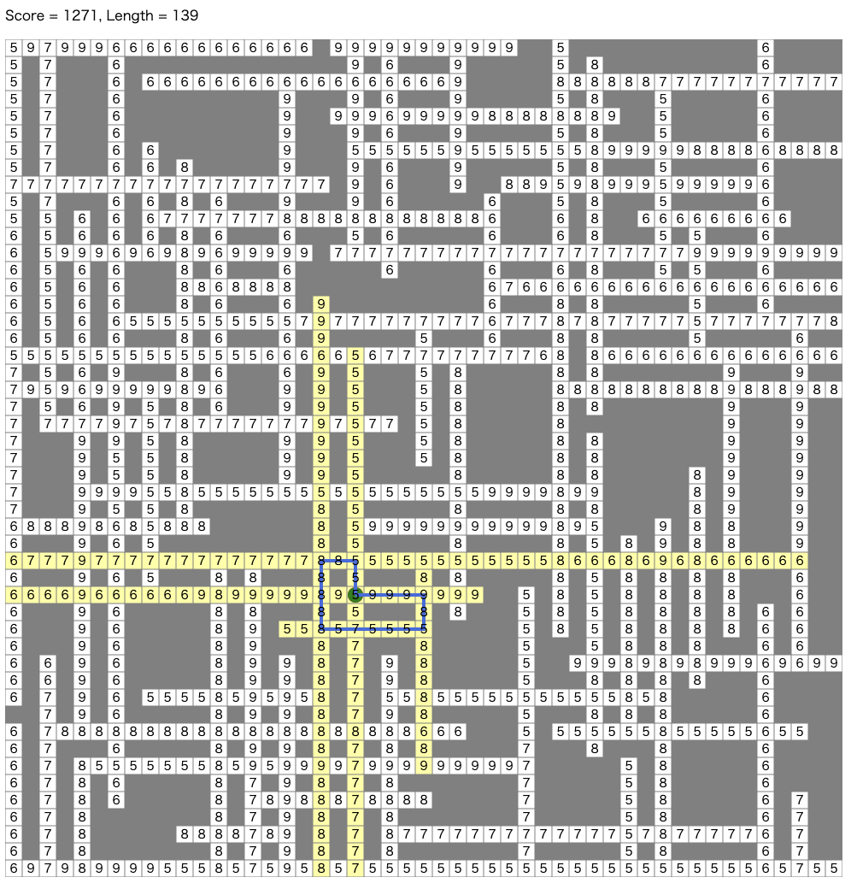

# AtCoder Heuristic Contest 005

- https://atcoder.jp/contests/ahc005
- https://atcoder.jp/contests/stage0-2021 (「STAGE:0 競技プログラミング高校生大会 powered by AtCoder」とパラレル)

## 問題概要

- N \* N マスの地図が与えられ、各マスは道路または障害物になっている
  - 道路の場合は、5〜9 の数字が書かれており、そのマスへの移動にかかる時間を表している
  - 道路からは隣接する道路に移動することができる
- あるマスにいるとき、その上下左右に続く道路は「視界に入る」
- 指定されたスタートマスから、すべての道路が「視界に入る」ように動いて、スタートマスに戻ってくるようなルートについて、できるだけ総移動時間が短いルートを求めよ

## 時間

240 分

## 個人的メモ

- ざっくり「全道路が視界に入るようなの交差点の部分集合を通って戻ってくる TSP」
- 「すべての道路が視界に入っているか」判定
  - 交差点列挙した後、`dp[N][N]`みたいに持って、交差点を選んだら上下左右に+1、選ばなくしたら上下左右に-1 みたいにすると更新に O(N)程度かかってしまう
  - 連続した道路列(線分、辺)に対して ID を割り振って、道路列上の交差点とのペア`(線分ID, 交差点ID)`で扱うようにすると、更新が O(1)程度にできる
- 通る頂点集合最適化と TSP 最適化を一緒に焼きなます
  - 交差点巡回の場合。交差点の追加削除近傍、2-opt 近傍
  - 道路列巡回の場合は、`(線分ID, 交差点ID)`の順番を最適化して、最短時間計算時にうまく交差点無視しつつ計算する、などもできる

## 解説

- [c7c7さん](https://twitter.com/C7C7LL/status/1423963600280973317)
- [phocomさん](https://twitter.com/_phocom/status/1423964300905910274)
- [hitonanodeさん](https://twitter.com/rsat__m/status/1423964658994618368)
- [tomerunさん](https://twitter.com/tomerun/status/1423964750367531015)
  - https://twitter.com/tomerun/status/1424298448690446336
- [assyさん](https://assy.hatenablog.jp/entry/2021/08/08/000925)

- [社長コメント](https://twitter.com/chokudai/status/1423964972002930695)

## Links

- [agwさん Twitter まとめ](https://togetter.com/li/1756054)
- [Twitter hashtag AHC005](https://twitter.com/hashtag/AHC005)

