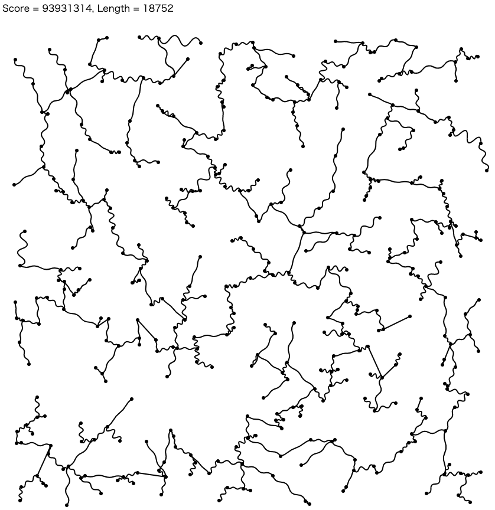

# THIRD プログラミングコンテスト 2021(AtCoder Heuristic Contest 007)

- https://atcoder.jp/contests/ahc007

## 問題概要

- 頂点数 N、辺の数 M の無向グラフがあり、辺 i の長さ l は、頂点間のユークリッド距離を d とすると、d <= l <= 3 \* d であるが、正確な値は最初はわからない
- ターン i では、辺 i の正確な距離が与えられるので、その辺を選択するか否かを答える
- 最終的に選んだ辺が全域木になっており、その選択した辺の長さの合計が最小になるようにせよ

## 時間

240 分

## 個人的メモ

- 毎ターン、その辺を選択した/選択しなかった場合の「最終的な最小全域木の総距離の期待値」を計算できれば、期待値が低くなる場合に選択、そうでないなら選択しない、とする greedy が考えられる
- 期待値を正確に算出するのは難しいので、近似的に求めることになる

### 近似の仕方

- l=2d を仮定
  - https://www.terry-u16.net/entry/ahc007-explanation
  - 残りの不明な辺の長さを l=2d と仮定するのは、実はそんなに良い解が得られない
  - 目指している解では l=d に近い辺を採用しているはずなので、大きめに期待値を計算している可能性
  - 2 じゃなく少し小さめの値にすると少しだけよくなる
- モンテカルロ法
  - 長さが不明な辺に対して実際に値を割り当ててみたものをいくつか用意して、コスト平均を見る
- wataさんの DP 解

### その他の方針

- 辺の採用確率
  - ランダムに辺の長さを割り当てたグラフをいくつか用意して最小全域木を計算
  - 作った最小全域木でその辺が採用される確率が X 以上なら採用

### その他

- 近くの辺のみ考慮
  - グラフを見ると結構「塊」みたいになっているので、近くの辺だけを考えるなどの高速化は有効だった模様
- ランダムに辺の値を決めるときに乱数の範囲 d〜3d ではなく、少し狭めると結構変わるっぽい
  - https://twitter.com/5bin101/status/1469992023121924101
  - https://blog.knshnb.com/posts/ahc007-optuna/

## 解説

(50 位まで&発言を見つけられた方のみ)

- [解説(公式)](https://atcoder.jp/contests/ahc007/editorial)
- [writer 解(wataさん)](https://twitter.com/wata_orz/status/1469986628517376004)
  - https://twitter.com/wata_orz/status/1469992225484713984
  - https://twitter.com/wata_orz/status/1470733095179792385
  - https://twitter.com/wata_orz/status/1470767323510616065
  - https://twitter.com/wata_orz/status/1470768152649027588
- [社長解(chokudaiさん)](https://twitter.com/chokudai/status/1469987427393892353)
- [square1001さん](https://twitter.com/square10011/status/1469986298685722633)
- [bin101さん](https://twitter.com/5bin101/status/1469992023121924101)
- [saharanさん](https://twitter.com/shr_pc/status/1469989780809478147)
  - https://twitter.com/shr_pc/status/1469995102513033222
- [tute7627さん](https://twitter.com/tute7627/status/1469986542563491840)
  - https://twitter.com/tute7627/status/1469991054283710464
- [olpheさん](https://twitter.com/_olphe/status/1469985927556927494)
  - https://twitter.com/_olphe/status/1469990829909745669
- [kawateaさん](https://twitter.com/kawatea03/status/1469987323610013700)
- [daijuさん](https://twitter.com/WniKwo/status/1469987016536629248)
- [firiexpさん](https://twitter.com/m_idiri/status/1469986645013561346)
- [Shibungiさん](https://twitter.com/Shibungi_kyopro/status/1469987076926238720)
- [noimiさん](https://twitter.com/noimi_kyopro/status/1469986997582594050)
- [cunitacさん](https://twitter.com/CUteNeuron/status/1469987798388453381)
- [terry_u16さん](https://twitter.com/terry_u16/status/1469991344982888448)
  - https://www.terry-u16.net/entry/ahc007-explanation
- [rabotさん](https://twitter.com/tanaka_a8/status/1470010825666891785)
- [hamamuさん](https://twitter.com/hamamu_kyopro/status/1470007379609931777)
- [threecourseさん](https://twitter.com/threecourse/status/1469986759274803204)
- [sansenさん](https://twitter.com/akakimidori/status/1469986752370995206)
  - https://twitter.com/akakimidori/status/1469986907455365124
  - https://twitter.com/akakimidori/status/1469989653218758665
- [fuppy0716さん](https://twitter.com/fuppy_kyopro/status/1469986470257901570)
  - https://twitter.com/fuppy_kyopro/status/1469987223961751554
  - https://twitter.com/fuppy_kyopro/status/1469986968360873986
- [assyさん](https://twitter.com/assy1028/status/1469988350279176192)
  - https://assy.hatenablog.jp/entry/2021/12/13/205320
- [tsukammoさん](https://twitter.com/tsukammo/status/1469985929826021376)
- [shibh308さん](https://twitter.com/shibh308/status/1469986167567581186)
- [phocomさん](https://twitter.com/_phocom/status/1469995485239078913)
- [suisenさん](https://twitter.com/_su1sen/status/1469986769383079937)
- [tomerunさん](https://twitter.com/tomerun/status/1469986110281760774)
- [iraytnoさん](https://twitter.com/iray_tno/status/1469989827613700100)

## Links

- [agwさん Twitter まとめ](https://togetter.com/li/1815565)
- [Twitter hashtag AHC007](https://twitter.com/hashtag/AHC007)

