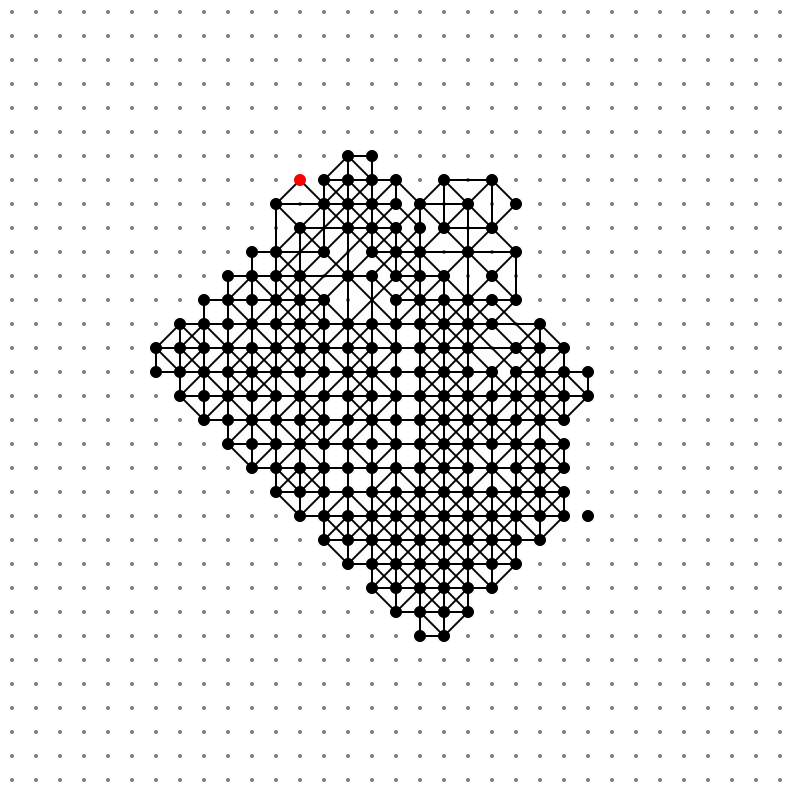

# estieプログラミングコンテスト2022(AtCoderHeuristic Contest 014)

- https://atcoder.jp/contests/ahc014

## 問題概要

- N \* Nの方眼紙上に格子点があり、M個の格子点には印がついている
- 以下の操作を可能な限り繰り返すことで印と長方形を描いていく
  - まだ印のついていない格子点p_1と、印がついている格子点p_2,p_3,p_4が以下の条件をすべて満たすものを選ぶ
    - この4点を順番に結ぶと、軸に平行、または、45度傾いた長方形になる
    - 長方形の外周上にはこの4点以外の印のついた格子点がない
    - 長方形の外周はすでに書かれた他の長方形と辺を共有しない(点で交わるのはOK)
  - 条件を満たす格子点に印をし、長方形を方眼紙に描く
- 格子点には重みがあり、印がついた格子点の重みの和に基づく得点が得られる
- できるだけ高得点が得られるようにゲームをプレイせよ(操作列を求めよ)

## 時間

- 340時間

## 個人的メモ

- できるだけ中心から遠く＆多くの格子点に印をつける、のが難しい問題
- 方眼紙の部分領域の破壊＆再構築＋小さい長方形を優先する焼きなましが強かった模様
  - 操作列を求める問題だが、盤面の局所性を活かせるかが鍵だった

### 問題固有の性質

- 小さい長方形の方を優先したほうが良い
  - 大きい長方形は遠くに行けるが、後々邪魔になりやすい
  - 良い解(高密度な解)の場合は1x1長方形を多用する
- 各頂点について、その頂点が接する長方形の数は最大4つまで
  - 8方向あり、長方形で2方向消費するため
  - 長方形の形や周囲の長方形の状況で、4つにできない場合が出る
  - できるだけ4つの長方形に接するようにしたほうが良い
- パリティ的なのが揃うと外に広げられる(ピラミッド)
  - 1x1で、斜め長方形は2マスずつ、軸に平行な長方形は市松模様っぽく置ける場合
  - https://twitter.com/kusano_k/status/1576220002130472960

### 盤面の局所性

- 盤面に注目すると、ある部分領域の格子点の印を削除したい場合、それに依存している格子点＆長方形を連鎖的に削除することで、部分的に作り直すことが可能
- 実際は、「上の方はうまくできてても下の方はうまくいっていない」ような場合に、下の方だけやり直すなどが可能
  - 自分は、採用してたアプローチのためか、文脈がかなり強いと思い、ある長方形を削除したらそれ以降においたすべての長方形が削除されうると思ってしまっていたので部分破壊は難しいのでは？と思って考慮から除いてしまっていた、、、

#### 長方形または部分領域内の印のある格子点の削除＆再構築

- 領域の部分破壊＆再構築を近傍とすることで、焼きなませる
  - 今回の場合は、矩形領域内でなくても、ある格子点を選ぶと連鎖的に関連する格子点、長方形がでてくるので、それでもある程度の範囲が消える

#### 操作の依存関係をグラフとみなす

- 操作同士の依存関係をグラフにして深さを調べる
  - https://twitter.com/Shun___PI/status/1576160234636091392
- トポロジカルソートによる操作列の入れ替え
  - 格子点に印を付けたことで新たに置けるようになった印は、依存関係が有向グラフでかけるので、操作列の長方形も有向グラフにできる
  - トポロジカルソートすることで、操作列の途中から最後までを消すことができる(前側に依存しないので)
  - いい感じに順番をぶらして後ろ側を消す＋再構築することで、依存関係を壊さずに状態を変更できる
    - https://sites.google.com/view/pixy-kyopro/ahc%E5%8F%82%E5%8A%A0%E8%A8%98/ahc014
    - https://twitter.com/sash277/status/1576160956727824384

### 盤面の状態の持ち方

- 印の有無、その格子点の8方向について長方形の辺を持つか否か
  - `bool[N][N]`、`bool[N][N][8]`
- 印の有無、辺の有無(4方向)
- 印の有無、対応する辺の終了位置

### 合法手の列挙、高速化

- 盤面の合法手の列挙は、単純にやるとかなり時間がかかってしまう
  - 3点選んで長方形になるか＋外周に他の点や辺がないかチェック、などだと結構重い
- ここらへんはうまく高速化する
  - p_3に対応する印のある格子点を選んで、長方形の角度を決めれば8パターンだけになる
    - 途中に印のある格子点や他の長方形の辺がない必要があるため、p_2やp_4はその方向で一番最初に見つかった印のある格子点になる
  - p_1を選んで同じようにする方法もあるが、外周チェックをO(N)でやると、印がない格子点のほうが多いので、p_3を中心に探索したほうが無駄が減る
    - ただ、自分は、外周チェックを更新O(N)確認O(1)にしていたので、p_1でやっていたが、p_3に変更してもあんまり変わらないと思う

#### 手の評価値

- 手に優先度をつけることで、より良い操作列を選びやすくする
- 問題の性質から、「小さい長方形のほうがよい」「各頂点についてできるだけ接する長方形数が多いほうがよい」などを取り入れる
  - 1x1を優先、各頂点について180度反対方向の辺が使われているか、他の辺上に印をつけるか
  - 固定パターン(良い部分形)にマッチしているか
  - 各頂点の次数の和
  - 長方形の大きさ
  - 頂点の重み
  - など

#### 手をランダムに選ぶ方法

- https://twitter.com/terry_u16/status/1576231985596764160
- https://twitter.com/ntk_ta01/status/1576309454928506880
  - roulette-wheel-selection

### 盤面の評価値、ビームサーチ

- ゲームの途中の盤面の評価が難しく、「盤面に対する評価値」が使いにくい
  - 単純なスコアでは、先に外側に置こうとして大きな長方形を使いがちになってしまう
  - 最後の方まで手を進めて見ないと良し悪しが決まらない
- そのため、ビームサーチやゲーム木探索でうまくスコアを取るのが難しかった
- とはいえ、ビームサーチで60M超えはできるらしい
  - https://twitter.com/hari64boli64/status/1576157001633001473

### その他

- seed=0の1M超え
  - ymatsuxさんの1,019,259点
    - https://twitter.com/ymatsux_ac/status/1576135034414968832
  - terry_u16さんの1,009,330点
    - https://twitter.com/terry_u16/status/1574785571066589184
- 強化学習、DQN
  - https://twitter.com/Shun___PI/status/1576233441481592832
  - https://twitter.com/Shun___PI/status/1576261913519849473
  - https://twitter.com/Shun___PI/status/1576278422737022976
- 問題の元ネタ
  - Join Five
  - https://en.wikipedia.org/wiki/Join_Five

## 解説

(50位まで&発言を見つけられた方のみ)

- [解説放送(公式)](https://www.youtube.com/watch?v=eddDPITjzDc)
- [解説(公式)](https://atcoder.jp/contests/ahc014/editorial)
- [writer解(wataさん)](https://atcoder.jp/contests/ahc014/submissions/35260618)

- [1位 bowwowforeachさん](https://twitter.com/bowwowforeach/status/1576151587126640641)
  - https://twitter.com/bowwowforeach/status/1576154269564432384
  - https://twitter.com/bowwowforeach/status/1576156945291313152
  - https://twitter.com/bowwowforeach/status/1576515420009693185
- 2位 ynasuさん
- [3位 terry_u16さん](https://twitter.com/terry_u16/status/1576150413782327296)
  - https://twitter.com/terry_u16/status/1576154746305777664
  - https://twitter.com/terry_u16/status/1576155146094280704
  - https://twitter.com/terry_u16/status/1576214080464965632
  - https://twitter.com/terry_u16/status/1576231985596764160
- 4位 kozimaさん
  - https://twitter.com/t33f/status/1576152524280987648
  - https://twitter.com/t33f/status/1576156121160568832
  - https://twitter.com/t33f/status/1576158196238278656
  - https://twitter.com/t33f/status/1576167342240768006
  - https://twitter.com/t33f/status/1576150385701814272
  - https://twitter.com/t33f/status/1576192230481891332
  - https://twitter.com/t33f/status/1576195028816232448
  - https://twitter.com/t33f/status/1576206672032587782
  - https://twitter.com/t33f/status/1576216905962037249
  - https://twitter.com/t33f/status/1576217442606796802
- 5位 Rafbillさん
- 6位 Aquariusさん
- [7位 tomerunさん](https://twitter.com/tomerun/status/1576150783711932418)
- [8位 EmKさん](https://twitter.com/EmKjp/status/1576152024713814016)
  - https://twitter.com/EmKjp/status/1576153245093097472
  - https://twitter.com/EmKjp/status/1576155565474349058
- [9位 penguin46さん](https://twitter.com/ryota_cpp/status/1576150343376809984)
  - https://twitter.com/ryota_cpp/status/1576163136331141120
  - https://penguin46.hatenablog.com/entry/2022/10/01/191428
  - https://penguin46.hatenablog.com/entry/2022/10/01/191358
- [10位 eijirouさん](https://twitter.com/eijirou_kyopro/status/1576205208379457536)
  - https://eijirou-kyopro.hatenablog.com/entry/2022/10/02/184706
- 11位 sash0さん
- [12位 kensさん](https://twitter.com/kens_kyopro/status/1576151871634694144)
  - https://twitter.com/kens_kyopro/status/1576153029182910464
- [13位 wanuiさん](https://twitter.com/gmeriaog/status/1576151075886768128)
  - https://twitter.com/gmeriaog/status/1576152049854488576
  - https://twitter.com/gmeriaog/status/1576167888871833601
  - https://twitter.com/gmeriaog/status/1576173765481811968
  - https://twitter.com/gmeriaog/status/1576260699021447169
  - https://twitter.com/gmeriaog/status/1576276211239571456
- [14位 fuppy0716さん](https://twitter.com/fuppy_kyopro/status/1576157119174217728)
  - https://twitter.com/fuppy_kyopro/status/1576162606905438209
  - https://twitter.com/fuppy_kyopro/status/1576161955265794049
- [15位 saharanさん](https://twitter.com/shr_pc/status/1576152559139442693)
  - https://twitter.com/shr_pc/status/1576154626122211328
  - https://twitter.com/shr_pc/status/1576169792595144704
  - https://twitter.com/shr_pc/status/1576175080203489281
  - https://twitter.com/shr_pc/status/1576158157499695104
  - https://twitter.com/shr_pc/status/1576160486974173185
- [16位 highjumpさん](https://twitter.com/highjump_425/status/1576153438328881153)
- 17位 dn6049949さん
- [18位 shibh308さん](https://twitter.com/shibh308/status/1576151638532050944)
- 19位 c7c7さん
- 20位 rhooさん
- [21位 arimattiさん](https://twitter.com/pg_ariii/status/1576156402774515712)
  - https://twitter.com/pg_ariii/status/1576169896643244034
  - https://twitter.com/pg_ariii/status/1576173286056427520
- 22位 saitodevel01さん
- [23位 ymatsuxさん](https://twitter.com/ymatsux_ac/status/1576153267939446784)
- [24位 hari64さん](https://twitter.com/hari64boli64/status/1576157001633001473)
  - https://twitter.com/hari64boli64/status/1576157838862213121
  - https://twitter.com/hari64boli64/status/1576163230765838337
- 25位 hoshi524さん
- 26位 dissonanceさん
- 27位 brown_amaurotisさん
- [28位 yunixさん](https://twitter.com/yunix91201367/status/1576152791797891073)
  - https://twitter.com/yunix91201367/status/1576155278474899456
  - https://twitter.com/yunix91201367/status/1576156773706526731
  - https://twitter.com/yunix91201367/status/1576162212594737152
  - https://yunix-kyopro.hatenablog.com/entry/2022/10/01/190445
- [29位 s_shoheiさん](https://twitter.com/s_shohey/status/1576151122611384320)
- 30位 sensaurさん
- 31位 tishii24さん
- [32位 mtsdさん](https://twitter.com/soiya_ksk/status/1576153307827273728)
  - https://twitter.com/soiya_ksk/status/1576152218423939072
- 33位 bin101さん
- [34位 dn154さん](https://twitter.com/shakaijin_ex/status/1576151588322045953)
- [35位 pesさん](https://twitter.com/pes_magic/status/1576152361705230336)
- [36位 hamamuさん](https://twitter.com/hamamu_kyopro/status/1576151748468961280)
- [37位 yochanさん](https://twitter.com/yochan_tech/status/1576153792839835650)
  - https://twitter.com/yochan_tech/status/1576155044042657792
- 38位 BURIさん
- [39位 iehnさん](https://twitter.com/arimasenu/status/1576170325464973312)
- 40位 roto_37さん
- 41位 tokuさん
- [42位 maeda3さん](https://twitter.com/dj_maeda3/status/1576153759830667266)
- 43位 hirataiさん
- [44位 hirokazu1020さん](https://twitter.com/hirokazu1020/status/1576163910637346816)
- 45位 Haaさん
- 46位 zachさん
- [47位 sumoooruさん](https://twitter.com/sumoooru/status/1576164755873857536)
- [48位 komori3さん](https://twitter.com/komora71_/status/1576150948623183873)
  - https://twitter.com/komora71_/status/1576157301802606593
  - https://twitter.com/komora71_/status/1576158532080017410
- [49位 pixyさん](https://twitter.com/pixy_kyopro/status/1576155154528673792)
  - https://twitter.com/pixy_kyopro/status/1576155731027722241
  - https://twitter.com/pixy_kyopro/status/1576167814943354881
  - https://twitter.com/pixy_kyopro/status/1576157645157040128
- 50位 ChiyosBigDragonさん

## Links

- [matsu7874さんまとめ](https://togetter.com/li/1952553)
- [Twitter hashtag AHC014](https://twitter.com/hashtag/AHC014)
- [wleiteさんstatistics](https://tc-wleite.github.io/ahc014.html)
- [kiri8128 さん Score-Performance グラフ](https://twitter.com/kiri8128/status/1576456482803298304)
