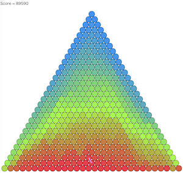

# TOYOTA Programming Contest 2023 Summer (AtCoder Heuristic Contest 021)

[TOC]

## 問題概要

- https://atcoder.jp/contests/ahc021
- N(=30)段のピラミッド型にボールが並んでいる
- 各ボールには、0からN*(N+1)/2-1の数字が書かれており、すべてのボールの数字は異なる
- 1回の操作で、あるボールについて、隣接する左上、右上、左、右、左下、右下の6方向にあるボールと入れ替えられる
- 最下層以外で、どのボールについても左下と右下のボールの数字よりも小さい状態になるようにしたい
- できるだけ操作回数を少なくなるような操作列を求めて、目的の状態になるようにせよ

## 時間

- 4 時間

## 個人的メモ

- いろいろ貪欲解を試して、良い性質を押さえて、さらなる工夫を試す、というのができるとよかった模様
- 特に、今回は強い貪欲解があり、それを見つけられるだけで予選通過ラインの200位以上が取れていた
  - 重要な性質を押さえられてない状態では、高スコアを出すのは難しかった

### 問題固有の性質

- ソートっぽい雰囲気
  - バブルソート的な感じ？
- 手順が間に合えば、上から順番に番号を埋めていくことで条件を違反している数を0にできるので、50000点以上は取れる
  - 基本、間に合うので、最終状態で、条件を違反しているようなものはないものとして考えるとよい
- ボールの番号は、最終状態では、小さいものが上の方、大きいものが下の方になるはず
- 隣接2ボールのswapは、小さいものが上に＆大きなものが下に来るようなものを同時に行えるようなものが効率がよい
  - 横方向のswapは判断が難しい

### 有効な最終状態(完成状態)

- 条件の「どのボールについても左下と右下のボールの数字よりも小さい状態」というのを満たす状態として、自明には、上＆左から0,1,2,...という状態になっていれば満たせている
  - また、その状態で、同じ行のところのボールは入れ替えても条件を満たせている
    - https://twitter.com/__hiraku__/status/1672921186525921282

- しかし、これ以外にも条件を満たす形があり、上の図のような「下部中心に向かって数字が大きくなるような配置」なども条件を満たせている
  - むしろ、こちらの形になる方が手数は少なくなるため、上から行を順番に埋めていくようなアプローチではスコアが出せなかった
  - 一番下の行に「29」番のボールが来るようなのもvalid
    - https://twitter.com/k_k_pyrhon/status/1672943547467837440
  - 問題文にある4段の場合のgif動画の最終状態も5が最下段に来ているが有効なケース
- 解の形を決め打ちせず、いろんな貪欲解がうまくいくかを試せていれば、気づけていたはず、、、

#### 性質

- 最終状態では、ある番号について、そこより上方向にひし形の領域では、その数字よりも小さいもののみで構成される
- ピラミッドの端の方では、その数字より小さいボールの数が少なくて済むため、小さい番号のボールが下の方に来てもvalidになる
  - 下の方にある小さい番号のボールの移動距離が短くて済む
  - 端の方が小さい数字でも許されやすいので、全体的な形として「下部中心付近に数字が大きいものが集まっている」状態になるのは自然

### 貪欲解

- いくつか単純なルールを繰り返す貪欲解を試すことで、良い性質を探れる(ここで、最終状態を決め打ちしないことも大切)
  - 上/下、右/左から順番に「違反しているもの」をswapしていく、ことを繰り返す
  - 小さい/大きい番号のボールから「違反している場合swap」を繰り返す
  - あるボールについて、上/下のペアで大きい方/小さい方とswap
  - 差が大きいペアをswap
  - 上/下方向だけ使う、横方向も使う
  - できるだけ左右に寄せる
  - など

#### 停止性

- 繰り返す系の解法では、最終的に停止するか？も問題になる
- 解説放送では、ポテンシャル$\sum_x h(x) * b(x)$を考えて、swapによって増加して、これは有限なので停止する、というのが紹介されていた
  - xはピラミッドでの位置、h(x)は位置xの高さ、b(x)は位置xのボールの番号
  - 違反しているところでは、上側が大きい番号で下側が小さい番号なので、`h*大+(h+1)*小`が`h*小+(h+1)*大`となって大小関係的には後者が大きい

#### 番号が小さい方から/大きい方から、の違いの考察

- 解説放送では、「ある行まで決まったとして、残りのボールがランダムに配置されていると仮定した場合」でおおよその期待step数を見積もる方法が紹介されていた
  - 小さい方からの方が期待step数が小さい
  - (ただし、実際はランダムな配置ではないなどで、あくまで近似の値)

### 強い貪欲解(13,426,585点)

- 「小さい番号から、上に向かって番号が大きければ交換する、を繰り返す。上のどちらも大きい場合は、番号が大きい方と交換する」という貪欲が強い
  - 「小さい番号から」「大きい番号と交換」などが強い性質
- これは、順位表で、開始後早い段階から同スコアで並んでいることから、シンプルで強い貪欲解がある可能性があることを示唆
  - 開始後30分ですでに1位がこの解法で埋まっていて、開始後1時間で50人ぐらいいたらしい
    - https://twitter.com/pu__Ne/status/1672924612013981697
    - https://atcoder.jp/contests/ahc021/editorial/6680
  - 最終順位でも150〜200位付近に44人並んでいる
- 平均89,511点/ケース
- (上図はこの解法でのSeed=0の最終状態)

### 貪欲解の改善

- 上の強い貪欲解や「差が大きいペアをswap」などが良い解を作っているので、これを改善することを考える
- 強い貪欲解法で考えると、小さい番号のボールから処理するとして、ボールの動かし方に探索の余地がある
- あるボールを上に持っていくときの経路で、貪欲解では直近しか見ていないが、経路上で番号が大きいものが多いほどよさそうに思われる
- また、経路をどうするかで、最終地点の位置や他のボールの配置も変わりうるので、後の方で嬉しい配置になるものを選ぶのも大事そうに思われる

#### 評価値が良い経路を選ぶ

- ボールを上方向に動かすときの経路で、できるだけ大きい番号を多く下にさげるような経路を探したい
- DP/ダイクストラ等で、ピラミッドの上方向に向かって探索して、経路復元
- 辺や頂点の重みは、基本は、「移動回数が最小で、番号の大きさの合計が一番大きいもの」的な感じだが、他にもバリエーションが考えられる
  - 通った数字の和/平均値
  - 移動回数(swap回数)
  - 移動方向に応じた重み(横方向も許すが大きめの重みを追加、など)
  - 最終地点の中央からのズレ具合/端への近さ
  - など

#### 盤面の評価値が良くなる状態を選ぶ

- ピラミッドのボールの状態の評価値として、上の「ポテンシャル」のようなものなどが考えられる
  - xを番号として、「ボールxの高さ * x」の和
    - 「ボールxの高さ * sqrt(x)」 の和
  - 違反しているペアの数
  - など
- この評価値を使って、ビームサーチで探索
- 1step
  - (違反しているところの)隣接swap1回
  - 上記の経路の移動を1回
  - など
- 重複排除
  - 確定済みのボールの状態の違いは無視
- 状態を差分で木構造を行き来するテク / euler-tourビームサーチ
  - advance/undo操作で状態を行き来する(差分)やつ
  - https://qiita.com/rhoo/items/f2be256cde5ad2e62dde
  - https://atcoder.jp/contests/ahc021/editorial/6681
    - https://gitlab.com/rafaelbocquet-cpcontests/euler-tour-beam-search

#### 途中状態を変える

- swapするときに一定確率でswapするものを変える、乱択
  - 全体で適用、最初の方だけ適用、など
- 手順の途中を変えて、それ以降は貪欲したもので完成させ、山登り
  - greedy解を評価関数にする
  - 「過去に戻ってワープ/過去改変」(解説放送)
    - ある経路のボールの移動について、対象のボールの隣接ボールのswapを先におこなっておくと、1手で移動するボールを入れ替えられる
    - 条件付き「離れたボールの交換」的な感じにできる

### その他

#### 完成形を焼き鈍す

- AHC011では「完成形を決めて操作列を作る」というアプローチが強かった
- 今回、同様のアプローチが考えられたが、実際に良いスコアが出るかは見積もるのが難しかった
  - (というか、完成形を作るところからうまくいかずコンテスト時間を無駄にしてしまっていた、、、)
  - 初期状態からスタートして2点swapとかだと違反数を0にできないし、自明な違反0の状態から違反0を保ったままの移動だとあまり盤面が変わらない
  - さらに、単純に各ボールの距離合計とかを最小化しようとしても、実際は移動によって最初の位置からずれるため結構無駄移動が発生してしまっていた
- 解説放送では、スライドパズルの場合は、今回とは違って順番に決めるのが難しかったが、今回は順番に決めていけたり、決めたものが後の操作で邪魔にならないなどの良い性質がある、など違いがあったことが紹介されていた
  - 実装量も多く、うまく動くかわからないため、結構博打なアプローチだった

#### ビジュアライザ

- ボールのクリックで経路の表示のON/OFFが切り替えられた

## 解説

(50位まで&発言を見つけられた方のみ)

- [AHCラジオ(解説放送)](https://www.youtube.com/watch?v=VCFmQ4Aa0lg)
- [解説(日本語)](https://atcoder.jp/contests/ahc021/editorial)
- [解説(英語)](https://atcoder.jp/contests/ahc021/editorial?editorialLang=en)
- [writer解](https://twitter.com/wata_orz/status/1672909824865226752)
  - https://atcoder.jp/contests/ahc021/submissions/42958368

- [mtsdさん](https://twitter.com/soiya_ksk/status/1672910751575724032)
  - https://twitter.com/soiya_ksk/status/1672954595147141124
- [Rafbillさん](https://atcoder.jp/contests/ahc021/editorial/6681)
- [saharanさん](https://twitter.com/shr_pc/status/1672911886202048513)
- [hitonanodeさん](https://twitter.com/rsat__m/status/1672914191827767298)
- [kaz_mightyさん](https://twitter.com/kaz_mighty/status/1672909269593911296)
- [risujirohさん](https://twitter.com/risujiroh/status/1672909355522605059)
  - https://twitter.com/risujiroh/status/1672920755406012417
  - https://twitter.com/risujiroh/status/1673300072052953090
- [KoDさん](https://twitter.com/d7511168/status/1672911054450614272)
- [Shun_PIさん](https://twitter.com/Shun___PI/status/1672909131127353346)
- [chokudai社長](https://twitter.com/chokudai/status/1672913172674797568)
  - https://twitter.com/chokudai/status/1673146871479676929
  - https://twitter.com/chokudai/status/1673136259852795906
  - https://twitter.com/chokudai/status/1672936641273675776
- [niuezさん](https://twitter.com/xiuez/status/1672909765402570753)
  - https://twitter.com/xiuez/status/1672913289255460866
- [kotatsugameさん](https://twitter.com/kotatsugame_t/status/1672917659728621569)
  - https://twitter.com/kotatsugame_t/status/1672921996890619904
  - https://www.youtube.com/watch?v=fTRl9PNYi5Q
- [ttttanさん](https://twitter.com/ttttankyoupro/status/1672912628015067137)
- [heno239さん](https://twitter.com/heno_code/status/1672909020976517120)
  - https://twitter.com/heno_code/status/1672910978156236800
- [phocomさん](https://twitter.com/_phocom/status/1672909449466638337)
- [sigma425さん](https://twitter.com/sigma425/status/1672907968491433984)
  - https://twitter.com/sigma425/status/1672908866919727104
- [hitoareさん](https://twitter.com/hitoare1/status/1672908648769806337)
- [milkcoffeeさん](https://twitter.com/milkcoffeen/status/1672910631643795456)
- [Kiri8128さん](https://twitter.com/kiri8128/status/1672909807190413318)
- [colunさん](https://twitter.com/colun/status/1672908937593786369)
  - https://twitter.com/colun/status/1672910340915630080
  - https://twitter.com/colun/status/1672940324568842246
  - https://twitter.com/colun/status/1672965890428764160
  - https://twitter.com/colun/status/1672969192155541504
  - https://twitter.com/colun/status/1673176113819049985
  - https://twitter.com/colun/status/1673200452220121088
  - https://twitter.com/colun/status/1673681236878041090
- [shibh308さん](https://twitter.com/shibh308/status/1672909895765753856)
- [ymatsuxさん](https://twitter.com/ymatsux_ac/status/1672924947075956738)
- [hirataiさん](https://twitter.com/kyogi_hirame/status/1672909965328281600)
- [se1ka2さん](https://twitter.com/se1_ka4/status/1672907676639191040)
  - https://twitter.com/se1_ka4/status/1672907956067913728
- [netyo715さん](https://twitter.com/netyo715/status/1672909167361941505)
- [TheEpicCowOfLifeさん](https://atcoder.jp/contests/ahc021/editorial/6680)
- [threecourseさん](https://twitter.com/threecourse/status/1672909039817351168)
  - https://twitter.com/threecourse/status/1672914277311873026
- [kusanoさん](https://twitter.com/kusano_k/status/1672910301946331137)
- [c7c7さん](https://twitter.com/C7C7LL/status/1672908555748528128)
  - https://twitter.com/C7C7LL/status/1672910203204046849
- [Roy_Rさん](https://twitter.com/Roy_R_/status/1673662858758873090)
  - https://twitter.com/Roy_R_/status/1673961672103575552
- [Jirotechさん](https://twitter.com/Jiro_tech15/status/1672908873383178243)
- [fact493さん](https://twitter.com/fact493/status/1672908036212662279)
- [Moegiさん](https://twitter.com/mih28731325/status/1672908368376213504)
  - https://twitter.com/mih28731325/status/1673368796827103232
  - https://twitter.com/mih28731325/status/1673389567616126976
- [kenchoさん](https://twitter.com/border_of_ymg/status/1672918308822319106)

## Links

- [agwさんTwitterまとめ](https://togetter.com/li/2174660)
- [Twitter hashtag AHC020](https://twitter.com/hashtag/AHC021)
- [kiri8128さんScore-Performance グラフ](https://twitter.com/kiri8128/status/1672978440562298884)

