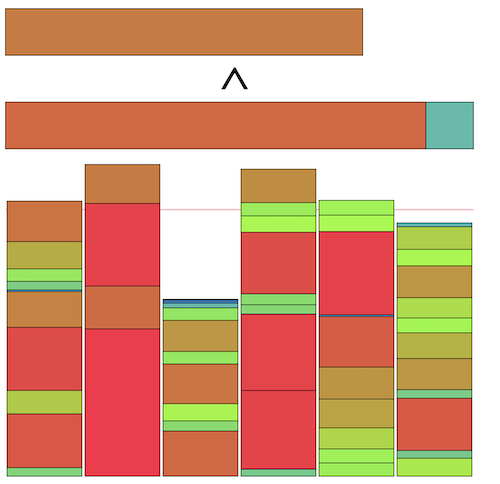

# AtCoder Heuristic Contest 025

- https://atcoder.jp/contests/ahc025

## 問題概要

- N個のアイテムがある
- ただし、アイテムiの重さw[i]が未知
- 天秤によって、指定した2つのアイテム集合の重さの総和を比較した結果を知ることができる
- Q回天秤で比較を行うことで、できるだけ重さの総和の等しいD個の集合に分割せよ

## 時間

- 199 時間

## 個人的メモ

- 基本的な局所改善を見つけて、より効率よく行う方法を見つけるのが重要だったみたい

### 基本アプローチ

- 2つの集合を選んで、アイテムを移動・swapする、を繰り返す局所改善(山登り)
  - 操作後に重さの差が前よりも小さくなっていれば採用
  - これは、「操作前の重い集合の重さ」と「操作後の重い集合の重さ」を比較して操作後のほうが小さければ良い
    - 重い集合から重いアイテム、軽い集合から軽いアイテムを選んでswapする場合は、必ず重い方が減って、軽い方が増えるので、元の軽い方の高さをチェックすれば良い
    - ここで、同じアイテムがある集合を比較することになるが、この比較は、それぞれから同じアイテムを除いたもの同士で比較すればよい
- 特に、2つの集合はできるだけ重い集合と軽い集合を選んだほうが(差が大きいので)成功率が高く、集合を常にソートした状態を維持すると、必ず選べる
- さらに、アイテムの重みの推定までやる場合は、重みの期待値から改善の可能性が高いものを選んで操作することで効率よく操作できる

### ソート

#### アイテムのソート

- Qが多い場合、各アイテムをソートする余裕がある
- 最初にソートしておくことで、2アイテムの大小関係を把握した上で操作できる
  - ランダム割当より良い初期解が作れる
  - あるアイテムiより小さいもので最大のアイテムを選ぶ
  - あるアイテムiよりも小さいものがなければ打ち切れる
  - あるアイテムが移動後に不採用なら、それより重いアイテムは不採用とわかる
  - など
- Qが少ないときでも、X個のアイテムだけソート、真ん中以外を狙ってソート、など

#### 集合のソート

- 集合について、最大重みのものと最小重みのものを対象にすると差が最大のため、ランダムに2集合を選ぶよりも差が大きいので改善できる可能性が高い
- 常に集合をソートしておくことで、最大のものと最小のものを対象にできる
  - 二分探索で挿入位置を決めるO(2logD)
- (自分はランダムに2集合を選んで既知の情報からできるだけ重みが離れるようにしたりしたけど、常に選べるわけではないので差がついてしまっていた模様)

#### ソートの種類

- できるだけ少ない回数でソートしたい
- 実験的にもマージソートが良かった模様？

### 局所改善操作

- 2つの集合(できれば最大と最小の重みの集合)について
  - 重い集合から軽い集合にアイテムを移す
  - 重い集合から軽い集合にアイテムをswapする
    - 1要素同士のswapの場合、2つの集合間の全部の組み合わせは必要なく、2つの集合のアイテムをまとめてソートして異なる集合での隣接だけ見れば良い
    - しゃくとり/二分探索的に探索したりなども
  - Largest Defferencing Methodを適用する
- ランダムに操作を選ぶというより、操作できなくなったら他の操作を有効にする、優先度を決めるとかがよいみたい
- 2つのアイテムをくっつけて扱う、2つの集合を混ぜて真ん中を2分探索でみつけて分割、とかも

### 大小関係の推定

- 問い合わせ内容によっては、過去の問い合わせ内容から大小関係を導き出せる
  - 推移律から`A<B`と`B<C`がわかっていれば`A<C`がわかる
  - `A+B<C`なら`A<C`かつ`B<C`がわかる
  - など
- ある`X<Y`が判明した場合、「Xより小さいとわかっているアイテム」と「Yより大きいとわかっているアイテム」の間にも大小関係が成り立つ
- ただ、上位の方だと重さの推定の方をしていそうで、あんまりここを頑張る感じではなかったっぽい？
  - 1対1より多い組み合わせを考えると計算量とかも厳しい

### 必要クエリ数の推定

- Q/Nを(1アイテムあたりのクエリ数)ベースに、クエリ数に余裕があるか見積もる
- ソートや検索にかかる最悪クエリ数を求めて必要クエリ数を見積もる
  - https://twitter.com/bowwowforeach/status/1716032987530482022

### 重さの推定

#### 線形計画法(LP)

- 問い合わせでは、アイテムの重みを変数とした不等式(等式)が得られる
- これらを満たす変数を見つけるために、線形計画法で求める？
- https://twitter.com/hari64boli64/status/1716037013382799427
  - https://twitter.com/hari64boli64/status/1716037490224816377
- https://twitter.com/ethylene_66/status/1716048409751331150
- https://twitter.com/birdwatcherYT/status/1716034189597044885

#### 重さの推定

- 具体的な重みが見積もれると、局所改善で改善する期待値が高いものを選べる
  - 最上位は重みの推定まで行っていた模様
- ランダム(指数分布に従う)に(いくつか)候補を生成→条件が増える→条件を満たさないものを破棄して再生成or修正→条件が増える→...、みたいな感じで推定
  - ギブスサンプリング？逐次モンテカルロ法？的な感じ
  - 再生成：全制約を満たす範囲を求めて打ち切った指数分布から再生性
  - 修正：条件を満たさない場合(不等号を逆にしたいので)重さの和を入れ替えるようスケーリング、過去の集合の大小関係に合わせてスケーリング
  - 候補を複数用意して期待値を計算
- 分布の分位点で推定
  - i番に重いアイテムの重さの期待値(分位点)を考える
  - これは、累積分布の逆数である分位点関数F^{-1}(p)=-1/λ*log(1-p)で期待値を見積もれる
    - ただし、入力生成方法で10^5*N/D以下で再生成されるのも考慮
  - `(2i+1)/2N`分位点を使う(p=0とp=1は使いたくないため？)
- 指数分布からN個生成、を何回(1000回程度)か実行して平均値でざっくり推定
- 条件を満たすように焼きなまし
- パーセプトロン風に学習し予測
- https://twitter.com/wata_orz/status/1716034332241051794
  - https://twitter.com/wata_orz/status/1716373444273885472
- https://twitter.com/eijirou_kyopro/status/1716089227140862264
- https://twitter.com/sugarrr_med/status/1716053911541620749
- https://montplusa.hatenablog.com/entry/2023/10/24/213200
- https://twitter.com/iiljj/status/1716036685832868047
- https://twitter.com/ymatsux_ac/status/1716051799680180669
- https://twitter.com/hamamu_kyopro/status/1716037388013916237
- https://twitter.com/yunix91201367/status/1716033843613114793
- https://ssaattoo.hatenablog.com/entry/2023/10/22/210022
- https://kiri8128.hatenablog.com/entry/2023/10/22/192752
- https://twitter.com/gmeriaog/status/1716035509653483720

### 順位スコアの扱い

- 今回は「順位スコア」(順位率)だった
- topの最適解がどの程度か見積もるのが難しいし、生スコアの悪化がどの程度影響するかも見積もりにくい
- 絶対スコアも相対スコアも適用しにくい問題だったっぽいが、ランダム性が強いところでぶれやすかったりもする

#### ローカルでの改善判断

- 何を参考にすればよいだろう？
- スコアの扱い
  - 相加平均、相乗平均
  - logを取ったスコア(相対スコア)
  - ケースごとの勝ち負け数
  - スコア*f(Q,D,N)
  - 手元でのベストスコアとの比較(ただしスコア1とか出ると微妙になる)

### その他

#### 数分割問題

- https://scmopt.github.io/opt100/76npp.html

#### Merge-Insertion sort(Ford–Johnson algorithm)

- Nが小さい(N<15なら最適、N<47なら最適の可能性が高いらしい)場合に最悪比較回数を最小限に抑えるソート
  - N=5を7回でソートできる
  - 実行速度がよいではなく、比較回数がよい
- 要素2つずつのペアにしてペア内をソート→各ペアの小さい方に対して同様に再帰的にソート→いい感じの順番で、各ペアの大きい方を2分探索で入れる位置を決めて入れる
  - いい感じというのは、2分探索する対象の長さと探索コストを考慮して無駄がでないように探索できるような順番で、という意味
- https://en.wikipedia.org/wiki/Merge-insertion_sort
- https://twitter.com/iwashi31/status/1716036715801125057
- https://twitter.com/iiljj/status/1716042633746006493
- https://atcoder.jp/contests/language-test-202001/tasks/practice_2?lang=ja
- https://twitter.com/tsukammo/status/1716441744278196374
  - https://github.com/decidedlyso/merge-insertion-sort/blob/master/README.md

#### スターリンソート

- (バケツソートのこと)
- https://twitter.com/yunix91201367/status/1716086099704168571
- https://qiita.com/sasanquaneuf/items/951c206284ffd49aec10

#### Largest Defferencing Method(LDM)

- 差分法、Karmarkar-Karpアルゴリズム
  - https://en.wikipedia.org/wiki/Largest_differencing_method
  - https://en.wikipedia.org/wiki/Karmarkar%E2%80%93Karp_bin_packing_algorithms
  - https://twitter.com/MickeyKubo/status/1716316014319964582
- 数字を降順に並べて、最大と最大の次に大きい数をその差分で置き換える、を繰り返す
- 要素が1つになったら、そこからバックトラックで実際の分割を復元する
  - 復元でどちらの分割にいれるかは、大きい方を自分と同じ分割に、小さい方を異なる分割にいれる
- 例: 数字の集合`S={8,7,6,5,4}`を集合`K=2`に分割する場合
  - 8と7を選んで差の1に入れ替えて`S={6,5,4,1}`
  - 6と5を選んで差の1に入れ替えて`S={4,1,1}`
  - 4と1を選んで差の3に入れ替えて`S={3,1}`
  - 3と1を選んで差の2に入れ替えて`S={2}`
  - 分割`2|φ`を考える
  - 2は3と1だったので、`3|1`に戻す(3を2があった方、1を他方に入れる)
  - 3は4と1だったので、`4|1,1`にする
  - 1は6と5だったので、`4,5|1,6`にする
  - 1は8と7だったので、`4,5,7|6,8`にする
- グラフで考えると2分木になる
- 3分割以上にも拡張できる

#### Largest Processing Time Heuristics

- https://scmopt.github.io/opt100/76npp.html
- 処理時間の長いジョブから順に、現状で最も合計完了時間が短い機械に割り振るのを繰り返す

#### 類似問題

- TopCoder MM127 CarRacing
  - https://inaniwa.hatenablog.com/entry/2021/06/17/171416
  - https://iwashi31.hatenablog.com/entry/2021/06/17/175032
  - https://togetter.com/li/1728312

### その他

- https://twitter.com/wata_orz/status/1716736455060734136
- https://twitter.com/idat_50me/status/1716089234862543106

## 解説

(50位まで&発言を見つけられた方のみ)

- [AHCラジオ(解説放送)](https://www.youtube.com/watch?v=CrzS-Tgnloc)
- [解説(日本語)](https://atcoder.jp/contests/ahc025/editorial)
- [解説(英語)](https://atcoder.jp/contests/ahc025/editorial?editorialLang=en)
- [writer解](https://twitter.com/wata_orz/status/1716033094405505107)

- [1位eijirouさん](https://twitter.com/eijirou_kyopro/status/1716089227140862264)
  - https://twitter.com/eijirou_kyopro/status/1716091730733465622
- [2位sugarrrさん](https://twitter.com/sugarrr_med/status/1716053911541620749)
- [3位montplusaさん](https://twitter.com/montplusa/status/1716033303063736573)
  - https://twitter.com/montplusa/status/1716037300369686678
  - https://twitter.com/montplusa/status/1716038546946236624
  - https://montplusa.hatenablog.com/entry/2023/10/24/213200
- [4位ymatsuxさん](https://twitter.com/ymatsux_ac/status/1716032652418146563)
- 5位Rafbillさん
- 6位ynasuさん
- [7位saharanさん](https://twitter.com/shr_pc/status/1716033022343225709)
  - https://twitter.com/shr_pc/status/1716039640963309642
  - https://twitter.com/shr_pc/status/1716054563256709333
  - https://twitter.com/shr_pc/status/1716058680767156565
- 8位daiwakunさん
- [9位simanさん](https://simanman.hatenablog.com/entry/2023/10/22/190146)
  - https://twitter.com/_simanman/status/1715388377074373041
- [10位kawateaさん](https://twitter.com/kawatea03/status/1716034167342072215)
  - https://twitter.com/kawatea03/status/1716036511836389886
- 11位hitonanodeさん
- 12位Pech1さん
- 13位tishii24さん
- 14位soumatさん
- 15位Shibuyapさん
- [16位hamamuさん](https://twitter.com/hamamu_kyopro/status/1716036581205893166)
- 17位yupiteruさん
- 18位yukikazerさん
- [19位ValGrowthさん](https://twitter.com/ValGrowth/status/1716034092943483219)
- [20位yunixさん](https://twitter.com/yunix91201367/status/1716032866646458569)
- [21位cuthbertさん](https://twitter.com/ethylene_66/status/1716032445496373508)
  - https://twitter.com/ethylene_66/status/1716033122935193917
  - https://twitter.com/ethylene_66/status/1716033122935193917
  - https://twitter.com/ethylene_66/status/1716064341106307274
  - https://twitter.com/ethylene_66/status/1716066644471275737
- 22位brown_amaurotisさん
- 23位nnnSMMさん
- [24位ks2mさん](https://twitter.com/ks4m/status/1716054538443198834)
  - https://twitter.com/ks4m/status/1716068583334457522
  - https://twitter.com/ks4m/status/1716089866264662257
- [25位ssaattooさん](https://twitter.com/myh9_f/status/1716065702761623808)
  - https://ssaattoo.hatenablog.com/entry/2023/10/22/210022
- [26位Kiri8128さん](https://twitter.com/kiri8128/status/1716034289182355875)
  - https://twitter.com/kiri8128/status/1716048771136827772
  - https://twitter.com/kiri8128/status/1716048100241072175
  - https://twitter.com/kiri8128/status/1716040933324833003
  - https://kiri8128.hatenablog.com/entry/2023/10/22/192752
- [27位Ueddyさん](https://twitter.com/_kueda/status/1716032799701086485)
- [28位Piiiiiさん](https://twitter.com/AcPiiiii/status/1716374224468898045)
- [29位noimiさん](https://twitter.com/noimi_kyopro/status/1716034155275055183)
  - https://twitter.com/noimi_kyopro/status/1716035560039694721
  - https://twitter.com/noimi_kyopro/status/1716035861031358806
  - https://twitter.com/noimi_kyopro/status/1716040165360390447
  - https://twitter.com/noimi_kyopro/status/1716041261222953373
  - https://twitter.com/noimi_kyopro/status/1716043052278809039
- 30位Jirotechさん
- 31位c7c7さん
- [32位neterukunさん](https://twitter.com/neterukun_cd/status/1716034588919898220)
- 33位USAさん
- 34位lemondoさん
- [35位hari64さん](https://twitter.com/hari64boli64/status/1716037013382799427)
  - https://twitter.com/hari64boli64/status/1716037490224816377
- [36位tomerunさん](https://twitter.com/tomerun/status/1716032131057733880)
  - https://twitter.com/tomerun/status/1716096247864721850
- [37位rabotさん](https://twitter.com/tanaka_a8/status/1716032572327891371)
  - https://twitter.com/tanaka_a8/status/1716038251797266595
  - https://twitter.com/tanaka_a8/status/1716214212639518729
  - https://twitter.com/tanaka_a8/status/1716405491583390182
- 38位tanashou1さん
- 39位ra5anchorさん
- [40位Risenさん](https://twitter.com/risenafis/status/1716032272238051808)
  - https://twitter.com/risenafis/status/1716456410471686554
  - https://twitter.com/risenafis/status/1716456959543791842
- [41位bowwowforeachさん](https://twitter.com/bowwowforeach/status/1716032987530482022)
  - https://twitter.com/bowwowforeach/status/1716036516693295376
  - https://twitter.com/bowwowforeach/status/1716037283269501316
  - https://twitter.com/bowwowforeach/status/1716038253126791263
  - https://twitter.com/bowwowforeach/status/1716038535084736774
  - https://twitter.com/bowwowforeach/status/1716041712240627745
- 42位koviさん
- [43位wanuiさん](https://twitter.com/gmeriaog/status/1716035509653483720)
- [44位heno239さん](https://twitter.com/heno_code/status/1716038248274014518)
  - https://twitter.com/heno_code/status/1716038513618231686
  - https://twitter.com/heno_code/status/1716038924039319624
  - https://twitter.com/heno_code/status/1716039911122632740
  - https://twitter.com/heno_code/status/1716040515693801747
  - https://twitter.com/heno_code/status/1716045192950874575
  - https://twitter.com/heno_code/status/1716046325643657410
- [45位CoCoJapanpanさん](https://twitter.com/CoCoJapanpan/status/1716033331861831873)
- [46位birdwatcherさん](https://twitter.com/birdwatcherYT/status/1716032159973347655)
- 47位besukohuさん
- 48位petit_sophiaさん
- [49位niuezさん](https://twitter.com/xiuez/status/1716033154962903359)
  - https://twitter.com/xiuez/status/1716249067347673110
- 50位iehnさん

## Links

- [agwさんTwitterまとめ](https://togetter.com/li/2245895)
- [Twitter hashtag AHC025](https://twitter.com/hashtag/AHC025)
- [kiri8128 さん Score-Performance グラフ](https://twitter.com/kiri8128/status/1716308256401104905)
  - https://twitter.com/kiri8128/status/1716470437318992057
- [simanさん統計](https://twitter.com/_simanman/status/1716308637793358077)
  - https://siman-man.github.io/ahc_statistics/025/index_with_admin.html
