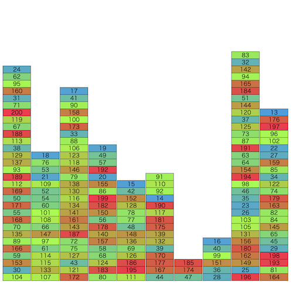

# トヨタ自動車プログラミングコンテスト2023#6(AHC026)

- https://atcoder.jp/contests/ahc026

## 問題概要

- 最初、1からn(=200)までの番号の付いた箱が、m(=10)個の山に、番号はランダムに、個数は均等に積まれている
- 以下の操作を最大5000回繰り返す
  - まだ運び出されていない箱vを選び、そのvより上に乗っている箱をまとめて山iに動かす。このときコストは「動かした箱の数+1」
    - 山はm個より多くは作ることは出来ない
  - 残っている箱のうち一番小さい番号がvであり、箱vが山の一番上にあるとき、運び出せる。このときコストは0
- コストをできるだけ小さくなるよう、すべての箱を運び出す操作列を求めよ

## 時間

- 4 時間

## 個人的メモ

### アプローチ

- 主に、「貪欲解を見つけて、それを評価値として使う(貪欲解ベース)」か「他の山をバッファとして使って、各山をソート(ソート解)」が強かった模様

#### 貪欲解

- 一番単純には、取り出したい番号の上の箱をすべてどかして取り出したい
- ただ、どかす先をどうするか、まとめてうごかすのか分けるのか1つずつか、取り出したい番号以外の場所を動かすか、動かす先を先に動かしてから動かすか、などいろいろ考えられる
- 1,356,657(426位)の貪欲
  - 取り出したい箱iよりも上の箱の集合をまとめて動かす
  - 山の中での番号の最小値が一番大きいところ、に動かす
    - その最小値を動かすタイミングで移動させた箱を動かすことになるので、できるだけそれが遅くなるようにしたいため
- 1,385,712(165位)の貪欲
  - 取り出したい箱iよりも上にある箱の集合について、一番小さい番号の箱までを1塊で考える。その塊の上についても再帰的に考え、複数の塊として考える
  - 各塊について、山の中での番号の最小値が一番大きいところ、に移動させる
- 移動先の選び方で、移動先の山での最小値が一番大きいところでなくても、どちらかというと動かす箱の最小値に一番近いほうが良いなどにすることでさらに改善(kotatsugameさん解, 解説放送)

#### 貪欲解(プレイアウト)を評価値として使う

- 貪欲解でプレイアウトしてそれを評価値として、各操作で一番よい操作を選ぶ
  - 貪欲解ではなくランダム操作(例えば、最小値のひとつ上をランダムに動かすとか)での解とかも考えられる
- また、ゲーム木探索の手法で工夫が考えられる
- 操作は、「移動したい箱iの上にある箱kについて、箱kとその上にある箱をまとめて山jへ動かす」ような感じで一番いいのを探す方法で1.4M点ぐらい出せる
- 更に拡張として、箱iの上の部分だけでなく他の山にある箱についても考えたいが、その場合、全部は制限時間的に厳しいので、いい感じに調べる箱を枝刈りする

#### 他の山をバッファとして利用して、各山をソートした状態にする(ソート解)

- 最上位はこの方針だった模様
- 各山がソートされた状態にできれば、上から順番にコストなしで取り出していける
- 各山について、それ以外の山に移動させて、ソートした状態で元に戻すように操作
  - 基本は、他の山に降順になるように置いて、大きいものから下に戻す
    - もともと降順になっている部分はまとめて動かせる
    - 連番的になっていれば、昇順で置いてまとめて戻す
  - ソートしたい20箱に対し、他の山は9山あるので、平均2個ぐらい
    - 最悪戻せないパターンになったとしても、移動先の山がまだソートしてなければそちらのソート時に処理するでもよい
- 移動するコストのざっくり見積もり
  - https://twitter.com/yunix91201367/status/1721110284545532075
  - 1山が20箱で、1箱ずつ行って戻ってくるコストが4で、10山分だと見積もると、9200ぐらいは出る
- 操作回数を減らす工夫
  - 取り出せる場合は即取り出す
  - 移した後で他の山の箱を合わせて考慮
    - 移した先でソート済みならそれを利用(まとめて移動する、元に戻さない、など)
  - 移動先や個数など、ランダム性を入れて山登り/焼きなまし
  - 2山以上まとめて考える
  - など
- https://twitter.com/rsat__m/status/1721107743938084924
- https://simanman.hatenablog.com/entry/2023/11/08/183631

#### 移動先の山などを焼きなまし

- 操作列について、移動の仕方や移動先の山をどれにするかなどを焼きなます

#### その他

- 見た目的には、ビームサーチが有効そうに見えるが、単純な「現在のスコア」を持ってビームサーチする方針だと結構難しい
  - 移動させる箱の塊の作り方や移動先の良し悪しが結構後のターンにならないとわからないし、あまり明確でもない
- ビーム幅というか、乱択でも、解候補を大量(数千ぐらい？)に作る感じでカバーなどで改善
- 山の高さ、転倒数、など

## 解説

(50位まで&発言を見つけられた方のみ)

- [AHCラジオ(解説放送)](https://www.youtube.com/watch?v=wcw2YB15fYo)
- [解説(日本語)](https://atcoder.jp/contests/ahc026/editorial)
- [解説(英語)](https://atcoder.jp/contests/ahc026/editorial?editorialLang=en)
- [writer解](https://twitter.com/wata_orz/status/1721107964340367866)
  - https://twitter.com/wata_orz/status/1721107093191880957
  - https://twitter.com/wata_orz/status/1721110096066019334

- [hitonanodeさん](https://twitter.com/rsat__m/status/1721107743938084924)
- [takumi152さん](https://twitter.com/takumi152/status/1721108990325878907)
  - https://twitter.com/takumi152/status/1721186044354441269
- [se1ka2さん](https://twitter.com/se1_ka4/status/1721106616521839086)
- [Kiri8128さん](https://twitter.com/kiri8128/status/1721107355256201444)
- [tomerunさん](https://twitter.com/tomerun/status/1721106027545018566)
- [mtsdさん](https://twitter.com/soiya_ksk/status/1721107462856790314)
- [hirataiさん](https://twitter.com/kyogi_hirame/status/1721108074520605065)
- [cuthbertさん](https://twitter.com/ethylene_66/status/1721106263822811297)
  - https://twitter.com/ethylene_66/status/1721107442019545099
- [heno239さん](https://twitter.com/heno_code/status/1721105692537631080)
- [noimiさん](https://twitter.com/noimi_kyopro/status/1721105573935264154)
  - https://twitter.com/noimi_kyopro/status/1721106172340847090
  - https://twitter.com/noimi_kyopro/status/1721106672700276936
  - https://twitter.com/noimi_kyopro/status/1721108480571125779
- [NKTさん](https://twitter.com/inani_waon/status/1721109266965385708)
  - https://twitter.com/inani_waon/status/1721111336850182649
  - https://twitter.com/inani_waon/status/1721117743976685660
  - https://twitter.com/inani_waon/status/1721128331750625524
  - https://twitter.com/inani_waon/status/1721229852605628470
  - https://inaniwa.hatenablog.com/entry/2023/11/06/061108
- [neterukunさん](https://twitter.com/neterukun_cd/status/1721112246829649935)
  - https://twitter.com/neterukun_cd/status/1721113727188299976
- [hexa0611さん](https://twitter.com/HEXAcpp/status/1721109612186001589)
- [shibh308さん](https://twitter.com/shibh308/status/1721106089482277240)
- [Risenさん](https://twitter.com/risenafis/status/1721108095043309658)
- [ichyoさん](https://twitter.com/ichyo/status/1721108083651604796)
- [kotatsugameさん](https://twitter.com/kotatsugame_t/status/1721109437849768021)
  - https://twitter.com/kotatsugame_t/status/1721109644729561181
  - https://twitter.com/kotatsugame_t/status/1721119668193337648
  - https://twitter.com/kotatsugame_t/status/1721131477965091153
  - https://twitter.com/kotatsugame_t/status/1721129626226078086
    - https://www.youtube.com/watch?v=OBLx4Ta2nwo
- [nrvftさん](https://twitter.com/nrvkpr/status/1721109710810828853)
  - https://twitter.com/nrvkpr/status/1721111730879971388
- [sky58さん](https://twitter.com/skyaozora/status/1721105873899278478)
  - https://twitter.com/skyaozora/status/1721107620172615694
- [masa_mitsuさん](https://twitter.com/MasaakiMitsuo/status/1721106050978644076)
  - https://twitter.com/MasaakiMitsuo/status/1721169055695171888
- [fuppy0716さん](https://twitter.com/fuppy_kyopro/status/1721106888363048992)
- [risujirohさん](https://twitter.com/risujiroh/status/1721107839740174505)
- [Rice_tawara459さん](https://twitter.com/rice_tawara459/status/1721119313678283227)
- [kabipoyoさん](https://twitter.com/kabipoyo/status/1721107083834368084)
  - https://twitter.com/kabipoyo/status/1721108553614921908
- [Shun_PIさん](https://twitter.com/Shun___PI/status/1721105454762451392)
  - https://twitter.com/Shun___PI/status/1721107785386201493
- [olpheさん](https://twitter.com/_olphe/status/1721106446195253463)
  - https://twitter.com/_olphe/status/1721107882371125365
- [toamさん](https://twitter.com/torii_kyopro/status/1721105994200309984)
  - https://twitter.com/torii_kyopro/status/1721106314427019462
- [shinchanさん](https://twitter.com/Sophia_maki/status/1721108578659078300)
  - https://atcoder.jp/contests/ahc026/editorial/7598
- [y_kawanoさん](https://twitter.com/y_kawano/status/1721107226516144219)
- [matsupさん](https://twitter.com/matsup10/status/1721109571027317048)
- [wanuiさん](https://twitter.com/gmeriaog/status/1721107656990167164)
- [throughさん](https://twitter.com/through__TH__/status/1721105216916115750)
  - https://zenn.dev/through/articles/d2d4d9633309ed
- [kaz_mightyさん](https://twitter.com/kaz_mighty/status/1721106882444837163)
- [yukidaruma6さん](https://twitter.com/yuki_prog/status/1721109109549027680)
  - https://twitter.com/yuki_prog/status/1721112494394212608
- [darnleyさん](https://twitter.com/mikhail_dvorkin/status/1721119806441894350)
- [bin101さん](https://twitter.com/5bin101/status/1721115766362370091)
- [terry_u16さん](https://twitter.com/terry_u16/status/1721107418950828067)
  - https://twitter.com/terry_u16/status/1721108851725090881
  - https://twitter.com/terry_u16/status/1721109524894113797
  - https://twitter.com/terry_u16/status/1721111588185485314
  - https://twitter.com/terry_u16/status/1721112183575380429
  - https://twitter.com/terry_u16/status/1721119911089746326
- [prod_xxxさん](https://twitter.com/prd_xxx/status/1721107177468002645)
- [chokudaiさん](https://twitter.com/chokudai/status/1721106997448458345)
  - https://twitter.com/chokudai/status/1721109778288848944
  - https://twitter.com/chokudai/status/1721115552759054607
  - https://twitter.com/chokudai/status/1721154579084234951
  - https://twitter.com/chokudai/status/1721161112128041065
  - https://twitter.com/chokudai/status/1721168775188484508

- 延長戦
  - https://simanman.hatenablog.com/entry/2023/11/08/183631
  - https://twitter.com/eijirou_kyopro/status/1723634076794704175
  - https://twitter.com/bowwowforeach/status/1723661967376920616

- 解説
  - https://speakerdeck.com/bowwowforeach/toyotazi-dong-che-puroguramingukontesuto2023-number-6-atcoder-heuristic-contest-026-zhi-gao-noarugorizumujie-shuo
  - https://www.docswell.com/s/hitonanode/K22QM4-2024-11-29

## Links

- [agwさんTwitterまとめ](https://togetter.com/li/2254054)
- [Twitter hashtag AHC026](https://twitter.com/hashtag/AHC026)
- [kiri8128さん Score-Performance グラフ](https://twitter.com/kiri8128/status/1721567827558330477)
