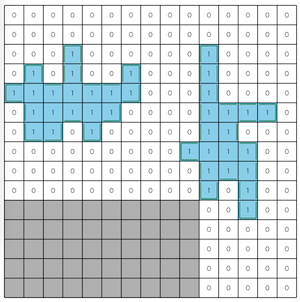

# THIRDプログラミングコンテスト2023(AHC030)

- https://atcoder.jp/contests/ahc030

## 問題概要

- N \* Nマスのグリッドがあり、M個の油田が隠れている
- 各油田はポリオミノ型の形状をしており、各油田の形はわかっているが、どの位置にあるかは最初はわからない
- 以下の3種類の操作を最大で2\*N^2回まで繰り返して、できるだけ少ないコストで油田のあるマスをすべて特定せよ
  - 1マスを選んで掘る。そのマスの埋蔵量がコスト1でわかる
  - kマス(2マス以上)の集合Sを選び占うことで、そのマスの合計埋蔵量にノイズがのった値がコスト1/sqrt(k)でわかる
    - 値は、kとεと合計埋蔵量から決まる平均と分散の正規分布からサンプリングされた値をxとしてmax(0,round(x))がわかる
  - 油田があるマスをすべて推測する。もし正解ならそこで終了し、不正解であればコスト1を払って継続する

## 時間

- 240 時間

## 個人的メモ

### 油田の数M

- 不確かさepsよりも油田の数Mが大きいほど難しい
  - 盤面の候補数が増える、小さい油田が多くて区別/特定しにくい、など
  - コンテスト的にはMが大きいところは解けてなくてもMが小さいところで稼げていれば上位を目指せていたみたい
- Mの出現分布を見てみると、均等ではなく、Mが小さいケースが比較的多かった
  - https://twitter.com/_simanman/status/1759965923761332645
    - https://twitter.com/kiri8128/status/1759967483518238746

### アプローチ

- ざっくりと、操作を繰り返すたびに情報が増えていって、それによって盤面を特定していく感じ
  - 各操作では、できるかぎり情報を得ることを目指すことで、操作回数やコストを減らす
- ただ、「占い」ベースの方は、各処理が重かったりして(性能をできるだけ落とさない)高速化や処理時間のバランス調整を実現できる必要があるっぽい

#### 「1マス掘り」ベース

- 「1マス掘り」は、コストが1で大きいが、正確な値が得られる
  - εが大きかったり、Mが大きいケースではこちらが有利だった模様
- そこで、できるだけ掘る回数を減らして盤面を特定することを考える
- ムダな採掘を減らす
  - サンプルコードは、「全マスを掘って埋蔵量が1以上だったマスを答える」というものになっている
  - 油田の形がわかっているので、それまで掘った油田の埋蔵量の合計からすべての油田を見つけ方がわかるのでそこで終了できる
  - 油田の形から、端っこなどで必ず0になるマスは調べなくて良い
- BFSで探す
  - あるマスで埋蔵量が1以上である場合、油田の形は連結なので、そこから隣接マスに対して埋蔵量が1以上のマスをBFSで探すと、ムダな0のマスをできるだけ探さなくて済む
- 候補を絞っていく
  - 各油田について、ありえる左上の位置の候補を全部列挙しておく
  - あるマスの埋蔵量がわかった場合、そこから、候補のうちありえないものが除外できる
    - どのマスを掘るかは、候補ができるだけ減らせそうなマスを選ぶようにする
    - また、ある程度まで候補が減ったら残りは全探索とかもできる
- しかし、これだけだとコストが結構かかってしまうため、上位は難しかった模様

#### 「占い」ベース

- 「占い」は、コストが1/sqrt(k)で済むが、不正確な値しか得られない
- 得られた情報の使い方
  - 盤面(油田の位置)の候補xの集合を考え、それぞれの候補の確率P(x)を考えると、ベイズ推定により、占いの合計埋蔵量の情報yを得て、確率を更新できる
- 占うマスの集合の選び方
  - 選ぶマスの集合はいろいろ考えられるが、強かったのは、上記の候補の確率のエントロピーを考えて、コストとエントロピーの減少量(相互情報量)が多くなるように選ぶことで効率的に情報を得る方法だった模様

### 盤面候補のベイズ推定

- 占った情報から可能性の高い油田の位置を推定するのにベイズ推定が使える
- https://qiita.com/aplysia/items/c3f2111110ac5043710a

#### ある盤面xで占いの結果がrとなる尤度

- ある盤面の候補xで、あるマスの集合Sの占いをして値rが得られた場合の尤度P(r|x)を考える
- これは、問題文から、正規分布で与えられることがわかっており、round(x)していることからr-0.5〜r+0.5の範囲の確率であることがわかるので、正規分布の累積分布関数からその範囲の確率値が求められる
  - 厳密にはmax(0,round(x))なので、x=0は0.5以下の範囲
- マスの集合が複数与えられた場合は、それらが同時に与えられる場合として、$\prod P(r_i|x)$を考えれば良い
  - そのままだと値が小さくなりすぎるので、対数を取った対数尤度で考えるとよい

#### 各盤面での確率値

- ベイズの定理から、$P(x|r) = P(r|x)P(x)/P(r) \propto P(r|x)P(x)$と書ける
  - 各油田の位置は一様ランダムに決まるので$P(x)$は「1/候補数」としてよい
- 上記の式から、すべてのxについて求めてから正規化した$P(x|r) = P(r|x) / \sum_{x_i}{P(r|x_i)}$で求められる

### 選ぶマスの集合の選び方

- できるだけコストが少なく、できるだけ情報(どの盤面なのかを区別できる情報)が得られるようなマスの集合を選びたい
- https://qiita.com/aplysia/items/29a4fb4573fc1b8dec79

#### 尤度が高い2つの盤面を区別できるところを選ぶ

- 候補盤面の中で尤度が1番高いのと2番目に高い盤面を区別することを考える

#### エントロピーの減少量(相互情報量が最大)になるところを選ぶ

##### エントロピー

- やりたいことは、各盤面での確率値P(x|r)について、正解の盤面xを特定(=その盤面だけ確率が高い状態)すること
- P(x|r)の確率分布で、あるxに特定できている、まったく特定できていないなどを評価するものとして「(情報理論における)エントロピー」が使える
- $H(X) = -\sum_{x}{P(x)logP(x)}$
  - エントロピーは、あるxに特定できている場合は最小、全く特定できていないは最大になる
  - logの底は2(bit)が一般に使われるが、なんでも良い
- これを使って、マスの情報を得た後で、できるだけエントロピーが減るように、マスの集合を考えることができる

##### エントロピーの減少量

- マスの情報を得た後の確率は$P(x|r)$で、その時のエントロピーは$H(X|r) = -\sum_{x}{P(x|r)logP(x|r)}$
- ここで、エントロピーの減少量(差分)を$\Delta_r = H(X) - H(X|r)$として、値rについての期待値を考えると、$\sum_{r}{P(r) * \Delta_r}$となる
  - この値が大きくなるようなマスの集合を見つけて投げれば良い
- この式は、「相互情報量」と呼ばれる値で、こちらでも考えることができる
  - $I(X;Y)=H(X)-H(X|Y)$
  - $I(X;Y)=\sum_{x}\sum_{y}{P(x,y)log\frac{P(x,y)}{P(x)P(y)}}$
    - https://manabitimes.jp/math/1403
    - ($H(X)$の方に$\sum_{y}{P(y|x)}=1$を掛けて式を整理)
  - 今回の場合、$P(x,y)=P(y|x)P(x)$から$I(X;Y)=\sum_{x}\sum_{y}{P(y|x) P(x) log\frac{P(y|x)}{P(y)}}$にしてから使う

##### 相互情報量最大のマス集合

- 「相互情報量/コスト」を目的関数として、マスの追加削除などを近傍とした山登りで求める
- 高速化
  - ただ、まともに計算しようとすると、「候補盤面\*占った結果のあり得る値」回すことになるので、かなり重い
  - 以下のような高速化や調整をいれてないと厳しいっぽい
    - 候補盤面は、確率が低い盤面を削除して減らす
    - ある程度小さい確率の部分は無視する
    - できるだけ重い関数を何度も呼ばない
    - 配列などの確保や初期化を何度もしない(差分計算する、逆操作で戻す)
    - 前計算しておく(log計算)
    - パラメータ調整、時間調整

### 候補が多すぎる問題への対処(M>2への対処)

- M=2は全列挙ができる
  - M=3でもテストケースによっては可能かも？
- しかし、M>2の場合、盤面の候補数が多くなりすぎてしまう
- そこで、確率が高そうな候補を何件かまで保持してそれ以外は無視する(または、サンプリングする)
- 候補に正解が含まれないと正解できないので、候補に正解が入るように調整するのが大切
  - ローカルでは答えも与えられるので、その情報を使ってパラメータ調整や手法を検討

#### 候補が列挙できる程度になるまで減らす

- 1マス掘りする
  - 1マス掘りは確定情報なので、確実に候補を減らせる
  - しかし、コストが大きい
- 適当に占って尤度が高い上位n件を使う
  - 問題ページにある例のように、5x5とかの区間に分けて各区間の占い情報を下に尤度が高い候補上位n件だけを使う
  - 候補から正解が漏れる可能性があるので、その場合は失敗する(確率的に成功する)

#### 乱択山登りで候補生成

- (矛盾を許容した)ランダム配置からスタートして、できるだけ矛盾がなくなるように部分破壊再構築近傍で山登り
  - https://www.terry-u16.net/entry/ahc030
  - (BFS的に複数候補を保持しながら山登り)

#### 焼きなましによる候補生成

- 各油田の位置をずらしたり入れ替えたりする近傍で焼き鈍すと、その途中の状態が候補になり得る
- 尤度が高い盤面候補を求めることで、可能性が高い候補だけ用意できる
  - 今回の場合、確率が高い状態はだいたい似たような盤面(自己相関が高い？)になるので、その周辺だけ調べれば十分な感じっぽい
- 「油田の位置をずらす(隣接にずらす、ランダム位置にずらす)」近傍以外に、油田の区別がしにくいこともあるため、「油田同士のswap」近傍もいれるとよいみたい

#### MCMCでサンプリング

- ギブスサンプリング/MH法

### 占いマスの形状について

- https://twitter.com/kiri8128/status/1761038377691041802

### パラメータ調整

- 1ターンあたりの計算時間
  - 何ターンかかるかを入力パラメータから見積もって、おおよその時間を調整
- 1ターン内の、各処理にかける時間のバランス
- 何個候補盤面を持つか
- 盤面の確率がどの程度になったら解答するか

### コスト0の話(clar)

- 最初にいきなり解答して正解してしまうとコスト0になる可能性がある
- https://twitter.com/ethylene_66/status/1759538377505099954
  - https://twitter.com/kiri8128/status/1759541028288348391
  - NやMが小さいパターン特定のケースでなく、パターン数がある程度あったとしても、その戦略が最適になる可能性

### 悪いテク

- https://twitter.com/wata_orz/status/1759545903017541685
- https://twitter.com/ethylene_66/status/1759542532168692054
  - atcoderは、TLEすると3回実行するという一部の言語向けの救済処置がある
  - 答えが見つからなそうだったらあえてTLEにすることでチャレンジ回数を増やせる

### その他

#### 占いで得られる値の分布

- https://qiita.com/hari64/items/a7793a7071b4015ef92c
- https://twitter.com/terry_u16/status/1760701818764722293
- https://twitter.com/theory_and_me/status/1759538373486895326
- 二項分布の正規分布による近似らしい
  - (分散が二項分布の形をしている)
  - 確率εで(k-v(S))、確率(1-ε)でv(S)が得られる二項分布を考えて、正規分布で近似すると考える？
    - マス単位で考えると、確率εでそのマスの油田の情報が反転する感じ
  - https://ja.wikipedia.org/wiki/%E4%BA%8C%E9%A0%85%E5%88%86%E5%B8%83

#### 類問

- https://twitter.com/tomerun/status/1759524138493071611
  - https://topcoder-tomerun.hatenablog.jp/entry/2011/05/12/000000

#### ビジュアライズ

- 順位表の推移
  - https://twitter.com/kiri8128/status/1759573401243668523

- お絵かき(動画)
  - https://twitter.com/010_clam/status/1759941318334185765
  - https://twitter.com/moooaki/status/1759956965344911529
  - https://twitter.com/moooaki/status/1759809924954226828
  - https://twitter.com/myh9_f/status/1759874064217497778

## 解説

(50位まで&発言を見つけられた方のみ)

- [AHCラジオ(解説放送)](https://www.youtube.com/watch?v=lIz8EarV0ek)
  - https://img.atcoder.jp/ahc030/ahc030.pdf
- [解説(日本語)](https://atcoder.jp/contests/ahc030/editorial)
- [解説(英語)](https://atcoder.jp/contests/ahc030/editorial?editorialLang=en)

- [writer解](https://twitter.com/wata_orz/status/1759521380813685029)
  - https://atcoder.jp/contests/ahc030/submissions/50443474

- [1位terry_u16さん](https://twitter.com/terry_u16/status/1759518666138566919)
  - https://twitter.com/terry_u16/status/1759521227855773743
  - https://twitter.com/terry_u16/status/1759523057423786266
  - https://twitter.com/terry_u16/status/1759526435323285921
  - https://twitter.com/terry_u16/status/1759544783213830334
  - https://twitter.com/terry_u16/status/1759547406843318401
  - https://twitter.com/terry_u16/status/1759550733966586163
  - https://twitter.com/terry_u16/status/1759551650971422905
  - https://twitter.com/terry_u16/status/1759553002049061063
  - https://twitter.com/terry_u16/status/1759562235238842422
  - https://twitter.com/terry_u16/status/1759567813147279664
  - https://twitter.com/terry_u16/status/1759579967346876841
  - https://twitter.com/terry_u16/status/1759943961379033302
  - https://github.com/terry-u16/ahc030/blob/main/diary.md
  - https://www.terry-u16.net/entry/ahc030
- [2位cuthbertさん](https://twitter.com/ethylene_66/status/1759520732470780363)
  - https://twitter.com/ethylene_66/status/1759525492577935675
  - https://twitter.com/ethylene_66/status/1759526453019037939
  - https://twitter.com/ethylene_66/status/1759562665817751626
  - https://twitter.com/ethylene_66/status/1759599486995931338
  - https://twitter.com/ethylene_66/status/1759602462976364812
  - https://twitter.com/ethylene_66/status/1759602863565877313
  - https://twitter.com/ethylene_66/status/1759603417016930629
  - https://twitter.com/ethylene_66/status/1759603727705813047
  - https://twitter.com/ethylene_66/status/1759604152664199434
  - https://twitter.com/ethylene_66/status/1759827942006567173
  - https://twitter.com/ethylene_66/status/1759855149269582226
- [3位eijirouさん](https://twitter.com/eijirou_kyopro/status/1759561428061888834)
  - https://twitter.com/eijirou_kyopro/status/1759562028799389841
  - https://twitter.com/eijirou_kyopro/status/1759564121409020151
  - https://eijirou-kyopro.hatenablog.com/entry/2024/02/22/152604
- [4位bowwowforeachさん](https://twitter.com/bowwowforeach/status/1759522695300170104)
  - https://twitter.com/bowwowforeach/status/1759526338246082706
  - https://twitter.com/bowwowforeach/status/1759528583658447222
  - https://twitter.com/bowwowforeach/status/1759549501487169580
  - https://twitter.com/bowwowforeach/status/1759689545522807163
  - https://twitter.com/bowwowforeach/status/1759703325254275385
- [5位Shun_PIさん](https://twitter.com/Shun___PI/status/1759518690067030405)
- 6位USAさん
- 7位brown_amaurotisさん
- [8位hari64さん](https://twitter.com/hari64boli64/status/1759522213689278746)
  - https://twitter.com/hari64boli64/status/1759822554552992217
  - https://qiita.com/hari64/items/a7793a7071b4015ef92c
- 9位ynasuさん
- 10位daiwakunさん
- [11位yosupoさん](https://twitter.com/yosupot/status/1759525425171316825)
  - https://twitter.com/yosupot/status/1759541131959050732
  - https://yosupo.hatenablog.com/entry/2024/02/21/044022
- [12位gasinさん](https://twitter.com/_gacin/status/1759518521145639194)
  - https://twitter.com/_gacin/status/1759521242955330022
  - https://twitter.com/_gacin/status/1759525024380379285
  - https://twitter.com/_gacin/status/1759527596059250922
  - https://twitter.com/_gacin/status/1759531952884048287
  - https://twitter.com/_gacin/status/1759837509738287116
- [13位yunixさん](https://twitter.com/yunix91201367/status/1759519048029937706)
  - https://twitter.com/yunix91201367/status/1759560882907131945
- 14位Rafbillさん
- [15位colunさん](https://twitter.com/colun/status/1759543949767942279)
  - https://twitter.com/colun/status/1759554593502244946
  - https://twitter.com/colun/status/1759555386200453212
  - https://twitter.com/colun/status/1759670255537012814
  - https://twitter.com/colun/status/1759686828872040559
  - https://twitter.com/colun/status/1759694094572617923
  - https://twitter.com/colun/status/1759704303013687702
  - https://twitter.com/colun/status/1759707468463222932
  - https://twitter.com/colun/status/1759711086855762221
  - https://twitter.com/colun/status/1759839106006409326
- 16位ky0r0sukeさん
- 17位xyz600さん
- 18位monnuさん
- 19位rhooさん
- [20位MathGorillaさん](https://twitter.com/MathGorilla_cp/status/1759519890522911066)
- [21位fky_さん](https://twitter.com/fkyrz_0111/status/1759518272436015247)
  - https://twitter.com/fkyrz_0111/status/1759519377131749731
  - https://twitter.com/fkyrz_0111/status/1759524398292410741
  - https://twitter.com/fkyrz_0111/status/1759524976842203335
  - https://twitter.com/fkyrz_0111/status/1759527215157699016
  - https://twitter.com/fkyrz_0111/status/1759527512202457561
  - https://twitter.com/fkyrz_0111/status/1759528045462110549
  - https://twitter.com/fkyrz_0111/status/1759544306443149585
  - https://twitter.com/fkyrz_0111/status/1759719581093118348
- [22位notさん](https://twitter.com/not_522/status/1759520187999723685)
- 23位Psyhoさん
- 24位tishii24さん
- [25位simanさん](https://twitter.com/_simanman/status/1759521160071696774)
  - https://twitter.com/_simanman/status/1759533850584314261
  - https://twitter.com/_simanman/status/1759533599601365207
  - https://twitter.com/_simanman/status/1759786736883052599
  - https://twitter.com/_simanman/status/1759788810735620102
  - https://twitter.com/_simanman/status/1759958092920537583
  - https://twitter.com/_simanman/status/1759755130961072171
- 26位Jirotechさん
- [27位risujirohさん](https://twitter.com/risujiroh/status/1759933100447125838)
  - https://twitter.com/risujiroh/status/1760351434229559554
  - https://twitter.com/risujiroh/status/1760383230275104823
- [28位toamさん](https://twitter.com/torii_kyopro/status/1759518774947180721)
  - https://twitter.com/torii_kyopro/status/1759520417499468042
  - https://twitter.com/torii_kyopro/status/1759791688510566704
  - https://twitter.com/torii_kyopro/status/1759792257102926199
  - https://twitter.com/torii_kyopro/status/1759795449559728338
  - https://twitter.com/torii_kyopro/status/1759793628430709211
- [29位theory_and_meさん](https://twitter.com/theory_and_me/status/1759520037743014289)
  - https://twitter.com/theory_and_me/status/1759538373486895326
- [30位saharanさん](https://twitter.com/shr_pc/status/1759520508524331058)
  - https://twitter.com/shr_pc/status/1759978421499932781
  - https://twitter.com/shr_pc/status/1760317806376313094
- 31位catoonさん
- [32位Piiiiiさん](https://twitter.com/AcPiiiii/status/1759520559594176978)
  - https://twitter.com/AcPiiiii/status/1759544128374030701
- [33位montplusaさん](https://twitter.com/montplusa/status/1759521888450302217)
  - https://twitter.com/montplusa/status/1759793949814989005
- [34位mtsdさん](https://twitter.com/soiya_ksk/status/1759522423870022054)
  - https://twitter.com/soiya_ksk/status/1759536829114777745
- [35位ssaattooさん](https://twitter.com/myh9_f/status/1759532749793468557)
  - https://ssaattoo.hatenablog.com/entry/2024/02/20/102541
- [36位G4NP0Nさん](https://twitter.com/G4NP0N_kyopro/status/1759518523817439501)
  - https://twitter.com/G4NP0N_kyopro/status/1759519767478833303
  - https://twitter.com/G4NP0N_kyopro/status/1759520288654635048
  - https://twitter.com/G4NP0N_kyopro/status/1759520723352310040
  - https://twitter.com/G4NP0N_kyopro/status/1759522365757956292
  - https://twitter.com/G4NP0N_kyopro/status/1759526724721897843
  - https://twitter.com/G4NP0N_kyopro/status/1759527041421250838
  - https://twitter.com/G4NP0N_kyopro/status/1759535044182605826
  - https://twitter.com/G4NP0N_kyopro/status/1759534659673989539
  - https://twitter.com/G4NP0N_kyopro/status/1759538542127296873
  - https://twitter.com/G4NP0N_kyopro/status/1759538919572660364
  - https://twitter.com/G4NP0N_kyopro/status/1759539153736441954
  - https://twitter.com/G4NP0N_kyopro/status/1759541455046213753
  - https://twitter.com/G4NP0N_kyopro/status/1759540616579678301
  - https://twitter.com/G4NP0N_kyopro/status/1759788690099024154
  - https://twitter.com/G4NP0N_kyopro/status/1759788826107785471
- [37位wanuiさん](https://twitter.com/gmeriaog/status/1759521477081416106)
  - https://twitter.com/gmeriaog/status/1759523879184478673
  - https://twitter.com/gmeriaog/status/1759532780910956854
  - https://twitter.com/gmeriaog/status/1759550544706990411
  - https://twitter.com/gmeriaog/status/1759554414413848805
- 38位phocomさん 
- [39位kozimaさん](https://twitter.com/t33f/status/1759518765459677641)
  - https://twitter.com/t33f/status/1759522354378821658
  - https://twitter.com/t33f/status/1759522889802600464
  - https://twitter.com/t33f/status/1759526015532171552
  - https://twitter.com/t33f/status/1759527304500572366
  - https://twitter.com/t33f/status/1759530925376118820
  - https://twitter.com/t33f/status/1759547109601386790
  - https://twitter.com/t33f/status/1759547296222757235
  - https://twitter.com/t33f/status/1759566945404506595
  - https://twitter.com/t33f/status/1759579786694053917
  - https://twitter.com/t33f/status/1759586401589567566
  - https://twitter.com/t33f/status/1759937788705919292
  - https://twitter.com/t33f/status/1759938381000433735
  - https://twitter.com/t33f/status/1759939799215903224
  - https://twitter.com/t33f/status/1759940168968999383
  - https://twitter.com/t33f/status/1759951146184249525
  - https://twitter.com/t33f/status/1760280983046430914
  - https://twitter.com/t33f/status/1760266378203009242
- [40位saitodevel01さん](https://twitter.com/KaggleSaito/status/1759540639765873069)
- 41位wleiteさん
- [42位yochanさん](https://twitter.com/yochan_tech/status/1759570522717954547)
  - https://twitter.com/yochan_tech/status/1759571208444744104
  - https://twitter.com/yochan_tech/status/1759572708092981263
- 43位syndromeさん
- [44位fuppy0716さん](https://twitter.com/fuppy_kyopro/status/1759520496771895354)
  - https://twitter.com/fuppy_kyopro/status/1759526911578120503
  - https://twitter.com/fuppy_kyopro/status/1759533307338055681
- [45位tomerunさん](https://twitter.com/tomerun/status/1759518423531589703)
  - https://twitter.com/tomerun/status/1759524138493071611
  - https://twitter.com/tomerun/status/1759542507451662364
- [46位eivourさん](https://twitter.com/contramundum2/status/1759525158048666063)
  - https://twitter.com/contramundum2/status/1759530486924513297
  - https://twitter.com/contramundum2/status/1759532662853902653
  - https://twitter.com/contramundum2/status/1759535465693364241
  - https://twitter.com/contramundum2/status/1759545603577835642
  - https://twitter.com/contramundum2/status/1759544609582223493
  - https://twitter.com/contramundum2/status/1759549164629942367
  - https://twitter.com/contramundum2/status/1759537468964311295
  - https://twitter.com/contramundum2/status/1759579284753330377
- 47位Kahukaさん
- [48位rabotさん](https://twitter.com/tanaka_a8/status/1759526095492354330)
  - https://twitter.com/tanaka_a8/status/1759583455300714853
  - https://twitter.com/tanaka_a8/status/1759903756219724173
- [49位chimaki821さん](https://twitter.com/chimaki_yama821/status/1759518830911742186)
  - https://twitter.com/chimaki_yama821/status/1759521188202832077
  - https://twitter.com/chimaki_yama821/status/1759523057398673452
  - https://twitter.com/chimaki_yama821/status/1759526300564455695
  - https://twitter.com/chimaki_yama821/status/1759566551018360909
  - https://twitter.com/chimaki_yama821/status/1759581031513170070
- [50位petit_sophiaさん](https://twitter.com/EmptyBox_0/status/1759524322237116496)
  - https://twitter.com/EmptyBox_0/status/1759535566826467703
  - https://twitter.com/EmptyBox_0/status/1759887989235441895

## Links

- [agwさんTwitterまとめ](https://togetter.com/li/2317966)
- [Twitter hashtag AHC030](https://twitter.com/hashtag/AHC030)
- [Twitter hashtag THIRDプログラミングコンテスト2023](https://twitter.com/hashtag/THIRD%E3%83%97%E3%83%AD%E3%82%B0%E3%83%A9%E3%83%9F%E3%83%B3%E3%82%B0%E3%82%B3%E3%83%B3%E3%83%86%E3%82%B9%E3%83%882023)
- [kiri8128 さん Score-Performance グラフ](https://twitter.com/kiri8128/status/1759969370175095106)
- [simanさん統計](https://siman-man.github.io/ahc_statistics/030/)
  - https://twitter.com/_simanman/status/1759755130961072171
- [wataさんの詳細な順位表](https://img.atcoder.jp/ahc_standings/index.html?contest=ahc030)
