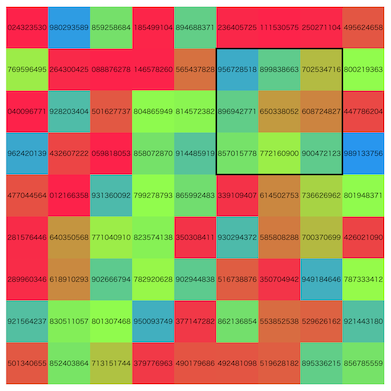

# AtCoder Heuristic Contest 032

- https://atcoder.jp/contests/ahc032

## 問題概要

- N \* N (N=9)マスの盤面があり、各マスにはあらかじめ整数が設定されている
- 3 \* 3マスの各マスに整数が設定されているスタンプがM(=20)個あり、はみ出さないようにK(=81)回好きなスタンプを押すことで、その盤面の各マスにスタンプの整数分加算することができる
- 最終的な盤面のマスの値を997244353で割った余りの総和を最大化せよ

## 時間

- 4 時間

## 個人的メモ

### 問題固有の性質

- N,M,Kは全ケースで固定で、あまり大きくない
  - 状態や遷移数が小さく抑えられる
- 1マスあたりの調整に使える回数は、マスが81箇所あるのでマス当たりだと81/81=1回だが、押せる箇所が7\*7=49箇所しかないので、押せる箇所当たりでは81/49=1.653回
- スタンプを押す順番は入れ替えても最終状態は変化しない

### マスを確定させていく貪欲、ビーム

- 左上(0,0)のマスを考えると、そのマスは(0,0)にスタンプを押すしかなく、そこを確定させると、その下と右が角になり、そこについても同様にそこにスタンプを押すしかなくなる
- ここから、順番にマスを確定していくことが考えられる
- 今回、1マスあたり1〜2回はスタンプを押す余地があるので、各確定したいマスに注目して、値が最大になるようにスタンプを選ぶ
  - 左上6x6マスについては、1マスについて考えられるが、右端と下端、右下3x3は調整できないので、1x3、3x1、3x3のマスをまとめて確定すると考える
  - 「そのターン以降で調整できなくなるマス」を対象として考えるとよいよう
    - https://twitter.com/terry_u16/status/1776974618559160393

#### 合成スタンプの列挙

- 同じ場所に複数のスタンプを押す場合、それらのスタンプを全部合成(各マスの総和)したスタンプを考え、それを1回押すのは同じ
- また、押す順番は関係ないので、M個あるスタンプのうち、K回どれかを選ぶ組み合わせの数は、重複組合せH(M,K)回程度
  - (さらに無駄に「同じスタンプは重複して使わない」とか入れてしまうと、C(M,K)ぐらいしか用意できない・・・)
  - 押す順番を区別するとM^Kになってしまうが、H(M,K)はそんなに大きくない
  - K=9程度でも10^7個いかない程度
- 合成スタンプは、順番に「前に選んだインデクス以上しか選べない」ように制約をいれてDFSなどすれば列挙できる

#### 複数マスを同時に確定させる場合の問題

- 「1マスを1回以下のスタンプで揃える」ではなく「3マスを3回以下のスタンプで揃える」とか「9マスを9回以下のスタンプで揃える」かなどが考えられる
  - 右端・下端、右下の部分はこれになっている
  - 左上6x6の部分についても複数マスを同時に確定させるバリエーションは考えられる
    - 盤面全体を3x3マスが9個あると考える、とか
- 複数のスタンプを同じスタンプ位置で適用する場合、その組み合わせは上の合成スタンプと同じでH(M,K)種類程度しかない
  - この中にうまく高スコアになる組み合わせが含まれていて欲しいが、結構少ない
  - (高スコアが出すのに必要な種類数の見積もりは解説放送)
- しかし、「1マスを1回以下のスタンプで揃える」場合、他の位置の別のスタンプとの組み合わせになるため、そのマスに対して適用できる和の組み合わせの数はかなり多くなる
- そのため、同じところで複数回スタンプを適用するよりも分散してスタンプしたほうが調整しやすい

#### マスを辿る順番

- マスを辿る順番によってスコアに違いがでる
  - 複数マスの確定が連続すると調整しにくいとか、未確定マスの状態が変わるので古い状態に依存してる部分は、後になると多様性がなくなっていってしまう恐れとか、あるっぽい
- 左上6x6を先に処理し、右端と下端を処理、右下3x3を処理
  - 「右端を処理してから下端」ではなく、「右端と下端を交互に処理する」などすると、右下3x3の多様性ができやすいかも
- 「左から右」を上から下に繰り返す(行ずつ処理)
- 左から右、右から左、を交互に繰り返す(ジグザグ型)
- 中心にむかってぐるぐる回るように辿る
  - 外側から埋める
- 横方向、縦方向を交互に繰り返す
- いくつかの盤面走査パターンを試す(盤面の上下左右反転・回転したものについても考える)

#### 各マスで何回までスタンプを押すか

- あらかじめ決め打ちで、「左上6x6は1回まで、右端下端は3回まで、右下は9回まで」などとすると制限回数の81回以下で解は得られる
- しかし、押さなかったマスがあった場合、次以降でその分を使うことでよりよい解が得られる可能性がある
- 「そこまでのターン数を超えない回数までは押すのを許す」とか、「各ターンでの最大スタンプ可能数を決めておく」など

#### ビームの種類

- 「確定マス」ベース
  - 確定マスをターンとする
  - 残り操作回数が状態に入る
- 「残り操作回数」ベース
  - 残り操作回数をターンとする
  - 確定したマスが状態に入る

#### 評価関数/ペナルティ

- 確定スコア
  - 確定したマスについては、スコアも決まるので、それを評価値とする
- 残り操作回数
  - (解説放送)
  - 操作回数がいい感じに多いほうがよい、最後に残らないほうがよい
- 1手当たりのペナルティ
  - https://twitter.com/chokudai/status/1777253380253233510
  - 操作回数が残ってた方がよい
- 未確定マスのスコア

#### 高速化

- 枝狩り
  - https://twitter.com/Shun___PI/status/1777006158672449689
  - https://twitter.com/MathGorilla_cp/status/1777866870512828416
- (解説放送)
  - 次の状態の候補の選択の効率化
    - https://eijirou-kyopro.hatenablog.com/entry/2024/02/01/115639
      - https://twitter.com/_simanman/status/1778034476549083279
      - https://twitter.com/_simanman/status/1778035217103765799
  - スタンプの左上の値でのソート＆二分探索
    - 1マス揃えのときに最適スタンプを効率的に求められる
    - 複数候補もデクリメントすれば得られる(＆閾値設定もできる)
  - 合成スタンプのグループわけ(バケット)
    - 注目している箇所の値についてバケットにわけて、高スコアになりそうな部分に入っている合成スタンプだけ試す
- k分木
  - https://twitter.com/wata_orz/status/1776985413770698841
- SIMD高速化
  - https://twitter.com/rho__o/status/1777338118833844520

#### その他

- プレイアウト
  - https://twitter.com/rian_tkb/status/1776975710118465583
- DP(ビームをわけて多様性確保するやつ？)
  - https://twitter.com/tanaka_a8/status/1777699709597143492
- 行を2分割してそれぞれで全探索して確定していく
  - https://kiri8128.hatenablog.com/entry/2024/04/08/021208

### 押すスタンプ集合を焼きなまし

- スタンプ(種類と位置)を状態として焼きなましするアプローチも考えられる(初手で試してみた人は多かった模様)
  - 押す順番は関係ないので集合で考えられ、スタンプは7\*7\*20=980通り程度で、K=81個までなので結構小さい
  - また、スタンプで3x3しか変化しないので局所性が見られ、局所改善アプローチが有効そうに見える
- しかし、今回は、スタンプの種類数が少ないため、置き換えた場合のスコアの変動が大きくならざるをえず、複数マスを同時に高い値にできるような組み合わせにすることが難しい
- そのため、適当な近傍(1つのスタンプの追加・削除・置き換え)では、あまり探索空間が滑らかにならず、そこそこのスコアは出るが、今回はそれでは不十分だった
  - (初期解を貪欲解にしたり、大きめの近傍(合成スタンプで扱うとか)にしたりとかすれば改善するかもしれないが)

### その他

#### 理論値計算

- https://kiri8128.hatenablog.com/entry/2024/04/08/021208

#### ビームサーチの各ターンでのスコア分布の可視化

- (解説放送)
- 各ターンで、ビーム内がどのようなスコア分布になっているかをプロットするといろいろ知見が得られそう
  - 最大値の推移だけでなく、最大、最小、平均などもプロット

#### お絵かき

- https://twitter.com/eijirou_kyopro/status/1778035066792480945

## 解説

(50位まで&発言を見つけられた方のみ)

- [AHCラジオ(解説放送)](https://www.youtube.com/watch?v=9JS0wXXNiZk)
- [解説(日本語)](https://atcoder.jp/contests/ahc032/editorial)
- [解説(英語)](https://atcoder.jp/contests/ahc032/editorial?editorialLang=en)
- [eijirouさん](https://twitter.com/eijirou_kyopro/status/1776988912692744308)
  - 解説スライド: https://img.atcoder.jp/ahc032/editorial.pdf
  - 作問裏話: https://twitter.com/eijirou_kyopro/status/1778035066792480945
- [wataさん](https://twitter.com/wata_orz/status/1776985413770698841)
  - https://twitter.com/wata_orz/status/1776983278312206445
  - https://twitter.com/wata_orz/status/1776992787902439764

- [1位heno239さん](https://twitter.com/heno_code/status/1776975278658728072)
- [2位terry_u16さん](https://twitter.com/terry_u16/status/1776974618559160393)
  - https://twitter.com/terry_u16/status/1776998085350314242
  - https://twitter.com/terry_u16/status/1776999696931938377
  - https://twitter.com/terry_u16/status/1777002030810444247
  - https://www.terry-u16.net/entry/ahc032
- [3位tute7627さん](https://twitter.com/tute7627/status/1776974554147275180)
  - https://twitter.com/tute7627/status/1776975274506334219
  - https://twitter.com/tute7627/status/1776977264212906112
  - https://twitter.com/tute7627/status/1776982371079979251
- [4位bin101さん](https://twitter.com/5bin101/status/1776979380239310871)
- [5位ichyoさん](https://twitter.com/ichyo/status/1776974939876360525)
- 6位yosupoさん
- [7位kawateaさん](https://twitter.com/kawatea03/status/1776976742634451028)
  - https://twitter.com/kawatea03/status/1776978532360675738
  - https://twitter.com/kawatea03/status/1776984233300640227
- 8位tatata96さん
- [9位Shun_PIさん](https://twitter.com/Shun___PI/status/1776974509381386395)
  - https://twitter.com/Shun___PI/status/1776975222924832929
  - https://twitter.com/Shun___PI/status/1776974268447981903
  - https://twitter.com/Shun___PI/status/1776979965344723069
  - https://twitter.com/Shun___PI/status/1776982845845864803
  - https://twitter.com/Shun___PI/status/1776995357635105185
  - https://twitter.com/Shun___PI/status/1776998774914850819
  - https://twitter.com/Shun___PI/status/1776998994125984042
  - https://twitter.com/Shun___PI/status/1777006158672449689
  - https://twitter.com/Shun___PI/status/1777011649473646990
  - https://twitter.com/Shun___PI/status/1777021041271030072
- 10位USAさん
- [11位takumi152さん](https://twitter.com/takumi152/status/1776975972207911164)
  - https://twitter.com/takumi152/status/1776977384681680997
  - https://twitter.com/takumi152/status/1776974720581411278
  - https://twitter.com/takumi152/status/1776981335464448274
  - https://twitter.com/takumi152/status/1777032256428929102
- [12位rabotさん](https://twitter.com/tanaka_a8/status/1776975466278289868)
  - https://twitter.com/tanaka_a8/status/1777699709597143492
- 13位Rafbillさん
- [14位kozimaさん](https://twitter.com/t33f/status/1776973506514968588)
  - https://twitter.com/t33f/status/1776973784622239942
  - https://twitter.com/t33f/status/1776974366796120525
  - https://twitter.com/t33f/status/1776976861337457009
  - https://twitter.com/t33f/status/1776977410791211254
  - https://twitter.com/t33f/status/1776978079006761231
  - https://twitter.com/t33f/status/1776978531320529300
  - https://twitter.com/t33f/status/1776982429842190711
  - https://twitter.com/t33f/status/1776986692316274910
  - https://twitter.com/t33f/status/1777009505542562131
- 15位asi1024さん
- [16位potato167さん](https://twitter.com/potato167_long/status/1776975565935042671)
- 17位Nyaanさん
- [18位Kiri8128さん](https://twitter.com/kiri8128/status/1776976666331697566)
  - https://twitter.com/kiri8128/status/1776980209893507486
  - https://kiri8128.hatenablog.com/entry/2024/04/08/021208
- [19位tomerunさん](https://twitter.com/tomerun/status/1776974377327923709)
  - https://twitter.com/tomerun/status/1776978055397048603
- [20位Nachiaさん](https://twitter.com/NachiaVivias/status/1776975272467923205)
- [21位ssaattooさん](https://twitter.com/myh9_f/status/1776977331720249397)
- [22位hitoareさん](https://twitter.com/hitoare1/status/1776974751254319184)
  - https://twitter.com/hitoare1/status/1776975396577370570
  - https://twitter.com/hitoare1/status/1776975838078259655
  - https://twitter.com/hitoare1/status/1776995739719336132
- [23位E869120さん](https://twitter.com/e869120/status/1776975839923671073)
  - https://twitter.com/e869120/status/1776979106724560931
  - https://twitter.com/e869120/status/1776985603768504395
- [24位Shibuyapさん](https://twitter.com/shibuyapprocon/status/1776976309949985229)
- [25位Psyhoさん](https://twitter.com/FakePsyho/status/1776981292870926581)
- [26位PCTprobabilityさん](https://twitter.com/PCTprobability/status/1776974167642153320)
  - https://twitter.com/PCTprobability/status/1776974953272983569
  - https://twitter.com/PCTprobability/status/1776985602103370130
  - https://twitter.com/PCTprobability/status/1776986953365504376
- [27位milkcoffeeさん](https://twitter.com/milkcoffeen/status/1776973783599022150)
- [28位neterukunさん](https://twitter.com/neterukun_cd/status/1776976364324921459)
- [29位yunixさん](https://twitter.com/yunix91201367/status/1776973971973636592)
  - https://twitter.com/yunix91201367/status/1776978286557667595
- 30位rin204さん
- 31位ynasuさん
- 32位qwerty787788さん
- [33位tempura0224さん](https://twitter.com/tempuracpp/status/1776977431699857652)
  - https://twitter.com/tempuracpp/status/1776983405814833562
  - https://twitter.com/tempuracpp/status/1777288300480663851
- [34位riantkbさん](https://twitter.com/rian_tkb/status/1776975710118465583)
- 35位sansenさん
- [36位hitonanodeさん](https://twitter.com/rsat__m/status/1776986413109764479)
- [37位toamさん](https://twitter.com/torii_kyopro/status/1776974316346970216)
- [38位iwashi31さん](https://twitter.com/iwashi31/status/1776973730083909638)
  - https://twitter.com/iwashi31/status/1776974534115242484
- [39位square1001さん](https://twitter.com/square10011/status/1776973662870253698)
  - https://twitter.com/square10011/status/1776977063108596043
- 40位ksun48さん
- 41位spica314さん
- 42位darnleyさん
- [43位wanuiさん](https://twitter.com/gmeriaog/status/1776977750496350628)
  - https://twitter.com/gmeriaog/status/1777005068606488801
- [44位nok0さん](https://twitter.com/nok0_kyopro/status/1776973500143882289)
  - https://twitter.com/nok0_kyopro/status/1776978363816739199
- 45位ytknさん
- 46位tokusakuraiさん
- 47位konecoさん
- [48位chokudai社長](https://twitter.com/chokudai/status/1776977312648692105)
  - https://twitter.com/chokudai/status/1776978489314574719
  - https://twitter.com/chokudai/status/1776981822641193068
  - https://twitter.com/chokudai/status/1776983590263504954
  - https://twitter.com/chokudai/status/1776995889175007695
  - https://twitter.com/chokudai/status/1777002968363176055
  - https://twitter.com/chokudai/status/1777253380253233510
- [49位cirno3153さん](https://twitter.com/CuriousFairy315/status/1776978439536541810)
- [50位picherrimさん](https://twitter.com/plcherrim/status/1776980533278634403)
  - https://twitter.com/plcherrim/status/1776982167748591642

## Links

- [Twitter hashtag AHC032](https://twitter.com/hashtag/AHC032)
- [kiri8128さん Score-Performance グラフ](https://twitter.com/kiri8128/status/1776984174181982218)
