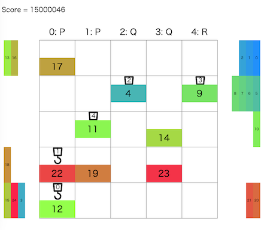

# トヨタ自動車プログラミングコンテスト2024#5(AHC033)

- https://atcoder.jp/contests/ahc033

## 問題概要

- 番号がついたコンテナを、N \* N (N=5)マスのグリッドの左から右へ、N台のクレーンを使って、指定の順番で搬出したい
- 毎ターン、各クレーンは、コンテナを掴む、離す、上下左右に移動する、何もしない、クレーンを爆破する、のいずれかをすることができる
  - 各クレーンは同じグリッド上に重なったり、すれ違ったりはできない
  - クレーンは2種類あり、0番だけ大クレーンでそれ以外は小クレーンで、大クレーンは移動先にコンテナがあっても移動できるが、小クレーンはできない
- できるだけ短いターンで搬出するような操作列を求めよ

## 時間

- 240 時間

## 個人的メモ

### クレーンが1台だけの場合

- シンプルな方法として、大クレーンが1台だけの場合を考えると、他のクレーンを気にしなくて済み、大クレーンは他のコンテナを無視して移動できるのでシンプルに考えられる
- なので、全部のクレーンでできるだけコンテナを取り出してから、小クレーンは爆破し、大クレーンのみで搬出するアプローチが考えられる
  - (ほぼ問題ないが、最初に搬出するコンテナが取り出せてない場合は詰む場合が存在するので注意)
  - ひとまず、大雑把に「このアプローチでのターン数/5台」が目指すべきターン数として考えられる
- 一方、クレーンを並列で動かすことを考える場合、小クレーンの方が多いので、小クレーンが動ける方法を考えたい
  - 小クレーンはコンテナやクレーンがあるマスには移動できないので、大クレーンと違った工夫が必要となる
- 小クレーンがコンテナを搬出できるためには、搬出口までの経路が空いている必要があるため、「経路(道)を作っておく」か「あまりコンテナが出さないようにする」かしたい

### 一時置き場

- 番号順に搬出するためには、どうしても一時的にどこかのマスに置いておく必要がある
- また、小クレーンが搬出できるようにするため、置いているコンテナは搬出の邪魔にならず、「置く＆取る」で2ターン分ロスするので、少ない方が良い
  - ただ、並列で動くため、このロスは必ずしもクリティカルなものではないみたい
- なので、できるだけそのようなロスが少なくなるような取り出し方を考える

#### 必要な一時置き場の最小数

- 「`dp[r0][r1][r2][r3][r4]`:=各行の搬入済み個数の状態がrxのときの必要な最小一次置き場個数」とかで求められる
  - ただ、条件を少しいじって適当に山登り/焼きなまし、ビームサーチとかでも
- これを求めると、各ケースによって結構違いがあることがわかり、大体平均3〜4マス、最大でも8マスとかであることがわかる
  - seed=0は必要な置き場の数が多くて実は難しめのケースで、seed=38とかは一時置き場が不要な簡単なケース、と違いがあることがわかる
- また、ここから「取り出す順番」が得られるので、この順番に処理すればよい
- ただし、多少最小数を超えても一時置き場において良いなど緩和したほうがターン数が減るケースもあるみたい

#### 一時置き場のパターン

- 道を用意する
  - 行2の部分を道にする
  - 行1と行3の部分を道にする
- できるだけ端を使う
  - 行0や行4を優先して使う(次に行1や行3)
- (一時置き場が7箇所とか必要になるケースもあるので、注意)

#### 特定のコンテナを具体的にどの一時置き場に置くか

- 下記のビームサーチ時に一緒に探索
- 「必要な一次置き場の最小数」を満たすような順番をたくさん生成して試す
- 貪欲に空いているところに置く
- など

### クレーン動作の並列化

- 小クレーン1台で処理する場合は、上記で求めた「取り出す順番」で、一時置き場に置きながら処理していけば、順番に搬出できる
- これを5台のクレーンで並列化したい

#### クレーンの1ターンの動きでビームサーチ

- クレーンの動きは8通りあり、5台分あるため、8^5=32768通りある
  - 実際は、Bは使わない、PとQはコンテナの搬入・一時置き場・搬出地点で決まる、などでもっと少ない
  - コンテナを持っている場合は基本は右方向、持ってない場合は左方向に行きたいはずなので、逆方向や無駄な動きを減らすと4^5=1024ぐらいにできる
  - また、範囲外移動やクレーンの存在でできない動きなどでさらに減る
- 適当に評価関数を用意して、ビームサーチするなどが考えられる
- この方法だと、ビーム幅が小さいや評価関数が微妙だと、無駄な動きをして無駄にターン数がかかっていたり、デッドロックが発生したりなどで失敗する可能性がある
- ただ、良い評価関数やビーム幅を確保できてるなど、十分調整できていれば、この方針で上位にいけていたっぽい

#### タスク割り当てで貪欲、ビームサーチ

- (解説放送)
- クレーンに「指定のコンテナを取りに行って、拾って、移動して、目的地に置く」というタスクを考える
- 他のクレーンとぶつからない/すれ違わないように移動する方法は、**グリッドに時間軸を加えた3次元で考える** と、クレーンがいて良い位置がわかるので、これでBFSなどすれば求められる
- そこで、各クレーンに対して、タスクを割り当てることを考える
  - 割り当てる順番が変わると、先に割り当てた方の経路を後に割り当てた方が避ける経路を取る感じの違いでる
  - コンテナやクレーンの配置によってはどうしても経路が見つからない場合もありえる
- 空いているクレーンに「取り出す順番」でコンテナを順番に処理する貪欲などでもそこそこ良くなる
  - 順番を変えて貪欲をたくさん試す、順序を焼き鈍す、など
    - 上位ではこの方針の人結構いるっぽい
- これをビームサーチにしたいが、タスク単位の場合、比較が難しい状態が同じビーム内に並ぶので、評価関数をどうするかが問題になる
  - 最上位は、「考えられる要素を考えて調整」や「必要手数の下限を考える」など

### 評価関数/評価値

- 評価関数の要素、評価値調整法
  - https://bowwowforeach.hatenablog.com/entry/2024/05/30/210002
- 搬出完了までに必要な手数の下限/下界を考える
  - https://shuu0914.hatenablog.com/entry/2024/05/27/190612
  - https://eijirou-kyopro.hatenablog.com/entry/2024/05/30/110801
- 無駄な動きに対して減点
- コンテナが目的地に近づくほど加点
- 各クレーンの必要ターン数のlogsumexp/クリティカルパス分析
  - https://twitter.com/terry_u16/status/1795033749257597363
  - [HTTF2022予選](./httf2022qual.md)
    - https://qiita.com/contramundum/items/52609b5a4c943bc6a275
- linear conflict
  - n-puzzleで使われる評価関数([AHC011](./ahc011.md))
  - https://eijirou-kyopro.hatenablog.com/entry/2024/05/30/110801

### その他工夫

- 重複排除/多様性確保
  - Zobrist Hash
- 枝狩り
- ビットによる高速化
- など

### その他

#### クレーンで役割を変える

- 「クレーンXは搬出、クレーンYはコンテナ整理」のように役割をわけて動かすことも考えられる
- しかし、搬出するクレーンが減るほど並列数が減ってターン数が増えてしまうため、できるだけ全クレーンが並列で搬出できている方が良い

#### 難しいケース

- seed=601
  - https://twitter.com/terry_u16/status/1795116652956172290
- https://twitter.com/hirohiso/status/1795065841865691437

#### 順位表から上位解の見積もり

- 点数から具体的な手数の見積もりまでできるらしい
  - https://twitter.com/tempuracpp/status/1795038898474619264
  - https://twitter.com/kiri8128/status/1795049445739917797
- スコアを調整して平均値を見積もることもできる
  - https://twitter.com/btk15049/status/1795050843655328136

#### 最短経路

- ビット演算
  - https://twitter.com/bowwowforeach/status/1795063661502873628
  - https://twitter.com/thun_c/status/1795070022701756533

#### 実行時間の劣化、リジャッジ

- 個別ケースでのブレの話ではなく、ある時間帯やテストケース付近で連続的にマシンの性能が劣化してそうな話
  - TLEが増えていたり、時間調整している人はTLEにはならないが探索数が減ってしまっていたり
- リジャッジが入った
- 他のインスタンスとキャッシュ(L3?)を奪い合っていたり、帯域圧迫しているのではないか、との仮説
- https://atcoder.jp/contests/ahc033/clarifications
- https://twitter.com/fuppy_kyopro/status/1795111517702045937
- https://twitter.com/terry_u16/status/1795129959054283171
  - https://twitter.com/terry_u16/status/1795322604502528295
- https://twitter.com/yunix91201367/status/1795123464149270753
  - https://twitter.com/yunix91201367/status/1795121124000305526
- https://twitter.com/yosupot/status/1795129618904605172
  - https://github.com/yosupo06/library-checker-judge/issues/396

#### マルチエージェント経路計画

- https://kei18.github.io/note/posts/mapf-tutorial/
- https://speakerdeck.com/kei18/navigation-for-a-team-of-agents
  - https://speakerdeck.com/kei18

## 解説

(50位まで&発言を見つけられた方のみ)

- [AHCラジオ(解説放送)](https://www.youtube.com/watch?v=DUWfVeIRjCU)
- [解説(日本語)](https://atcoder.jp/contests/ahc033/editorial)
- [解説(英語)](https://atcoder.jp/contests/ahc033/editorial?editorialLang=en)

- [1位bowwowforeachさん](https://twitter.com/bowwowforeach/status/1795033980015640708)
  - https://twitter.com/bowwowforeach/status/1795036799233884504
  - https://twitter.com/bowwowforeach/status/1795058222606201278
  - https://twitter.com/bowwowforeach/status/1795063661502873628
  - https://twitter.com/bowwowforeach/status/1795066764415369448
  - https://twitter.com/bowwowforeach/status/1795073795725590597
  - https://twitter.com/bowwowforeach/status/1795074349143130223
  - https://bowwowforeach.hatenablog.com/entry/2024/05/30/210002
- [2位Jirotechさん](https://shuu0914.hatenablog.com/entry/2024/05/27/190612)
- [3位eijirouさん](https://twitter.com/eijirou_kyopro/status/1795050942284357978)
  - https://twitter.com/eijirou_kyopro/status/1795089750178541626
  - https://twitter.com/eijirou_kyopro/status/1795090880681988378
  - https://eijirou-kyopro.hatenablog.com/entry/2024/05/30/110801
- [4位montplusaさん](https://twitter.com/montplusa/status/1795033648401428539)
  - https://twitter.com/montplusa/status/1795034496401563702
  - https://twitter.com/montplusa/status/1795040592117854220
  - https://twitter.com/montplusa/status/1795042153187422352
  - https://twitter.com/montplusa/status/1795050007780847980
  - https://twitter.com/montplusa/status/1795138598875849023
- [5位asi1024さん](https://twitter.com/asi1024/status/1795032809909674447)
- [6位soumatさん](https://twitter.com/soumat_13/status/1795038459108659495)
- [7位yunixさん](https://twitter.com/yunix91201367/status/1795032669727645960)
  - https://twitter.com/yunix91201367/status/1795061801492648100
  - https://twitter.com/yunix91201367/status/1795086756955537804
  - https://twitter.com/yunix91201367/status/1795086188472160528
  - https://twitter.com/yunix91201367/status/1795089742339449283
  - https://twitter.com/yunix91201367/status/1795095918464635323
  - https://twitter.com/yunix91201367/status/1795301426199146763
  - https://twitter.com/yunix91201367/status/1795353061021647093
  - https://yunix-kyopro.hatenablog.com/entry/2024/05/27/235836
- 8位ytknさん
- [9位terry_u16さん](https://twitter.com/terry_u16/status/1795033057411441016)
  - https://twitter.com/terry_u16/status/1795036495041945850
  - https://twitter.com/terry_u16/status/1795038303198101845
  - https://twitter.com/terry_u16/status/1795038864270033143
  - https://twitter.com/terry_u16/status/1795040624313336072
  - https://twitter.com/terry_u16/status/1795041965232337344
  - https://twitter.com/terry_u16/status/1795042617308086779
  - https://twitter.com/terry_u16/status/1795043475676598314
  - https://twitter.com/terry_u16/status/1795044804595757134
  - https://twitter.com/terry_u16/status/1795048430286324048
  - https://twitter.com/terry_u16/status/1795053777831047269
  - https://twitter.com/terry_u16/status/1795057312450670752
    - https://github.com/terry-u16/ahc033/blob/main/%E8%80%83%E5%AF%9F%E3%83%A1%E3%83%A2.pdf
  - https://twitter.com/terry_u16/status/1795067377240932435
  - https://twitter.com/terry_u16/status/1795068164910334186
  - https://twitter.com/terry_u16/status/1795086156884746619
  - https://twitter.com/terry_u16/status/1795087104646553950
  - https://twitter.com/terry_u16/status/1795089509194858885
  - https://twitter.com/terry_u16/status/1795090179864097252
  - https://twitter.com/terry_u16/status/1795096501510606955
  - https://twitter.com/terry_u16/status/1795104310755209633
  - https://twitter.com/terry_u16/status/1795107909484867761
  - https://twitter.com/terry_u16/status/1795111507161702653
  - https://twitter.com/terry_u16/status/1795112789968621632
  - https://twitter.com/terry_u16/status/1795114993769197897
  - https://twitter.com/terry_u16/status/1795116652956172290
  - https://twitter.com/terry_u16/status/1795121567069827408
  - https://twitter.com/terry_u16/status/1795130543794770308
  - https://twitter.com/terry_u16/status/1795130767569211575
    - https://twitter.com/Mi_Sawa/status/1790709606064570856
  - https://twitter.com/terry_u16/status/1795136941324894335
  - https://twitter.com/terry_u16/status/1795296681912938611
  - https://twitter.com/terry_u16/status/1795300176133075311
- 10位Pech1さん
- 11位WA_TLEさん
- [12位c7c7さん](https://twitter.com/C7C7LL/status/1795034462679376336)
- 13位dn6049949さん
- [14位toamさん](https://twitter.com/torii_kyopro/status/1795033165037293862)
- [15位saharanさん](https://twitter.com/shr_pc/status/1795032819242062084)
  - https://twitter.com/shr_pc/status/1795033594601070815
  - https://twitter.com/shr_pc/status/1795034110986960906
  - https://twitter.com/shr_pc/status/1795038821404266822
  - https://twitter.com/shr_pc/status/1795042238528954569
- [16位btk15049さん](https://twitter.com/btk15049/status/1795050843655328136)
  - https://twitter.com/btk15049/status/1795051078402101403
- [17位Rafbillさん](https://twitter.com/Rafbill_pc/status/1795144513410785774)
  - https://twitter.com/Rafbill_pc/status/1795116433602433296
- [18位tokoharuさん](https://twitter.com/tokoharu_procon/status/1795076092769796260)
- [19位simanさん](https://twitter.com/_simanman/status/1795050909505896724)
  - https://twitter.com/_simanman/status/1795045496802640304
  - https://twitter.com/_simanman/status/1795044402437513348
  - https://twitter.com/_simanman/status/1795043631419601014
  - https://twitter.com/_simanman/status/1795037426462650809
  - https://twitter.com/_simanman/status/1795033273204199670
  - https://twitter.com/_simanman/status/1795034018993283105
- [20位Shun_PIさん](https://twitter.com/Shun___PI/status/1795032975702188128)
  - https://twitter.com/Shun___PI/status/1795033616231125249
  - https://twitter.com/Shun___PI/status/1795034382136184994
  - https://twitter.com/Shun___PI/status/1795040524593676386
  - https://twitter.com/Shun___PI/status/1795044355658395782
  - https://twitter.com/Shun___PI/status/1795094997542248532
- [21位syndromeさん](https://twitter.com/syndro_6/status/1795034726744363410)
- 22位fgwiebfaoishさん
- [23位yochanさん](https://twitter.com/yochan_tech/status/1795034709912699014)
  - https://twitter.com/yochan_tech/status/1795036863444439234
  - https://twitter.com/yochan_tech/status/1795038316024246777
  - https://twitter.com/yochan_tech/status/1795068774741074324
  - https://twitter.com/yochan_tech/status/1795111826981560374
  - https://twitter.com/yochan_tech/status/1795114785639367088
- [24位tomerunさん](https://twitter.com/tomerun/status/1795033721952706681)
  - https://twitter.com/tomerun/status/1795038390053654990
  - https://twitter.com/tomerun/status/1795049361598009506
  - https://twitter.com/tomerun/status/1795120733883883909
  - https://twitter.com/tomerun/status/1795417394569183550
- 25位yukikazerさん
- 26位hirosegolfさん
- [27位rabotさん](https://twitter.com/tanaka_a8/status/1795055243010474222)
  - https://twitter.com/tanaka_a8/status/1795435550381609083
- [28位kawateaさん](https://twitter.com/kawatea03/status/1795034915647488107)
  - https://twitter.com/kawatea03/status/1795037819561189613
- [29位uta_cccさん](https://twitter.com/uta_cccc/status/1795036756418363532)
  - https://twitter.com/uta_cccc/status/1795043988690321598
  - https://twitter.com/uta_cccc/status/1796141656346935761
  - https://twitter.com/uta_cccc/status/1796156385211625752
  - https://twitter.com/uta_cccc/status/1796158055664738653
  - https://twitter.com/uta_cccc/status/1796509207547769169
  - https://twitter.com/uta_cccc/status/1796509970760143287
  - https://utac.hateblo.jp/entry/2024/05/28/193532
- [30位tsukammoさん](https://twitter.com/tsukammo/status/1795041041302626631)
  - https://hackmd.io/@tRy4BmqEQNynaezZyF9K5g/S1vvBo470
- 31位besukohuさん
- [32位itigoさん](https://twitter.com/itigo_purokonn/status/1795032390747684995)
  - https://twitter.com/itigo_purokonn/status/1795034814497591786
  - https://twitter.com/itigo_purokonn/status/1795036329916441009
  - https://twitter.com/itigo_purokonn/status/1795037402785824843
  - https://twitter.com/itigo_purokonn/status/1795041568904069207
  - https://twitter.com/itigo_purokonn/status/1795089307213918211
  - https://twitter.com/itigo_purokonn/status/1795046824346071145
  - https://twitter.com/itigo_purokonn/status/1795753802391584907
  - https://twitter.com/itigo_purokonn/status/1795766407021670685
- [33位mikuさん](https://twitter.com/ekidenp/status/1795046942390554952)
  - https://twitter.com/ekidenp/status/1795114087057084563
- [34位PrussianBlueさん](https://twitter.com/prussian_coder/status/1795049461187563787)
  - https://twitter.com/prussian_coder/status/1795059606487523542
  - https://twitter.com/prussian_coder/status/1795063394283700538
  - https://twitter.com/prussian_coder/status/1795550831967899877
  - https://twitter.com/prussian_coder/status/1795735687049998818
  - https://twitter.com/prussian_coder/status/1795791608958566462
  - https://twitter.com/prussian_coder/status/1795794913453285740
- 35位highjumpさん
- 36位adapchiさん
- 37位yosupoさん
- 38位wleiteさん
- [39位ssaattooさん](https://twitter.com/myh9_f/status/1795051910489116783)
  - https://ssaattoo.hatenablog.com/entry/2024/05/27/214709
- [40位hteさん](https://twitter.com/9busters16/status/1795051211294449681)
- [41位yuusanlondonさん](https://twitter.com/yuusanlondon/status/1795079022390411467)
  - https://twitter.com/yuusanlondon/status/1795081113141936516
  - https://twitter.com/yuusanlondon/status/1795078285358928068
- [42位RinSakamichiさん](https://twitter.com/RinSakamichi/status/1795037527771861153)
  - https://twitter.com/RinSakamichi/status/1793289208834236549
  - https://twitter.com/RinSakamichi/status/1795775411059904710
  - https://twitter.com/RinSakamichi/status/1795391844865716399
    - https://www.youtube.com/live/6y-NPNVkyHA
- [43位Ang107さん](https://twitter.com/Ang_kyopro/status/1795069110147006859)
  - https://twitter.com/Ang_kyopro/status/1795070326495138129
  - https://twitter.com/Ang_kyopro/status/1795072894218711398
  - https://twitter.com/Ang_kyopro/status/1795075412453732747
- [44位tempura0224さん](https://twitter.com/tempuracpp/status/1795032724756931063)
  - https://twitter.com/tempuracpp/status/1795038898474619264
  - https://twitter.com/tempuracpp/status/1795041667654750536
  - https://twitter.com/tempuracpp/status/1795043669138976871
  - https://twitter.com/tempuracpp/status/1795046113675809016
  - https://twitter.com/tempuracpp/status/1796224855257530636
- [45位yuuki_nさん](https://twitter.com/yuuki_n_n/status/1795079055223521753)
  - https://twitter.com/yuuki_n_n/status/1795079726798614661
- 46位sensaurさん
- 47位behoma8さん
- 48位saitodevel01さん
- [49位sortAさん](https://twitter.com/raccoon0329/status/1795034942394515963)
- [50位MathGorillaさん](https://twitter.com/MathGorilla_cp/status/1795096634264555829)
  - https://twitter.com/MathGorilla_cp/status/1795097412475773061
  - https://twitter.com/MathGorilla_cp/status/1795098265530011839

## Links

- [Twitter hashtag AHC033](https://twitter.com/hashtag/AHC033)
- [kiri8128さん Score-Performance グラフ](https://twitter.com/kiri8128/status/1795831436186153025)
- [simanさん統計](https://siman-man.github.io/ahc_statistics/033/index_rejudge.html)
  - https://siman-man.github.io/ahc_statistics/033/ (rejudge前)

