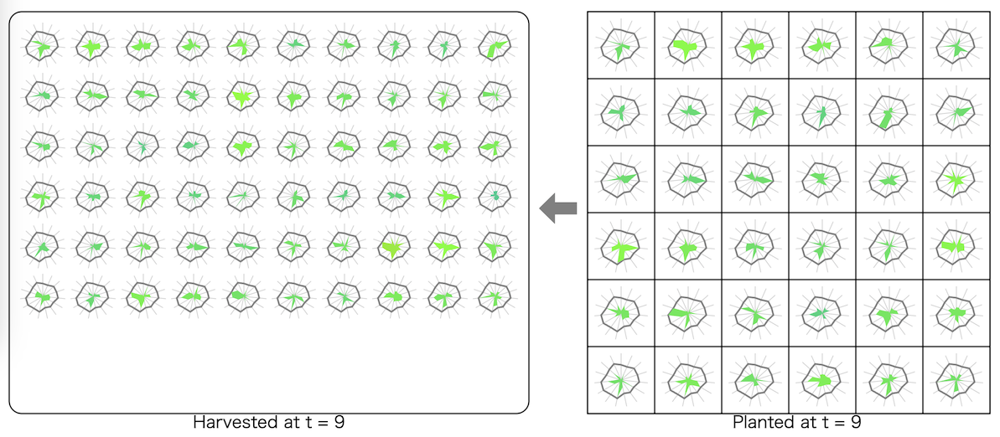

# ALGO ARTISプログラミングコンテスト2024夏(AHC035)

[TOC]

## 問題概要

- https://atcoder.jp/contests/ahc035
- N \* Nマス(N\=6)の畑があり、マスに種子を植えると、隣り合うマスについて1つの種子の特性を受け継いだ種子が2\*N\*(N-1)個収穫できる
- 各種子は、M個(M\=15)の評価項目があり、2つの種子からできる新しい種子は各評価項目についてどちらかの値をランダムに選んだものになる
- 最初に2\*N\*(N-1)個の種子が与えられるので、T回(T\=10)の収穫後にできるだけ評価項目の合計が大きい種子を作り出せ

## 時間

- 4 時間

## 個人的メモ

### 問題固有の性質

- 最終的に、最強の種子を1個作り出せば良い
  - 最初の種子集合での各評価項目の最大値を持つような種子が最強で、1,000,000点が得られる
  - (盤面全体を最大化するわけではない)
- 評価項目のいずれかで最大値を持つ種子はかなり大事
  - それが消えてしまうと最終的に可能なスコアの最大値が減少してしまう
- 植える種子はN\*N個なので、種子のうち半分程度は毎回破棄される

### 植えた種子の評価項目が次の世代に引き継がれる可能性

- 植えた種子の評価項目xが次の世代に残る可能性は、基本的には上下左右との4つの種子に引き継がれるため、1-すべての種子で引き継がれない1/2^4=93.75%ぐらいとかなり高い
- そのため、ある項目について最大値に近い値を持つ種子同士を組み合わせて残すことよりも、異なる項目で強い異種同士を組み合わせてより強い種子を作るのを狙う感じでよい模様

### 評価関数ベースのアプローチ

- 種子や植え方に関する評価関数を考え、各ターンで評価関数が高くなるように植える

#### 種子に関する評価関数

- 平均的に高い種子よりも、どれかの評価項目で最大値(またはそれに近い値)を持つような種子が重要
- そこで、最大値に近いところが大きく評価されるような評価関数を考える
- n乗和
  - 最大値付近以外のはほとんど無視しても良いため、差をつけるためにn乗した値を使う
    - 2乗、3乗、10乗、25乗とか
- 最大値(またはそれに近い値)を持つか、または、ボーナスを加える
  - 最大値なら1、そうでないなら0
  - sigmoid関数
  - 大きい方\*0.8+小さい方\*0.2
  - など
- 各項目の順位
- 目標との差
  - 最大値との差
  - 目標ベクトルとの差
- 特定の評価項目の最大値付近の種子の数が多すぎる場合はマイナス
  - 他の評価項目の評価値が高い種子が消えないようにしたい
- ターンによって値を変える
  - 最後の方のターンになるにつれ、最大値以外の値も重要になるので、ターンに応じて補正を変える

#### 植え方に関する評価関数

- 植えた場合の隣接種子(ペア)との組み合わせに対する評価関数を考える
- ペアの各評価値での大きい方の値の合計(の総和)
  - 理想的に評価項目が良い方を引き継いだ場合で考える
- 内積(の総和)
  - ベクトルとして見たとき、内積が小さいほうが異なる種子同士の組み合わせになっていてよい

#### 植え方

- グリッドの端の方だと種子の数が少なくなってしまうため、「強い種子」はできるだけ中心付近に置きたい
- グリッドの中心付近から、貪欲に評価値が高い種子を選んで植える方法でも強い
  - 渦巻き配置にしていた人が多いっぽい
- 貪欲法だと時間はかなり余るので、焼きなまし、など
  - 種子の交換、2点位置交換

### その他

#### 最終ターンだけ別処理

- 最終ターンは、どれかのペアが最強の種子を作れていればよいので、できるだけ最強の種子の生成確率が高そうな配置にする
  - 最大値を残すというより、できる種子の期待値が最大になるようにする

#### logsumexp関数 / Smooth maximum

- https://speakerdeck.com/terryu16/ahc035jie-shuo?slide=16
  - [HTTF2022予選](./httf2022qual.md)
- `max(a,b)`はaかbの大きい方しか返さないが、小さい方も加味した滑らかな値を返す
- 今回は、最大値以外の値も考慮したい気持ちに使えた
  - (自然言語処理や機械学習だと、オーバーフロー/アンダーフロー回避の手法の一つとして使われたりも)
- https://en.wikipedia.org/wiki/Smooth_maximum
  - max()のなめからな近似

#### AI活用

- 渦巻き配置などパターン生成にchatGPTなどを使う

## 解説

(50位まで&発言を見つけられた方のみ)

- [AHCラジオ(解説放送)](https://www.youtube.com/watch?v=gRbq9aUCrKs)
  - https://speakerdeck.com/terryu16/ahc035jie-shuo
- [解説(日本語)](https://atcoder.jp/contests/ahc035/editorial)
- [解説(英語)](https://atcoder.jp/contests/ahc035/editorial?editorialLang=en)

- [writer解](https://atcoder.jp/contests/ahc035/submissions/55746489)
  - https://atcoder.jp/contests/ahc035/submissions/55741487

- [peroonさん](https://twitter.com/peroon_cp/status/1814964907705844184)
  - https://twitter.com/peroon_cp/status/1815256727476203863
- [rhooさん](https://twitter.com/rho__o/status/1814965408123994264)
  - https://twitter.com/rho__o/status/1814964859781734626
- [Koi51さん](https://twitter.com/Koi1583/status/1814965102329962781)
  - https://twitter.com/Koi1583/status/1814966627546583382
  - https://trap.jp/post/2294/
- [ponjuiceさん](https://twitter.com/PonponJuice0/status/1814976794199507244)
  - https://twitter.com/PonponJuice0/status/1814981053557461398
  - https://twitter.com/PonponJuice0/status/1814994085872365813
  - https://twitter.com/PonponJuice0/status/1815249150805684296
- [yuusanlondonさん](https://twitter.com/yuusanlondon/status/1814964901565079721)
  - https://twitter.com/yuusanlondon/status/1814965473135473008
  - https://twitter.com/yuusanlondon/status/1814967411516358839
  - https://twitter.com/yuusanlondon/status/1814969237586293069
- [MathGorillaさん](https://twitter.com/MathGorilla_cp/status/1814967556064907268)
  - https://twitter.com/MathGorilla_cp/status/1814973825068765244
  - https://math-gorilla.hatenablog.com/entry/2024/07/28/161631
- [NKTさん](https://twitter.com/inani_waon/status/1814965611547799870)
  - https://inaniwa.hatenablog.com/entry/2024/07/22/215800
- [physics0523さん](https://twitter.com/butsurizuki/status/1814968472893313136)
  - https://twitter.com/butsurizuki/status/1814968839303843849
  - https://twitter.com/butsurizuki/status/1814976839925850285
- [sky58さん](https://twitter.com/skyaozora/status/1814965059204067744)
  - https://twitter.com/skyaozora/status/1814992811068170482
- [Jinapettoさん](https://twitter.com/Jinapetto/status/1814966525654450452)
- [Pech1さん](https://twitter.com/Pechi998244353/status/1814973021993718185)
- [simanさん](https://twitter.com/_simanman/status/1814967602634215592)
  - https://twitter.com/_simanman/status/1814968788334563678
  - https://twitter.com/_simanman/status/1814976163334557968
  - https://twitter.com/_simanman/status/1814976788160024799
  - https://twitter.com/_simanman/status/1814985722514010127
- [tsukammoさん](https://twitter.com/tsukammo/status/1814967319107617233)
  - https://twitter.com/tsukammo/status/1814973066763714876
  - https://twitter.com/tsukammo/status/1814980942475534801
- [Rice_tawara459さん](https://twitter.com/rice_tawara459/status/1814970683136544858)
  - https://twitter.com/rice_tawara459/status/1814972777352573018
  - https://twitter.com/rice_tawara459/status/1814973589193671090
- [yochanさん](https://twitter.com/yochan_tech/status/1814967743810326912)
  - https://twitter.com/yochan_tech/status/1814964403147792767
- [PrussianBlueさん](https://twitter.com/prussian_coder/status/1814967176291602692)
- [square1001さん](https://twitter.com/square10011/status/1814967707038826528)
- [fuppy0716さん](https://twitter.com/fuppy_kyopro/status/1814964096317690276)
  - https://twitter.com/fuppy_kyopro/status/1814965239106134368
  - https://twitter.com/fuppy_kyopro/status/1814966868744048667
  - https://twitter.com/fuppy_kyopro/status/1814969620622893564
  - https://twitter.com/fuppy_kyopro/status/1814970499883253810
- [kawateaさん](https://twitter.com/kawatea03/status/1814965382203240822)
- [wanuiさん](https://twitter.com/gmeriaog/status/1814967031646834856)
  - https://twitter.com/gmeriaog/status/1814983171513176506
- [emankcinさん](https://twitter.com/nickname959198/status/1814968798866440666)
  - https://twitter.com/nickname959198/status/1814969255651385605
  - https://twitter.com/nickname959198/status/1814970301505311085
- [hirataiさん](https://twitter.com/kyogi_hirame/status/1814967673035661458)
- [ichyoさん](https://twitter.com/ichyo/status/1814968513049604264)
- [threecourseさん](https://twitter.com/threecourse/status/1814968442342248773)
  - https://twitter.com/threecourse/status/1814968490778145169
  - https://twitter.com/threecourse/status/1814965852057567325
- [takumi152さん](https://twitter.com/takumi152/status/1814966791170367946)
- [LayCurseさん](https://twitter.com/laycrs/status/1814966815912767772)
- [konecoさん](https://twitter.com/mekemeke8865/status/1814976840718803049)
- [kaz_mightyさん](https://twitter.com/kaz_mighty/status/1814965185603600761)
  - https://twitter.com/kaz_mighty/status/1814967032665784667
- [merom686さん](https://twitter.com/merom686/status/1814966174330834988)
- [Nachiaさん](https://twitter.com/NachiaVivias/status/1814964271740293410)
  - https://twitter.com/NachiaVivias/status/1814964810775249107
- [Risenさん](https://twitter.com/risenafis/status/1814965325722800458)

- 延長戦
  - https://x.com/eijirou_kyopro/status/1815402549924790277
  - https://twitter.com/ymatsux_ac/status/1818310481209401418

## Links

- [Twitter hashtag AHC035](https://twitter.com/hashtag/AHC035)
- [kiri8128さん Score-Performance グラフ](https://twitter.com/kiri8128/status/1814978494142767585)
