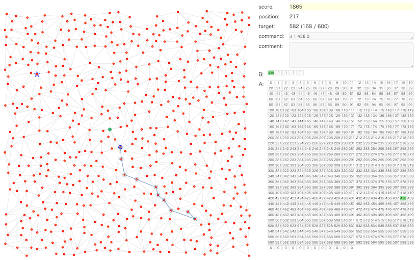

# RECRUIT 日本橋ハーフマラソン 2024夏(AHC036)

- https://atcoder.jp/contests/ahc036

## 問題概要

- N個の都市とM本の道路のが与えられる(平面グラフ)
- 各都市には信号があり、赤の場合はその都市には入れず、青の場合のみ都市に入れる
  - 都市から出る場合はどちらでもよい
- 信号は、あらかじめ決めておいた配列A(サイズLA)の連続部分を配列B(サイズLB)にコピーすることで、配列Bにある番号の都市だけ青にできる
- N個の都市のうち、与えられた順番に都市をT個訪れるような経路を考えるとき、信号操作の回数を最小化せよ
  - 都市間の移動にはコストはかからない

## 時間

- 240 時間

## 個人的メモ

### 問題固有の性質

#### 訪問する必要がない都市がある

- https://x.com/tomerun/status/1830946998628790625
- 訪問したい都市は、現在地以外のうちどれかから1都市を選ぶことを繰り返すため、ある程度の数の都市は訪問する必要がない
  - ( T回で1回も選ばれない確率 ) = ( 1 - 1/599 ) ^ 600 = 36.7%ぐらい
  - これはガチャとかのやつ
    - https://qiita.com/Ru_no4/items/66088cdfba83bbc1c91f
- 配列Aになくてもよい都市で、それによって配列に結構余裕ができるため、結構重要
- 都市数N\=600で、訪問したい都市の数T\=600だったので、順列になっているように誤読しやすかったかも・・・
  - 公式ビジュアライザも動きの可視化のため、誤読してても未訪問都市があることに気づきにくかった
  - 問題文にはちゃんと重複ありと書いてある＆入力生成ルールをちゃんと理解すれば気づける

#### グラフの大きさ、直径(半径)

- 各訪問点間の距離は実はそんなに遠くならない
  - 次の訪問点が一番離れているところの距離は平均27ぐらい
- ある頂点を根としてBFS木(最短経路木)を作った場合、(一番深さが小さくなる頂点を選んだ場合で)、根から各訪問点への最大距離は平均16程度しかない
- そのため、LBが大きいケースでは、根から各訪問点へは1つのパスで届きうる

### アプローチ

#### 木・放射状に伸ばすように考える

- https://x.com/yunix91201367/status/1830546895942615242
- LBが大きい場合を考えると、中心付近の頂点を根として、根から訪問点に行く経路が配列Bにすべてのせることができる
- 根から放射状にパス・木(部分木)的なものを伸ばすような形状を考える
  - 毎回根に戻ってくるとして同様に他の経路を根から伸ばすと考えると、経路切替のためのコスト1しかかからないため、かなりコストが抑えられる
  - 多少、訪問点に1回で行けなくてもかなりコストが抑えられる
- 作り方の初手としては、遠い訪問点から根までの経路の頂点を考えてすでにある経路にぶつかってマージした部分木サイズがLB以下ならマージする、DFS行きがけ順でグループを作る、など？
  - 通った回数や含む訪問都市数を考慮したり、など
  - ただし、単純に作っても配列Aにはそのままは入らないので、配列Aにはうまく圧縮していれてあげる必要はある
- うまく次の訪問点がパスにのってる場合は経路切替コストがかからずコストなしでいけるので、うまくそのようなものを探す
- 根の1頂点だけでなく、3-cliqueの各頂点から放射状に伸ばすのでもコスト1で別のパスに切り替えできる

#### 配列Bに入れる頂点集合をグループとして考える(グループベース)

- 配列Aのある地点から長さLB以下の部分区間の頂点集合を1グループとして考えると、信号操作はグループ間の移動回数と考えられる
- 良いグループの集合を作ることを目指す
  - 良い候補集合を見つける、山登り/焼きなまし、貪欲、など

##### LB以下の頂点集合を考える

- LB以下の頂点集合からなるグループの集合で、訪問順をグループ移動で考えたときの移動回数が少なくなるような、グループ集合を考える
- 候補としては、訪問点間の最短経路のパスをLB以下のグループに区切ったもの、最短経路でよく使われる辺、など
  - シュタイナー木とかのイメージで考えると、訪問点以外の頂点からの経路が最適だったりするので、そういう候補も入ってる必要があるかも
- しかし、スコア計算が結構重いため、グループの頂点集合を変化させる局所探索や良いグループを選んでいく貪欲法ではそのままだと厳しく、グループ数を抑えたり、高速化して計算するとか、代替の評価指標で最適化する必要がある

##### LB以上のパスを考える、LAのwalkを考える

- 長さがLB〜LAのwalk/パスを考えると、配列Aに入れたときに、その部分の部分区間はすべて連結なグループになる
  - ほぼwalk/パス(一筆書き)に限定すると、1次元で考えられるなど、いろいろ考えやすい利点がある
  - 訪問都市と次の訪問都市までの最短経路、任意の2都市間の経路、など
  - リサージュ曲線で生成されていた方もいた
    - https://x.com/MathGorilla_cp/status/1830591528827515363
- 訪問都市間の最短経路を連結したもの、適当に遠くの頂点に最短経路で向かう経路を連結したもの、パターンで生成、TSP、など

#### その他のアプローチ

- グリッドっぽい感じにする

### 解の探索

- BFSまたはDP、ビームサーチで求められる
- 配列Aの各位置から長さLB以下の(連結な)集合をグループとしてとりだし、隣接関係からグラフを作ると、グループ間の移動として考えられる
  - 何度か同じ訪問都市に訪れるので、距離計算はまとめてしたほうがよい
- 01BFS
  - グループ内の移動を重み0、グループ間は重み1として経路探索できる
  - けど、(グループ,頂点)が状態で、グループ数が多いと時間がかかりすぎるかも
- BFSで、訪問都市を含むグループの最短経路を探索
  - 各訪問都市ごとに、現在のグループから訪問点を含むグループへのBFSで最短経路を見つけて移動を繰り返す
  - グループ内の移動は、目的の頂点か次のグループに移動できる頂点まで適当に移動する
- DPで、グループの最短経路を探索
  - 各都市ごとにBFSで求める場合は、最短となるグループが複数あった場合にどちらを選ぶかで、次の訪問都市までの最短距離が変わりうる
  - dp\[目的としている訪問都市i番目\]\[現在のグループj\]:=最小信号操作回数
    - ここで、i-1番目の訪問としを含んでいたグループのみからしかi番目へ遷移しないので、jはそれだけ考えれば良い
    - さらに、i-1番目の訪問都市を含んでいたグループから考えるとき、最小回数のグループではないグループは、最小のグループから+1でそのグループに移動したより良くならないので、考える必要がなく、探索すべき状態が減らせる
- ビームサーチ
  - 配列BをサイズLB以下で更新する(前のBの状態を考慮する)場合、ビームサーチなどで探索したほうが実装しやすいかも

### 評価関数、スコア計算

- 基本的には、生スコア(信号操作回数)
- また、スコア以外にも配列Aに入るか？なども考慮した評価関数なども考えられる
- 木ベースの場合はあまりコストがかからないかもだが、グループベースの場合はそのままだと計算が重い
- 不要な計算を省略したり、差分更新での高速化などが可能

#### グループベースの場合、スコア計算だけなら頂点移動の計算は省略

- グループベースの方法で、頂点移動の情報が必要なのは最終的な結果だけなので、スコアを計算したいだけなら頂点の移動の計算は不要
  - グループ間の移動だけを考えれば良い
  - グループ数が多いと厳しいので、グループ数をLA個ぐらいまでに抑えたりするのも必要かも

#### 最短経路木を差分更新

- グループからなるグラフで、頂点の変更があった場合、最短経路木の部分木更新で差分更新すると高速に求められる
  - https://x.com/soumat_13/status/1830561544561967569

#### その他の評価項目

- 配列Aに入れる場合の使用率(増加量)
- 頂点のカバー率

### 配列Aへの入れ方

- 配列Aに2つのグループを並べて「a b c d x y z w」のようにいれる場合、その間の部分でいれた2つのグループ以外のグループが作れる
  - 例えば、a,b,c,d,x,y,z,wがすべて直線でつながっている場合は、「a b c d」と「x y z w」以外に、「b c d x」「c d x y」「d x y z」というグループができる
    - walk/パスを入れた場合、その部分区間はすべて連結なグループとして使える
  - 直線上でなくても、dとxが連結であれば、そこ付近でグループができる
    - グループの頂点の並びが重要になるので、DFSやBFSなどで順番を決めるなど
- グループ間で共通頂点を持つ場合
  - 2つのグループ「a b c d e」と「x c d e y」は、頂点c,d,eを共通頂点として持つ
  - 共通頂点を真ん中に「a b c d e x y」のように配列Aでいれると、2つのグループが7要素分で済む
- 他のグループの部分集合になっているグループはいれる必要はない(大きい方のグループを使えば良い)
  - 配列Bの部分更新を考慮する場合は、必要ないとは限らない

### 配列Bの部分更新

- 基本的には、配列BをLB個で更新するのがわかりやすいが、LB個未満で更新することで指示回数を減らせる場合がある
  - 例えば、Bが「a b c d e」で、aから、a,b,c,x,yの順で目的地yまで行ってaに戻りたい場合、LB個で更新するならx,yを含むもの(「a b c x y」はない場合)で更新してから再度「a b c d e」で更新するため2手必要だが、部分更新すれば1手で済む
- ただ、改善につながる一方、Bのどこを更新するかなどで状態が増えるため考慮が難しいし、グループとして考えてたりすると動的にグループができることになって扱いにくい
  - 前から/後ろからの場合のみ考えて探索時に考慮、など

### その他

#### 常時青の頂点を作る

- https://x.com/tanaka_a8/status/1831670720189100048

#### 平面グラフ、交通ネットワーク

- https://iwiwi.hatenablog.com/entry/20130912/1378989205
- https://www.slideshare.net/slideshow/20150606-shortest-pathkoike/49092386
- https://x.com/tsukammo/status/1830556111919010239
  - https://en.wikipedia.org/wiki/Contraction_hierarchies

#### 全点間距離の計算

- 2点間の距離を知りたいことが多いので、前計算しておくとよい
- 平面グラフのため辺の数が少なく、ワーシャルフロイド(O(N^3))より各点からBFSをしたほうがよい
  - 辺数Mの制約の「N-1」は連結な木の辺数、「3\*N-6」は平面グラフの最大数

#### 双方向、Astar

- スタートとゴールが決まっていたので、単純にスタートからBFSするより、双方向BFSしたほうが速いかも
- https://gist.github.com/koyumeishi/b736a779af616529fe225c733d64f011

#### スコアの理論値について

- 「訪問都市間の最短距離の合計をLBで割った回数」は理論値 **ではない**
- 訪問後に来た方向に折り返すような場合、その分の信号操作がなくせるので、もっと少なくなる
- 大雑把な参考値としては使えるかも

#### 訪問順の入れ替え

- https://utac.hateblo.jp/entry/2024/09/03/232633
- 訪問都市までの距離が近いなど、行き来が低コストでできる場合は、訪問順番を入れ替えて考えてもよい

#### 問題の元ネタ、作問裏話

- 解説放送
- Graph500
  - https://ja.wikipedia.org/wiki/Graph500

#### カスタムビジュアライザ

- 今回、アプローチによって公式ビジュアライザでは見れない情報などあったので、自分で可視化(1枚絵でも十分)してみるのが有効だった
  - 訪問都市を1ターンとして可視化
  - 木構造の場合は、通った全経路や回数を可視化
  - など
- 辺の通った回数を線の太さで表すとかが見やすい

## 解説

(50位まで&発言を見つけられた方のみ)

- [AHCラジオ(解説放送)](https://www.youtube.com/watch?v=QWBtEa7DFZY)
- [解説(日本語)](https://atcoder.jp/contests/ahc036/editorial)
- [解説(英語)](https://atcoder.jp/contests/ahc036/editorial?editorialLang=en)

- [1位soumatさん](https://x.com/soumat_13/status/1830559924965028099)
  - https://soumat.hatenablog.com/entry/2024/09/07/152734
- [2位rhooさん](https://x.com/rho__o/status/1830547507862286431)
  - https://x.com/rho__o/status/1830552705070440946
  - https://x.com/rho__o/status/1832066310970458182
- 3位Jirotechさん
- [4位yunixさん](https://x.com/yunix91201367/status/1830546895942615242)
  - https://x.com/yunix91201367/status/1830547474588877217
  - https://x.com/yunix91201367/status/1830549904797942244
  - https://x.com/yunix91201367/status/1830552948952461569
- [5位bowwowforeachさん](https://x.com/bowwowforeach/status/1830548667562078493)
  - https://x.com/bowwowforeach/status/1830582371412045843
- [6位Kiri8128さん](https://x.com/kiri8128/status/1830550742048117051)
  - https://x.com/kiri8128/status/1830555944444674232
  - https://x.com/kiri8128/status/1830553315618525403
  - https://x.com/kiri8128/status/1830560847468605588
  - https://x.com/kiri8128/status/1830565235532718171
  - https://x.com/kiri8128/status/1830602738050478220
  - https://x.com/kiri8128/status/1830603514688762056
  - https://x.com/kiri8128/status/1830626374182486281
  - https://x.com/kiri8128/status/1830630415666946223
  - https://kiri8128.hatenablog.com/entry/2024/09/02/195000
- [7位MAthGorillaさん](https://x.com/MathGorilla_cp/status/1830591528827515363)
  - https://x.com/MathGorilla_cp/status/1830601705614131369
  - https://x.com/MathGorilla_cp/status/1830984031049261382
- [8位montplusaさん](https://x.com/montplusa/status/1830547731611349363)
  - https://x.com/montplusa/status/1830552697793327572
  - https://x.com/montplusa/status/1830982167448694990
  - https://x.com/montplusa/status/1830983221498261534
- 9位sugarrrさん
- [10位rabotさん](https://x.com/tanaka_a8/status/1830579089406931107)
  - https://x.com/tanaka_a8/status/1831670720189100048
  - https://x.com/tanaka_a8/status/1831689262057787611
- [11位wanuiさん](https://x.com/gmeriaog/status/1830592363615465793)
- [12位risujirohさん](https://x.com/risujiroh/status/1830556265799729173)
- 13位asi1024さん
- [14位ToastUzさん](https://x.com/ToastUz/status/1830547054051074250)
  - https://x.com/ToastUz/status/1830559815741083719
  - https://x.com/ToastUz/status/1830569982776037492
- [15位saharanさん](https://x.com/shr_pc/status/1830552710715695586)
  - https://x.com/shr_pc/status/1830554889908568496
  - https://x.com/shr_pc/status/1830557460349997083
  - https://x.com/shr_pc/status/1830559292287803832
- [16位physics0523さん](https://x.com/butsurizuki/status/1830553500256022716)
  - https://x.com/butsurizuki/status/1830555436715749562
  - https://x.com/butsurizuki/status/1830556577692373187
  - https://x.com/butsurizuki/status/1830559078239928738
- 17位syndromeさん
- [18位highjumpさん](https://x.com/highjump_425/status/1830558288188166227)
- 19位nnnSMMさん
- [20位Shun_PIさん](https://x.com/Shun___PI/status/1830549817531269465)
  - https://x.com/Shun___PI/status/1830550705767416153
  - https://x.com/Shun___PI/status/1830553338087371208
  - https://x.com/Shun___PI/status/1830811767221690717
  - https://x.com/Shun___PI/status/1830927015182245934
- 21位Jeffreyさん
- [22位Psyhoさん](https://x.com/FakePsyho/status/1830553699199910313)
- 23位Pech1さん
- 24位dn6049949さん
- [25位notkamonohasiさん](https://x.com/notkamonohasi_2/status/1830548306797482140)
  - https://notkamonohasi.hatenablog.com/entry/2024/09/09/194745
- 26位sensaurさん
- [27位uta_cccさん](https://x.com/uta_cccc/status/1830550983702954350)
  - https://x.com/uta_cccc/status/1830605320919646319
  - https://x.com/uta_cccc/status/1830957094419472770
  - https://x.com/uta_cccc/status/1830958051920392414
  - https://utac.hateblo.jp/entry/2024/09/03/232633
- [28位simanさん](https://x.com/_simanman/status/1830550591036338455)
  - https://x.com/_simanman/status/1830572315664679169
  - https://x.com/_simanman/status/1830573764876423629
- 29位wleiteさん
- 30位scat_nekoさん
- 31位behoma8さん
- 32位adapchiさん
- 33位oogiriさん
- 34位USAさん
- [35位yochanさん](https://x.com/yochan_tech/status/1830551809863426351)
  - https://x.com/yochan_tech/status/1830552465542185422
  - https://x.com/yochan_tech/status/1830553687032524834
- [36位kaliafluoridoさん](https://x.com/kaliafluorido/status/1830561974771737081)
  - https://x.com/kaliafluorido/status/1830569068065382604
- 37位btk15049さん
- 38位besukohuさん
- [39位bresoさん](https://x.com/Carbon_so6/status/1830546728753549443)
- 40位fgwiebfaoishさん
- 41位mn_7545さん
- [42位Ang107さん](https://x.com/Ang_kyopro/status/1830546219531370679)
  - https://x.com/Ang_kyopro/status/1830548981656805641
- 43位shingo0909さん
- 44位kurakuraさん
- 45位Boleroさん
- [46位kozimaさん](https://x.com/t33f/status/1830546680652914854)
  - https://x.com/t33f/status/1830547445627150668
- [47位fuppy0716さん](https://x.com/fuppy_kyopro/status/1830549650044326382)
  - https://x.com/fuppy_kyopro/status/1830574985192304807
- [48位Jinapettoさん](https://x.com/Jinapetto/status/1830546845929517240)
  - https://x.com/Jinapetto/status/1830550872935591964
  - https://x.com/Jinapetto/status/1830555556370882800
- [49位yosssさん](https://x.com/yos1up/status/1830587905619927302)
- [50位ninja7さん](https://x.com/ninja9973/status/1830549835659018704)

## Links

- [twitter hashtag AHC036](https://x.com/hashtag/AHC026)
- [twitter hashtag rcl_procon](https://x.com/hashtag/rcl_procon)
- [simanさん統計](https://siman-man.github.io/ahc_statistics/036/)
- [kiri8128さん Score-Performance グラフ](https://x.com/kiri8128/status/1831361874132386008)
- [kiri8128さん スコア比較](https://x.com/kiri8128/status/1830999312207355907)
  - https://x.com/kiri8128
- [wataさんの詳細な順位表](https://img.atcoder.jp/ahc_standings/index.html?contest=ahc036)
  - x軸をLBにして上位の分布を見ると、LB13あたりを境に違いがある
