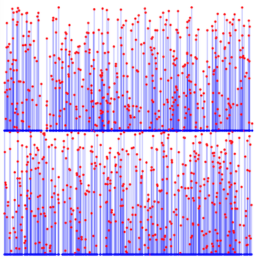

# 第11回 Asprova プログラミングコンテスト(AHC037)

[TOC]



## 問題概要

- https://atcoder.jp/contests/ahc037
- 炭酸飲料の甘さx、炭酸の強さyを(x,y)で表す
- 炭酸飲料(x,y)からは、x'>=xかつy'>=yであるような炭酸飲料(x',y')を新たに作ることができるが、コスト(x'-x)+(y'-y)だけかかる
  - 作り出した後も、元の炭酸飲料は残る
- 最初(0,0)の炭酸飲料からスタートし、指定されたN種類の炭酸飲料すべてをできるだけ低コストで作りたい
  - 途中で指定されていない炭酸飲料を作っても構わない
  - ただし、操作回数は5N回以下

## 時間

- 4 時間

## 個人的メモ

### 問題固有の性質

#### 中間点なしでの最適形

- xy平面上にプロットしたもの(ビジュアライザ参照。左下が原点)を考える
  - 生成する炭酸飲料を点で表す
- この時、ある点からその右上領域にある点を生成でき、その点の間の辺のマンハッタン距離の合計をできるだけ小さくしたい
- 基本的には、(0,0)の点から、できるだけ近くの頂点同士を辺でつなぐような木構造になっていると、生成コストが小さくなるのでそのようにしたい
  - 単純に、中間点は考えずに、できるだけコストが小さくなるよう親頂点をランダムに入れ替える山登りを時間いっぱい回した場合、600位に並んでいる3,430,697,513点解が得られる

#### コストが減る中間点

```
       ・p


                  ・q

・a
```

- 上のように点aから点pと点qをそれぞれ生成している場合、以下のように点rを用意し、点aから点r、点rから点p点qを生成すると、コストがより減らせる
  - 点rは、点pと点qのそれぞれの座標の小さい方の組み合わせ
  - シュタイナー木のイメージ

```
       ・p


       ・r        ・q

・a
```

- 中間点rは、できるだけ点aからの距離が遠いほど経路をまとめられるので、上記の場合は、中間点r=(min(p.x,q.x),min(p.y,q.y))に置くのがよい
- ただ、中間点rは頂点の組み合わせによって複数考えられるので、良い中間点の集合とつなぎ合わせ方を探したい

### アプローチ

#### 強い貪欲

- 上記の「中間点」を原点から遠い方から貪欲に選んでいく方法
  - 2点p,q選んで、中間点r=(min(p.x,q.x),min(p.y,q.y))として、そのようなrの中で一番マンハッタン距離が大きいものを選び、p,qを除いてrを入れる、を繰り返す
  - 原点側からだとどの頂点に伸ばすか考えにくいが、「後ろから考える」と、頂点ペアをマージしていく問題として考えられる
- 23位(5,388,249,433点解)

##### コスト関数から導出

- (解説放送)
- すべて原点と繋いだ場合は、コスト合計 = Σ_{p∈P}(p.x + p.y)
- ある中間点rを追加し点p点qの距離が縮まった場合、コスト合計は、Σ_{p∈P}(p.x + p.y) - (r.x + r.y)
  - マンハッタン距離なので、x,yそれぞれ独立で、上の図のようなケースで点aが原点とした場合だと、(p.x+q.x-r.x)+(p.y+q.y-r.y)
- したがって、rはできるだけ大きい方がコストの減りが大きい
  - ので、そのようなものを貪欲に選んでいく、というのが自然に導出される

##### ビームサーチ

- 頂点ペアの選び方をビームサーチで探索する(解説放送)
  - ただし、そのままだと頂点ペアの選び方が重かったりするため、マンハッタン距離の降順でうまく枝狩りなどする

#### 局所探索

- 「どの点から生成するか(親頂点)」と「中間点の置き方(集合)」を変える局所探索が考えられる
  - 中間点を追加すると、その付近での最適なつなぎ方も変わり、不要になる中間点が出たりする
- (あと山登りではなく焼きなましの場合は、スコアのスケールが大きいので調整する)

##### 二分木で考える

- 1位やwriter解など
- 「2つの点のマージ」的なイメージで、二分木にして考える
  - 解の木構造の子の個数は2個以外の場合もありえるが、同じ座標の別の点もコスト0で追加できることから二分木としても考えられる(ダミー頂点としてもよい)
- 頂点の移動、部分木の回転など、木の構造を変化させるような近傍を考える

### その他

#### 枝狩り

- 離れすぎている2点から作れる中間点は採用されることはほとんどないため、探索時の候補を減らせる

#### Rectilinear Steiner Arborescence Problem

- https://x.com/ygussany/status/1835318265922687453
- https://atcoder.jp/contests/ahc037/editorial/11041
- https://x.com/theory_and_me/status/1840997904649241075
- 上の強い貪欲は「貪欲2近似アルゴリズム」として知られているっぽい？

#### 操作回数5N以下

- (解説放送)
- https://x.com/terry_u16/status/1835322897650610639

## 解説

(50位まで&発言を見つけられた方のみ)

- [AHCラジオ(解説放送)](https://www.youtube.com/watch?v=r1emPyMJNew)
- [解説(日本語)](https://atcoder.jp/contests/ahc037/editorial)
- [解説(英語)](https://atcoder.jp/contests/ahc037/editorial?editorialLang=en)


- [Rafbillさん](https://x.com/Rafbill_pc/status/1835318996817588308)
  - https://github.com/Rafbillpc/writeups/blob/main/atcoder/ahc037/writeup.md
- [tempura0224さん](https://x.com/tempuracpp/status/1835321905534116223)
  - https://x.com/tempuracpp/status/1835323796204515767
- [spawnさん](https://twitter.com/SP1_winter/status/1835322319822340299)
- [oogiriさん](https://x.com/00giri_/status/1835324423190323349)
- [ichyoさん](https://twitter.com/ichyo/status/1835319901722194305)
- [uwiさん](https://twitter.com/uwitenpen/status/1835318274227400913)
- [FplusFplusFさん](https://twitter.com/FplusFplusF____/status/1835321125410386267)
- [ygussanyさん](https://twitter.com/ygussany/status/1836365191405281791)
  - https://twitter.com/ygussany/status/1835318265922687453
- [yokozuna57さん](https://twitter.com/yokozuna_57/status/1835317822337245659)
  - https://twitter.com/yokozuna_57/status/1835319566790254644
  - https://twitter.com/yokozuna_57/status/1835324006335135872
- [Psyhoさん](https://twitter.com/FakePsyho/status/1835320810006868095)
- [soumatさん](https://x.com/soumat_13/status/1835330551043285098)
- [wanuiさん](https://x.com/gmeriaog/status/1835321782280335838)
- [ymatsuxさん](https://twitter.com/ymatsux_ac/status/1835319899608281584)
  - https://twitter.com/ymatsux_ac/status/1835334236561424724
  - https://twitter.com/ymatsux_ac/status/1835336284749144382
- [hourenさん](https://twitter.com/Dark_hourensou/status/1835319000936649076)
- [mtsdさん](https://twitter.com/soiya_ksk/status/1835318786192502935)
  - https://twitter.com/soiya_ksk/status/1835319175654576228
- [nrvftさん](https://twitter.com/nrvkpr/status/1835320085524955334)
  - https://twitter.com/nrvkpr/status/1835320592301719719
- [yatubaさん](https://twitter.com/yatuba_/status/1835323529518342303)
- [harmokeyさん](https://twitter.com/harmokey/status/1835326542169120871)
  - https://twitter.com/harmokey/status/1835343734713770466
- [gksatoさん](https://twitter.com/Fine_sugar_hill/status/1835323029926351270)
- [fuppy0716さん](https://twitter.com/fuppy_kyopro/status/1835318614410297423)
  - https://twitter.com/fuppy_kyopro/status/1835322561321959523
  - https://twitter.com/fuppy_kyopro/status/1835323035026661718
- [yosupoさん](https://twitter.com/yosupot/status/1835318123584766377)
  - https://twitter.com/yosupot/status/1835322156336763310
- [KoDさん](https://twitter.com/d7511168/status/1835319444031287725)
- [yuuki_nさん](https://twitter.com/yuuki_n_n/status/1835321075057738184)
  - https://twitter.com/yuuki_n_n/status/1835318307093905734
  - https://twitter.com/yuuki_n_n/status/1835321922978189758
- [takumi152さん](https://twitter.com/takumi152/status/1835329726338203972)
  - https://twitter.com/takumi152/status/1835341360444166436
- [tokoharuさん](https://twitter.com/tokoharu_procon/status/1835646244192227703)
- [Kohenyanさん](https://twitter.com/Kohenyan_pro/status/1835325173828125029)
- [mono_1729さん](https://twitter.com/mono_1729/status/1835321101930684539)
- [ganmodokixさん](https://twitter.com/AprilGanmo/status/1835319796931744146)
  - https://twitter.com/AprilGanmo/status/1835508210540724538
- [tomerunさん](https://twitter.com/tomerun/status/1835318877305356340)

## Links

- [twitter hashtag AHC037](https://x.com/hashtag/AHC037)
- [kiri8128さん Score-Performance グラフ](https://x.com/kiri8128/status/1835329056717590796)
