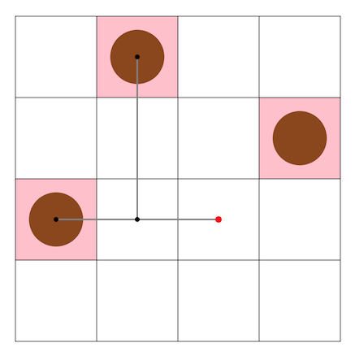

# トヨタ自動車プログラミングコンテスト2024#10(AHC038)

- https://atcoder.jp/contests/ahc038



## 問題概要

- N \* Nマスのたこ焼き器があり、Mマスにたこ焼きが置かれており、これを指定されたMマスの目的地に移動させたい
- 移動には、あらかじめ設計した木構造のロボットアームを使うことができ、葉の指すマスに対してたこ焼きを掴む、置く操作が行える
  - ロボットアームは、V頂点からなる木構造で、軸に並行に配置され、毎ターン、根位置の移動、90度回転、たこ焼き操作が行える
- ロボットアームの設計を行い、できるだけ少ないターンで目的地に移動する操作列を求めよ

## 時間

- 240 時間


## 個人的メモ

### ロボットアーム設計

#### 根のみ

- 1番単純なのは、1頂点(根のみ)で運ぶケース
- 運ぶのに1ターンで1マスしか動けないため、移動分だけターンが必要になってしまう

#### スター型

- 「根のみ」の拡張として、根から辺をたくさん生やすことで、(だいたい)同時に運べるようになる
  - この場合は、[AHC006](./ahc006.md)的な感じ？
- 同時に運べるためターンは減るが、根のみの場合と同様に、移動分のターンが多く必要

#### パス型

- 長い辺を考えた場合、90度回転させることでかなりの長距離を1ターンで移動することができる
  - 長さがLの辺のみのアーム(`●--------o`みたいなの)で考えると、90度回転した位置へは、根の移動のみで動かすと2Lターンかかるところが、回転操作の1ターンでできる
- また、直線的につなげた辺つなげた`●--------o-------o----o`のような形を考えると、1ターンで移動できる位置が増加する
- それぞれの長さが「16,8,4,2,1」のものを考えると、すべてのNで、中心からすべての位置に2ターン以下でアクセスできるので、「少なくとも2ターン\*移動が必要なたこ焼き数」を達成できる

#### 箒型(パス＋スター)

```
               o
               |
●------o----o--o----o
               |\
               | \
               o  \
                   o
```

- 上記のような、パスの先端や途中の頂点からスター型のように辺を生やすと、長距離移動＆同時移動が両立できる
- 最終的には、1ターンで大量に拾って1ターンで大量に置く、を繰り返す感じにしたいため、同じ長さのスターではなく、長さを1,2,3,4,...のように分けて同時に操作できるようにするなどが考えられる
- パス側に頂点を使うか？スター部分に頂点を使うか？
  - パス部分の頂点を1頂点減らすと、移動できる範囲が減ってしまうが、代わりに並列数が1増える
- バリエーション
  - 頂点数、生やし方、辺の長さなどの工夫が可能
  - V=5やVが大きい場合は、うまく形状を変えると、より良くなる可能性がある

#### パス部分の長さ(「8,4,2,1」型/「1,2,4,8」型)

- https://x.com/t33f/status/1845770322051768707
- https://x.com/ymatsux_ac/status/1845795193179816375
- 根から伸びるアームの長さが「8,4,2,1」型と「1,2,4,8」型では、1ターンでアクセスできる位置が異なる
  - 右に伸び切っている状態からは、前者のほうだと反対方向には1ターンでは移動できないが、後者は1ターンである程度移動可能、など

#### V=5の場合

- 5頂点しか使えない場合、頂点数に余裕がないため、`8-4-2-1`のように構成すると、1つずつしかたこ焼きが移動できない
- うまくパス部分の頂点を減らして、スター部分に頂点を使えないか探せると、スコアが大きく変わりうる
  - Nが小さかったり、葉の数を増やせるケースの場合は、2〜3個同時に移動できるため、並列化効果がかなり大きい

### アームの探索、埋め込み

- NやVによって必要な長さや葉の個数が変わったり、各ケースのたこ焼きの数(M)や配置によって、変わりうる
- アームの形状は「決め打ち」するか「ケースに合わせて探索」するかが考えられるが、今回は、どちらでも上位を目指せた模様
  - NやVで固定で埋め込む
  - 貪欲などで試してみて一番良かったやつを採用して、より時間をかけて探索する
  
### 操作列の探索

- アームの形状が決まったら、最短手数で移動できる操作列を探索する
- 上位は、ビームサーチ/chokudaiサーチか、貪欲が多かった模様

#### 次の状態の生成

- ある状態に対して、次の状態を考える場合、1手で動かせるのは、「ルートの位置5通り＋アームの状態3^V＋拾うか置くか2^{葉の個数}」だけありえてしまう
- 箒型のアームの場合、ルートの位置とパス部分のアームの状態だけ全探索し、葉の向きや拾うか置くかは貪欲に決めるように考えると、かなり無駄な状態を減らせる
- 「1回休み」
  - 直前で何もしない葉は、180度(2ターン分)操作可能
  - パス部分も、1個もたこ焼きを取れない場合、1回休みとすると、根の距離と状態の差だけ見れば遷移可能かがわかり、無駄に状態を増やさなくて済む
- 次にどこにも拾う/置くができない場合、「1回休み」になるが、その近くに拾う/置くができる場所がなければある程度の移動が必要なため、そのような場合は、できる位置まで大きく移動させる
  - そのような位置は別途探索する

#### 評価関数

- 拾った・置いたたこ焼き数
  - 2\*M個の進捗として考える
- たこ焼きの重要度(取れる状態数、外側にあるか、など)
- 1列消しに対して加点

### その他

#### 操作回数の理論値

- 理論値的には、拾う&置くがそれぞれ1ターンで行えた場合、「移動が必要なたこ焼き数 / 同時に移動できるたこ焼き数 * 2(拾う&置く分)」になる
  - この時、回答の後ろの部分はPで埋まっている感じになる
  - ケースによってスコアが結構バラけるので、上記で正規化するとよいかも
  - ただし、「同時に移動できるたこ焼き数」はアーム設計依存

#### 中継

- 「ある地点を経由して移動する」というのも考えられる
- ただ、今回は考慮しなくても良かった模様

#### 厳しいケース

- seed=5333(N=30,M=266,V=5)

#### お絵かき

- https://x.com/winter_kyopro/status/1845833925186466112
  - https://github.com/winter-2521/AHC038/blob/main/chokudai.txt

## 解説

(50位まで&発言を見つけられた方のみ)

- [AHCラジオ(解説放送)](https://www.youtube.com/watch?v=lJWAnmZWWSw)
- [解説(日本語)](https://atcoder.jp/contests/ahc038/editorial)
- [解説(英語)](https://atcoder.jp/contests/ahc038/editorial?editorialLang=en)

- [writer解](https://twitter.com/wata_orz/status/1845773954193244361)
  - https://atcoder.jp/contests/ahc038/submissions/58799365

- [montplusaさん](https://twitter.com/montplusa/status/1845770020712067252)
  - https://twitter.com/montplusa/status/1845768749401673950
  - https://twitter.com/montplusa/status/1845822718341730462
  - https://montplusa.hatenablog.com/entry/2024/10/17/174500
- [saharanさん](https://twitter.com/shr_pc/status/1845769258854432948)
  - https://twitter.com/shr_pc/status/1845767946410618908
  - https://twitter.com/shr_pc/status/1845771974309785770
  - https://twitter.com/shr_pc/status/1845780515548496080
  - https://twitter.com/shr_pc/status/1845784310168842670
  - https://twitter.com/shr_pc/status/1845796635982626915
  - https://twitter.com/shr_pc/status/1845951229928919444
  - https://twitter.com/shr_pc/status/1846202846427103719
  - https://twitter.com/shr_pc/status/1846204264240369859
- [bowwowforeachさん](https://twitter.com/bowwowforeach/status/1845782286752739745)
  - https://twitter.com/bowwowforeach/status/1845792586398838863
  - https://twitter.com/bowwowforeach/status/1845792987680497934
  - https://twitter.com/bowwowforeach/status/1845796962781495417
  - https://twitter.com/bowwowforeach/status/1846297722191859925
- [Shun_PIさん](https://twitter.com/Shun___PI/status/1845768372946076152)
  - https://twitter.com/Shun___PI/status/1845769387070070814
  - https://twitter.com/Shun___PI/status/1845769794903015571
  - https://twitter.com/Shun___PI/status/1845770756535517592
  - https://twitter.com/Shun___PI/status/1845771660315840870
  - https://twitter.com/Shun___PI/status/1845774838671270342
  - https://twitter.com/Shun___PI/status/1845775316314370344
- [yochanさん](https://twitter.com/yochan_tech/status/1845768048994885870)
  - https://twitter.com/yochan_tech/status/1845770994298114186
  - https://twitter.com/yochan_tech/status/1845771730910105977
  - https://twitter.com/yochan_tech/status/1845767032358465780
  - https://twitter.com/yochan_tech/status/1846185472516936093
- [Psyhoさん](https://twitter.com/FakePsyho/status/1845796966141251700)
  - https://twitter.com/FakePsyho/status/1846160554345349573
  - https://twitter.com/FakePsyho/status/1848005552149758111
- [wanuiさん](https://twitter.com/gmeriaog/status/1845771175533973632)
  - https://twitter.com/gmeriaog/status/1845788752335310859
  - https://twitter.com/gmeriaog/status/1845802705236959313
- [MathGorillaさん](https://twitter.com/MathGorilla_cp/status/1845768621374808510)
  - https://twitter.com/MathGorilla_cp/status/1845781493832151294
  - https://twitter.com/MathGorilla_cp/status/1846044494371999821
  - https://twitter.com/MathGorilla_cp/status/1846408757628358897
  - https://twitter.com/MathGorilla_cp/status/1846886538682290413
  - https://twitter.com/MathGorilla_cp/status/1846918531478331709
- [rabotさん](https://twitter.com/tanaka_a8/status/1845779842882736611)
  - https://twitter.com/tanaka_a8/status/1845782547927621955
- [soumatさん](https://twitter.com/soumat_13/status/1845770259778703868)
- [tomerunさん](https://twitter.com/tomerun/status/1845767316807757828)
  - https://twitter.com/tomerun/status/1846183574242054626
  - https://twitter.com/tomerun/status/1846552922441855488
- [risujirohさん](https://twitter.com/risujiroh/status/1845768169723715603)
  - https://twitter.com/risujiroh/status/1845770606530240700
  - https://twitter.com/risujiroh/status/1845772165888811299
  - https://twitter.com/risujiroh/status/1845778253228966327
  - https://twitter.com/risujiroh/status/1845780695459016926
  - https://twitter.com/risujiroh/status/1846386733434446213
- [Boleroさん](https://x.com/10mlx10/status/1845768354000490666)
- [uta_cccさん](https://twitter.com/uta_cccc/status/1845768405116412293)
  - https://twitter.com/uta_cccc/status/1845776266764722426
  - https://utac.hateblo.jp/entry/2024/10/16/061758
- [maeda3さん](https://x.com/dj_maeda3/status/1845770840589357348)
  - https://x.com/dj_maeda3/status/1845781898905481426
  - https://x.com/dj_maeda3/status/1845782605305946228
  - https://x.com/dj_maeda3/status/1845784957219942500
- [Moegiさん](https://twitter.com/mih28731325/status/1845768680686404091)
  - https://atcoder.jp/contests/ahc038/submissions/58803053
- [mekemeke_sanさん](https://twitter.com/mekemeke8865/status/1845775923020169364)
  - https://twitter.com/mekemeke8865/status/1845777614977561085
- [yowaさん](https://twitter.com/yowa/status/1845853221283340522)
  - https://twitter.com/yowa/status/1848866375902912761
- [yosssさん](https://twitter.com/yos1up/status/1845769021360103502)
- [Fuyuruさん](https://twitter.com/Fuyuru_yumemin/status/1845774925652746432)
  - https://twitter.com/Fuyuru_yumemin/status/1846110127990112534
- [Jinapettoさん](https://twitter.com/Jinapetto/status/1845767001039642838)
- [Shibuyapさん](https://twitter.com/shibuyapprocon/status/1846737373666988520)
- [titiaさん](https://twitter.com/titia_til/status/1845769134522692077)
  - https://twitter.com/titia_til/status/1845875383780233736
  - https://twitter.com/titia_til/status/1845879769193439512
  - https://twitter.com/titia_til/status/1845876306220916793
- [itigoさん](https://twitter.com/itigo_purokonn/status/1845766920546423273)
- [Kahukaさん](https://twitter.com/kahuka0005/status/1845783839945453902)
- [kabipoyoさん](https://twitter.com/kabipoyo/status/1845768281288053059)
- [kozimaさん](https://twitter.com/t33f/status/1845766959788659179)
  - https://twitter.com/t33f/status/1845767672358990235
  - https://twitter.com/t33f/status/1845767879565930969
  - https://twitter.com/t33f/status/1845770322051768707
  - https://twitter.com/t33f/status/1845772365369663593
  - https://twitter.com/t33f/status/1845781494268350736
  - https://twitter.com/t33f/status/1846176089233846501
  - https://twitter.com/t33f/status/1846182888817283281
- [notkamonohasiさん](https://twitter.com/notkamonohasi_2/status/1845767835546779899)
- [meminさん](https://twitter.com/nemunemu_mas/status/1845773554610212992)
  - https://twitter.com/nemunemu_mas/status/1846176645826465822
- [sor4chiさん](https://twitter.com/sor4chi/status/1845774078642434379)
  - https://twitter.com/sor4chi/status/1846041363483447432

## Links

- [twitter hashtag AHC038](https://x.com/hashtag/AHC038)
- [simanさん統計](https://siman-man.github.io/ahc_statistics/038/)
- [kiri8128さん Score-Performance グラフ](https://x.com/kiri8128/status/1846184260996419894)
- [wleiteさん statistics](https://x.com/wleite/status/1846295081650684114)
  - https://wladimirleite.github.io/ahc038
- [wataさんの詳細な順位表](https://img.atcoder.jp/ahc_standings/index.html?contest=ahc038)
  
