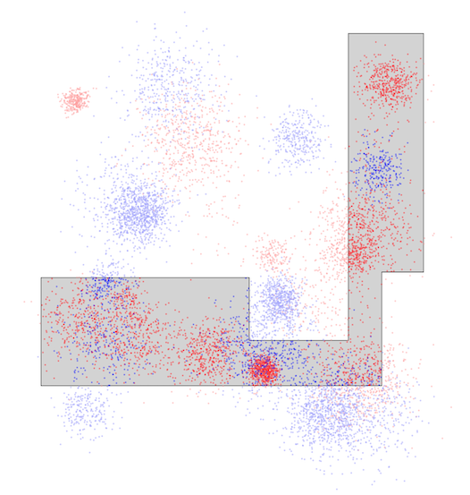

# THIRDプログラミングコンテスト2024(AHC039)

[TOC]



## 問題概要

- https://atcoder.jp/contests/ahc039
- 二次元平面上(それぞれ10^5以下)に、N(=5000)匹のサバとN匹のイワシがいる
- 以下の条件を満たす多角形を構築し、その内部に含まれるサバの総数からイワシの総数を引いた値を最大化せよ
  - 多角形の頂点数 <= 1000
  - 多角形の辺の長さの合計 <= 4 \* 10^5
  - 各辺はx軸またはy軸に平行
  - 多角形は自己交差しない

## 時間

- 4 時間

## 個人的メモ

### 問題固有の性質

- 二次元平面のサイズが結構大きい
- 魚は、結構、塊(クラスタ)になっている
- 多角形の条件の「周の長さが 4 \* 10^5以下」という条件は、結構厳しい
  - 「E」や「凹」みたいな形にしようとすると周の長さが結構長くなってしまいがち

### 幾何的アプローチ

- 結構実装しんどい気がするけど、こちらのアプローチで上位の人も結構いた模様
- ぱっと見だと、魚が塊で存在しているので、それらを囲った長方形を見つけて、それらを細い道(余計なイワシを拾わないようにしたい)みたいなのでつなぐ感じが考えられる
- しかし、長方形の集合をうまく見つけるのも、それらをつなぐ実装も結構大変で、しかも、周の長さが長くなりがちで制約を満たすように制限する必要があるなど、4時間では結構厳しいかも
  - 細い道/橋みたいなのは辺の長さを使う割にスコアが得られないので、あまり長いのは作りたくない
  - 平面のサイズが大きいことや、実装によっては重なり/自己交差に気をつける必要があったり、など

#### 良い長方形を見つける

- 辺の長さの制約は、平面いっぱいの長方形でも満たせるので、任意の長方形はすべて条件を満たせる
- 長方形を決め打ちした場合、その時のスコアは、各魚(=10^4)が長方形内部にいるかどうかで判定できる
- ランダムに長方形を生成して一番いいスコアをものを採用する、などができる
  - 2秒でも数万回ぐらいは回せる
- (k-meansとかして各クラスタを囲む最小長方形、とかもありかも？)

#### 長方形を加える・削る、辺を動かす

- 多角形に対して、その形を変形させる局所探索も考えられる
  - (辺に隣接するような)長方形を加える、長方形を削る
  - 多角形の辺を動かす

#### 塊を長方形で囲って連結

- 長方形の候補をたくさん作って、貪欲によいものを連結していく
  - とはいえ、長方形内のサバとイワシの数を求めるのはそんなに

#### 多角形を生成

- 出力形式で多角形を作ってスコアを計算する、のを繰り返すのも考えられる
  - ランダム生成や、頂点集合を局所探索、など
- 多角形(自己交差なし)の内外判定は、頂点から軸に平行な半直線を伸ばして交差する辺の数の偶奇で判断できる(Crossing Number Algorithm)
  - 角度を使うWinding Number Algorithmというのもあるっぽい
- 辺の長さや頂点数に気をつけつつ、自己交差もしないように多角形を作るのは結構たいへんかも

### グリッドアプローチ

- 平面を大雑把にグリッドに分割して、マスを選ぶ/選ばないで考えると、マスを選んだときのスコアが前計算できたりなど、扱いやすくなる
- 基本は、連結なマスの集合(穴なし)を多角形にすることを考える

#### 分割の仕方

- 基本は、x軸y軸を等間隔に分割したもの
- x軸とy軸で分割数を変える
- 乱択で決める
- 分割位置を等間隔じゃなくする(分割位置変更を近傍に局所探索)
- など

#### 分割サイズ

- 基本的には、可能な限り細かく分割したほうが調整しやすそうに見えるが、必要な探索量も増えてしまって最適解にたどりにくくなってしまう可能性がある
  - 荒く分割する場合、サバもイワシも含まれてしまってスコアが伸ばしにくい
  - 細かく分割する場合、探索空間が大きくなってしまう(遠くのマスとの連結になるまでに探索量を必要としてしまう、局所解に陥りやすい)

#### 外周をたどる方法(出力の生成方法)

- グリッド上の連結なマスの集合(穴なし)が与えられた時、その外周を順番にたどる辺の集合を求めるのは、主に2つのアプローチが考えられる
- 右手法(左手法)
  - 進行方向の右側に壁(連結成分)が来るように辿る
    - 角からスタートして、進行方向の左、まっすぐ、右の順で壁(選択したマス)があるかチェックしながらたどるとかすればよい
- 外周の辺を列挙して連結する
  - マスの角を頂点として、連結成分のマスとそうでないマスの間にある辺を列挙し、その辺を頂点を戻らないようにたどればよい
  - https://x.com/kyopro_friends/status/1857383065741578328

#### 評価関数

- 基本は生のスコアをそのままで十分な模様
- スコア(サバの総数 - イワシの総数)
  - スコアに係数をかけたもの
    - イワシの総数の方の係数を大きくすると、イワシを含むような長方形を避けるようにできる
- 網の長さ
  - 短いほうがよい(探索しにくくなってしまう可能性もある)
  - 制限超えてなければよい
  - 超えてる分をペナルティ(invalidを許容)

#### 貪欲

- 各マスについてスコアがわかるので、スコアが大きいマスから選ぶような貪欲が考えられる
  - 隣接マスを優先度付きキューに入れて拡張
    - 周の長さやスコアを見て一番良いタイミングのものを返す
  - プリム法ベースシュタイナー木的に連結

#### 区間DP

- y軸の小さい方から、x軸のどの区間を選ぶか？と周の長さ、その時のスコアで考えるDP
  - 片方の方向だけしかへこませられない
- 「広がる->狭くなる」という形に制限してDP

#### 局所探索

- 連結を保ってマスの連結成分を変形させる局所探索ができる
- 連結成分変形
  - あるマスをOFFにした場合、連結成分が別れてしまうか(関節点か)どうかは、まともに連結成分計算すると重いが、[3x3関節点高速化](../Library/grid.md)など近似だが高速な方法がある
  - あるマスをONにしたときに連結成分の塊の内側に「穴」ができてしまうのを避けたい場合、OFFマスに対して上記の関節点判定をしてあげれば、穴ができないようにできる
    - (ON->OFFはONマスをちぎらないか、OFF->ONはOFFをちぎらないかをチェックする)
    - (穴ありでやって実装間に合わずに最終的に穴を無視して囲っても、その分のマイナスが増えるだけではある)
- 近傍
  - 連結成分変形操作
    - マスのON/OFFを変える
      - 1マス/複数マス
- 初期解
  - 全マスを選んだ状態からスタートした場合、周の長さが最大で、「凹」のような形にしたくても制限を超えてしまうため、変形しにくい問題がある模様
  - 1マススタートや、魚が存在しない外周マスは無視するとか、ある程度貪欲解とかからスタートとか、がよい？
- 分割サイズを段階的に細分化
  - 最上位は、比較的少ないグリッドの分割から初めて、段階的に細かいグリッド(分割幅を1/2するなど)にしていくアプローチをしていた模様
  - マスの大きさが大きい場合、おおよその形は見つけられるが、細かいところを見ると改善の余地があり、グリッドを細かくすることで、改善できる
    - 最初からマスの大きさを小さくしてしまうと、いい形を見つけるまで探索量が必要になって間に合わないなどある
    - サイズ調整など結構重要かも

### その他

#### Wavelet Matrixで2次元クエリ処理

- https://twitter.com/xiuez/status/1855554776198783149
- 「長方形内に何匹いるか？」は、愚直には、5000匹全部に対して内部か判定する必要があるが、wavelet matrixを使うと対数時間にできる
- https://kopricky.github.io/code/DataStructure_Advanced/wavelet_matrix.html
- 動的に1点加算/矩形和もできる？
  - https://nyaannyaan.github.io/library/data-structure-2d/wavelet-matrix.hpp.html

#### 魚が存在する範囲

- 入力的には各魚は`0<=x,y<=10^5`だが、実際は魚が存在する範囲はもうちょっと小さい
  - 端の方の領域で魚が存在しないところとかは伸ばすだけ無駄な可能性がある


#### 塊に穴を作りたい場合

- 一応、辺の長さが足りるなら、頂点や辺を増やせば内側に穴を作ることはできる
  - 以下みたいに穴までと穴の部分を囲む頂点や辺を用意する

```
+------------+
|            |
|            |
+--------+   |
+---+    |   | ← ちょっとだけずらす
|   |    |   |
|   +----+   |
|            |
|            |
+------------+
```

#### お絵かき

- https://x.com/ymsksky/status/1855625952547779012
- https://x.com/Frest296192/status/1855558460345106435

## 解説

(50位まで&発言を見つけられた方のみ)

- [AHCラジオ(解説放送)](https://www.youtube.com/watch?v=ZRsYD8yBWwE)
- [解説(日本語)](https://atcoder.jp/contests/ahc039/editorial)
- [解説(英語)](https://atcoder.jp/contests/ahc039/editorial?editorialLang=en)

- [writer解](https://x.com/wata_orz/status/1855553559439520155)
  - https://atcoder.jp/contests/ahc039/submissions/59648665

- [terry_u16さん](https://twitter.com/terry_u16/status/1855552971045789937)
  - https://twitter.com/terry_u16/status/1855553238847922497
  - https://twitter.com/terry_u16/status/1855553684949946630
  - https://twitter.com/terry_u16/status/1855555976004604224
  - https://twitter.com/terry_u16/status/1855558526787326161
  - https://twitter.com/terry_u16/status/1855559903462776855
  - https://twitter.com/terry_u16/status/1855561944985710594
  - https://twitter.com/terry_u16/status/1855568397804941658
  - https://twitter.com/terry_u16/status/1855575682509860972
  - https://twitter.com/terry_u16/status/1855575079461196266
  - https://twitter.com/terry_u16/status/1855632815800631366
  - https://twitter.com/terry_u16/status/1855635979702612316
  - https://www.terry-u16.net/entry/ahc039
- [chokudai社長](https://twitter.com/chokudai/status/1855552972853232114)
  - https://twitter.com/chokudai/status/1855556491505479745
  - https://twitter.com/chokudai/status/1855558326379315546
- [niuezさん](https://twitter.com/xiuez/status/1855554776198783149)
  - https://twitter.com/xiuez/status/1855555581375107357
- [Psyhoさん](https://twitter.com/FakePsyho/status/1855565478099353857)
- [Rafbillさん](https://twitter.com/Rafbill_pc/status/1855557517322956923)
- [Shun_PIさん](https://twitter.com/Shun___PI/status/1855551328165998616)
  - https://twitter.com/Shun___PI/status/1855552115189633454
  - https://twitter.com/Shun___PI/status/1855557929078026419
  - https://twitter.com/Shun___PI/status/1855563155138920943
  - https://twitter.com/Shun___PI/status/1855774689513332737
  - https://twitter.com/Shun___PI/status/1855776604074737844
- [tempura0224さん](https://twitter.com/tempuracpp/status/1855555596902121634)
  - https://twitter.com/tempuracpp/status/1855557996673400998
  - https://twitter.com/tempuracpp/status/1855599468042912162
- [mtsdさん](https://twitter.com/soiya_ksk/status/1855553795264278729)
  - https://twitter.com/soiya_ksk/status/1855554011463602570
- [E869120さん](https://twitter.com/e869120/status/1855553120765710637)
  - https://twitter.com/e869120/status/1855555889765511530
- [tomerunさん](https://twitter.com/tomerun/status/1855552404701466786)
  - https://twitter.com/tomerun/status/1855555808584683860
- [rs02さん](https://x.com/rs02_hako/status/1855553941947421079)
- [ssaattooさん](https://x.com/myh9_f/status/1855567126876082374)
- [kawateaさん](https://twitter.com/kawatea03/status/1855552465103712378)
  - https://twitter.com/kawatea03/status/1855554253927940159
- [physics0523さん](https://twitter.com/butsurizuki/status/1855553757855313954)
  - https://twitter.com/butsurizuki/status/1855555927853961707
  - https://twitter.com/butsurizuki/status/1855603547200799033
  - https://twitter.com/butsurizuki/status/1855603890219343966
- [yokozuna57さん](https://twitter.com/yokozuna_57/status/1855555296330187169)
  - https://twitter.com/yokozuna_57/status/1855557402369917266
- [square1001さん](https://twitter.com/square10011/status/1855556359401660587)
- [simanさん](https://twitter.com/_simanman/status/1855553247966302719)
  - https://twitter.com/_simanman/status/1855553474827780189
  - https://twitter.com/_simanman/status/1855554301197992447
    - https://twitter.com/bowwowforeach/status/1855551618948980901
  - https://twitter.com/_simanman/status/1855556184415314306
  - https://twitter.com/_simanman/status/1855557604896088105
  - https://twitter.com/_simanman/status/1855558909211320603
  - https://twitter.com/_simanman/status/1855560181113077962
  - https://twitter.com/_simanman/status/1855560674220638664
- [toamさん](https://twitter.com/torii_kyopro/status/1855551090441470197)
  - https://twitter.com/torii_kyopro/status/1855552110341104039
  - https://twitter.com/torii_kyopro/status/1855552620821414298
  - https://twitter.com/torii_kyopro/status/1855553577097535935
  - https://twitter.com/torii_kyopro/status/1856014981084701106
  - https://twitter.com/torii_kyopro/status/1856015889981952348
- [toku4388さん](https://twitter.com/toku4388/status/1855558334172348841)
- [milkcoffeeさん](https://twitter.com/milkcoffeen/status/1855553719074521365)
- [rabotさん](https://x.com/tanaka_a8/status/1855573096226599152)
- [ganmodokixさん](https://twitter.com/AprilGanmo/status/1855551549797494897)
  - https://twitter.com/AprilGanmo/status/1855553098070298933
- [ichyoさん](https://twitter.com/ichyo/status/1855552951852675192)
- [risujirohさん](https://twitter.com/risujiroh/status/1855594978698985799)
- [Pech1さん](https://x.com/Pechi_kyopro/status/1855561017247568122)
- [Koi51さん](https://x.com/Koi1583/status/1855553161572024448)
- [yoichiroさん](https://x.com/ynishi2015/status/1855552326305792332)
- [merom686さん](https://twitter.com/merom686/status/1855553422746943828)
- [throughさん](https://twitter.com/through__TH__/status/1855555478421684475)
  - https://twitter.com/through__TH__/status/1855568782443294950
    - https://twitter.com/Shun___PI/status/1855563155138920943
  - https://twitter.com/through__TH__/status/1855817146108113322
- [sasayuさん](https://twitter.com/yusapon_/status/1855553433471996292)
- [Taiki0715さん](https://twitter.com/periperiver/status/1855551861337853983)
- [Kiri8128さん](https://twitter.com/kiri8128/status/1855555063353094381)
  - https://twitter.com/kiri8128/status/1855609085024157820
  - https://twitter.com/kiri8128/status/1855989138429989353
- [y_kawanoさん](https://x.com/y_kawano/status/1855554429094863008)


- 延長戦
  - https://x.com/MathGorilla_cp/status/1857058623584612444
  - https://x.com/MathGorilla_cp/status/1857092759741411680

## Links

- [twitter hashtag AHC039](https://x.com/hashtag/AHC039)

