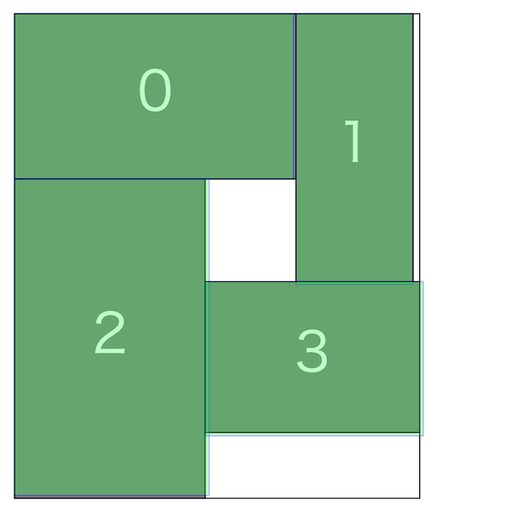

# HACK TO THE FUTURE 2025(AHC040)

- https://atcoder.jp/contests/ahc040

## 問題概要

- N個の長方形があり、横幅と縦幅が決まっている
  - 長方形には番号がついており、区別される
- 最初に入力として、各長方形を計測誤差あり(ガウス雑音)で観測した値が与えられる
- クエリとして、選んだ長方形を以下の操作で配置することができ、配置後の長方形座標の縦と横の最大値が計測誤差ありで得られる
  - 配置する長方形の番号(ただし、番号は昇順に配置)
  - 90度回転するかどうか
  - 配置するときの方向
  - 配置するときに基準とする配置済み長方形の番号、または、壁沿いかどうか
- クエリはT回投げる
- スコアは各クエリでの「配置した長方形座標の最大値の和＋未配置の長方形の横幅と縦幅の和」の最小値としたとき、これを最小化せよ

## 時間

- 240 時間

## 個人的メモ

### 「衝突」

- https://x.com/Shun___PI/status/1866070101944053912
- 正確な幅がわからないため、大小関係を見誤ると、想定していた地点に配置されずに、途中の他の長方形と衝突したり、止まると思っていた場所で止まらない、といったことが発生してしまう
- これが配置中に発生してしまうと、想定よりも大きくズレた結果になってしまう
- そのため、今回は、できるだけこのような現象が起きないような配置方法を考える必要がある

### スコアの最小値

- 面積の合計値だけで考えると、面積が一定で縦幅と横幅の最大値の和が最小になるようなものは正方形になる
  - min. W+H, s.t. W\*H=const.
  - W=H=sqrt(面積)
- 実際は配置によって隙間ができて達成できないが、この値を基にして、おおよその横幅の見積もりや枝狩りに使える
- ケースによってスコアのスケールが違うため、この値を最小スコアとして、相対スコアで比較すると評価しやすい

### 誤差にロバストな配置方法

#### Uのみ

- 方向をUのみ(または、Lのみ)で、ベースにする長方形は1つ前に限定すると、期待したところ以外に配置される可能性がない
  - 適当なところで折り返して(b=-1にして)あげると、ある程度正方形っぽい感じに配置することはできる
- しかし、解の形がかなり限定されてしまうため、もっといろいろな配置を試せる方法を考える必要がある

#### 帯状/階段状で考える

- https://x.com/chokudai/status/1866394403696505313/photo/1
- https://x.com/Shun___PI/status/1866061590661108020/photo/3
- https://x.com/montplusa/status/1866061754494865588
- (解説放送など)
- 各段の高さが異なる本棚ように考えると、各段に対してどこにいれるかで考えられる(帯状)
  - 基本、方向はUのみ
- また、「右下方向に長方形が配置されないようにする」を維持すると帯に限らず階段型としても考えられる(階段状)
- このとき、配置のときにbに指定できる長方形は、各段(帯)や階段の端の部分の長方形だけで考える
- うまく、十分な余裕を持ちながら配置させることで、想定外の衝突を避けながら配置することができる
  - 横幅が同じぐらいになったり、上の段の幅を追い越したりするようなことをすると、置くのに失敗したり、デッドスペースを作ってしまったりする
- また、帯状/階段状だと、デッドスペースになる部分も計算しやすくなり、高速に良い評価値の計算ができる

##### 貪欲・ビームサーチ

- 順番に長方形を入れる操作をビームサーチで探索
- 評価値
  - 端の部分の長方形から計算される充填率/デットスペースの面積
  - 残りの長方形を液体と考えて、デットスペース以外の部分に入れた場合の高さ(解の下界)
    - または、その残りの面積のα倍したもの
- 多様性
  - 最終的な最大横幅
  - b=-1で配置した長方形をハッシュ値にしたもの
  - 入れた長方形の位置、幅
  - デットスペースの大きさ(？)
- その他
  - 帯のマージ

##### 焼きなまし

- 各段に割り当てる長方形(や各長方形の回転の有無)を焼きなましでも考えられる
  - だいたい、sqrt(N)段ぐらいになると考えられる
- 実際に配置したときのスコアだったり、各段に対して高さの分散が小さくなるようにしてからシミュレーション上位を選ぶ、など
  - 温度高めにしておくとか、初期解をいくつか用意するなど工夫は必要そう

#### その他

- 帯状、階段状ではなく、各方向(L,U)からどんどん大きくしていくような方法も考えられる
- 長辺にぶつけるように配置
  - https://x.com/bowwowforeach/status/1866062460287070569
- 同じ方向から最後においた長方形に揃えるように配置
  - https://x.com/MathGorilla_cp/status/1866065644246151551

### 各長方形の幅の推定

- 幅の推定値は正確なほど、より安全に配置が行える/配置のバリエーションが増やせる
  - ただ、コンテスト的には、推定が適当でも良い配置方法にできると上位狙えたので、本質は配置方法の方だった
  - https://x.com/chokudai/status/1866065662306832584
- 最終的に出力する解配置とかだと、どの長方形の幅の合計なのか？がわからないため、推定が難しい
- そのため、解とは別に、推定しやすい配置を投げてそこから推定する

#### 1つの長方形を投げる

- 一番単純なのは、1つの長方形を投げて、その計測誤差ありの横幅と縦幅を取得して、平均を取る方法
- しかし、操作回数Tがあまり多くないため、各長方形に対して十分な回数取得できない

#### 複数の長方形をまとめて投げる

- 例えば、横一列に長方形を並べれば、それらの幅の合計と高さの最大値が計測誤差ありで得られる
- 合計値については、計測誤差が最終的な合計値に分散σ^2 でのるだけのため、最初に与えられる長方形の情報を使って出した合計値(m個の和であれば分散mσ^2)よりはかなり正確な値がわかる

##### 配置の仕方

- 横一列、縦一列
  - b=-1のみ、方向をUかLどちらかのみで配置すれば、横一列/縦一列に配置でき、その時の幅の合計が得られる
- L字型(Г字型)
  - b=-1のみで方向を変えれば、L字型にでき、「横に並べた長方形の横幅の合計」と「縦に並べた長方形の縦幅の合計」が同時に得られる
    - 2個の合計値が得られるので効率的
  - 方向と回転の有無をランダムに決める以外にも、番号の前半は横方向/後半は縦方向にして回転の有無だけ変えるとかも
    - https://x.com/montplusa/status/1866061219981099518
  - b=-1のみしか使わない場合は角(一番左上)に来る長方形が小さいときに別の長方形と入れ替わってしまうなど問題があるが、縦方向に置きたいならLと横方向に置きたいならUで各方向の最後の番号をbに指定するようにすると、気にしなくてすむ
    - https://x.com/MathGorilla_cp/status/1866070012487966781
- T字型
  - bを配置した途中の長方形にすればT字型のようにもできる

##### 誤差あり合計値情報から推定

- 簡単のため、ランダムに、幅の計測誤差ありの合計値がt個与えられる場合を考える
- 各幅を推定する問題は有名問題で、最小二乗法やベイズ推定などで求められる
  - [AHC003](./ahc003.md)
- 最小二乗法(正規方程式)
  - $\|Ax-b\|$を最小にする$x$を見つけたい
  - $A^T A$が正則なら、正規方程式$A^T Ax=A^T b$を解くことでxを解析的に求められる
    - このとき、分散共分散行列も求められる
    - (tが少ない場合やランク落ちで正則にならないかも？なので注意)
  - https://x.com/Shun___PI/status/1866061590661108020/photo/2
  - https://manabitimes.jp/math/1054
- ベイズ推定

##### 逐次推定

- あらかじめランダムに選んでおく方法だと、分散(推定誤差)が大きそうなものを多めに調べる、みたいなことができない
- 今回は、t-1回目までの結果を得た状態でt回目の配置を選ぶことができるため、より推定が不正確な(分散の大きい)ものを選んで調べる、ということができる
  - 分散共分散行列のトレースが小さくなるように投げる
    - https://www.terry-u16.net/entry/ahc040
  - writer解では、カルマンフィルタを使って、貪欲に、各iで横に並べる場合と縦に並べる場合でのそのiでの分散の増分が大きい方に入れるということを繰り返してるみたい

##### 常に長方形0を角においてL字で推定する場合、長方形0の幅の推定値が悪化する

- https://www.terry-u16.net/entry/ahc040
- https://x.com/chokudai/status/1867901537974190582
- T字型にしたり、0を入れたり入れなかったりと若干工夫が必要
- [AHC040推定パートで、長方形0を毎回入れると推定結果が悪化する件](../blog/posts/20241222_ahc040_estimate.md)

### 長方形の幅の大小関係の推定

- 衝突を回避するためには、「長方形の幅の正確な値」までわからなくても「長方形の幅の大小関係」がわかれば十分な可能性がある
- 例えば、比較したい2つの長方形を縦に並べて、方向Uで別の長方形を重ねたものを配置して衝突したかどうか判定、とかはできる
- 複数の長方形の幅の和についても同様に並べて考えることができる
- https://x.com/ToastUz/status/1866065633278046574
- 今回は、幅を直接推定するアプローチの方が効率的だったかも？

### 「推定パート」と「配置/詰め込みパート」の回数のトレードオフ

- 配置に失敗しやすいアプローチの場合は、なるべく多くの解を出力したほうが安定するが、推定に使えるクエリ数は減ってしまう
- 配置に失敗しにくいアプローチだと、出力数が少なくてもスコアが安定し、推定に使えるクエリも増えて、よりスコアが上がりやすい
  - 十数件ぐらいを出力にして、それ以外を推定クエリにする

### ビームサーチの時間調整

- chokudaiサーチなどは時間いっぱい回せるが、ビームサーチだとビーム幅の調整が必要
- 各ターンでは、それまでのビーム幅(の合計値)、計算時間、残りターン数、残り時間の情報などが使えるので、それらを使って調整できる

### その他

#### bottom-left法

- https://orsj.org/wp-content/corsj/or63-12/or63_12_762.pdf
- 有名問題として「長方形パッキング問題(詰め込み問題)」があり、代表的な解法にbottom-left法(BL法)などがある
  - 配置可能な位置の中で、最も下で、そのような場所が複数ある場合は最も左のところに配置する貪欲

#### 確率変数の和の分散

- [wikipedia](https://ja.wikipedia.org/wiki/%E5%88%86%E6%95%A3_(%E7%A2%BA%E7%8E%87%E8%AB%96))
- $V[X + Y] = V[X] + Cov(X,Y) + Cov(Y,X) + V[Y]$
- $V[\sum_{i}{a_i X_i}] = \sum_{i,j} a_i a_j Cov[X_i,X_j]$

#### 衝突判定のSIMD高速化

- https://x.com/terry_u16/status/1866066488068907289

#### 類題

- [AHC003](./ahc003.md)
- トヨタ自動車 実課題プログラミングコンテスト 2023 Spring
  - https://atcoder.jp/contests/toyota-hc-2023spring
  - https://bowwowforeach.hatenablog.com/entry/2023/03/26/171555

#### シーケンスペア

- https://ja.wikipedia.org/wiki/%E3%82%B7%E3%83%BC%E3%82%B1%E3%83%B3%E3%82%B9%E3%83%9A%E3%82%A2

#### Windowsでのローカルテスタの準備の仕方

- 「readmeが読めないのでAHC040に参加できないニキを救いたい」
  - https://qiita.com/aplysia/items/942b1c0e47d36d0ca622

#### best=unique

- https://x.com/yowa/status/1868496621358788975
- システムテストの全ケースで、ベスト解がユニークだった(同率1位がなかった)模様

## 解説

(50位まで&発言を見つけられた方のみ)

- [AHCラジオ(解説放送)](https://www.youtube.com/watch?v=heT7phjNLLs)
- [解説(日本語)](https://atcoder.jp/contests/ahc040/editorial)
- [解説(英語)](https://atcoder.jp/contests/ahc040/editorial?editorialLang=en)

- [writer解](https://atcoder.jp/contests/ahc040/submissions/60603678)

- [chokudai社長](https://x.com/chokudai/status/1866082484401868981)
  - https://x.com/chokudai/status/1866087409248821758
  - https://x.com/chokudai/status/1866091966393655644
  - https://x.com/chokudai/status/1866101555516281197
  - https://x.com/chokudai/status/1866115610192814490
  - https://x.com/chokudai/status/1866366791460729060
  - https://x.com/chokudai/status/1866394403696505313
  - https://x.com/chokudai/status/1866407507318718499
- [Shun_PIさん](https://x.com/Shun___PI/status/1866061590661108020)
  - https://x.com/Shun___PI/status/1866062270696198560
  - https://x.com/Shun___PI/status/1866064710103404978
  - https://x.com/Shun___PI/status/1866065096503611718
  - https://x.com/Shun___PI/status/1866065892251246742
  - https://x.com/Shun___PI/status/1866068337186455884
  - https://x.com/Shun___PI/status/1866068469281849413
  - https://x.com/Shun___PI/status/1866068944718901281
  - https://x.com/Shun___PI/status/1866070101944053912
  - https://x.com/Shun___PI/status/1866075892210131454
  - https://x.com/Shun___PI/status/1866084580501106870
  - https://x.com/Shun___PI/status/1866086557045928313
  - https://x.com/Shun___PI/status/1866095183668171043
  - https://x.com/Shun___PI/status/1866096104120664422
  - https://x.com/Shun___PI/status/1866111485296181400
  - https://x.com/Shun___PI/status/1866358597648834696
  - https://x.com/Shun___PI/status/1866368483082359157
  - https://x.com/Shun___PI/status/1866387285761266092
  - https://x.com/Shun___PI/status/1866387438224249081
  - https://x.com/Shun___PI/status/1866400683739717668
  - https://x.com/Shun___PI/status/1866401045246841131
  - https://x.com/Shun___PI/status/1866443282747941294
  - https://x.com/Shun___PI/status/1866444778218664256
  - https://x.com/Shun___PI/status/1867070570002813134
- [montplusaさん](https://x.com/montplusa/status/1866060975893618718)
  - https://x.com/montplusa/status/1866064591551398011
  - https://x.com/montplusa/status/1866066280912150921
  - https://x.com/montplusa/status/1866104867422646466
  - https://x.com/montplusa/status/1866383101007667650
  - https://x.com/montplusa/status/1866531753508393073
  - https://x.com/montplusa/status/1866539117498208465
  - https://x.com/montplusa/status/1867106767039303802
  - https://x.com/montplusa/status/1867814112887288028
- [Jinapettoさん](https://x.com/Jinapetto/status/1866062232641212885)
  - https://x.com/Jinapetto/status/1866076005506723907
  - https://x.com/Jinapetto/status/1866326411885355087
- [terry_u16さん](https://x.com/terry_u16/status/1866064810993127595)
  - https://x.com/terry_u16/status/1866062265117823103
  - https://x.com/terry_u16/status/1866066813903352087
  - https://x.com/terry_u16/status/1866068046441582755
  - https://x.com/terry_u16/status/1866069474757275729
  - https://x.com/terry_u16/status/1866073153090568609
  - https://x.com/terry_u16/status/1866074142451331105
  - https://x.com/terry_u16/status/1866076158024134819
  - https://x.com/terry_u16/status/1866078720664150209
  - https://x.com/terry_u16/status/1866082446246309930
  - https://x.com/terry_u16/status/1866084217299570981
  - https://x.com/terry_u16/status/1866088084854706410
  - https://x.com/terry_u16/status/1866088911623393681
  - https://x.com/terry_u16/status/1866090458260369644
  - https://x.com/terry_u16/status/1866090696178065693
  - https://x.com/terry_u16/status/1866091501136343426
  - https://x.com/terry_u16/status/1866095431685640427
  - https://x.com/terry_u16/status/1866096880905863465
  - https://x.com/terry_u16/status/1866097229934858708
  - https://x.com/terry_u16/status/1866098994293956666
  - https://x.com/terry_u16/status/1866099696718299611
  - https://x.com/terry_u16/status/1866100663119409405
  - https://x.com/terry_u16/status/1866102129284559189
  - https://x.com/terry_u16/status/1866102603077304626
  - https://x.com/terry_u16/status/1866106271218405549
  - https://x.com/terry_u16/status/1866110346693620122
  - https://x.com/terry_u16/status/1866114315834867970
  - https://x.com/terry_u16/status/1866117334651576472
  - https://x.com/terry_u16/status/1866118215602250062
  - https://x.com/terry_u16/status/1866144958719418544
  - https://x.com/terry_u16/status/1866147798732997037
  - https://x.com/terry_u16/status/1866148470362620239
  - https://x.com/terry_u16/status/1866151153584791653
  - https://x.com/terry_u16/status/1866152722195792186
  - https://x.com/terry_u16/status/1866157256863330604
  - https://x.com/terry_u16/status/1866164507695038477
  - https://x.com/terry_u16/status/1866168807691342192
  - https://x.com/terry_u16/status/1866310854150664263
  - https://x.com/terry_u16/status/1866450862916481441
  - https://x.com/terry_u16/status/1866458512970457422
  - https://x.com/terry_u16/status/1866486227157004469
  - https://x.com/terry_u16/status/1866486375945777506
  - https://x.com/terry_u16/status/1866487571712541118
  - https://x.com/terry_u16/status/1866514725372321860
  - https://x.com/terry_u16/status/1866517447668588778
  - https://x.com/terry_u16/status/1866518186805674239
  - https://x.com/terry_u16/status/1866519785129041976
  - https://x.com/terry_u16/status/1866520253335056894
  - https://x.com/terry_u16/status/1867081636388708654
  - https://x.com/terry_u16/status/1867104903258312945
  - https://x.com/terry_u16/status/1867197894631272465
  - https://www.terry-u16.net/entry/ahc040
- [yowaさん](https://x.com/yowa/status/1866080385018568957)
  - https://x.com/yowa/status/1867186417077788743
- [bowwowforeachさん](https://x.com/bowwowforeach/status/1866062455543349258)
  - https://x.com/bowwowforeach/status/1866078714540531964
  - https://x.com/bowwowforeach/status/1866080409970524274
  - https://x.com/bowwowforeach/status/1866092357797703876
  - https://x.com/bowwowforeach/status/1866118841769828427
  - https://x.com/bowwowforeach/status/1867054812048834571
- [rabotさん](https://x.com/tanaka_a8/status/1866061660349415763)
- [asi1024さん](https://x.com/asi1024/status/1866066614254477369)
- [yokozuna57さん](https://x.com/yokozuna_57/status/1866071091753746630)
  - https://x.com/yokozuna_57/status/1866157846603481093
  - https://x.com/yokozuna_57/status/1866459043788898728
  - https://x.com/yokozuna_57/status/1866337937551708425
- [MathGorillaさん](https://x.com/MathGorilla_cp/status/1866065640366498130)
  - https://x.com/MathGorilla_cp/status/1866070012487966781
  - https://x.com/MathGorilla_cp/status/1866073708886163714
  - https://x.com/MathGorilla_cp/status/1866077990091964553
  - https://x.com/MathGorilla_cp/status/1866079165289828372
  - https://x.com/MathGorilla_cp/status/1866089345373155478
  - https://x.com/MathGorilla_cp/status/1866092471530541092
  - https://x.com/MathGorilla_cp/status/1866097267062776236
  - https://x.com/MathGorilla_cp/status/1867194931623895458
- [soumatさん](https://x.com/soumat_13/status/1866069874407244110)
- [itigoさん](https://x.com/itigo_purokonn/status/1866060610401935430)
  - https://x.com/itigo_purokonn/status/1866061895440167185
- [uta_cccさん](https://x.com/uta_cccc/status/1866061816952148362)
  - https://x.com/uta_cccc/status/1866108948295860370
    - https://utac.hateblo.jp/entry/2024/12/09/221205
  - https://x.com/uta_cccc/status/1866112144280097090
  - https://x.com/uta_cccc/status/1866452196122096001
  - https://x.com/uta_cccc/status/1866453559409279445
  - https://x.com/uta_cccc/status/1867049019035599340
  - https://x.com/uta_cccc/status/1867521049342161356
  - https://x.com/uta_cccc/status/1867585109303734425
- [ocha_heavenさん](https://x.com/ocha_heaven/status/1866060570866364829)
  - https://x.com/ocha_heaven/status/1866133038192857159
  - https://x.com/ocha_heaven/status/1866149609992847737
  - https://x.com/ocha_heaven/status/1866275610856915117
- [Ang107さん](https://x.com/Ang_kyopro/status/1866070751918657868)
  - https://x.com/Ang_kyopro/status/1866075015617323360
  - https://x.com/Ang_kyopro/status/1866106363480535543
  - https://x.com/Ang_kyopro/status/1866092866164195808
  - https://x.com/Ang_kyopro/status/1866060470115037361
  - https://x.com/Ang_kyopro/status/1866397969446232097
  - https://x.com/Ang_kyopro/status/1866403856843935937
  - https://x.com/Ang_kyopro/status/1866645652983394474
  - https://x.com/Ang_kyopro/status/1866681991120511183
  - https://x.com/Ang_kyopro/status/1867084196063383645
- [RinSakamichiさん](https://x.com/RinSakamichi/status/1866101698885992900)
  - https://x.com/RinSakamichi/status/1866119320214114554
  - https://x.com/RinSakamichi/status/1866045629279117349
- [yochanさん](https://x.com/yochan_tech/status/1866062186726248592)
  - https://x.com/yochan_tech/status/1866087132986818818
  - https://x.com/yochan_tech/status/1866530863498006784
  - https://x.com/yochan_tech/status/1866701855478386772
- [Piiiiiさん](https://x.com/AcPiiiii/status/1866063914968170622)
- [PrussianBlueさん](https://x.com/prussian_coder/status/1863057123959280048)
  - https://x.com/prussian_coder/status/1866072130477343162
  - https://x.com/prussian_coder/status/1866074054358405553
  - https://x.com/prussian_coder/status/1866321980506702037
  - https://x.com/prussian_coder/status/1866489197433159712
  - https://x.com/prussian_coder/status/1867088709411364908
- [KawattaTaidoさん](https://x.com/KawattaTaido/status/1866073527977435360)
- [yunixさん](https://x.com/yunix91201367/status/1866068690548248582)
  - https://x.com/yunix91201367/status/1866069034686660934
  - https://x.com/yunix91201367/status/1866068001306595606
  - https://x.com/yunix91201367/status/1866072158084222986
- [saharanさん](https://x.com/shr_pc/status/1866062040290476061)
  - https://x.com/shr_pc/status/1866063205048713233
  - https://x.com/shr_pc/status/1866064671364755872
  - https://x.com/shr_pc/status/1866064946699923884
  - https://x.com/shr_pc/status/1866065444450508959
  - https://x.com/shr_pc/status/1866066708030759024
  - https://x.com/shr_pc/status/1866067901297647822
  - https://x.com/shr_pc/status/1866069421003022680
  - https://x.com/shr_pc/status/1866071524484194418
  - https://x.com/shr_pc/status/1866079671345090919
  - https://x.com/shr_pc/status/1866089423966011468
  - https://x.com/shr_pc/status/1866095554654265744
  - https://x.com/shr_pc/status/1866097782781796815
  - https://x.com/shr_pc/status/1866098703687430648
  - https://x.com/shr_pc/status/1866105874076570025
- [fuppy0716さん](https://x.com/fuppy_kyopro/status/1866063029923991648)
  - https://x.com/fuppy_kyopro/status/1866063654002753901
  - https://x.com/fuppy_kyopro/status/1866064258183889212
  - https://x.com/fuppy_kyopro/status/1866069578151010658
- [niuezさん](https://x.com/xiuez/status/1866060586276302905)
  - https://x.com/xiuez/status/1866061346036646246
  - https://x.com/xiuez/status/1866061999706349681
  - https://x.com/xiuez/status/1866295792182657391
  - https://x.com/xiuez/status/1866063500571029640
  - https://x.com/xiuez/status/1866841569468502285
  - https://x.com/xiuez/status/1867552033810895155
- [risujirohさん](https://x.com/risujiroh/status/1866063469361221955)
  - https://x.com/risujiroh/status/1866067116493099196
  - https://x.com/risujiroh/status/1866068905988603906
- [ToastUzさん](https://x.com/ToastUz/status/1866065633278046574)
  - https://x.com/ToastUz/status/1866072455544188938
  - https://x.com/ToastUz/status/1866084863096594723
  - https://x.com/ToastUz/status/1866126283366867362
  - https://x.com/ToastUz/status/1866253279304507467
  - https://x.com/ToastUz/status/1866255585077027258
  - https://x.com/ToastUz/status/1866256793447633399
  - https://x.com/ToastUz/status/1866258155208139241
  - https://x.com/ToastUz/status/1866406565852688415
  - https://x.com/ToastUz/status/1866426464662651139
  - https://x.com/ToastUz/status/1866803750003937565
  - https://x.com/ToastUz/status/1866809160094060900
  - https://x.com/ToastUz/status/1867203275705176158
- [tipstar0125さん](https://x.com/DragonEngineer1/status/1866076917285421397)
  - https://x.com/DragonEngineer1/status/1866084465971527955
  - https://x.com/DragonEngineer1/status/1866086165360910415
  - https://x.com/DragonEngineer1/status/1866095552146100583
  - https://x.com/DragonEngineer1/status/1866104780789363140
  - https://x.com/DragonEngineer1/status/1866108968604663860
  - https://x.com/DragonEngineer1/status/1867196662042832936
- [tmbさん](https://x.com/tombo_ac/status/1866061284627919308)
- [mooakiさん](https://x.com/moooaki/status/1866061182752469126)
  - https://x.com/moooaki/status/1866078130718535900
  - https://x.com/moooaki/status/1866102175505731832
  - https://x.com/moooaki/status/1867574866163249656
- [wanuiさん](https://x.com/gmeriaog/status/1866068021330268377)
  - https://x.com/gmeriaog/status/1866108653679632548
- [titan23さん](https://x.com/titan_230/status/1866061620704862645)
  - https://titan-23.hatenablog.com/entry/2024/12/12/151218

## Links

- [twitter hashtag AHC040](https://x.com/hashtag/AHC040)
- [twitter hashtag HTTF](https://x.com/hashtag/HTTF)
- [simanさん統計](https://siman-man.github.io/ahc_statistics/040/)
  - https://siman-man.github.io/ahc_statistics/040/index_with_admin.html
- [wataさんの詳細な順位表](https://img.atcoder.jp/ahc_standings/index.html?contest=ahc040)
