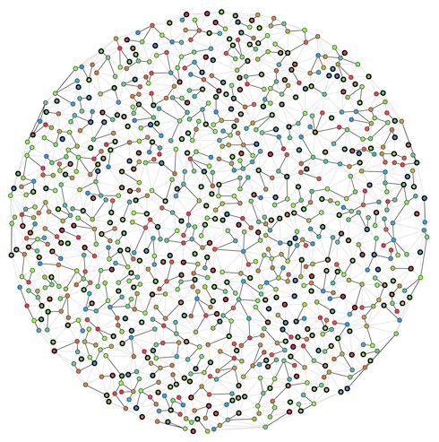

# ALGO ARTISプログラミングコンテスト2025冬(AHC041)

- https://atcoder.jp/contests/ahc041

## 問題概要

- N(=1000)頂点M辺の連結な無向平面グラフGが与えられ、各頂点には美しさA_iが設定されている
- ここで、以下のような根付き木の集合を考える
  - 各根付き木に含まれる辺はGに含まれる
  - Gの各頂点はちょうど1つの根付き木に属する
  - 各根付き木の頂点の高さは、根からの距離で、すべてH(=10)以下になっている
- 根付き木Tの見栄えa(T)をΣ(h_v+1)*A_vと定義し、1+Σa(T)が得点となる
- できるだけ得点が高くなるように根付き木の集合を構築せよ
  - 出力は、各頂点の親の頂点番号を出力する

## 時間

- 4 時間

## 個人的メモ

## 解説

(50位まで&発言を見つけられた方のみ)

- [AHCラジオ(解説放送)](https://www.youtube.com/watch?v=WcrjJPNSwCg)
- [解説(日本語)](https://atcoder.jp/contests/ahc041/editorial)
- [解説(英語)](https://atcoder.jp/contests/ahc041/editorial?editorialLang=en)

- [writer解説スライド](https://speakerdeck.com/terryu16/ahc041jie-shuo)

- [hitonanodeさん](https://x.com/rsat__m/status/1880929429503021344)
  - https://x.com/rsat__m/status/1880919665876390034
  - https://rsm9.hatenablog.com/entry/2025/01/22/213923
- [Rafbillさん](https://x.com/Rafbill_pc/status/1880924430723109094)
- [takumi152さん](https://x.com/takumi152/status/1880919321922425269)
- [Trineutronさん](https://x.com/trineutron/status/1880921885896241272)
- [eijirouさん](https://x.com/eijirou_kyopro/status/1880968455966593518)
  - https://x.com/eijirou_kyopro/status/1881234980380213249
- [niuezさん](https://x.com/xiuez/status/1880920279704301702)
- [besukohuさん](https://x.com/besukohu/status/1880920051823640853)
- [risujirohさん](https://x.com/risujiroh/status/1880918815732855006)
  - https://x.com/risujiroh/status/1880920464589304262
- [tatyamさん](https://x.com/tatyam_prime/status/1880920451788271749)
- [hirayuu_Atさん](https://x.com/halc_kyopro/status/1880918380129198211)
  - https://x.com/halc_kyopro/status/1880919182663135591
  - https://x.com/halc_kyopro/status/1880937233274097765
- [square1001さん](https://x.com/square10011/status/1880969818272337968)
- [wanuiさん](https://x.com/gmeriaog/status/1880921567254945934)
- [tempura0224さん](https://x.com/tempuracpp/status/1880922116880769044)
  - https://x.com/tempuracpp/status/1880922457428877592
  - https://x.com/tempuracpp/status/1880928189180223925
  - https://x.com/tempuracpp/status/1881043997042553089
  - https://x.com/tempuracpp/status/1883438909474160780
- [mtsdさん](https://x.com/soiya_ksk/status/1880919897045414297)
  - https://x.com/soiya_ksk/status/1880922841547510077
  - https://x.com/soiya_ksk/status/1880923469606793404
  - https://x.com/soiya_ksk/status/1880936415552565407
- [Moegiさん](https://x.com/mih28731325/status/1880920695057867226)
- [nouka28さん](https://x.com/nouka28/status/1880921829403152624)
- [E869120さん](https://x.com/e869120/status/1880921808834273451)
  - https://x.com/e869120/status/1880922921612513401
- [kawateaさん](https://x.com/kawatea03/status/1880920253477347478)
- [Shun_PIさん](https://x.com/Shun___PI/status/1880918985962877372)
  - https://x.com/Shun___PI/status/1880920271949078900
- [iwashi31さん](https://x.com/iwashi31/status/1880919034939707626)
  - https://x.com/iwashi31/status/1880918392653373890
- [MathGorillaさん](https://x.com/MathGorilla_cp/status/1880920328085688738)
  - https://x.com/MathGorilla_cp/status/1880922996870992201
- [chuokudai社長](https://x.com/chokudai/status/1880919032351875243)
- [tomerunさん](https://x.com/tomerun/status/1880918679254421736)
  - https://x.com/tomerun/status/1880939474802311320
- [HBitさん](https://x.com/toomerhs/status/1880919117873713518)
- [ardRiriyさん](https://x.com/ardririy/status/1880919739566055499)
- [fky_さん](https://x.com/fkyrz_0111/status/1880920942756712605)
- [Kiri8128さん](https://x.com/kiri8128/status/1880918805322625118)
  - https://kiri8128.hatenablog.com/entry/2025/01/21/204230
- [saharanさん](https://x.com/shr_pc/status/1880920441600332149)
- [ganmodokixさん](https://x.com/AprilGanmo/status/1880918426375565652)
  - https://x.com/AprilGanmo/status/1880924371092738170
- [itigoさん](https://x.com/itigo_purokonn/status/1880918334180565199)
  - https://x.com/itigo_purokonn/status/1880926917270110716
- [satanic0258さん](https://x.com/satanic0258/status/1880921359062278469)

- [physics0523さん](https://kcpc.hatenablog.com/entry/2025/01/19/200411)

## Links

- [twitter hashtag AHC041](https://x.com/hashtag/AHC041)
