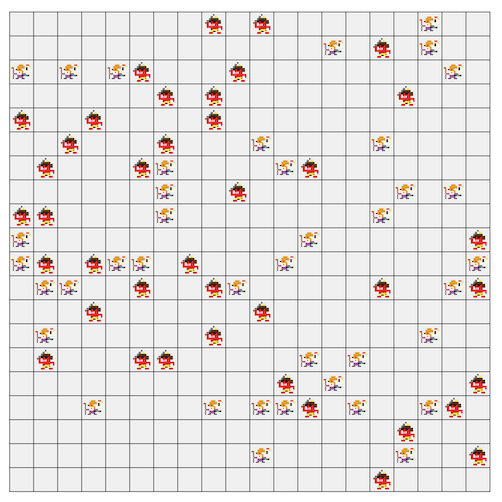

# AtCoder Heuristic Contest 042

[TOC]



## 問題概要

- https://atcoder.jp/contests/ahc042
- 20\*20マスのグリッド上に、40個の福と40個の鬼の駒が置いてある
- 1回の操作でどこかの行または列に対し、左右または上下に1マスだけずらすことができる
- 操作によって盤面の外に移動する場合、盤面から取り除かれる
- できるだけ少ない操作回数で、福を1つも取り除くことなく、鬼をすべて取り除くような操作列を答えよ

## 時間

- 4 時間

## 個人的メモ

### サンプルの操作の無駄を改善

- サンプルは「各鬼について、福がいない方向に向かって外に押し出して、**その逆操作して元に戻す**」をしている
- 逆操作をしない場合、各鬼について「福がいない方向がある」というのを満たせなくなってしまう
- とはいえ、完全に元に戻さなくても「各鬼について福がいない方向がある」を満たせていればよいので、それを満たすところまで逆操作すれば十分なため、操作の無駄を減らすことができる

### 福をどかしながら鬼を押し出す

- 「福がいない方向」ではなく、「端に近い方向」向かって動かすと外に出すまでの操作回数を減らせる可能性がある
- ただ、福がいる可能性があるため、その福をどかしつつ押し出すことを考える必要がある
  - 基本的には、鬼を右に動かしたい場合、そのライン上の福は上下に動かせば1手でどかすことができる
- しかし、これをルールで書こうとすると、福が連続していたり、端に福がいて動かせなかったり、複雑な形状になってルールが複雑化してしまいうる
  - BFSで手順を求めたり、詰む場合は諦めてビームサーチで多様性を確保しつつ操作列を求めることはできる
- また、これだけだと上位に入るには操作回数的にまだ不十分

### 鬼を「まとめて押し出す」

- ある鬼を、外に押し出すライン上、または、ラインに近い他の鬼をライン上に移動してまとめて押し出し操作をすると、別々に外に押し出すよりも少ない操作回数で押し出せる可能性がある
  - ある鬼を押し出すときに、他の鬼をまとめて動かせるので、操作回数が減る
- これがかなり効果的で、積極的に狙うことで操作回数が減らせる

### アプローチ

#### 「近くの鬼をまとめて押し出す」操作を1手として探索

- 「近くの鬼をまとめて押し出す」操作を1手として、鬼の順番(や押し出す方向)をいろいろ試す
  - 乱択だったり、後ろに足していくビームサーチ、特定の行・列にまとめる、など

#### 操作列を焼き鈍す

- 操作列を状態として、「ある操作を続けて外に出せる鬼を全部外に出す操作」や「上下左右へのN手分の移動操作」などを近傍に焼き鈍す
- 文脈が弱い(ある部分を変えても他の部分への影響があまり大きくない)ので、操作列の局所改善が有効
  - ただ上記の1つ目の近傍が重要そう？

#### 過去改変型

- 操作列を状態とするが、後ろに「周囲の鬼をまとめて押し出す操作」を追加するのではなく、「鬼を外に押し出す」や「上下左右へのN手分の移動操作」などを操作列の途中に **挿入** する貪欲やビームサーチ
  - 過去改変型
  - 上記の焼きなましのイメージに近い
- 「鬼をまとめて押し出す」操作は、ルールで書かなくても、構造的には「ある鬼を外に押し出す」＋「押し出すライン上に他の鬼を持ってくる」ような感じになっており、「ライン上に鬼を持ってくる操作」を近傍に追加することで、探索に組み込むことができる
- 評価関数
  - 各マスの外側までの距離を持つような2次元配列を用意して、操作列を逆から逆方向に動かすようにすると、ある時点から最後までその操作をしたときに「そのマスは外に出るか？」や「あるマスは最終的に外側まで距離はどれぐらいか？」などが求められるので、福を落とさずに、その評価値ができるだけ小さくなるのを目指す

```
# イメージ
(外側までの距離を持つ2次元配列)
1111111
1222221
1233321
1234321
1233321
1222221
1111111

「(U,0) -> (R,1)」という操作列の場合、

(R,1) # 2行目をL方向に動かす
1111111
2222210
1233321
1234321
1233321
1222221
1111111

↓

(U,0) # 1列目をD方向に動かす
0111111
1222210
2233321
1234321
1233321
1222221
1111111

的なイメージ。
(0のマスは最終的に外に出ているマスで、それ以外は外までの距離)
```

### その他

#### 操作の種類数

- 1手あたりだと、操作は「どの行/列か」と「上下/左右」しかないので、40*2=80通り程度しかない

#### seed=0のベスト解

- https://x.com/montplusa/status/1888650837767197072
- 65手が存在するらしい

## 解説

(50位まで&発言を見つけられた方のみ)

- [AHCラジオ(解説放送)](https://www.youtube.com/watch?v=gGN1Jq2A86Y)
- [解説(日本語)](https://atcoder.jp/contests/ahc042/editorial)
- [解説(英語)](https://atcoder.jp/contests/ahc042/editorial?editorialLang=en)

- [writer解](https://x.com/wata_orz/status/1886052902252462405)

- [Shun_PIさん](https://x.com/Shun___PI/status/1886053302313583100)
  - https://x.com/Shun___PI/status/1886053658011570251
  - https://x.com/Shun___PI/status/1886053869341577381
  - https://x.com/Shun___PI/status/1886055696061673488
  - https://x.com/Shun___PI/status/1886064607686709482
  - https://x.com/Shun___PI/status/1886066378387734580
- [Kahukaさん](https://x.com/kahuka0005/status/1886056263743930423)
- [yokozuna57さん](https://x.com/yokozuna_57/status/1886052621141889253)
  - https://x.com/yokozuna_57/status/1886054037717696799
- [Shibuyapさん](https://x.com/shibuyapprocon/status/1886066547594285475)
- [takumi152さん](https://x.com/takumi152/status/1886054188612034675)
  - https://takumi152.hatenablog.jp/entry/2025/02/03/014142
- [MathGorillaさん](https://x.com/MathGorilla_cp/status/1886054899206734284)
  - https://x.com/MathGorilla_cp/status/1886057220749885565
  - https://x.com/MathGorilla_cp/status/1886058788240896081
  - https://x.com/MathGorilla_cp/status/1887160569322787082
  - https://x.com/MathGorilla_cp/status/1887517278964723770
  - https://x.com/MathGorilla_cp/status/1887520522722025906
  - https://x.com/MathGorilla_cp/status/1887544962218332567
- [tomerunさん](https://x.com/tomerun/status/1886433394218930395)
  - https://topcoder-tomerun.hatenablog.jp/entry/2025/02/04/001531
  - https://x.com/tomerun/status/1887104835951972647
- [noimiさん](https://x.com/noimi_kyopro/status/1886054179220955448)
  - https://x.com/noimi_kyopro/status/1886054952650555543
  - https://x.com/noimi_kyopro/status/1886055616977965397
  - https://x.com/noimi_kyopro/status/1886058395570196868
  - https://x.com/noimi_kyopro/status/1886061268022559041
  - https://x.com/noimi_kyopro/status/1888058925213524338
- [iwashi31さん](https://x.com/iwashi31/status/1886053533545529518)
- [terry_u16さん](https://x.com/terry_u16/status/1886054053379211615)
  - https://www.terry-u16.net/entry/ahc042
  - https://x.com/terry_u16/status/1886791331915424128
  - https://x.com/terry_u16/status/1886816166573957441
- [HBitさん](https://x.com/toomerhs/status/1886053843181662327)
- [uta_cccさん](https://x.com/uta_cccc/status/1886053393837506995)
  - https://utac.hateblo.jp/entry/2025/02/03/220944
- [tempura0224さん](https://x.com/tempuracpp/status/1886133949858263327)
  - https://x.com/tempuracpp/status/1887543562314920074
- [kawateaさん](https://x.com/kawatea03/status/1886054357063622983)
- [mtsdさん](https://x.com/soiya_ksk/status/1886052303754633638)
  - https://x.com/soiya_ksk/status/1886052631149490658
  - https://x.com/soiya_ksk/status/1886053145710903780
  - https://x.com/soiya_ksk/status/1886054162754043945
  - https://x.com/soiya_ksk/status/1886054820144181509
  - https://x.com/soiya_ksk/status/1886055819139219885
  - https://x.com/soiya_ksk/status/1886059824775115081
  - https://x.com/soiya_ksk/status/1886059474630443202
  - https://x.com/soiya_ksk/status/1886062926777495641
- [chokudai社長](https://x.com/chokudai/status/1886057417563386301)
  - https://x.com/chokudai/status/1886065359574516221
  - https://x.com/chokudai/status/1886350747853328482
- [kotamanegiさん](https://x.com/small_onions/status/1886053220595994945)
- [y_kawanoさん](https://x.com/y_kawano/status/1886053386354819532)
  - https://x.com/y_kawano/status/1886055232595214831
- [lumaさん](https://x.com/lumc_/status/1886056389845639558)
- [boleroさん](https://x.com/10mlx10/status/1886054110644105534)
- [c7c7さん](https://x.com/C7C7LL/status/1886052671930634487)
  - https://x.com/C7C7LL/status/1887386031575736438
- [fuppy0716さん](https://x.com/fuppy_kyopro/status/1886055278074089530)
- [ichyoさん](https://x.com/ichyo/status/1886054260493959489)
- [montplusaさん](https://x.com/montplusa/status/1888650837767197072)
- [FplusFplusFさん](https://x.com/FplusFplusF____/status/1886053898798137667)
- [cuthbertさん](https://x.com/ethylene_66/status/1886052411221115249)
  - https://x.com/ethylene_66/status/1886052563671478729
  - https://x.com/ethylene_66/status/1886052874712674510
  - https://x.com/ethylene_66/status/1886053310870007850
  - https://x.com/ethylene_66/status/1886054475628236814
- [physics0523さん](https://x.com/butsurizuki/status/1886089142846824850)
  - https://kcpc.hatenablog.com/entry/2025/02/05/223052
- [statiolakeさん](https://x.com/statiolake/status/1886056889471095120)
- [fumin29さん](https://x.com/fumin_29/status/1886060900521750684)
  - https://x.com/fumin_29/status/1886249705782624707
- [simanさん](https://x.com/_simanman/status/1886055627258200159)
  - https://x.com/_simanman/status/1886053756472836437

## Links

- [twitter hashtag AHC042](https://x.com/hashtag/AHC042)

