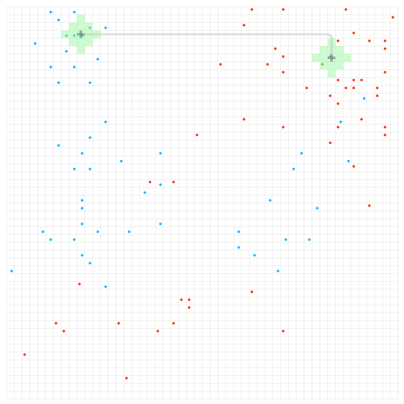

# RECRUIT 日本橋ハーフマラソン 2025冬(AHC043)

- https://atcoder.jp/contests/ahc043

## 問題概要

- 50\*50の区画からなるグリッドに対して、M人の家と職場の区画の情報が与えられる
- 各区画は、最初は更地で、コストを払うことで線路か駅を設置することができ、駅から距離2以下の区画の家か職場がその駅を利用できる
  - 線路はコスト100だが、駅はコスト5000
  - 線路は、上下左右の最大2つの区画と接続することができる
    - 線路は、設置後にあとから駅にすることもできる
  - 駅は、上下左右の最大4つの区画と接続することができる
- 各人は、家と職場が駅と線路を経由して到達可能なとき、鉄道を利用できる
- 各ターンでは、線路か駅の設置、または、待機を行い、その後、家と職場がつながっている人について、その家と職場の距離が資金として集金できる
- 最初に資金K持っているとき、T(=800)ターン後の資金を最大化せよ

## 時間

- 240 時間

## 個人的メモ

### 問題固有の性質

- 拡大再生産系
- 駅の位置、線路の形状、設置順番をどうするかが問題
- 最初の方では資金不足で貯まるまでターンを待つ可能性があるが、incomeや資金に余裕ができるとすぐに設置できるようになっていく
  - 前半と後半で問題の性質が異なる
- 1ターンを無駄にすると、最終的なincome分を損することになる
  - その無駄がなくなると最後の1ターンが増えるため
- 線路は「周囲区画の2つ」としか接続できないため、接続をどうするかが問題になる
  - 線路を交差したい場合、駅を増やせば繋げられるが、コストがかかるので、序盤などはできるだけ交差しないように設置したい

### 駅、線路の形状

- 木構造(連結成分1つ)になるように駅を追加していく形、が強かった
- 序盤などは木構造に限定しないほうがよいケースもあるかもしれないが、基本的には、連結成分が1つだと考えやすかったり、駅を追加したときにカバーされるところが多いのでincomeも増えやすいなどメリットが多い

### 駅の設置場所の候補

- 家か職場を含むように設置してなければ意味がないので、そういう場所を考えると、Mが小さい場合は有効な候補地点は結構少なくなる

### 序盤の重要性

- 最初の2駅の設置を考えた場合、incomeが10の場合とincomeが50のつなぎ方があるとき、前者だと次の駅設置コスト5000分がたまるまでに500ターンかかる一方、後者だと100ターンで済む
- 所持金が増えるまでにかかるターンが多いほど、後半のincomeがバンバン増えるフェーズに使えるターンが減ってしまうため、できるだけ少ないターンで所持金を貯めることが重要になる
- 上位でも、序盤のターンや最初の何個かの駅は、大きめの幅のビームサーチで求めるなどしている人が多かった模様
- 評価関数は、「最終的な所持金」にしてしまうと、最初に遠い距離を繋いだほうが得られるincomeが大きい場合が多いのでそういうのが先に選ばれやすいが、最初の所持金(K)がある程度多い場合は、近くを繋いでも3つ目の駅がすぐに設置できてincomeがより速く増える、などの場合もありえるので、「あるしきい値以上の資金がたまるまでに必要なターン数」が少ないようなものを探すようにすると良いみたい

### いつ設置を辞めるか？

- ある解について、各ターンについて、そこで設置をやめた場合、「現在の所持金 + 残りのターン\*現在のincome」で最終的な所持金を計算できるので、それが最大になるターンで設置をやめれば良い

### 線路と駅の設置順番、線路先置き

- ある駅を既存の駅・線路に繋ぐ事を考えた場合、incomeが増加するのは駅と線路がどちらも設置終わったタイミングだが、線路と駅の設置コストが違うため、序盤の資金不足のときは、「駅の設置→線路の設置」より「線路の設置→駅の設置」のほうが待ちターンが少なくなる可能性がある
  - 「駅→線路」の順番だと、駅を設置するまで待つしかないが、「線路→駅」だと、線路の設置と同時に「現在のincome-100」分のincomeも得られる
- さらに、「線路の設置(a)→駅の設置(b)→線路の設置(c)→駅の設置(d)」という場合に、bのコストが貯まるまで待つのではなく、上記と同様に先にcをやっておくと駅dまでのターンが減る可能性がある
  - https://x.com/skyaozora/status/1893971946343157978
  - https://x.com/ymatsux_ac/status/1893976812813689335
  - https://atcoder.jp/contests/ahc043/editorial/12355
- 最適な設置順はDPで求められる
  - https://atcoder.jp/contests/ahc043/editorial/12302
  - 後処理などで対応もできるが、探索中に考慮できるとより良い解が見つかる可能性がある

### 線路の経路

- BFSで近くの駅や線路までの経路を求めればよいが、計算コストが大きい
- 「追加する駅からの距離」ではなく「既存の駅・線路からの距離」を求めておくなどすれば、追加駅ごとに計算しなくて済むが、それでも結構重い

#### 経路を限定する

- 駅の所以外は交差しないので、複雑な形状を考える必要がない場合も多く、駅間は「x軸方向に移動→y軸方向に移動」「y軸方向に移動→x軸方向に移動」の経路だけに限定する、とかも考えられる
- ただ、後から設置する駅の考慮が難しく、カバーできていない家や駅の近くを通ったほうが良いケースなどに差ができやすい

#### 線路の設置を遅延させる

- 2つの駅を繋ぐ線路の経路は、最短経路で繋ぐ場合でもかなり自由度がある
  - 経路によっては、後で設置する駅が経路上にあれば1ターンで設置できるので、うまく経路を選ぶメリットがある
- 上位は、探索時には実際に線路を決めずに後から決める方法を取っていた模様
- 長方形領域で扱う
  - 経路を1つに決めずに、経路に使える長方形領域で扱っておき、領域が重なる場合や後で設置する駅が領域内にできたらその長方形領域を更新するようにすると、経路決定を最後まで遅延させることができる
    - https://blog.oimo.io/2025/03/02/ahc043/
    - https://x.com/kiri8128/status/1894006928386232522
    - 最短経路の一つは、領域内について距離が減る方向に移動/DFSで高速に求められる
- グラフで考える
  - 探索時には駅を頂点とした木(ただし、次数に制限や交差しないなど制約をいれる)を考え、実際の線路は後処理や別途厳密計算時に考える

#### 線路の種類

- 線路の種類は、その線路の周囲(4近傍、パスの前後)がどうなっているかで決まる
- 線路のパスさえ保持されていれば種類がわかる
  - 毎回種類を求めなくても、後から求めることができる
  - 線路の位置が欲しい場合も種類まではいらないので、各区画1bitで保持するなどできる

#### あとから経路を繋ぎ変える

- 駅に線路を繋げる場合に、前に設置した線路の向きによっては接続できなくなる/遠回りになってしまうケースができる
- その場合、線路を繋ぎ変えることで、解消できる可能性がある
  - https://atcoder.jp/contests/ahc043/editorial/12302

### アプローチ

#### 貪欲、ビームサーチ/chokudaiサーチ

- 「新しい駅を既存の駅/線路に繋ぐ」を1手として、貪欲やビームサーチ/chokudaiサーチ
  - chokudaiサーチを考える場合、「設置済みの駅数」か「ターン」かが考えられる
- 評価関数
  - シンプルなのは「追加incomeが一番多い地点」「最終所持金を計算して最大になる地点」などだが、設置までのある程度ターン数が必要なども踏まえると、最終ではなく「xターン後の最大所持金」などのほうがよいっぽい
  - 家と職場両方をカバーしないとincomeにならないが、駅を1つずつ追加する場合片方ずつカバーされていくので、片方だけをカバーしていることも評価関数に組み込むとよい
    - ただし、最初の方は直近の資金のほうが大事なので小さめにしておく
  - 後半の所持金やincomeに余裕がある場合は、設置にかかるターンのほうがボトルネックになるので、「1ターンあたり得られるincome増加分」が大きい地点を選ぶなど、切り替える
- 重複排除
  - ある区画をカバーするような駅の設置の仕方は13通り(距離2以下)あり、最短で繋いだとしても何通りかの組み合わせがありえて似たような盤面が発生しやすい
  - 他の多様性の持たせ方として、評価値での「〜ターン後の最大所持金のもの」でベストのものだけを残す、なども

#### 焼きなまし

- 今回の場合、駅の位置や訪問順を変えた場合でも、待ちターン数などは変化するが、形状は全体に対して部分的にしか変化しないので、局所探索系を考えることもできる
  - ビームサーチの解の改善として使うなどもできる
- 状態としては、「駅の位置・接続先とその順番」を持つ、など
  - 設置順ではなく木構造を持つ、なども
- 資金に余裕があるタイミングの、順番の隣接swap操作は、その後の所持金しか変わらないので高速に評価できる
  - https://x.com/yochan_tech/status/1893967881538338845  

### その他

#### カバー範囲が被らないように敷き詰める駅配置

- 駅が隣接していたりでカバーしている範囲が被っているのは、無駄そうに見えるので、できるだけ被らずに敷き詰められるような駅配置がよいのでは？と考えられる
  - 敷き詰めるように駅を配置すると、隣接駅と卍のような感じでつなげることができ、グリッド的に考えることができる
- しかし、駅や線路の接続が最短経路にならず、細かく無駄なターンが発生してしまって、良い解が得られない
  - 有効なのは駅が大量に設置できるケースだが、そういう場合は資金に余裕があって、きれいに設置するよりも、隣接や近くに駅を設置しまくったほうがよい場合が多い

#### お絵かき

- https://x.com/moooaki/status/1893980046248845763

## 解説

(50位まで&発言を見つけられた方のみ)

- [AHCラジオ(解説放送)](https://www.youtube.com/live/7oJehEY5cJE)
- [解説(日本語)](https://atcoder.jp/contests/ahc043/editorial)
- [解説(英語)](https://atcoder.jp/contests/ahc043/editorial?editorialLang=en)

- [writer解](https://img.atcoder.jp/ahc043/AHC043.pdf)

- [saharanさん](https://x.com/shr_pc/status/1893966381764256146)
  - https://x.com/shr_pc/status/1893974020208435533
  - https://x.com/shr_pc/status/1894013738581106950
  - https://x.com/shr_pc/status/1894018844378681763
  - https://x.com/shr_pc/status/1894375510693875896
  - https://x.com/shr_pc/status/1894375331777454129
  - https://x.com/shr_pc/status/1894391624199016940
  - https://x.com/shr_pc/status/1894389335174385770
  - https://blog.oimo.io/2025/03/02/ahc043/
- [nikajさん](https://atcoder.jp/contests/ahc043/editorial/12302)
- [rhooさん](https://atcoder.jp/contests/ahc043/editorial/12355)
  - https://x.com/rho__o/status/1893964676834218437
  - https://x.com/rho__o/status/1893965861884420229
  - https://x.com/rho__o/status/1893967733316005995
  - https://x.com/rho__o/status/1894732403471692152
- [montplusaさん](https://montplusa.hatenablog.com/entry/2025/02/27/231300)
  - https://montplusa.hatenablog.com/entry/2025/02/24/194500
  - https://x.com/montplusa/status/1893965136852832502
  - https://x.com/montplusa/status/1893969182422667362
  - https://x.com/montplusa/status/1894013446162702677
  - https://x.com/montplusa/status/1894017127608177024
- [MathGorillaさん](https://x.com/MathGorilla_cp/status/1893965909989228766)
  - https://x.com/MathGorilla_cp/status/1894022211578585455
  - https://x.com/MathGorilla_cp/status/1894168675122618513
  - https://x.com/MathGorilla_cp/status/1894176357812211833
  - https://x.com/MathGorilla_cp/status/1894368645285122411
  - https://x.com/MathGorilla_cp/status/1894759530745225450
  - https://x.com/MathGorilla_cp/status/1895141897121026048
- [terry_u16さん](https://x.com/terry_u16/status/1893966477528629338)
  - https://x.com/terry_u16/status/1893967473692557716
  - https://x.com/terry_u16/status/1893970425048109307
  - https://x.com/terry_u16/status/1894008363282846015
  - https://x.com/terry_u16/status/1894009435929850142
  - https://x.com/terry_u16/status/1894010031579787379
  - https://x.com/terry_u16/status/1894014565270065214
  - https://x.com/terry_u16/status/1894015238053265632
  - https://x.com/terry_u16/status/1894016722296074543
  - https://x.com/terry_u16/status/1894024139389714753
  - https://x.com/terry_u16/status/1894025672449982821
  - https://x.com/terry_u16/status/1894027759849988352
  - https://x.com/terry_u16/status/1894034225034149947
  - https://x.com/terry_u16/status/1894296487586070937
- [Shun_PIさん](https://x.com/Shun___PI/status/1893965325374222424)
  - https://x.com/Shun___PI/status/1893966802259939792
  - https://x.com/Shun___PI/status/1893977471894106336
  - https://x.com/Shun___PI/status/1894334184560509322
  - https://x.com/Shun___PI/status/1894334333869310301
- [fuppy0716さん](https://x.com/fuppy_kyopro/status/1893965085749682561)
  - https://x.com/fuppy_kyopro/status/1894020815324123533
  - https://x.com/fuppy_kyopro/status/1894021868757062051
- [eijirouさん](https://x.com/eijirou_kyopro/status/1894003583831388273)
- [Jinapettoさん](https://x.com/Jinapetto/status/1893966549406421177)
  - https://x.com/Jinapetto/status/1893968145372557513
  - https://x.com/Jinapetto/status/1893968575158739316
  - https://x.com/Jinapetto/status/1893969856766132520
  - https://github.com/Jinapetto/AHC043
- [ymatsuxさん](https://x.com/ymatsux_ac/status/1893969647621570564)
  - https://x.com/ymatsux_ac/status/1893976812813689335
  - https://x.com/ymatsux_ac/status/1894023730495397914
  - https://x.com/ymatsux_ac/status/1894043417262395435
  - https://x.com/ymatsux_ac/status/1894093712248246691
  - https://x.com/ymatsux_ac/status/1894093922441318716
- [FplusFplusFさん](https://x.com/FplusFplusF____/status/1893973505047490788)
  - https://x.com/FplusFplusF____/status/1893966155347337305
  - https://x.com/FplusFplusF____/status/1893979648138117389
  - https://fplusfplusf.hatenablog.com/entry/2025/02/24/203959
- [Ang107さん](https://x.com/Ang_kyopro/status/1893965424393343147)
  - https://ang107.hatenablog.jp/entry/2025/02/28/190322
  - https://x.com/Ang_kyopro/status/1893971820413390913
  - https://x.com/Ang_kyopro/status/1894004629953741302
  - https://x.com/Ang_kyopro/status/1894005511604809979
  - https://x.com/Ang_kyopro/status/1894036770704036231
  - https://x.com/Ang_kyopro/status/1894040828839854571
  - https://x.com/Ang_kyopro/status/1894052830694015120
  - https://x.com/Ang_kyopro/status/1894160384157950176
  - https://x.com/Ang_kyopro/status/1894553845654851708
  - https://x.com/Ang_kyopro/status/1895019133689082149
- [yunixさん](https://x.com/yunix91201367/status/1893964638737649918)
- [kawateaさん](https://x.com/kawatea03/status/1893966658194051549)
  - https://x.com/kawatea03/status/1893968163290726683
- [bowwowforeachさん](https://x.com/bowwowforeach/status/1894150835694919887)
  - https://x.com/bowwowforeach/status/1894162153491632354
  - https://x.com/bowwowforeach/status/1894162998752940493
- [Piiiiiさん](https://x.com/AcPiiiii/status/1894217878422888662)
- [simanさん](https://x.com/_simanman/status/1893965935246991815)
  - https://x.com/_simanman/status/1893967566818721949
  - https://x.com/_simanman/status/1893968297005318451
  - https://x.com/_simanman/status/1893970206172835995
- [ssaattooさん](https://x.com/myh9_f/status/1893964431404744990)
- [niuezさん](https://x.com/xiuez/status/1893966767321411667)
  - https://x.com/xiuez/status/1893969244766740914
  - https://x.com/xiuez/status/1894208508419346827
  - https://x.com/xiuez/status/1894208797893353798
  - https://x.com/xiuez/status/1894209789942796343
  - https://x.com/xiuez/status/1894219968826544457
- [kozimaさん](https://x.com/t33f/status/1893965371855561132)
  - https://x.com/t33f/status/1893965811817021878
  - https://x.com/t33f/status/1893968089428996264
  - https://x.com/t33f/status/1893968854730027074
  - https://x.com/t33f/status/1893966331789140161
  - https://x.com/t33f/status/1893975789567451524
  - https://x.com/t33f/status/1893977020394095061
  - https://x.com/t33f/status/1893978477885296967
  - https://x.com/t33f/status/1894005209820471501
  - https://x.com/t33f/status/1894010759266328992
  - https://x.com/t33f/status/1894012503232770124
  - https://x.com/t33f/status/1894018499669852478
  - https://x.com/t33f/status/1894034560360271998
  - https://x.com/t33f/status/1894052418385580058
  - https://x.com/t33f/status/1894322856655557097
  - https://x.com/t33f/status/1894385334303298035
  - https://x.com/t33f/status/1894385837783355803
  - https://x.com/t33f/status/1894393710814925069
  - https://x.com/t33f/status/1894710663962108174
  - https://x.com/t33f/status/1894714457814921329
  - https://x.com/t33f/status/1894764740783767866
- [highjumpさん](https://x.com/highjump_425/status/1893981930690949382)
- [Kahukaさん](https://x.com/kahuka0005/status/1893980309533622462)
- [besukohuさん](https://x.com/besukohu/status/1893966494175834441)
- [G4NP0Nさん](https://x.com/G4NP0N/status/1893964604130353335)
  - https://x.com/G4NP0N/status/1893965593084047546
  - https://x.com/G4NP0N/status/1893965201516495197
  - https://x.com/G4NP0N/status/1893967281497002198
- [bresoさん](https://x.com/Carbon_so6/status/1893969000369160221)
  - https://x.com/Carbon_so6/status/1893972804594483203
  - https://x.com/Carbon_so6/status/1893973587499094340
  - https://x.com/Carbon_so6/status/1894001628912464352
- [HBitさん](https://x.com/toomerhs/status/1893965934504604102)
- [hari64さん](https://x.com/hari64boli64/status/1893971163824406529)
  - https://x.com/hari64boli64/status/1893975430316556781
- [sumoooruさん](https://x.com/sumoooru/status/1893968331830419591)
- [mtsdさん](https://x.com/soiya_ksk/status/1893968265476542790)
  - https://x.com/soiya_ksk/status/1893968899755966807
  - https://x.com/soiya_ksk/status/1893970887990264098
  - https://x.com/soiya_ksk/status/1894014633142333536
  - https://x.com/soiya_ksk/status/1894014844975665319

## Links

- [twitter hashtag AHC043](https://x.com/hashtag/AHC043)
- [twitter hashtag rcl_procon](https://x.com/hashtag/rcl_procon)
- [simanさん統計](https://siman-man.github.io/ahc_statistics/043/)
- [wataさんの詳細な順位表](https://img.atcoder.jp/ahc_standings/index.html?contest=ahc043)
