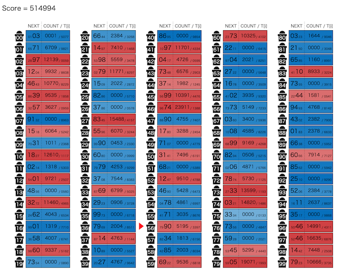

# AtCoder Heuristic Contest 044

[TOC]

## 問題概要

- https://atcoder.jp/contests/ahc044
- N(=100)人に対し、順番にL(=500,000)回掃除当番を割り当てる
- 掃除の順番は、「ある人iの次の当番の人は、人iに割り当たった回数が奇数回目なら人a_i、偶数回目なら人b_i」のように割り当てられる
  - 最初は人0から始まる
- 各人について、目標の当番回数T_iが与えられるので、実際の当番回数をt_iとして、Σ|T_i - t_i|を最小化するように(a_i,b_i)を決めよ

## 時間

- 4 時間

## 個人的メモ

### スコア計算の近似

- 素直にそのままスコアを計算しようとすると、L回のシミュレーションが必要で、かなり重い
- もっと計算量が少ないスコア近似を考えらえると、アプローチの選択肢が増える

#### マルコフ連鎖の定常状態として考える O(N \* 反復回数)

- 「偶数回、奇数回」ではなく、「1 / 2の確率でどちらかに移動する」と考える
- これはマルコフ連鎖として考えられるので、(Lは大きいので)「定常状態での各状態に存在する確率 \* L」ぐらいを実際の当番回数の推定値として考えることができる
- 定常状態を求めるのは、ちゃんと計算しようとすると重いが、反復解法でO(N \* 反復回数)ぐらいで求められる
  - 固定回数 or 収束するまで回す
- 反復解法での初期状態として、p_0=1.0(それ以外は0.0)から始める場合は強連結性などを考慮したものがでるが、p_i=1.0/Nやp_i=T_i/Lとかから始めてしまうと、実際の値と大きくズレてしまう可能性がある
  - 変化はあまり大きくないため、前の状態などを初期値として上げるなどすると、かなり速く収束する可能性がある
  - 焼きなましなどで前半の変化が大きい場合などは収束までに必要な反復回数が多い可能性もある
- https://note.com/ymatsux/n/n9b2c8c3d94c6

#### 最初のx回分で求めたものをL/x倍する O(x)

- シミュレーションをL回ではなく、最初のx回(例えば5000回とか)でやめて、その時点での訪問回数をL/x倍したものを近似スコアとして利用できる
  - O(x)
- このxは多くなるほど精度が高くなるので、時間とともに回数を増やして精度を高めるなどにも対応できる
  - [AHC039](./ahc039.md)の「段階的に細分化」のようにできる

#### 目標回数を割り振る O(N) or O(1)

- 人iはT_i回割り当てられると仮定して、T_i/2を人a_iと人b_iを配ることを考える
- 実際の当番回数t_iがT_iに近ければ、かなりよく近似できる
  - 実際、スコアが理論値近くまで出せるので、よい近似になる
- すべての人について、配った後の値との差を評価値とするとO(N)で求められるが、差分更新O(1)もできるので、かなり高速
- ただし、注意として、強連結かは保証されないため、入次数が0の場合や、複数の強連結成分を経由するような場合にかなり大きくズレてしまいうるため、対処が必要
  - 例えば、すべての人が自己ループを作ると最適解になるが、実際のスコアは人0がL回になるのでズレまくる

### 強連結性

- 有向グラフとして考えると、強連結成分が複数あるような場合、当番回数は0(人0から到達不可能の場合)や0に近い値(人0から到達可能だが最終的な強連結成分ではない場合)になってしまいうる
  - 出次数が2なので、入次数も平均2で、結構疎なグラフなので分離しやすいかも？
  - 評価関数計算などで大きくズレてしまう原因になりうる
  - 今回は、上位のスコアが平均99%後半とか出ているため、150ケース中数ケースでも悪い解が出ると厳しい
- そのため、t_iを0付近にしたくない人は、強連結(人iから人jに到達可能)になっているほうがよい

#### 強連結性への対処

- 制約を加える
  - 自己ループやa,bがどちらも同じ先にいかないようにする
- 探索中、時々チェックする
  - 強連結性を確認する
  - 厳密計算する
- 複数解を出して失敗してたら捨てる
- a_iは(i+1)%N固定で、b_iを探索する

### 「ビンパッキング問題」のようなイメージで考える

- (解説放送)
- ↑の「目標回数を割り振る」のところのような感じで、T_i/2をアイテム(2つずつ)として、各人のT_iを大きさの異なるビンと考えると、ビンパッキング問題のように考えることができる
  - 「ビンパッキング問題」はビンの数を最小化する問題なので、厳密には異なる
- 有名問題のため、この問題の様々なアイデアを流用できたり、問題が考えやすくなる
  - ビンにアイテムが割り当てられた状態からの局所探索向けの近傍を考えると、「アイテムを別のビンに移動する」「別のビンのアイテムをswapする」「ビンの中のアイテムを全部入れ替える」など自然な発想として考えられる
  - 順番に瓶詰めしていくと考えると、貪欲解やビームサーチ解なども自然に考えることができる
  - ビンパッキング問題は、整数計画問題として定式化もできるので、そのアプローチも考えられる

### アプローチ

#### 構築解

- 二冪構築
  - サイクルになっているグラフの頂点iと頂点i+1の間に2つの頂点x,yを入れて、i->x、i->y、x->i+1、y->i+1のように辺を張れば、x,yの当番回数はiの当番回数の半分にできる
  - これを繰り返すと、1/2^nが作れたり、そこから頂点を伸ばす感じで頂点を増やせば、同じ値を作ったり、などはできる
    - T_jがT_iのおおよそ半分なら、T_iからT_jに辺を貼れば、辺1本で達成できる
- 等間隔構築(解説放送)
  - a_iをi+1、b_iをi-1のような感じにすると、規則的に、0からiまで行って0に戻って来るような動きをさせることができる
  - このとき、訪問回数は98回、196回、294回、・・・と等間隔の回数にすることができる
  - 入力の生成方法は、一様分布(0〜1)でN個生成しているので、小さい方からk番目の値の期待値はk/(N+1)で等間隔になり、T_iで降順ソートして割り当てると、ある程度良い解が得られる
    - [wikipedia順序統計量](https://ja.wikipedia.org/wiki/%E9%A0%86%E5%BA%8F%E7%B5%B1%E8%A8%88%E9%87%8F)
    - 一様分布の確率変数を順番に並べたk番目の値はベータ分布に従い、ベータ分布の期待値からk/(N+1)になる
  - https://x.com/satanic0258/status/1901276050614833388
  - https://blog.tobisatis.com/2025/03/atcoder-ahc044.html
    - 等間隔構築のグラフの頂点に複数人を割りてるような感じで貪欲に構築もできるようで、スコアもかなり改善する模様

#### 局所探索解(山登り、焼きなまし)

- (a_i,b_i)を状態に、局所探索(山登りや焼きなまし)を考えることができる
  - 山登りはすぐ完了する可能性があるため、kick近傍を入れたり、時間いっぱい乱択で複数解を生成して一番良いものを返す(乱択山登り)
  - 上位は焼きなまし解が多かった模様
- 近傍
  - 1つの値を変える
    - 辺の向き先を変化させた場合、それらの子孫は、子は変化量の1 / 2、さらにその子は変化量の1 / 4、・・・の変化が起きる
      - 全体から見ると結構局所的だが、焼きなまし後半などでは変化量が大きい近傍で、採用率が悪い
  - 2つの値をswapする
    - 上記のビンパッキングをイメージするとわかりやすく、1点更新だけだと悪化を経由しないといけないが、2点swapだと1回で改善できる可能性がある
    - 1点更新より変化量が少ない近傍
  - 1-2swap
    - https://x.com/ymatsux_ac/status/1902205550378578026
    - https://x.com/terry_u16/status/1902616979955187940
    - 上記2つの組み合わせ近傍
    - 3つの辺について、2本は向き先をswapし、残りの1本はswapした向き先のどちらかに向き先を変える
  - など
- その他
  - 初期解にある程度良いものを使う
  - 近傍の採用率を上げる工夫をする
  - スコア計算などで悪化が大きいことが分かる場合に打ち切る
  - など

#### 貪欲、ビームサーチ解

- ビンパッキング問題として考えると、順番にビンにアイテムをいれていく貪欲やビームサーチを考えることができる
  - 小さいものから埋めていく
  - 最初の2つを固定して、すでに決めたやつから0〜3本まで使って割り当てていく感じ
  - など
- writer解や1位はこちらのアプローチだった模様

#### 整数計画問題(ILP)

- 整数計画ソルバーで解く(時間はかかるので2秒制限だと厳しそう?)
- https://x.com/kiri8128/status/1902146352249028790
  - https://x.com/kiri8128/status/1904188236588597376
  - https://speakerdeck.com/kiri8128/ahc-044-hun-he-zheng-shu-ji-hua-sorubajie-fa
- https://x.com/Rafbill_pc/status/1902280224613564620

### その他

#### 入力生成の成功率

- 一様ランダムにN-1個生成し、「L - それまでの和」を最後の1個に割り当てるが、それが0以上10000以下でなければやり直す、という感じのため、結構失敗が多そうに見える
- https://x.com/kiri8128/status/1901287349847462152
  - 計算すると、成功率は13〜14%ぐらいみたいなので、期待値13〜14回ぐらいやれば成功する模様

#### グラフ表示

- 有向グラフでビジュアライズされていたほうがわかりやすそうに思うが、実際グラフで表示してみようとすると、頂点の位置関係が難しかったり、辺がごちゃごちゃになってわかりやすい訳では無い
  - 試してみたけど、2次元表示だとあんまりいい感じにならない
  - https://x.com/phyllo/status/1901612835324694587
- (解説放送)
- https://x.com/idolikeshishamo/status/1902520408223707244

#### お絵かき

- https://x.com/prd_xxx/status/1902358679426613274

## 解説

(50位まで&発言を見つけられた方のみ)

- [AHCラジオ(解説放送)](https://www.youtube.com/watch?v=TKAlQ5pcfdU)
  - [解説資料](https://drive.google.com/file/d/1LZ2FoDso1POI1BQaPjIl6BXjo-Y8kSZW/view)
- [解説(日本語)](https://atcoder.jp/contests/ahc044/editorial)
- [解説(英語)](https://atcoder.jp/contests/ahc044/editorial?editorialLang=en)

- writer解
  - https://x.com/e869120/status/1901276006285300171
    - https://atcoder.jp/contests/ahc044/submissions/63889785
  - https://x.com/square10011/status/1901278084508332213
    - https://atcoder.jp/contests/ahc044/submissions/63893180

- [Rafbillさん](https://x.com/Rafbill_pc/status/1901276976758862035)
- [terry_u16さん](https://x.com/terry_u16/status/1901275079285068144)
  - https://x.com/terry_u16/status/1901273650449498270
  - https://x.com/terry_u16/status/1901275929034269183
  - https://x.com/terry_u16/status/1901276794050986246
  - https://x.com/terry_u16/status/1901277271266328838
  - https://x.com/terry_u16/status/1901279379499405740
  - https://x.com/terry_u16/status/1901280713967853607
  - https://www.terry-u16.net/entry/ahc044
- [yokozuna57さん](https://x.com/yokozuna_57/status/1901275605112619416)
  - https://x.com/yokozuna_57/status/1901277087132156399
- [saharanさん](https://x.com/shr_pc/status/1901273915378536510)
  - https://x.com/shr_pc/status/1901276580439351451
  - https://x.com/shr_pc/status/1901276982656299291
  - https://x.com/shr_pc/status/1901282829843190142
  - https://x.com/shr_pc/status/1901283176129196125
  - https://x.com/shr_pc/status/1901287747543065077
  - https://x.com/shr_pc/status/1901290376272773164
  - https://x.com/shr_pc/status/1901306137582158144
- [MathGorillaさん](https://x.com/MathGorilla_cp/status/1901276037146870199)
  - https://x.com/MathGorilla_cp/status/1901281560055501014
  - https://x.com/MathGorilla_cp/status/1901934918474797195
  - https://x.com/MathGorilla_cp/status/1902234159730631027
- [tomerunさん](https://x.com/tomerun/status/1901273518165352874)
  - https://x.com/tomerun/status/1903848945253847353
- [Shun_PIさん](https://x.com/Shun___PI/status/1901272579903783116)
  - https://x.com/Shun___PI/status/1901273349667569886
  - https://x.com/Shun___PI/status/1901274952688677219
  - https://x.com/Shun___PI/status/1901275841616810357
  - https://x.com/Shun___PI/status/1901277917323379133
- [KKT89さん](https://x.com/_KKT89/status/1901274487192220151)
  - https://x.com/_KKT89/status/1901276636420698323
- [tempura0224さん](https://x.com/tempuracpp/status/1901272529433420052)
  - https://x.com/tempuracpp/status/1901273426335272995
  - https://x.com/tempuracpp/status/1901274884820644063
  - https://x.com/tempuracpp/status/1901316000806752365
- [iwashi31さん](https://x.com/iwashi31/status/1901272943365390789)
  - https://x.com/iwashi31/status/1901273503044874381
- [tute7627さん](https://x.com/tute7627/status/1901272582776668235)
  - https://x.com/tute7627/status/1901273036692828542
  - https://x.com/tute7627/status/1901273845560197266
  - https://x.com/tute7627/status/1901274730394739147
  - https://x.com/tute7627/status/1901275323133788282
- [HBitさん](https://x.com/toomerhs/status/1901275352372248918)
- [notkamonohasiさん](https://x.com/notkamonohasi_2/status/1901275013141184857)
- [cuthbertさん](https://x.com/ethylene_66/status/1901272421954691514)
  - https://x.com/ethylene_66/status/1901273489245614191
  - https://x.com/ethylene_66/status/1901274270908694952
  - https://x.com/ethylene_66/status/1901277157747569024
- [risujirohさん](https://x.com/risujiroh/status/1901279364396065130)
- [Moegiさん](https://x.com/mih28731325/status/1901273561530241272)
  - https://x.com/mih28731325/status/1901274311253754155
- [niuezさん](https://x.com/xiuez/status/1901273798034481427)
- [hitonanodeさん](https://x.com/rsat__m/status/1901289148935499816)
- [gueさん](https://x.com/onegaspine/status/1901283016510464022)
- [Kiri8128さん](https://x.com/kiri8128/status/1901276486444945857)
  - https://x.com/kiri8128/status/1901278174740447510
  - https://x.com/kiri8128/status/1901278788371231062
  - https://x.com/kiri8128/status/1901279049038860707
  - https://x.com/kiri8128/status/1901282411373306247
  - https://x.com/kiri8128/status/1901287349847462152
  - https://x.com/kiri8128/status/1901288508464955405
  - https://x.com/kiri8128/status/1901293148636381672
  - https://x.com/kiri8128/status/1901309198140662105
  - https://x.com/kiri8128/status/1901437585790312656
  - https://x.com/kiri8128/status/1901626672941834390
  - https://x.com/kiri8128/status/1901628714133360843
  - https://x.com/kiri8128/status/1901635221327417663
  - https://x.com/kiri8128/status/1901656457239736715
  - https://x.com/kiri8128/status/1902146352249028790
  - https://x.com/kiri8128/status/1902414920123347383
  - https://x.com/kiri8128/status/1902555287221104840
  - https://x.com/kiri8128/status/1902647309608857735
  - https://x.com/kiri8128/status/1904188236588597376
  - https://speakerdeck.com/kiri8128/ahc-044-hun-he-zheng-shu-ji-hua-sorubajie-fa
- [Shibuyapさん](https://x.com/shibuyapprocon/status/1901286950436573246)
- [nouka28さん](https://x.com/nouka28/status/1901274620117827673)
- [miiitomiさん](https://x.com/miiitomi/status/1901273309830160421)
  - https://x.com/miiitomi/status/1901277005053931812
  - https://x.com/miiitomi/status/1901281049961001013
- [olpheさん](https://x.com/_olphe/status/1901272565563412676)
  - https://x.com/_olphe/status/1901275846327017587
  - https://x.com/_olphe/status/1901293184560558222
  - https://x.com/_olphe/status/1901292865994776797
- [maeda3さん](https://x.com/dj_maeda3/status/1901277845910945894)
  - https://x.com/dj_maeda3/status/1901636129608310786
  - https://x.com/dj_maeda3/status/1901637780863934896
  - https://x.com/dj_maeda3/status/1901640462693523772
- [uta_cccさん](https://x.com/uta_cccc/status/1901273730686541895)
  - https://x.com/uta_cccc/status/1901614606260621753
  - https://x.com/uta_cccc/status/1902665856855027801
  - https://x.com/uta_cccc/status/1902001750086668619
  - https://utac.hateblo.jp/entry/2025/03/18/231717
- [Piiiiiさん](https://x.com/AcPiiiii/status/1901277165502783842)
- [yunixさん](https://x.com/yunix91201367/status/1901273047447003406)
- [physics0523さん](https://x.com/butsurizuki/status/1901274465558028784)
  - https://x.com/butsurizuki/status/1901274655115424102
  - https://x.com/butsurizuki/status/1901278352801186146

- 延長戦
  - https://x.com/ymatsux_ac/status/1901916892912366038
  - https://x.com/prussian_coder/status/1902330550750474591

## Links

- [twitter hashtag AHC044](https://x.com/hashtag/AHC044)
