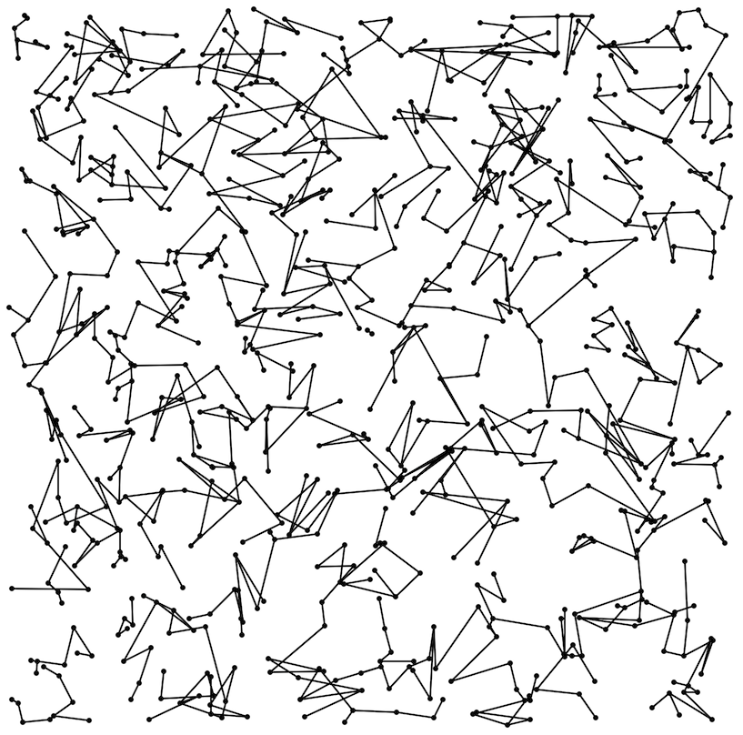

# THIRDプログラミングコンテスト2025(AHC045)

- https://atcoder.jp/contests/ahc045

## 問題概要

- 平面上にN(\=800)個の都市があり、各都市について、対応する長方形範囲(最大の幅・高さはW以下)内のどこかに存在することだけわかっている
- クエリとして、Q(\=400)回、以下の情報が得られる
  - 2個〜L個(\=3〜15)都市を選ぶと、その都市集合で最小全域木を構成したときの辺情報(頂点番号順)が得られる
- 最終的に、各都市をあらかじめ与えられるM個のグループ(各グループのサイズはG_i個)に分割し、各グループ内の都市は連結になるようにG_i-1本の道路を建設するような頂点・辺情報を出力せよ

## 時間

- 240 時間

## 個人的メモ

### クエリの使い方

- 「クエリの結果をそのまま使って全域木を構築する」か、「現状の全域木の頂点の部分集合をクエリにして局所改善する」か、「推定に活用する」か、などいろいろ使い道がある
  - 方針によって、どこにどのぐらいクエリを使うか？などの調整もありえる

### 位置推定

- クエリを使って各都市の位置をより正確にできるなら、その位置情報を使って全域木構築してもよい解が得られる
- ぱっと見だとどこまで正確にできるかわからないが、最終的にはかなりよく推定できるため、推定を頑張る必要があった

#### バネモデルっぽい感じで調整

- 「今の推定値で作ったMST」と「クエリの結果のMST」の辺の差分を見ると、今の推定値で作ったMSTの方だけにある辺はより長く、クエリの結果のMSTの方だけにある辺はより短い可能性がある
- また、相対的に、おおよそ「クエリの結果のMSTに含まれる辺は相対的に短く、含まれない辺は相対的に長い」可能性がある
  - サイクルができるため含まれない場合は含まれなくても短い可能性がある
- 辺の長さについて、もっと長そう、もっと短そう、という情報が使えるので、それを使ってバネモデルっぽく調整もできる
- ただ、Lが小さい場合、簡単に調整できる一方、情報が少ないため、ズレが大きく、あまりよくなかった
  - 初期位置ランダムにして調整し直しを何回かやって平均取る、とか
- [wikipedia力学モデル (グラフ描画アルゴリズム)](https://ja.wikipedia.org/wiki/%E5%8A%9B%E5%AD%A6%E3%83%A2%E3%83%87%E3%83%AB_(%E3%82%B0%E3%83%A9%E3%83%95%E6%8F%8F%E7%94%BB%E3%82%A2%E3%83%AB%E3%82%B4%E3%83%AA%E3%82%BA%E3%83%A0))

#### 不等式制約

- 「クエリの結果のMST」に含まれる辺について、より正確に、辺の大小関係(不等式)の情報を取ることができる
- 不等式の得方
  - ある頂点集合について、MSTとそれ以外の全域木を考えると、MSTは総長が最小になるので、「Σ(MSTの辺) <= Σ(全域木Tの辺)」になるので、共通する辺を両辺から除くと複数辺間の不等式が得られる
  - MSTの辺から1辺張り替えた全域木で考えると、「張替え前の辺の長さ <= 張替え後の辺の長さ」という不等式が得られる
    - MSTから1本取り除いて、連結になるように1本追加する、または、連結になる辺を全列挙
    - MSTに1本足すとサイクルができるので、そのサイクル上の辺を1本取り除く、または、サイクル上の辺を全列挙
- 不等式を使って位置調整
  - 不等式をできるだけ満たすように、推定位置を微調整(長方形内ランダムに置く)する局所改善
    - 違反数、違反量(ReLUみたいなイメージ)を目的関数にして減らす方向に山登り・焼きなましで改善
  - 違反量の和を損失関数として考えると、各頂点について勾配を考えることができるので、勾配降下法で最適化
  - ギブスサンプリング(他の推定位置を固定してある頂点についてサンプリングし直す(長方形内から条件をできるだけ満たす点を選ぶ))
- その他
  - 微調整とかで位置調整するとき、不等式条件の満たす満たさないの境界付近に収束しがちになってしまうので、マージン考慮やランダムにサンプリングなどを検討した方が良い
  - 凸じゃない(頂点位置が反転したようなのも解になったりする?)ようなので、局所解にハマる可能性があるみたい
    - 多点スタートやサンプリングを複数しなおしたり、ランダムウォークをいれたり、とか

#### クエリ設計

- できるだけ近い頂点を選ぶ
  - MSTに必要なのは、基本的には「短い辺の情報」なので、ある頂点についてその近傍の頂点を選んでおくと、短い辺に関する情報が得られやすい
- できるだけ分散が大きい頂点を選ぶ
- できるだけ長さが同程度の辺を含むような(正三角形、正三角形の組み合わせに近くなるような)頂点を選ぶ
  - 「直線上に離れてならぶ3頂点」みたいにほぼ自明なものを投げてもあまり意味がない
  - 頂点が近くなくても、辺の長さが不確実性が高いものを選ぶと改善につながる情報が得られる可能性がある
  - Lが小さい(L\=3)ケースなどでは重要そう
- できるだけ重複しないように選ぶ
  - 選び方によっては同じ辺について何回も取得する可能性がある
- できるだけ得られる情報が増えるように頂点を選ぶ
  - 現在の推定位置でのMSTより大きく異なるようなMSTになるクエリのほうが情報が増えて嬉しい
- あえて推定しない点を決める
  - グループサイズが1のものがある場合、分散が大きい頂点に割り当てておくと、その頂点を無視できる

### 距離推定

- MSTを構築するのに必要なのは「各頂点間の距離」(辺の大小関係)だけで、各頂点が正確に推定できている必要はない
- 長方形が大きい頂点等の場合、ズレを過小評価する可能性があるので、長方形の大きさも考慮すると良い可能性がある
- ギブスサンプリングなどで、「位置の期待値」を求めて距離を出すよりも、推定位置での距離を複数出して「距離の期待値」を求めるほうがよいっぽい

### 全域森構築

- グループサイズ制約ありの全域森構築も長い辺がでないように構築するのは結構難しい

#### 領域を荒く分割する/帯状に分けて考える

- 基本的に、「長い辺」を使う場合にスコアが悪化するので、そのような辺ができないようにしたい
- 領域を荒く分割して、その中の頂点か、隣接する区画の頂点だけと繋ぐように考えると、長い辺ができにくくなる
- サンプルから3行程度変えるだけで実装でき、クエリを活用するとかなり改善する(解説放送)

#### TSP/1本道を作って順番にグループを割り当てる

- TSPや1本道で1次元にすると、グループを順番に割り当てることができる
  - ユークリッドTSP(三角不等式が成り立つ、対称)を解く
    - ILSや焼きなましなど
  - TSPの辺をそのまま使うのではなく、割当後に頂点集合でMSTは構築し直すとより改善する
- TSPなどだと総長を最小化しているため、グループに分割したときに良いグループ分けになっているわけではないが、割当を考えやすいのと、最終的な解に長い辺ができにくいので、結構良いスコアが出る
- N\=800と頂点数が結構多いのに対し、制限時間が最大でも2秒で結構厳しい
  - 収束しきれないかもなので、できるだけ無駄な遷移をしないようにしたり、初期解を貪欲解にしておく必要もあるかも
- クリストフィードのアルゴリズム
  - https://ja.wikipedia.org/wiki/%E3%82%AF%E3%83%AA%E3%82%B9%E3%83%88%E3%83%95%E3%82%A3%E3%83%BC%E3%83%89%E3%81%AE%E3%82%A2%E3%83%AB%E3%82%B4%E3%83%AA%E3%82%BA%E3%83%A0

#### 全頂点MSTを切断して森を作る

- 全頂点でMSTを作り、そのMSTの長い辺から順番に削除すると、Mグループを作ることができる
- このとき、グループサイズの制約を満たすことも考えながら削除できる場合、最適な分割が得られる
  - その辺を削除したときの部分木サイズが、未割り当てのグループサイズのどれかになるなら削除できる
    - 部分和でもよい
  - 「1辺取り除くだけ」でなく、「2辺取り除いて連結になる1辺を追加」も考えられる
- ただ、MSTの形状やグループサイズによっては割当ができない場合もあるので、探索の工夫や別途調整が必要っぽい
- 最上位はこの方針が多かったっぽそう?

#### 全域森を焼きなまし

- 全域森を状態として、辺について「切断」「追加」「入れ替え」などを行うと局所改善ができる
  - 使える辺は限定したほうがよさそう？
- この場合、辺の状態も考慮するため、グループについて最適でないような辺の状態も考えるため無駄があり、ある程度の変化になるまで手数が必要で、大きめの変更をさせにくい

#### 頂点グループを焼きなまし

- 頂点のグループ割当のみを状態として、局所改善を考えることができる
  - 実際の辺や総長は、グループの頂点からMSTを作る
- 近傍
  - 部分破壊再構築(隣接2グループについてグループ割当をし直す、2つのグループの合計の頂点数と同じ別のグループがある場合にそれとswap)
    - prim法を1回実行し、残りを別グループとする
    - 2グループの全点でMSTを作ってグループサイズ制約を満たせる1辺取り除く
    - k-means
  - 頂点を移動させるパス(最短経路)を作って、パス上の頂点をスライドさせて移動
  - 2頂点swap
- 評価関数
  - MSTを計算
    - Mが大きい場合などはグループサイズが小さいものが多いのであまり計算コストが掛からない
  - グループ内頂点間距離の合計/グループサイズ
    - できるだけ円形塊的になってほしい
    - Mが小さいケースなどMST計算が重いので、代用
    - https://kiri8128.hatenablog.com/entry/2025/04/07/220212
      - 追加削除時がO(1)で計算できる
  - グループの重心からの距離の和

### 木構造特定クエリ(木構造の局所改善にクエリを使う)

- クエリの結果は真の座標で計算される正確なMSTになるので、そのまま解にすることも考えられる
  - 特に、長方形が大きい・位置推定が怪しいような頂点周り、など
- グループの頂点の部分集合についてクエリを投げれば、その頂点集合でのMSTで正確なものが得られるので局所改善できる
- グループサイズがL以下なら、そのグループのMSTは正確に作ることができる
  - また、複数グループをまとめて1クエリで投げることなども考えられる
    - グループが近いとグループ内で連結成分が分かれる可能性はありえそうなので、調整は必要そう

### その他

#### Euclidean MST

- https://en.wikipedia.org/wiki/Euclidean_minimum_spanning_tree

#### Mが小さいケースでのMST計算

- Mがある程度大きいケースが多いので気づきにくいが、最大で、M\=1の場合、800頂点でのMSTを求めることになる
- 制限時間ギリギリで調整したりしてこの構築時間を考慮していない場合は、手法によってはTLEになってしまったりする可能性があるので、要調整

#### 使う辺を減らす

- 遠すぎる辺を使わない
- ドロネー三角形分割の辺のみを使う(Euclidean MST)

#### O(N^2)のprim法

- 訪問済み頂点から未訪問頂点への最短距離を保持する配列を用意して、「最短のものを見つける→訪問済みに追加→配列を更新」を繰り返すとO(N^2)
- ヒープやソートするやり方だと、使わない辺についても保持・計算するため若干遅いっぽい

#### W\=0やL\=∞やQ\=∞の場合と比較する

- 入力やテスターをいじって、頂点の位置が正確に分かる場合(W\=0)や、クエリでまとめて頂点を投げられる場合(L\=∞)、クエリ数を増やした場合(Q\=∞)などと比較すると、推定精度や構築の伸び幅を確認できる
  - ビジュアライザからW=0のケースをまとめてダウンロードとかもできるので、それでスコアを見ると全域森構築パートの性能が比較できる

#### 3点のMSTで条件を満たせる範囲

- ある頂点a,b,cについて、cが存在しうる範囲は、MSTの結果から絞り込むことができる
  - aを中心に長さ|b-a|の円、bを中心に長さ|b-a|の円、辺abの中点を通る垂線、で領域を分けて考えると、MSTの結果によってそのどこかが絞られる

#### funcoder

- AIによる競技者支援に関する研究目的のアカウントが参加してた
  - AIだけで解いているわけではないっぽい
- https://x.com/chokudai/status/1909185507189481925
- https://x.com/wata_orz/status/1909217309400699002
- https://atcoder.jp/contests/ahc045/clarifications
- https://x.com/terry_u16/status/1909810624223486033

## 解説

(50位まで&発言を見つけられた方のみ)

- [AHCラジオ(解説放送)](https://www.youtube.com/watch?v=6RuhA6TlqbE)
  - [解説資料](https://speakerdeck.com/shun_pi/ahc045-jie-shuo)
- [解説(日本語)](https://atcoder.jp/contests/ahc045/editorial)
- [解説(英語)](https://atcoder.jp/contests/ahc045/editorial?editorialLang=en)

- [writerコメント](https://x.com/Shun___PI/status/1909184880719823325)
  - https://x.com/Shun___PI/status/1909185442429411443
  - https://x.com/Shun___PI/status/1909186839719870464
  - https://x.com/Shun___PI/status/1909187296148300039
  - https://x.com/Shun___PI/status/1910208854618472647
  - https://x.com/Shun___PI/status/1909239923397591158
  - https://x.com/Shun___PI/status/1909214611729219809
  - https://x.com/Shun___PI/status/1909187798701343031
  - https://x.com/Shun___PI/status/1909189221656756661
  - https://x.com/Shun___PI/status/1909197234421502222
  - https://x.com/Shun___PI/status/1909199094301794687
  - https://x.com/Shun___PI/status/1909209290247966897
  - https://x.com/Shun___PI/status/1909212685864145056

- [nikajさん](https://atcoder.jp/contests/ahc045/editorial/12674)
- [eijirouさん](https://x.com/eijirou_kyopro/status/1909230431352058062)
  - https://x.com/eijirou_kyopro/status/1909235208131379227
  - https://x.com/eijirou_kyopro/status/1909223088903901329
  - https://x.com/eijirou_kyopro/status/1909591920135045245
  - https://x.com/eijirou_kyopro/status/1909899957886460076
- [ymatsuxさん](https://x.com/ymatsux_ac/status/1909186954056622584)
  - https://x.com/ymatsux_ac/status/1909192594023969183
  - https://x.com/ymatsux_ac/status/1909198924822540650
  - https://x.com/ymatsux_ac/status/1909201195916525642
  - https://x.com/ymatsux_ac/status/1909205725077029112
  - https://x.com/ymatsux_ac/status/1909210424634974586
  - https://x.com/ymatsux_ac/status/1909343664868147412
  - https://x.com/ymatsux_ac/status/1909509844073144723
- [bowwowforeachさん](https://x.com/bowwowforeach/status/1909229895861010671)
  - https://x.com/bowwowforeach/status/1909234969148620864
  - https://x.com/bowwowforeach/status/1909236349015900283
  - https://x.com/bowwowforeach/status/1909541585571754211
  - https://x.com/bowwowforeach/status/1909552631023906925
  - https://x.com/bowwowforeach/status/1909955469541847228
- [montplusaさん](https://x.com/montplusa/status/1909195098665132208)
  - https://x.com/montplusa/status/1909202049755197645
  - https://x.com/montplusa/status/1909242830519947687
  - https://x.com/montplusa/status/1909252230638968997
  - https://x.com/montplusa/status/1909258856263471158
  - https://x.com/montplusa/status/1909832399858671944
- [MathGorillaさん](https://x.com/MathGorilla_cp/status/1909186383509696631)
  - https://x.com/MathGorilla_cp/status/1909197618326151408
  - https://x.com/MathGorilla_cp/status/1909206770192683438
  - https://x.com/MathGorilla_cp/status/1909207884929646906
  - https://x.com/MathGorilla_cp/status/1909209891509772696
  - https://x.com/MathGorilla_cp/status/1909248488371896335
  - https://x.com/MathGorilla_cp/status/1909482284937621811
  - https://x.com/MathGorilla_cp/status/1909890569817694666
  - https://x.com/MathGorilla_cp/status/1909950066812477839
- [Gearさん](https://x.com/oreha_senpai/status/1909187319955140624)
  - https://x.com/oreha_senpai/status/1909189885392777453
  - https://x.com/oreha_senpai/status/1909190534964629999
  - https://x.com/oreha_senpai/status/1909192767454298431
  - https://x.com/oreha_senpai/status/1909193911018692972
  - https://x.com/oreha_senpai/status/1909194256738357406
  - https://x.com/oreha_senpai/status/1909196168678244824
  - https://x.com/oreha_senpai/status/1909197946668933531
  - https://x.com/oreha_senpai/status/1909199409059102754
  - https://x.com/oreha_senpai/status/1909200098334281806
  - https://x.com/oreha_senpai/status/1909212250126307483
  - https://x.com/oreha_senpai/status/1909222751703056434
  - https://x.com/oreha_senpai/status/1909256714458980528
  - https://x.com/oreha_senpai/status/1909260125799690719
  - https://x.com/oreha_senpai/status/1909951956057227586
  - https://x.com/oreha_senpai/status/1909951991008428538
- [terry_u16さん](https://x.com/terry_u16/status/1909185405410578792)
  - https://x.com/terry_u16/status/1909190385814925818
  - https://x.com/terry_u16/status/1909191247392379017
  - https://x.com/terry_u16/status/1909194346441986402
  - https://x.com/terry_u16/status/1909193203330486703
  - https://x.com/terry_u16/status/1909195524722598080
  - https://x.com/terry_u16/status/1909197456165982435
  - https://x.com/terry_u16/status/1909197937739194805
  - https://x.com/terry_u16/status/1909186562656706564
  - https://x.com/terry_u16/status/1909199006783422949
  - https://x.com/terry_u16/status/1909199783019081888
  - https://x.com/terry_u16/status/1909200232606237174
  - https://x.com/terry_u16/status/1909201027586462201
  - https://x.com/terry_u16/status/1909202474583642160
  - https://x.com/terry_u16/status/1909203051145289994
  - https://x.com/terry_u16/status/1909206780263252055
  - https://x.com/terry_u16/status/1909207153635979357
  - https://x.com/terry_u16/status/1909210228278866050
  - https://x.com/terry_u16/status/1909212367764046211
  - https://x.com/terry_u16/status/1909268791730782580
  - https://x.com/terry_u16/status/1909269546604904705
  - https://x.com/terry_u16/status/1909288731712110835
  - https://x.com/terry_u16/status/1909653194852159908
  - https://x.com/terry_u16/status/1909657701501878529
  - https://x.com/terry_u16/status/1909810624223486033
- [yochanさん](https://x.com/yochan_tech/status/1909185830406721740)
- [besukohuさん](https://x.com/besukohu/status/1909188440304099368)
- [fuppy0716さん](https://x.com/fuppy_kyopro/status/1909186680399278214)
  - https://x.com/fuppy_kyopro/status/1909216618766643562
  - https://x.com/fuppy_kyopro/status/1909587205716418972
  - https://x.com/fuppy_kyopro/status/1909603132491092070
  - https://x.com/fuppy_kyopro/status/1910145928868360412
  - https://x.com/fuppy_kyopro/status/1910739128976863290
- [wanuiさん](https://x.com/gmeriaog/status/1909187515560628394)
  - https://x.com/gmeriaog/status/1909198919038591367
  - https://x.com/gmeriaog/status/1909215470311387391
  - https://x.com/gmeriaog/status/1909972988130107729
  - https://zenn.dev/gmeriaog/articles/ddb38cd5e9530b
- [yunixさん](https://x.com/yunix91201367/status/1909204512407167422)
  - https://x.com/yunix91201367/status/1909185140242383349
  - https://x.com/yunix91201367/status/1909220190270976236
  - https://x.com/yunix91201367/status/1909221480090755409
  - https://x.com/yunix91201367/status/1909236222901543206
  - https://x.com/yunix91201367/status/1909544276922606028
- [tempura0224さん](https://x.com/tempuracpp/status/1909187240447947159)
  - https://x.com/tempuracpp/status/1909201216598593660
  - https://x.com/tempuracpp/status/1909207279599259675
- [wleiteさん](https://x.com/wleite/status/1909944561532629253)
- [Piiiiiさん](https://x.com/AcPiiiii/status/1909226848518848685)
  - https://x.com/AcPiiiii/status/1909241672036495667
  - https://x.com/AcPiiiii/status/1909670212695380057
  - https://x.com/AcPiiiii/status/1910267636321227032
- [ssaattooさん](https://x.com/myh9_f/status/1909200827337916654)
- [syndromeさん](https://x.com/syndro_6/status/1909188353360302523)
- [yowaさん](https://x.com/yowa/status/1910206991362117643)
- [saharanさん](https://x.com/shr_pc/status/1909185681261547667)
  - https://x.com/shr_pc/status/1909189400421925117
  - https://x.com/shr_pc/status/1909191150516253010
  - https://x.com/shr_pc/status/1909191704240148967
  - https://x.com/shr_pc/status/1909193619116085728
  - https://x.com/shr_pc/status/1909194138186318245
  - https://x.com/shr_pc/status/1909196583541076241
  - https://x.com/shr_pc/status/1909205965809107178
  - https://x.com/shr_pc/status/1909206416545775928
  - https://x.com/shr_pc/status/1909210734841704496
  - https://x.com/shr_pc/status/1909213451760848916
  - https://x.com/shr_pc/status/1909214674043666588
  - https://x.com/shr_pc/status/1909215279907008551
  - https://x.com/shr_pc/status/1909215525114454037
  - https://x.com/shr_pc/status/1909212259135766641
  - https://x.com/shr_pc/status/1909222892421967913
  - https://x.com/shr_pc/status/1909224711772619156
  - https://x.com/shr_pc/status/1909224829741588816
  - https://x.com/shr_pc/status/1909838653255205109
  - https://x.com/shr_pc/status/1910312782723211694
- [rabotさん](https://x.com/tanaka_a8/status/1909207189790871973)
  - https://x.com/tanaka_a8/status/1909211951806451727
  - https://x.com/tanaka_a8/status/1909600108477661527
  - https://x.com/tanaka_a8/status/1909943823956128033
  - https://x.com/tanaka_a8/status/1909949479056502854
  - https://x.com/tanaka_a8/status/1910687347894780154
- [uta_cccさん](https://x.com/uta_cccc/status/1909187339228000717)
  - https://x.com/uta_cccc/status/1909225759253856734
  - https://x.com/uta_cccc/status/1909551360594616479
  - https://x.com/uta_cccc/status/1909582101877604694
  - https://x.com/uta_cccc/status/1909603122571579671
  - https://x.com/uta_cccc/status/1909948129731846328
  - https://utac.hateblo.jp/entry/2025/04/07/194010
- [simanさん](https://x.com/_simanman/status/1909184913888493632)
  - https://x.com/_simanman/status/1909186442485809563
  - https://x.com/_simanman/status/1909189759328809361
  - https://x.com/_simanman/status/1909928074164285719
  - https://x.com/_simanman/status/1910295280035176870
  - https://x.com/_simanman/status/1910308379840672070
- [sortAさん](https://x.com/Rac75116/status/1909195089022173449)
  - https://x.com/Rac75116/status/1909431612288405757
- [gacinさん](https://x.com/_gacin/status/1909210468407017560)
- [tomerunさん](https://x.com/tomerun/status/1909185193136763074)
  - https://x.com/tomerun/status/1909188563398529393
  - https://x.com/tomerun/status/1909190946333380685
  - https://x.com/tomerun/status/1909263334643466492
  - https://x.com/tomerun/status/1909265346282106917
  - https://x.com/tomerun/status/1909270357317706217
  - https://x.com/tomerun/status/1909480252130443472
  - https://x.com/tomerun/status/1910379377311039778
- [niuezさん](https://x.com/xiuez/status/1909190733372014742)
  - https://x.com/xiuez/status/1909192031710433425
  - https://x.com/xiuez/status/1909194500955648412
  - https://x.com/xiuez/status/1909236769973059714
- [Kiri8128さん](https://x.com/kiri8128/status/1909185131367276602)
  - https://x.com/kiri8128/status/1909196480382161241
  - https://x.com/kiri8128/status/1909202941711704384
  - https://x.com/kiri8128/status/1909221213853098410
  - https://x.com/kiri8128/status/1909226586584568299
  - https://kiri8128.hatenablog.com/entry/2025/04/07/220212
  - https://x.com/kiri8128/status/1909236481883095468
  - https://x.com/kiri8128/status/1909240258526670976
  - https://x.com/kiri8128/status/1909243849760981135
  - https://x.com/kiri8128/status/1909244874362433679
  - https://x.com/kiri8128/status/1909247275362299954
  - https://x.com/kiri8128/status/1909249641654206754
  - https://x.com/kiri8128/status/1909249991962718388
  - https://x.com/kiri8128/status/1909275454533783552
  - https://x.com/kiri8128/status/1909251155085181156
  - https://x.com/kiri8128/status/1909595266015281362
  - https://x.com/kiri8128/status/1909598615187996858
  - https://x.com/kiri8128/status/1909605174014099505
  - https://x.com/kiri8128/status/1910122579052118040
  - https://x.com/kiri8128/status/1910165961216606682
- [xyz600さん](https://x.com/xyz600600/status/1909222829461217430)
  - https://x.com/xyz600600/status/1909235422070542840
  - https://x.com/xyz600600/status/1909241492834746657
  - https://x.com/xyz600600/status/1909244608326017150
  - https://x.com/xyz600600/status/1909243804290269391
  - https://x.com/xyz600600/status/1909919970798301193
- [ei13333さん](https://x.com/ei1333/status/1909187771295809576)
  - https://x.com/ei1333/status/1909188427704398080
  - https://x.com/ei1333/status/1909189622913196533
  - https://x.com/ei1333/status/1909190742649798776
  - https://x.com/ei1333/status/1909191474140647757
  - https://x.com/ei1333/status/1909195741983388055
  - https://x.com/ei1333/status/1910266846382805033
  - https://x.com/ei1333/status/1910267001773367429
- [ToastUzさん](https://x.com/ToastUz/status/1909187170012926463)
  - https://x.com/ToastUz/status/1909186014763180240
  - https://x.com/ToastUz/status/1909201461130723330
  - https://x.com/ToastUz/status/1909202538617876646
  - https://x.com/ToastUz/status/1909225522003140695
  - https://x.com/ToastUz/status/1909558503850811824
  - https://qiita.com/toast-uz/items/59baf1c00f643f2305b6
  - https://x.com/ToastUz/status/1909947135380095305
  - https://x.com/ToastUz/status/1909950060148007233
  - https://x.com/ToastUz/status/1909972445295268262
  - https://x.com/ToastUz/status/1910715006330736654
  - https://x.com/ToastUz/status/1910829230969282879

## Links

- [twitter hashtag AHC045](https://x.com/hashtag/AHC045)
- [wleiteさん statistics](https://wladimirleite.github.io/ahc045)
- [simanさん統計](https://siman-man.github.io/ahc_statistics/045/)
- [wataさんの詳細な順位表](https://img.atcoder.jp/ahc_standings/index.html?contest=ahc045)
