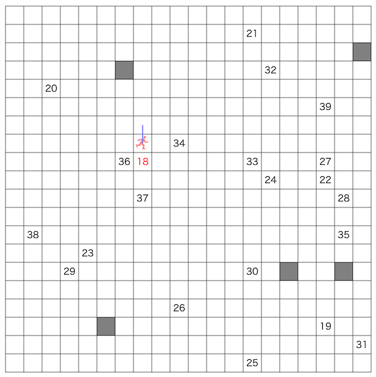

# BrainPadプログラミングコンテスト2025(AHC046)

- https://atcoder.jp/contests/ahc046

## 問題概要

- N \* N (N\=20)のマス目からなるスケートリンクがある
  - リンクの外側へは移動できない
- 初期位置から、順番に、与えられた目的マスに訪れるようにしたい
  - 初期位置を含め、全部でM(\=40)地点が与えられる
- 各ターンでは、以下の操作のいずれかを行える
  - 移動: 上下左右へ1マス移動する
  - 変更: 上下左右のマスにブロックを設置、または、ブロックを除去する
  - 滑走: ブロック、または、リンクの端にあたるまで滑走する
- できるだけ少ないターンになるような操作列を求めよ

## 時間

- 4 時間

## 個人的メモ

### 問題固有の性質

- 「滑走」を使うと長距離移動ができるので、できるだけ滑走を使ってターン数を減らしたい
- 「ブロックを設置」すると、滑走で滑りすぎないようにできるので、目的地までのターン数が減る可能性がある
  - ブロックの設置の仕方によっては、ブロックの除去なしでは目的地に辿り着けない配置になる可能性もある

### 最短経路の計算

- ブロックの追加・削除を考えない場合、ある時点での目的地への最短経路は、4方向に「移動」か「滑走」をするBFSで求められる
- 今回、ここにはいくつか高速化の余地があり、性能やアプローチの幅に影響する
  - 高速化については後述

### ブロック設置なしでの最適解

- ブロック設置を考えない場合は、順番に目的地へ最短経路を移動すれば、ブロック設置なしでの最適解が求まる
- 順位表での204,033点解

### ブロック設置について

- 今回は、「いつ、どこに設置すると良いか？」が考察で進めるのが難しく、さっさと探索する方向でアプローチを考えるのがよかった
- が、いくつかは改善に活かせる考察ができる

#### 設置のタイミング

- ブロックは基本的には早めに設置したほうが、活用できる機会は増える
  - 後半に設置しても、それを活用できる機会は少ない可能性
- 最初に設置してからスタートするのがいいか、経路をたどりながら近くを通ったときに置くのがいいかなど、あまりどのタイミングで置くのが良いかは判断しにくい
- 「目的地に到着したタイミング」は、必ずそのマスに止まっているはずなので、そのときに設置するなどはわかりやすいが、置ける位置が限られてしまう

#### 設置の仕方

- 「今いるマスの隣接マスに設置する」のが、設置のために1手増えるだけなので、効率が良い
  - 次の移動方向に設置してしまうと、移動の邪魔になる可能性もある
    - 同手数の迂回路がある場合は邪魔にはならない
- 「今いるマスに設置」とか「狙ったマスに設置」は、移動(避ける)→設置と2手かかってしまったり、狙ったマスのどの4近傍から置きに行くかなどが増えてややこしい
  - 「移動経路上に置く(移動後に後ろに置く)」とかは、置ける箇所がかなり限られてしまう問題もある

#### 設置場所、設置個数

- 一応、以下などは考えられそうだが、あまり明確に良し悪しはわからない
- 固定配置
  - 外壁付近へは「滑走」で一気に移動できる一方、盤面の真中付近へは「移動」で1マスずつ移動する必要があるため、中間や盤面中心あたりに配置したほうがよさそうに見える
  - ただ、盤面によって訪問点が異なり、使わない可能性のあるブロックをわざわざ移動経路から離れて置きに行くのは効率がよくない
- 目的地の付近
  - 目的地は必ずそのマスに止まるので、その周辺に設置するのはわかりやすいが、置ける箇所は限られてしまう
  - また、どちらかというと、将来訪問する目的地の付近にブロックを設置できる方がうれしい
- 連続した位置の配置
  - 隣り合うように配置した場合、どちらかだけでも、1手ずらせば使える可能性が高いので、あまりくっつく配置にならないほうが良い可能性がある
- 同じ行・同じ列に並ばないように配置
  - 滑走を連続して使うなら、ブロックが同じ行・列にない(ずれて配置されていた)方が良い可能性がある
- 設置個数
  - 滑走で止まれる位置が増えるのでブロックは多いほうがよさそうだが、設置にコスト(手数)がかかったり、滑走の邪魔になるので、そんなに配置はしないほうがよい可能性もある

#### ブロックの除去

- 一度設置したブロックを除去するのは、除去にも1手かかるので、できればほとんど除去しないほうがよさそうに思われる
- ブロックの配置によっては目的地に辿り着けない場合もあり得るので、そういう場合は除去は必要
  - 目的地のマスにブロックを置いていたり、周囲をブロックで囲ってしまっていたり、など

### アプローチ

#### 「これ以降ブロックを設置しない場合の最短手数」を評価値に貪欲/ビームサーチ/Chokudaiサーチ

- 現在の状態からの操作としては、ブロックの除去を考えない場合は、移動(4方向) + 滑走(4方向) + ブロックの設置(4方向) = 12通りがある
- それぞれの操作後の状態について、なんらかの評価値が得られる場合、ゲーム木探索が考えられる
  - 操作後の状態で一番よいものを選ぶ貪欲ができる
- 今回、「これ以降ブロックを設置しない場合の最短手数」を考えると、これはBFSで求められるので、これを評価関数として利用できる
- 前半に置きまくってしまったり、後からブロックの方が使われて前に置いたブロックが使われない、などが発生しうるため、設置数の制限や不要ブロックの除去、ビームサーチ化、BFSの同手数の別経路で試す、など改善の余地がある

#### 設置位置を局所探索

- ブロックの設置(したい)位置を決めて、移動中に設置できるときに設置する、というのを考えると、設置位置で局所探索ができる
  - BFSで最短経路を求めれば、各操作後に4近傍を確認して、置けるなら設置を追加すればよく、全体の手数が求められるので、これを評価値として使える
  - BFSでは同じ手数になる最短経路が複数でうると思われるので、できるだけ設置できる経路を選ぶほうが良さそう
- 置こうとしたけど置けなかった、置いたけど使われなかった、などは除去しておくのが結構重要っぽい
  - https://x.com/tomerun/status/1916121079212593458
- BFSの計算がボトルネックになるので、高速化は考える必要はある
  - 探索回数が稼げないので、複数回山登りとか、無駄な配置をしない、など重要そう

#### 中継地点を局所探索

- 各目的地に行くまでの途中に、中継地点として＜位置, 設置方向＞を入れて、「中継地点に移動→設置」するようにすると、局所探索できる
  - 「中継地点にブロックを置く」と考えてしまうと、どのタイミングで置くかや置いた後の動き、滑走時の処理、などややこしいので、中継地点に移動後、その4近傍のどこかに置く、とするのがよかった
- 中継地点への移動も同様にBFSできるので、最短経路で移動した場合の手数が求められ、評価値として使える
- 近傍
  - ブロック設置の追加・削除
  - ブロック設置位置の移動
  - 設置タイミングの入れ替え、変更、swap
  - など
- このアプローチの場合、他のブロック間の関連性や最後までの手数を見るので活用され具合が考慮されている
- こちらも、BFSの計算がボトルネックになるので、高速化は考える必要はある

#### 過去改変

- 最上位はこのアプローチが多かった模様
- ある地点にいるときに、「ここにブロックがあれば滑走が使えてよかったのに、、、」というのが考えられるので、過去改変したい気持ちになる
  - [ビームサーチ 過去改変](../Library/beam_search.md)
- 任意のマスでブロック挿入を考えると、そこまで行って設置して戻るなど過去改変操作がややこしそうに思われるが、「過去の経路で置けたマス、かつ、その後の経路で通ってないマス」に限定すると、そのようなマスはメモしておくことができ、過去改変操作もそのタイミングで設置操作を追加するだけでよい
  - 遅延配置
  - 移動(4方向) + 滑走(4方向) + 過去改変ブロック設置 (+ブロック削除)を1手として貪欲/ビームサーチができる
- 評価値はBFSでの最短手数以外にも、ブロック設置数(置いた数, 置ける数)、目的地までのマンハッタン距離/Astar、なども考慮できる

### BFSの高速化

#### 手数だけ必要な場合

- 評価関数として使う(手数だけわかればよい)場合、最終出力以外は経路復元は不要
- 山登りなどなら、現在手数よりも多くなる事がわかった時点で打ち切る

#### 滑走先の前計算/メモ化

- `slide_to[y][x][dir]:=停止位置`のような、(y,x)から方向dirに滑走したときの停止位置を前計算しておくと、BFSするときに滑走先をO(1)で求められる
- ブロックを設置した場合は、そのブロックの4方向に伸びるマスの値のみ影響があるので、差分更新ができる

#### ビットボード/ビット並列

- ビットボードを使うと、各地点における次の移動先をビット演算でまとめて並列計算できる
  - [ビットボード](../Library/bitboard.md)
- 「滑走」も、4方向について移動できなくなるまで動かすというのもビット演算可能で、移動は高々N回までなので、高速に求められる
  - 各行・各列をビット列で持って、clz(count leading zeros)/ctz(count tailing zeros)などでも

### その他

#### AI利用

- なんかAI(copilot, chatGPTなど)の出力が壊れた、使ってうまくいかなかった報告をよく見かけた気がする
  - https://x.com/tomerun/status/1916107591295635493

#### お絵かき

- https://x.com/moooaki/status/1916090324247843317

## 解説

(50位まで&発言を見つけられた方のみ)

- [AHCラジオ(解説放送)](https://www.youtube.com/watch?v=fBgj_QldWhY)
- [解説(日本語)](https://atcoder.jp/contests/ahc046/editorial)
- [解説(英語)](https://atcoder.jp/contests/ahc046/editorial?editorialLang=en)

- [writer解](https://x.com/wata_orz/status/1916071641928360178)
  - https://atcoder.jp/contests/ahc046/submissions/65212715

- [Rafbillさん](https://x.com/Rafbill_pc/status/1916075375798505963)
- [eijirouさん](https://x.com/eijirou_kyopro/status/1916107133743206494)
  - https://x.com/eijirou_kyopro/status/1916107346008543281
  - https://x.com/eijirou_kyopro/status/1916110894871843142
  - https://x.com/eijirou_kyopro/status/1916112124285489487
  - https://x.com/eijirou_kyopro/status/1916114180794683719
  - https://x.com/eijirou_kyopro/status/1916117165994086772
  - https://x.com/eijirou_kyopro/status/1916120401417277494
- [tishii24さん](https://x.com/tishii2479/status/1916079556018245742)
- [itigoさん](https://x.com/itigo_purokonn/status/1916070135141699991)
  - https://x.com/itigo_purokonn/status/1916071029585457422
  - https://x.com/itigo_purokonn/status/1916071652842197092
  - https://x.com/itigo_purokonn/status/1916075454387179535
  - https://x.com/itigo_purokonn/status/1916076084266959014
  - https://x.com/itigo_purokonn/status/1916077037967839258
  - https://x.com/itigo_purokonn/status/1916080448306090008
  - https://x.com/itigo_purokonn/status/1916080737079718087
  - https://x.com/itigo_purokonn/status/1916088818891165902
  - https://x.com/itigo_purokonn/status/1916091307488932300
  - https://x.com/itigo_purokonn/status/1916095235626815852
  - https://x.com/itigo_purokonn/status/1916113774848970935
  - https://x.com/itigo_purokonn/status/1917957633975455912
    - https://x.com/tomerun/status/1916121079212593458
- [Shun_PIさん](https://x.com/Shun___PI/status/1916069941834617275)
  - https://x.com/Shun___PI/status/1916070812903522428
  - https://x.com/Shun___PI/status/1916071288570790263
  - https://x.com/Shun___PI/status/1916072200496681458
  - https://x.com/Shun___PI/status/1916073983067492729
  - https://x.com/Shun___PI/status/1916079840094216610
- [Jinapettoさん](https://x.com/Jinapetto/status/1916070772898234471)
  - https://x.com/Jinapetto/status/1916071916252893529
  - https://x.com/Jinapetto/status/1916072957388197937
- [hitonanodeさん](https://x.com/rsat__m/status/1916089096918994955)
- [rhooさん](https://x.com/rho__o/status/1916070038228079099)
  - https://x.com/rho__o/status/1916070693869121990
- [neterukunさん](https://x.com/neterukun_cd/status/1916074276798751210)
  - https://x.com/itigo_purokonn/status/1916070135141699991
- [terry_u16さん](https://x.com/terry_u16/status/1916071651592311045)
  - https://x.com/terry_u16/status/1916073005815631926
  - https://x.com/terry_u16/status/1916074052164456850
    - https://x.com/tempuracpp/status/1916073869489934434
  - https://x.com/terry_u16/status/1916074543250289030
  - https://x.com/terry_u16/status/1916078932501401833
  - https://x.com/terry_u16/status/1916092936204521758
- [tempura0224さん](https://x.com/tempuracpp/status/1916071204596900283)
  - https://x.com/tempuracpp/status/1916071625029767376
  - https://x.com/tempuracpp/status/1916073869489934434
  - https://x.com/tempuracpp/status/1916082339043807465
- [MathGorillaさん](https://x.com/MathGorilla_cp/status/1916070366356627565)
  - https://x.com/MathGorilla_cp/status/1916074930212638940
  - https://x.com/MathGorilla_cp/status/1916080355687469082
  - https://x.com/MathGorilla_cp/status/1916084152316883244
  - https://x.com/MathGorilla_cp/status/1916096404248052082
- [sortAさん](https://x.com/Rac75116/status/1916072414439739702)
- [cologne1723さん](https://x.com/cologne1723/status/1916071823592329580)
- [ansainさん](https://x.com/titgenjB/status/1916088033465799061)
- [gasinさん](https://x.com/_gacin/status/1916070875750871520)
- [kotamanegiさん](https://x.com/small_onions/status/1916074903348121954)
- [tomerunさん](https://x.com/tomerun/status/1905221507854332334)
  - https://x.com/tomerun/status/1916071836510785955
  - https://x.com/tomerun/status/1916078993008103697
  - https://x.com/tomerun/status/1916079843583922309
  - https://x.com/tomerun/status/1916107591295635493
  - https://x.com/tomerun/status/1916121079212593458
- [takumi152さん](https://x.com/takumi152/status/1916071410440589769)
  - https://x.com/takumi152/status/1916072425642725631
  - https://x.com/takumi152/status/1916076275279794604
  - https://x.com/takumi152/status/1916081205218578695
  - https://x.com/takumi152/status/1916108744880230504
  - https://x.com/takumi152/status/1916141273922122225
  - https://x.com/takumi152/status/1917617326582817104
- [yunixさん](https://x.com/yunix91201367/status/1916081572497002938)
- [bin101さん](https://x.com/5bin101/status/1916074358038270025)
  - https://x.com/5bin101/status/1916078396020601006
- [yoichiroさん](https://x.com/ynishi2015/status/1916078387363516605)
  - https://www.wantedly.com/companies/learningbox/post_articles/972597
- [hari64さん](https://x.com/hari64boli64/status/1916076376370938160)
- [kawateaさん](https://x.com/kawatea03/status/1916071378765152662)
- [yokozuna57さん](https://x.com/yokozuna_57/status/1916070055701582344)
  - https://x.com/yokozuna_57/status/1916076549649911812
  - https://x.com/yokozuna_57/status/1916078009284730920
- [hirakuuuuさん](https://x.com/hirakuuuuuuu/status/1916074690181009436)
- [FplusFplusFさん](https://x.com/FplusFplusF____/status/1916071768395047048)
  - https://x.com/FplusFplusF____/status/1916073453159125449
  - https://x.com/FplusFplusF____/status/1916077308324286805
  - https://x.com/FplusFplusF____/status/1917546748786139165
  - https://x.com/FplusFplusF____/status/1917550366499168618
- [tute7627さん](https://x.com/tute7627/status/1916071116184957112)
  - https://x.com/tute7627/status/1916074042525946040
  - https://x.com/tute7627/status/1916077140384354485
- [mtsdさん](https://x.com/soiya_ksk/status/1916070223985447134)
  - https://x.com/soiya_ksk/status/1916072079021191409
  - https://x.com/soiya_ksk/status/1916072195199275105
  - https://x.com/soiya_ksk/status/1916072717163631027
  - https://x.com/soiya_ksk/status/1916073254294589922
  - https://x.com/soiya_ksk/status/1916075293917544509
  - https://x.com/soiya_ksk/status/1916079761501393287
- [merom686さん](https://x.com/merom686/status/1916072043650711973)
- [Piiiiiさん](https://x.com/AcPiiiii/status/1916072947435115010)
- [ninja7さん](https://x.com/ninja9973/status/1916070990301520036)
- [shindanninさん](https://x.com/nico_shindannin/status/1916072217013575803)
  - https://x.com/nico_shindannin/status/1916073396452135041
- [uta_cccさん](https://x.com/uta_cccc/status/1916072536602980697)
  - https://x.com/uta_cccc/status/1916071150242635842
  - https://x.com/uta_cccc/status/1916144256726798503
  - https://x.com/uta_cccc/status/1916156810370916546
  - https://utac.hateblo.jp/entry/2025/04/28/151927
- [kobae964さん](https://x.com/kobae964/status/1916072027104088489)

- 延長戦
  - https://x.com/sash277/status/1917913987687350576

## Links

- [twitter hashtag AHC046](https://x.com/hashtag/AHC046)

