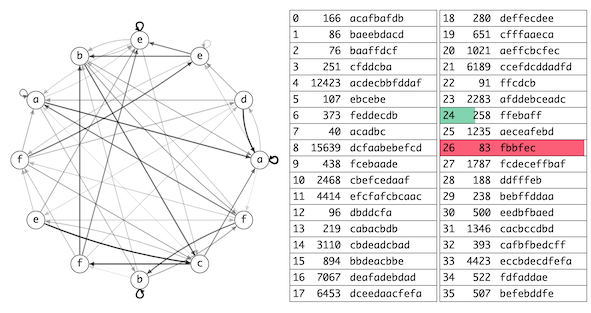

# トヨタ自動車プログラミングコンテスト2025#2(AHC047)

- https://atcoder.jp/contests/ahc047



## 問題概要

- N(\=36)個の文字列が与えられ、それぞれについて好ましさP_iが決まっている
  - 文字列はa〜fの6種類の文字で構成される
- M(\=12)個の状態とそれぞれの状態間の遷移確率を持つ生成モデルからL(\= 10^6 )文字分生成する
  - 各状態に文字が割り当てて、その状態から遷移確率によって次の状態に移り、その状態の文字を出力する、のを繰り返す
- 与えられる各文字列S_iについて、Lに1回以上出現する確率をQ_iとして、スコアはΣ_{i} Q_i \* P_i とする
- このスコアをできるだけ大きくなるよう、各状態の文字の割り当てC_iと、状態間の遷移確率行列Aを設計せよ
  - ただし、C_iはa〜fのいずれかの文字、Aの各要素は整数でパーセントを表し各行の合計は100である必要がある

## 時間

- 4 時間

## 個人的メモ

### 均等解

- 最初の考察用や初期解として、すべてを均等にした解で様子を見てみることができる
  - すべての文字を2文字ずつ使う(`aabbccddeeff`など)をCとして、遷移確率もすべて1/Mにする
    - 遷移確率は整数のみしか許されないので、あまり分を適当に振り分ける必要はある
- ビジュアライザを見てみると、長さに応じて確率Q_iも何段階かに分かれていることが確認できるが、P_iが大きい文字列は拾えていないことが確認できる
- 入力生成的には、長い文字列ほどP_iが高い可能性があるので、どうしたらP_iが高い長い文字列の確率をあげれるか？が問題になる
  - 短い文字列はP_iが低く、たくさん拾っても、長い文字列1個を拾うよりもP_iが出ないので、「長い文字列をできるだけ入れる＆短いのも拾えたら拾う」ようなところが目指したいところと考えられる

#### ビジュアライザの確率の色に注目する

- (解説放送)
- 均等解をビジュアライザに投げると、7文字以下なら赤(1.0付近)、8文字なら緑(0.4付近)、9文字なら青(0.1付近)、10文字以上はほぼ0に分かれている
- 均等解だと、ある文字xからある文字yへの遷移確率はすべて1 / 6になるので、長さlの文字列は(1 / 6)^lの確率で出現する
  - l=7のとき、3.57\*10^{-6}
  - l=8のとき、5.95\*10^{-7}
  - l=9のとき、9.92\*10^{-8}
  - l=10のとき、1.65\*10^{-8}
- 長さL(\= 10^6 )文字を生成するので、だいたい10^6回ぐらいのチャンスがあり、文字列ができるかが上記の確率でできると考えると、感覚がわかる
  - ある程度調整すれば、10^{-6}代の確率にはあげれそうか？、的な気持ちにはなれる(直感が働きやすい)
- より正確には、「1回以上出現する確率」は、1 - 「1回もでない確率」でわかるので、1回もでない確率\=(1-上記の確率)^{回数}から求められる

#### 1番大きなP_iの文字列のみ狙う解

- ちなみに、文字列は12文字以下なので、「Cをその文字列にして、次の状態への遷移確率のみ1にする」ようにすることが常に可能
  - 2,043,554点解
  - ビジュアライザだと、サイクルにするみたいな感じ
- これを初期解として、他の遷移確率を多少上げて別の文字列を拾いに行く、とかも考えられる
- (ちなみに、`abcdef`の6状態だけ使ってできないか？とやってみると、意外とうまくいったりすることがわかり、残りの6状態で2番目に大きい文字列を作って、適当に両方に遷移できるようにすると、上位2個ぐらいは埋め込めそうなことがわかる)

### スコア計算

- スコア計算をするために確率の計算が必要だが、「Lに1回以上出現する〜」など、ややめんどくさい
- ジャッジ/テスターのコードを持ってくる・流用するのが定石だったりするが、厳密に計算しており、結構計算が重く、制限時間2秒だと100回ぐらいの評価しかできない
  - 局所改善(山登りや焼きなまし)するのは厳しい
- 一応、コードの改善で多少の高速化はできるが、そこそこ大きな行列の累乗を計算する部分が重いため、この計算方針では限界がある
  - 高速化は最後にするというのも定石ではあるので、他の考察を優先しようとしたり局所改善系のアプローチを保留すると、結構厳しいことになる・・・

#### ライブラリによる行列計算高速化

- テスターのコード(lib.rs)では、「各文字列について、文字列の位置とモデルの状態のペアを状態として、行列計算」をしていて、その中の行列の掛け算や累乗(`Y=X^(L-1)`)は自前で用意していてボトルネックになっている
- 行列計算は高速なライブラリを使うと改善できる可能性があり、C++だとEigenなどが利用できる
- 解説放送では2500回ぐらいといっていたけど、自分だとAIでEigen::Denseに置き換えてもらったりしたぐらいだと数百回ぐらいだった・・・(べき乗はないので、繰り返し二乗法のまま)
- 多少増えるとはいえ、これでも局所改善にはまだ厳しい

#### 別の確率計算に変更

- 単純に、「文字列sが、このモデルで生成される確率」は、遷移確率Aが与えられたら高速に求めることができる
  - あるモデルの状態xからスタートして、文字列sでの次の文字の状態に移動する感じで、確率を求められる
  - 状態xにいる確率は、(マルコフ連鎖の)定常状態でわかるので、連立方程式(ガウスの消去法)だったり数回のシミュレーションなどで求められる
    - [AHC044](./ahc044.md)
- この確率がわかると、`「1回以上出現する確率」 \= 1 - (1回もでない確率) \= 1 - (1-生成確率)^(L-文字列長)` で求められる
  - 遷移確率によっては、状態xに移動できない(非連結)とか、1回しか訪れないとかもあり得るので、厳密にならない可能性もありえるが、おおよそ問題ない
- この方法で計算した場合、テスターコードよりもかなり高速にスコア計算でき、十万回以上(数十万回)は回せるようになる
  - P_iが小さいのは取れてなくてもあまり意味ないので、P_iが大きい上位何個かだけで計算、とかするとスコアのズレを抑えつつより高速化できる
  - (何回ぐらい実行できるかは実装方法で結構変わるかも)
- (解説放送)ここらへんをAIに任せようとすると、変な近似方法を返す可能性もあり、うまい方法をしてくれるかはガチャ感あるかも
  - 提案してきたものがいまいちでも、それに対して「もっと高速化して」など追求するとよかった可能性

### 各状態の文字の割り当てC_i

- モデルの各状態の文字の割り当てC_iは、おおよそ「各文字を2文字ずつ使う」人が多かった
  - `aabbccddeeff`型と`abcdefabcdef`型の人がいた
- 調整すると良い場合はありそうだが、基本的には「2文字ずつ使う」固定でも十分だった模様
  - ランダムに文字を選ぶため、偏りがあまりない
  - (解説放送)ある文字が1文字しかない場合、その文字が出現したらその状態に集中してしまうので、2文字を3文字にするメリットよりも、2文字が1文字に減ってしまうデメリットが大きい

#### 2文字ずつの場合の遷移状態

- (解説放送)
- 文字列sのスコア計算を考えるとき、2文字ずつ割り当てる場合は、各文字について2状態あることになる
  - 同じ文字が文字列中に出現しうるので遷移確率は共通にはなる

```
(イメージ: oはモデルの頂点、-は遷移確率)

a   f   e   ...

o - o - o - ...
  x   x   x
o - o - o - ...
```

- 2状態から次の2状態へは4本の遷移確率が利用できるが、出現確率的には、最後の状態のところの和が十分大きければ良く、極端には、上側の状態の横の遷移確率のところだけを使う(集中させる)ようにできるなら、それでも問題ない
- 文字列について、上記でのパス(どっちの状態を使うか)を決めるような感じで考えられると、埋め込み解への方針につながる
  - (自分は、上記というよりかは、ビジュアライザで見てPが大きい文字列の通る遷移のところが太くなってほしいなぁ、経路のところを上げてそれ以外を下げたい、のイメージだった)
- (`aAbBcCdDeEfF`みたいに分けると、`adec`という文字列の、パスは`aDEc`とかで表現できる、とかで考えることも)
  - https://atcoder.jp/contests/ahc047/editorial/13099

### アプローチ

#### 遷移確率を局所改善

- 高速なスコア計算ができる場合、遷移確率を少し変化させる局所改善アプローチ(山登り、焼きなまし)が取れる
- ただし、均等解などからスタートして、遷移確率を少しいじるだけの近傍では、P_iの大きな長い文字列がほとんど拾えず、あまりスコアがでない
- 最上位には、この長い文字列をどう取りに行くか？がポイントだった模様
  - 初期解やスコア計算、近傍などを工夫する
  - (解説放送)
  - ある文字列の出現確率は、遷移確率の掛け算の形(p_1\*p_2\*p_3\*...)になっている
  - この中の1つを変化させるだけの近傍だと、極端な場合、上記の遷移確率の全部が0だったら、全部を変化させないと出現確率が0より大きくならない(一つでも0があると全体も0)
  - また、全部が0でないとしても、1つの変化では、最大でも100倍(1->100にする)の変化しかさせられないので、出現確率を大きく変化させるのが結構難しい
  - ここをどう対処するかは、いろいろ考えられる
    - スコア計算をいじるか、まとめて変化させる近傍を用意するか、など
- 近傍
  - ある状態からの遷移について、「xへの確率」から「yへの確率」にΔだけ移動する
    - `A[i][x] -= Δ`かつ`A[i][y] += Δ`
    - Δは、1や、0以上「Xへの確率」以下の値、など 
  - Pが大きい文字列が通るパス上の確率をまとめて上げる
- スコア計算
  - 生スコア、近似スコア
  - 時間とともに変化させる
  - スコアを〜乗する(0.38乗)、対数にする

#### 文字列(パス)を埋め込む

- ↑の「2文字ずつの場合の遷移状態」のところでの考察のように、出現させたい文字列のパス(経路)の確率が高くなるようにしたい
  - 2文字ずつの場合は2状態ずつあるので、次はどちらを選ぶか？の部分で最適化要素がある
- 各文字列について、各状態でどっちの状態を選ぶか？を決めると、適当な重みを加算するとか通過回数などを求めて調整して遷移確率Aが決められ、スコアも求められるので、パスの局所改善できる
- これを初期解として、上位の遷移確率の局所改善をするとかなり強くなる
- また、どの文字列を埋め込むか？を、Pが大きい方から選んで入れられるかを試す貪欲・ビームサーチもでき、かなり強い(wataさん解)
  - https://atcoder.jp/contests/ahc047/submissions/65955752
  - 選び方は各文字列について2^12 (\=4096)通りで、スコア計算が十分高速なら、一番よいスコアの経路を採用するとかも

### その他

#### 繰り返しがある文字列

- 「bcbc」など繰り返しがある文字列の場合、前の状態に戻る遷移が1本あるだけで生成されるので、若干生成されやすいかもしれない

#### 各状態から出る遷移数を絞る

- 均等解から、あるモデルの状態xからの遷移を3本だけにする、とかすると、それらの遷移の確率は1 / 3になって1 / 6よりは大きくなるが、遷移の選び方に自由度がでる
- ここらへんからの考察とかも考えられる

#### スコア最大値の見積もり

- 一番大きいやつ1つは入れられるが、大きい方から何個ぐらい入れられるかが不明で、結構見積もりが難しい
- 順位表だと、1ケース40000点ぐらいは取れてそうなことはわかるので、大きい方から4〜5個分は入れられてそうなのはわかるが、大きいの1つなのか、中くらいの2つなのかなどはわからいので、どういう文字列の取り方になっているかはよくわからない

#### 本番21位に研究目的のアカウント

- AI系かは不明だが、普通に強い
- (レートには反映されてないけど、順位には反映されているみたい)

## 解説

(50位まで&発言を見つけられた方のみ)

- [AHCラジオ(解説放送)](https://www.youtube.com/live/5P1AoziVlJM)
- [解説(日本語)](https://atcoder.jp/contests/ahc047/editorial)
- [解説(英語)](https://atcoder.jp/contests/ahc047/editorial?editorialLang=en)

- [writer解](https://x.com/chokudai/status/1924105037799952844)
  - https://x.com/chokudai/status/1924107052374483362
  - https://x.com/chokudai/status/1924106627822789057
  - https://x.com/chokudai/status/1924102768379494449
  - https://x.com/chokudai/status/1926998442233971043
  - https://atcoder.jp/contests/ahc047/submissions/65960870
- [wataさん解](https://x.com/wata_orz/status/1924105561458782471)
  - https://atcoder.jp/contests/ahc047/submissions/65955752

- [itigoさん](https://x.com/itigo_purokonn/status/1924103828028485890)
  - https://x.com/itigo_purokonn/status/1924105449315696933
  - https://x.com/itigo_purokonn/status/1924105643096768721
  - https://x.com/itigo_purokonn/status/1924109786725195813
  - https://x.com/itigo_purokonn/status/1924113418929471769
  - https://x.com/itigo_purokonn/status/1924115177156555020
  - https://x.com/itigo_purokonn/status/1924310544699605014
  - https://x.com/itigo_purokonn/status/1924417747611767198
  - https://x.com/itigo_purokonn/status/1924452613720043711
- [Moegiさん](https://x.com/mih28731325/status/1924106858689917276)
  - https://x.com/mih28731325/status/1924108101692825898
  - https://x.com/mih28731325/status/1924108489796026375
  - https://x.com/mih28731325/status/1924109852043092026
  - https://x.com/mih28731325/status/1924111099659723130
  - https://x.com/mih28731325/status/1924116219755659462
  - https://x.com/mih28731325/status/1924135713240731673
  - https://x.com/mih28731325/status/1924109337800356007
  - https://atcoder.jp/contests/ahc047/editorial/13096
- [toamさん](https://x.com/torii_kyopro/status/1924069166287597839)
  - https://x.com/torii_kyopro/status/1924079103344529504
  - https://x.com/torii_kyopro/status/1924103403191648424
  - https://x.com/torii_kyopro/status/1924103700378996749
  - https://x.com/torii_kyopro/status/1924104175945916680
  - https://x.com/torii_kyopro/status/1924105433335353612
  - https://x.com/torii_kyopro/status/1924107930078748883
  - https://x.com/torii_kyopro/status/1924108973818691720
  - https://x.com/torii_kyopro/status/1924116880882864626
  - https://x.com/torii_kyopro/status/1924467560252391494
  - https://x.com/torii_kyopro/status/1925359493959098536
  - https://x.com/torii_kyopro/status/1925363170618769759
  - https://x.com/torii_kyopro/status/1925524134861447360
  - https://atcoder.jp/contests/ahc047/editorial/13099
- [E869120さん](https://x.com/e869120/status/1924105112873750565)
  - https://x.com/e869120/status/1924106821071208710
- [terry_u16さん](https://x.com/terry_u16/status/1924105062672159223)
  - https://x.com/terry_u16/status/1924109157709599078
  - https://x.com/terry_u16/status/1924111791485018121
  - https://x.com/terry_u16/status/1924112428599828639
  - https://x.com/terry_u16/status/1924115980290310604
  - https://x.com/terry_u16/status/1925529537984831886
  - https://x.com/terry_u16/status/1925542095814894024
  - https://www.terry-u16.net/entry/ahc047
- [Shun_PIさん](https://x.com/Shun___PI/status/1924104038184096140)
  - https://x.com/Shun___PI/status/1924104373510324622
  - https://x.com/Shun___PI/status/1924107051078418931
  - https://x.com/Shun___PI/status/1924110560070971418
  - https://x.com/Shun___PI/status/1924124497462034455
    - https://x.com/tempuracpp/status/1924121529878753735
  - https://x.com/Shun___PI/status/1924132801378738223
  - https://x.com/Shun___PI/status/1924134040443183538
- [takumi152さん](https://x.com/takumi152/status/1924105856117031075)
  - https://x.com/takumi152/status/1924114644173778978
  - https://x.com/takumi152/status/1924134039868604730
  - https://x.com/takumi152/status/1924134885461229962
- [Gearさん](https://x.com/oreha_senpai/status/1924104536538611773)
  - https://x.com/oreha_senpai/status/1924108093438443621
  - https://x.com/oreha_senpai/status/1924125225131917540
- [yosupoさん](https://x.com/yosupot/status/1924107037379907951)
- [yunixさん](https://x.com/yunix91201367/status/1924103083212275856)
  - https://x.com/yunix91201367/status/1924104314760667651
  - https://x.com/yunix91201367/status/1924112034544968115
- [rhooさん](https://x.com/rho__o/status/1924104495275131058)
  - https://x.com/rho__o/status/1924105261750599993
  - https://x.com/rho__o/status/1924307138203258951
  - https://x.com/rho__o/status/1924307306235507115
- [tempura0224さん](https://x.com/tempuracpp/status/1924115184668586049)
  - https://x.com/tempuracpp/status/1924119987977109642
- [yochanさん](https://x.com/yochan_tech/status/1924106236175466791)
- [potato167さん](https://x.com/potato167_long/status/1924295966775214145)
- [square1001さん](https://x.com/square10011/status/1924111403218280717)
- [physics0523さん](https://x.com/butsurizuki/status/1924103542111178911)
  - https://x.com/butsurizuki/status/1924106720093389036
  - https://x.com/butsurizuki/status/1924110322404909231
- [jin_matakichさん](https://x.com/37kt_kyopro/status/1924102827544396096)
  - https://x.com/37kt_kyopro/status/1924103585249575215
  - https://37kt.hateblo.jp/entry/2025/05/23/105903
- [syndromeさん](https://x.com/syndro_6/status/1924110324787277872)
- [Ang107さん](https://x.com/Ang_kyopro/status/1924103303878803526)
- [nurupo0723さん](https://x.com/nurupo1530/status/1924104278257619359)
- [urectancさん](https://x.com/urectanc/status/1924107256007893105)
- [milkcoffeeさん](https://x.com/milkcoffeen/status/1924105077817774551)
- [colunさん](https://x.com/colun/status/1924103597534707939)
  - https://x.com/colun/status/1924120943036960872
- [ymatsuxさん](https://x.com/ymatsux_ac/status/1924104031456419932)
  - https://x.com/ymatsux_ac/status/1924105698486718562
  - https://x.com/ymatsux_ac/status/1924107369786777676
- [kenchoさん](https://x.com/border_of_ymg/status/1924109159060119932)
- [mtmr_s1さん](https://x.com/mtmr_s1/status/1924106024765796390)
  - https://x.com/mtmr_s1/status/1924112226014949849
- [yuuDotさん](https://x.com/yuuDot_kyopro/status/1924105126790492251)
  - https://x.com/yuuDot_kyopro/status/1924113717404533081
  - https://x.com/yuuDot_kyopro/status/1924463728051007498
  - https://yuudot.hatenablog.com/entry/2025/05/21/201125
- [wanuiさん](https://x.com/gmeriaog/status/1924108308509769759)
  - https://x.com/gmeriaog/status/1924109292090818845
- [olpheさん](https://x.com/_olphe/status/1924120286544474211)
  - https://x.com/_olphe/status/1924119683126694125
  - https://x.com/_olphe/status/1924124272634794443
  - https://x.com/_olphe/status/1924130771322982793
    - https://x.com/celestial_dater/status/1924103336871235658
  - https://x.com/_olphe/status/1924415980836717022
- [miiitomiさん](https://x.com/miiitomi/status/1924108901596975314)
  - https://x.com/miiitomi/status/1926314344226185587


## Links

- [twitter hashtag AHC047](https://x.com/hashtag/AHC047)


