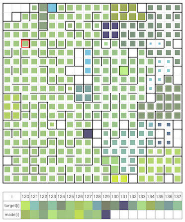
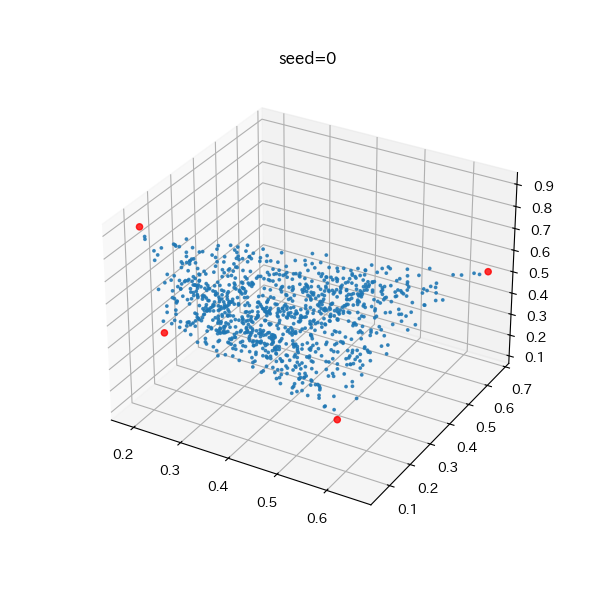
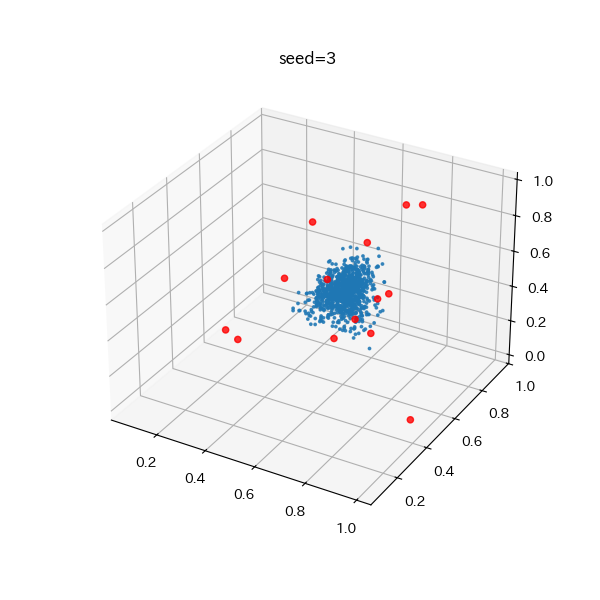

# MC Digitalプログラミングコンテスト2025(AHC048)

[TOC]



## 問題概要

- https://atcoder.jp/contests/ahc048
- K(=4〜20)種類の絵の具をN\*N(=20\*20)マスのパレットを使って混ぜ合わせて、与えられたH(=1000)種類の目的色を順番に作りたい
- 絵の具は(C,M,Y)で表現される
- パレットのマスは、仕切りによって区切ることができ、仕切りによって区切られた各領域は「ウェル」と呼ぶ
- 最初に仕切りの状態を指定したうえで、以下の操作を最大T(\=4000〜64000)回行える
  - 追加: 絵の具iを1グラム指定のマスに出す
    - そのマスが属するウェルに色が追加され、割合に応じた色になる
    - ただし、ウェルのサイズ以上には入れられず、超える分は破棄される
  - 渡す: 指定したマスの属するウェルから1グラム取り出して渡す
    - 渡された色は目的色と比較される
    - ウェルにある絵の具が1グラム未満のウェルは選択できない
  - 廃棄: 指定のマスの属するウェルから1グラム廃棄する
    - ただし、1グラム未満の場合は、ウェル内のすべての絵の具を廃棄する
  - 仕切りの出し入れ: 隣接する2マスを選び、その間の仕切りを出し入れする
    - 2つのウェルが合併される場合は、量は2つの和になり、各サイズに応じた割合で色が混ざって1色に合成される
    - ウェルが2つに分割される場合は、色は変わらず、量はそのサイズに応じた割合で分割される
- 以下のスコアをできるだけ最小化するような操作列を求めよ
  - スコア = $1+D*(V-H)+round(10^4*E)$
    - D: 絵の具を出すコスト(10〜10000)
    - V: 絵の具を出した回数
    - E: 渡された色と目的色の誤差(距離)の合計

## 時間

- 240 時間

## 個人的メモ

- 「パレットをどう使うか」と「仕切り操作」が重要だったかも

### 問題固有の性質

- パレットの使い方の自由度が高い
  - どういうウェルの形にするかや、仕切りの出し入れなどのタイミングなど、いろいろ考えられる要素がある
- 仕切りの出し入れと廃棄は、(操作回数合計の制約だけで)、ノーコストで行える
  - 特に、仕切りを変えられる効果が大きい問題だったので、仕切り操作を活用する方針を考える必要があった
- 操作回数Tの制約の幅が広い
  - 追加操作と渡す操作を除くと、1ターン平均で2回〜64回操作ができるが、やれることがだいぶ異なる
- 絵の具を出すコストDの幅も広い
  - Dが小さければ追加絵の具で調整できるが、Dが大きいと誤差の削減よりも追加コストのほうが大きくなるため、追加絵の具なしで調整する必要がある
- サイズがsのウェルにはsグラムしか入れられない
  - 色を混ぜ合わせるためには1\*1ではだめで、サイズ2以上でないといけない
- 計算時間が結構厳しい
  - 制限時間は3秒だったが、Hが1000もあるので、1ケースあたり最大でも3msぐらいしか計算できない
  - 仕切りの数や位置、絵の具の種類Kやその組み合わせなど、いろいろ探索しようとすると、時間が足りない可能性がある

### 3次元空間で考える

- 必ずしも3次元空間で考える必要性はないが、一部は考えやすくなったかも

#### 色

- 色はC,M,Yの3次元なので、3次元空間(CMY色空間)の点として考えられる
- 出力色は絵の具の重み付き和になっており、絵の具の色の点の凸包内に配置される
  - 制約的に、凸包の外側の点は作れない

#### ウェル

- ウェルは、色と容量があるが、これを3次元の質点として考えると、色の合成は質点の重心移動として考えることができる
  - 色を1つ混ぜたときは、その方向に移動することになる
  - ただし、ウェルには容量の上限があるので注意が必要
- 合成以外も、操作によるウェルの変化は、3次元の質点の位置と大きさの変化と考えられる

### スコア関連

#### スコアの構造

- スコアは「追加絵の具のコスト」と「出力色との誤差」で構成されている
- 追加絵の具のコスト
  - H回は絶対追加する必要があるが、H回なら0
  - それ以上に追加した分についてコストがDずつかかる
- 出力色との誤差
  - 誤差の合計Eの10000倍になっている
  - なので、Dに応じて、1グラム絵の具を多く使うことで、誤差の合計がD/10000より減るなら使ったほうがよい

#### 捨てる/あふれるを1回でもしてしまうと、絵の具の追加コストが0にできない

- 「捨てる」や「あふれる(ウェルサイズを超えて入れる)」が1回でもあると、渡せる総量がH未満になってしまうので、追加絵の具が必要となり、V-H>0で、追加コストが発生してしまう
- 今回、Tが大きいケースではEがかなり小さいところまでいけたため、ベスト解近くを目指すなら、追加絵の具を使わずになんとかする方法まで考える必要があったらしい

### 出力色関連

#### 入力の生成方法、出力色の偏り



- 出力色は、K種類の絵の具の重み付き和として表されており、重みは「x_k = -ln rand_double(0,1)」で生成して正規化している
  - この式は、逆関数法での指数乱数生成の式
- 3次元の異なる4点を考えると、その内部の任意の点は、4点の重み付き和(ただし各重みが0〜1で、重みの合計が1)で表現することができる(凸結合)
  - バリセントリック座標、重心座標
- この重みがDirichlet分布Dir(1,1,1,1)に従う場合は四面体内部に一様に分布するが、これは指数乱数を4つ生成して正規化することで生成できる
- ただ、今回は、K>=4で、Kが大きいほど結構中心付近？にかたまりができやすかった模様
  - 正規化前の重みx_iの期待値が1で正規化で1/NぐらいになるのでNが多いほど中心に近づく感じ？
    - 凸包の点だけから作るとかでは一様にはならなそう
  - 出力色を見て似たような色が多いと気づくか、3次元プロットとかしないと、凸包内で均等に散っているイメージを持ってしまうかも

#### 出力色の割合の推定

- 出力色の割合を推定したい場合、等式制約付きの非負値最小二乗問題(Non-negative least squares, NNLS)として考えられる
  - AIなどに聞くと、active-set法などで求められるよ、と言われる
- ただ、実際に推定をしてみると、Kが大きい場合でも4つ程度の重みの和だけで表現できることが多いことがわかる
- これは、カラテオドリの定理から、高々d+1個の点の凸結合として表現できるため
  - d=3なので高々4つの点の重み付き和
  - 3点の平面上や2点間の線分上とかの場合は減る
  - https://ja.wikipedia.org/wiki/%E3%82%AB%E3%83%A9%E3%83%86%E3%82%AA%E3%83%89%E3%83%AA%E3%81%AE%E5%AE%9A%E7%90%86_(%E5%87%B8%E5%8C%85)
  - https://manabitimes.jp/math/1216
- 目的の点を含む4点(四面体)を考えると、各重みは連立方程式で求められる
  - 重みベクトルwは4点の座標を縦に並べた行列をAとして、p_target = A \* wのようにかけるので、前からA^{-1}をかけて、w = A^{-1} \* p_target
  - 行列式の絶対値が0ならダメで、それで四面体内にあるか判定もできるので、これで内部になるような4点を見つけて連立方程式を解くでもよい
- 注意として、「ある1つの色は、ある4つの絵の具の重み付き和で表現できる」であって、全部の出力色が特定の4つの絵の具の重み付き和で表現できるわけではない
  - とはいえ、全部の絵の具が必要かというと、凸包内部の点は不要なので、凸包の点だけにすれば減らせる
  - さらに、K種類の絵の具から順番に「その絵の具を削っても全部の色を表現できる」なら削る、などすると、使う絵の具の種類をもっと減らせる可能性がある(解説放送)
- 使う色が減ると、なんとなく組み合わせが減って不利っぽく見えるが、アプローチによっては1色あたりのウェルサイズを増やせる利点もある

### アプローチ

- 今回は、Tによって強いアプローチが異なっていて(というか別ゲー状態)、上位でも違っていたので、相対スコアが上位でも低めだったりしていた
  - 詳細順位表のbestが結構散っている
- 上位解法の出力は、解説放送で鑑賞会がされていたのでそちらを参照
  - それぞれでのトップの解法は、詳細順位表でみて、best解が取れている方の解法を見に行くのと良い

#### 仕切りを変化させない解法

- 考えやすいという理由で、「追加」と「渡す」だけできる場合で考える
- 一番単純なのは、「絵の具0を1グラム出して、それを渡す」や「一番出力色に近い絵の具を1グラムを出して、それを渡す」を繰り返す方法
  - 順位表でも同じ点数が並んでいたのが確認できる(提出しなくても、大体のスコアが推測しやすかったかも)
- 発展として、2種類混ぜた場合を考えて「1x2マスを用意して、一番近づく2つの色を混ぜてそれを渡す」、種類数を増やす、などが考えられる
- 仕切り変化なしだとかなり厳しいが、それでもうまく評価関数や調整をすることでスコア取れている方はいた模様
  - https://note.com/shira_111/n/n9cefa5c9a158

#### 同系色でグループ(クラスタ)に分ける方針

- ウェルにある程度入っている状態で絵の具を混ぜた場合、追加した絵の具の影響が微小になるので、「同系色でグループ(クラスタ)を作って、それぞれを独立に調整する」というアプローチは考えられる
- しかし、クラスタごとのウェルを別々に用意して独立にすると、各クラスタで使えるウェルが1つになってしまったり、ウェルサイズも小さくなってしまい細かい調整がしにくくなってしまうなど、良い方針ではなかった

#### たくさんのウェルを用意する方針

- Tが小さい時は、こちらの方針が強かった模様
  - 「仕切りを変化させない解法」の発展型
- パレットにたくさんのウェルを用意して、絵の具の追加や隣接ウェルとの合成をすることで目的の色を作り、そこから取り出す
- 基本形として、例えば、固定配置でサイズ4(1\*4とか2\*2とか)のウェルをたくさん用意して敷き詰める感じ
  - サイズ4なら100ウェルできる
- 現在のパレットの状態に対して、貪欲やビームサーチなどで一番良くなる操作列を見つけて採用する方針

##### ウェルの合成(マージ)の効果

- 絵の具の追加だけの場合、K種類しかないため、K方向にしか色を変化させられない
- ウェル間の合成をする場合、K種類の絵の具の組み合わせしたウェルとの合成なら、K方向ではない方向に変化させられる
  - たくさんウェルを用意できると、変化させられる方向が増加する
  - また、だいたい似た色の合成だと、その変化量も小さくなるため、微調整できる可能性がある
- 固定配置系の場合
  - 近くのウェルを複数(〜4個とかまで)合成することを考えると、仕切りの上げ下げの仕方にバリエーションがあり、絵の具の追加の場所やタイミングも変えると、作れる色が増える
    - ただし、探索量が増える
- 仕切り位置可変系の場合
  - 仕切りの位置をいろいろ変えたり操作順を変えることでいろんな色を作り出せる

##### ウェルの配置、形状

- 固定配置
  - 単純には、1\*4や2\*2のウェルを敷き詰めて、ウェルの境界の仕切りのみ操作可能にする感じ
    - ウェル形状は、Iミノ、Oミノ以外にも、Zミノや仕切りを増やして「コ型」にする、なども
    - 隣接ウェルを増やすために、配置をズラしたり(ハニカムっぽい感じ)などもできる
      - 2\*2の場合、そのまま敷き詰めると上下左右だけだが、奇数列だけ1つずらすと、6個のウェルを隣接させることができる
  - 隣接のウェルと合成した後は、仕切りを元に戻してウェルの形状は固定にするか(形状固定)、元に戻さず必要があれば仕切りを上げる(形状可変)、など
- 不定形
  - すべての仕切りを操作可能として、不定形にしても行けた模様
- 仕切り位置可変
  - 1\*L(L<=N)を1単位として、その内部の仕切りのみ可変にする
- 一本道
  - 仕切り位置可変の最大長で、1\*(N^2)の一本道として考えて、その間に仕切りを入れる
    - パレットへの埋め込みは、蛇腹状なり渦巻き状なりにすれば簡単にできる
  - 埋め込んだ後に、一本道の前後以外に隣接するウェルに対しても仕切り操作可能にするのもできる
- 隣接ウェルが多いほど1回の仕切り操作で分離/合成ができる数が増えるのでそういう配置を考えたいが、(ウェルサイズをバラバラにしたとしても)配置は平面グラフになるので、平面グラフの性質で辺の数は「e<=3v-6」なので、(辺は双方向化して考えると)、ウェルあたり平均6隣接もいけない

#### 各絵の具のタンクを用意して、必要な量を出して混ぜ合わせる解法(分数解法)

(インクジェットプリンタみたいなイメージ？)

```
+----------+--+
|          |  |
+----------+  |
|          |  |
+----------+  |
|          |  |
+----------+  |
.          .  .
.          .  .
+----------+--+
```

- (解説放送)
  - Tが大きいとき、この方針が強すぎで、ベスト解がかなり小さくなっていて、他の方針だとほとんど相対スコアの点数取れてなかったかも
- 基本形として、上記のような仕切りを考える
  - 左側の1\*(N-1)のウェルは、絵の具のタンクとして使う
  - 右側のN\*1のウェルは、混ぜ合わせる領域として使う
- タンクのウェルにはK種類の絵の具をそれぞれ1種類のみ入れ、仕切りをうまく調整することで必要な分を切り出して、右側の混ぜる領域に入れることができる
  - たとえば、以下のように仕切りを動かすと、"少し"だけを右側に混ぜることができる

```
+----------+
|. . . . . |
+----------+

↓

+----------+
|. . .|. . |
+----------+

↓

+----------+
|. . .|
+----------+
```

- 出力色は4色の混ぜ合わせで、割合は計算できる(「出力色の割合の推定」)ので、それに一番近づくように切り出して上げれば良い
  - 焼きなましなどでも
- タンクに絵の具が足りなくなった場合は追加する
- 渡した後にあまりが出るときは、捨てるのがわかりやすい
  - が、1度でも捨てるとDのコストが発生してしまう

##### 切り出し方

- 1\*Lのウェルを、上記のように区切ると、ウェル内の絵の具の容量の1/L単位で切り出して使うことができる
  - 1つの出力色を作るのに、絵の具の追加が平均1手\+渡すのに1手\+絵の具が足りないときに追加前に一番右の仕切りを戻すのに平均2手\+絵の具の調整に仕切りを2手\*4色分、とすると約12手かかる
    - (どんどん仕切りが左に寄っていく感じ)
  - H色なので、だいたいT>=12000のときに適用できる
- もっと手数を使える場合は、さらに仕切りを入れると、より細かい単位で切り出すことができる
  - 積型(q/p\*s/r)
    - 短くなっている一番右の仕切りを"拡張"するように動かしてから、同様に仕切りを入れて取り出すと、仕切りの操作に4手かかっているが、仕切りの位置の組み合わせのバリエーションが増えて1/L^2程度の単位で取り出せる
    - 似たような感じで繰り返すとより2手ずつより細かい単位(k次精度)での調整ができる
  - 和型(q/p\+s/r)
    - 仕切った後で、左側を同様に2回ぐらい仕切って合わせるような和型(q/p\+s/r)みたいな形でも細かい調整ができるが、手数が上記よりかかる
    - 両側から取り出せるようにする
      - https://www.terry-u16.net/entry/ahc048
  - など

##### 混ぜ合わせ領域を減らす

- 上の基本形だと右側にN\*1確保しているが、作る絵の具はほぼ1グラムなので、こんなに大きくなくて良い(1〜2程度あれば十分)
- パレットのどこか(中央付近とか)に小さな混ぜ場を用意して放射状にウェルを伸ばす感じの配置を、手で作ったり焼きなましなどで見つけて(使う絵の具の種類数ごとに求めて)埋め込んでおくとよい

##### ちょうどよく終わらせる

- 一番最後の出力色は、追加の絵の具を考えない場合は、パレットに残ったやつを組み合わせてつくることになるため、適当にやると、誤差が大きくなる可能性がある
- 残り数ターンは、残る絵の具が最後の目的色と合うように調整してあげると誤差を減らせる

### その他

#### KD木/8分木

- 絵の具の追加のみで作れる組み合わせは前計算しておくと、あるウェルに対して、出力色に一番近づくような追加を逆算して求めることで、最近傍探索の問題になる
- KD木や8分木で高速に探索することができる

#### ビジュアライザの改造

- 今回、公式ビジュアライザだと、「追加絵の具のコストと誤差それぞれどれだけか」「作成色と出力色がかなり近いときの差分」などがわかりにくい問題があったため、改造するか自前でビジュアライザを用意すると良かった
  - ただ、デバッグとか確認にはうれしいが、そんなに考察に役に立つという感じでもなかったかも・・・

#### 立体視でビジュアライズ

- https://x.com/moooaki/status/1932030219915079858

#### 詳細順位表の式

- X-axisを`log(T/4000)/log(2)`にすると、横軸がテストケース数の割合ぐらいになる

#### 順位表デバッグ

- 相対スコアのとき、「T>=1000のときはWAになるようにする」という提出をすると、ケース数と相対スコアの合計が得られるので、そのパラメータのときの平均スコアがわかる
  - 解説放送で、こんなことしなくても表示するようにしておく案が出ていたので、不要になるかも
- スコアが取れてなさそうなケースの特定や、特定ケースだけでの確認、ベスト解の見積もりとかすることができる
  - 提出は30分間隔なので、30分で1つの情報が得られる
- 潜伏的みたいなことになったりするけど、これ以外にも、複数の解法を組み合わせて最終提出にする場合とか、実装が間に合わなくてギリギリ提出になったとかでも潜伏みたいにはなりえる
  - コンテスト中の順位があまり役に立たなくなる恐れがあるが、そもそも暫定順位だったり、コンテスト終了後も時間指定で潜伏することができるテクもあるので、結局最終順位表まではわからない

#### メタ戦略

- 今回は、Tが大きいケースなどではベスト解がかなり小さくなるため、そのようなケースで改善してもあまり相対スコアが増加しないということが起きていた
  - たとえば、ベストが100点とか出ているときに、100,000点を10,000点にしても、相対スコアが0.001点から0.01点にしか伸びない
- 相対スコア的に言えば、Tが大きいケースを頑張るよりも、Tが小さくベスト解がある程度大きいところを攻めたほうがスコアを伸ばすのには効率がよかった
  - 上位・最上位へは、Tが大きいケースがほぼ0点だと厳しいので、ちゃんと考える必要がある
- https://kiri8128.hatenablog.com/entry/2024/05/06/032420

#### 相対スコア以外のスコア

- 解説放送の最後でいろいろアイデアがでていた

#### 小数点誤差

- https://rsk0315.hatenablog.com/entry/2025/06/17/000613

#### お絵かき

- https://x.com/Carbon_so6/status/1932064308625904120
- https://x.com/m_buyoh/status/1932016597574824029

## 解説

(50位まで&発言を見つけられた方のみ)

- [AHCラジオ(解説放送)](https://www.youtube.com/watch?v=h8k7f1Dbvao)
- [解説(日本語)](https://atcoder.jp/contests/ahc048/editorial)
- [解説(英語)](https://atcoder.jp/contests/ahc048/editorial?editorialLang=en)
- https://x.com/mcdigital_mcd/status/1933373745722454030

- [writer解](https://x.com/wata_orz/status/1932016846024434029)
  - https://x.com/wata_orz/status/1932021125799924058

- [montplusaさん](https://x.com/montplusa/status/1932016611965476867)
  - https://x.com/montplusa/status/1932019174374809616
  - https://x.com/montplusa/status/1932055881929408583
  - https://x.com/montplusa/status/1932057698780266637
  - https://x.com/montplusa/status/1932065454216073696
  - https://x.com/montplusa/status/1932078851406073989
  - https://x.com/montplusa/status/1932080413620797842
  - https://x.com/montplusa/status/1932089533748891844
  - https://x.com/montplusa/status/1932103719635886349
  - https://x.com/montplusa/status/1932111064923095222
  - https://x.com/montplusa/status/1932380897573323194
    - https://montplusa.github.io/ahc048-postmortem/
  - https://x.com/montplusa/status/1932455950142914723
  - https://x.com/montplusa/status/1932458563366265303
  - https://x.com/montplusa/status/1932476138305302767
  - https://x.com/montplusa/status/1932696982210163047
  - https://x.com/montplusa/status/1932719958158684342
  - https://x.com/montplusa/status/1932721032261243146
  - https://x.com/montplusa/status/1932828830261260726
  - https://x.com/montplusa/status/1933142846934253951
- [MathGorillaさん](https://x.com/MathGorilla_cp/status/1932022547807445018)
  - https://x.com/MathGorilla_cp/status/1932073933383340417
  - https://x.com/MathGorilla_cp/status/1932075363422929165
  - https://x.com/MathGorilla_cp/status/1932081789134356985
  - https://x.com/MathGorilla_cp/status/1932084841966973335
  - https://x.com/MathGorilla_cp/status/1932094390090260654
  - https://x.com/MathGorilla_cp/status/1932653823849611738
- [Kiri8128さん](https://x.com/kiri8128/status/1932017983129596008)
  - https://x.com/kiri8128/status/1932047531103674871
  - https://x.com/kiri8128/status/1932058820454600755
  - https://x.com/kiri8128/status/1932061966094516553
  - https://x.com/kiri8128/status/1932071173929742563
  - https://x.com/kiri8128/status/1932074414579065117
  - https://x.com/kiri8128/status/1932077461770305979
  - https://x.com/kiri8128/status/1932083230192365740
  - https://x.com/kiri8128/status/1932095031277699461
  - https://x.com/kiri8128/status/1932095449730859403
  - https://x.com/kiri8128/status/1932098436947693767
  - https://x.com/kiri8128/status/1932099053028004281
  - https://x.com/kiri8128/status/1932099597234745575
  - https://x.com/kiri8128/status/1932105277513544014
  - https://x.com/kiri8128/status/1932108893792125299
  - https://x.com/kiri8128/status/1932116443929465185
  - https://x.com/kiri8128/status/1932216125707927991
  - https://x.com/kiri8128/status/1932415612988637598
  - https://x.com/kiri8128/status/1932438770563068082
  - https://x.com/kiri8128/status/1932708259342979137
  - https://x.com/kiri8128/status/1932798908629201385
  - https://x.com/kiri8128/status/1932802838381609113
  - https://x.com/kiri8128/status/1932805997871206662
- [Piiiiiさん](https://x.com/AcPiiiii/status/1932020137143730584)
  - https://x.com/AcPiiiii/status/1932060049742131495
- [terry_u16さん](https://x.com/terry_u16/status/1932016842597687644)
  - https://x.com/terry_u16/status/1932017073175347403
  - https://x.com/terry_u16/status/1932019219509760076
  - https://x.com/terry_u16/status/1932019783719100593
  - https://x.com/terry_u16/status/1932020353108500976
  - https://x.com/terry_u16/status/1932020507278299410
  - https://x.com/terry_u16/status/1932020785604104488
  - https://x.com/terry_u16/status/1932021552603939047
  - https://x.com/terry_u16/status/1932016594022260946
  - https://x.com/terry_u16/status/1932023448274084226
  - https://x.com/terry_u16/status/1932025200067154189
  - https://x.com/terry_u16/status/1932025576644337802
  - https://x.com/terry_u16/status/1932025932266770529
  - https://x.com/terry_u16/status/1932026330650227190
  - https://x.com/terry_u16/status/1932026808674988491
  - https://x.com/terry_u16/status/1932030220858782161
  - https://x.com/terry_u16/status/1932029354567184473
  - https://x.com/terry_u16/status/1932030822468767970
  - https://x.com/terry_u16/status/1932031966242853135
  - https://x.com/terry_u16/status/1932032829497716848
  - https://x.com/terry_u16/status/1932033147841183794
  - https://x.com/terry_u16/status/1932033736251711845
  - https://x.com/terry_u16/status/1932035888177148282
  - https://x.com/terry_u16/status/1932036601791807654
  - https://x.com/terry_u16/status/1932038557373526460
  - https://x.com/terry_u16/status/1932039623414583428
  - https://x.com/terry_u16/status/1932023822682832972
  - https://x.com/terry_u16/status/1932044134258491594
  - https://x.com/terry_u16/status/1932045737472528720
  - https://x.com/terry_u16/status/1932048654875148686
  - https://x.com/terry_u16/status/1932050013909336117
  - https://x.com/terry_u16/status/1932064476477690189
  - https://x.com/terry_u16/status/1932091545123279164
  - https://x.com/terry_u16/status/1932093051650154828
  - https://x.com/terry_u16/status/1932093897985159502
  - https://x.com/terry_u16/status/1932095769286504700
  - https://x.com/terry_u16/status/1932096771548967235
  - https://x.com/terry_u16/status/1932097852089757818
  - https://x.com/terry_u16/status/1932100256034181257
  - https://x.com/terry_u16/status/1932113120434233640
  - https://x.com/terry_u16/status/1932117459185902051
  - https://x.com/terry_u16/status/1932119077117710452
  - https://x.com/terry_u16/status/1932272015731560867
  - https://x.com/terry_u16/status/1932360903623848047
  - https://x.com/terry_u16/status/1932361437953077675
  - https://x.com/terry_u16/status/1932445370694693290
  - https://x.com/terry_u16/status/1932456553598324822
  - https://x.com/terry_u16/status/1932456932159488328
  - https://x.com/terry_u16/status/1932474640334753878
  - https://x.com/terry_u16/status/1932703141369409625
  - https://x.com/terry_u16/status/1932704274586480747
  - https://x.com/terry_u16/status/1932704957926662283
  - https://x.com/terry_u16/status/1932742897121861677
  - https://x.com/terry_u16/status/1932743830186700951
  - https://x.com/terry_u16/status/1933132102905774393
  - https://x.com/terry_u16/status/1933137388894855423
  - https://www.terry-u16.net/entry/ahc048
- [yosupoさん](https://x.com/yosupot/status/1932018744479625354)
- [rabotさん](https://x.com/tanaka_a8/status/1932021041171456156)
  - https://x.com/tanaka_a8/status/1932030189258822099
  - https://x.com/tanaka_a8/status/1932066585726099857
  - https://x.com/tanaka_a8/status/1932780363333693836
  - https://x.com/tanaka_a8/status/1932782370102652998
- [Shun_PIさん](https://x.com/Shun___PI/status/1932015482808500267)
  - https://x.com/Shun___PI/status/1932016373917761681
  - https://x.com/Shun___PI/status/1932017178444022231
  - https://x.com/Shun___PI/status/1932017485387333894
  - https://x.com/Shun___PI/status/1932018137895215500
  - https://x.com/Shun___PI/status/1932018987011117197
  - https://x.com/Shun___PI/status/1932019482182189455
  - https://x.com/Shun___PI/status/1932023899807744034
  - https://x.com/Shun___PI/status/1932026827083821153
  - https://x.com/Shun___PI/status/1932067255841415677
  - https://x.com/Shun___PI/status/1932700181805609025
- [kenchoさん](https://x.com/border_of_ymg/status/1932015899839721819)
  - https://x.com/border_of_ymg/status/1932021227369234655
  - https://x.com/border_of_ymg/status/1932024313781367047
  - https://x.com/border_of_ymg/status/1932025545895927963
  - https://x.com/border_of_ymg/status/1932025821008638203
  - https://x.com/border_of_ymg/status/1932026954372563193
  - https://x.com/border_of_ymg/status/1932029047321805078
  - https://x.com/border_of_ymg/status/1932029962980315375
  - https://x.com/border_of_ymg/status/1932031177021608371
  - https://x.com/border_of_ymg/status/1932056252282233133
  - https://x.com/border_of_ymg/status/1932057114480107893
  - https://x.com/border_of_ymg/status/1932058235726627201
  - https://x.com/border_of_ymg/status/1932058675105214533
  - https://x.com/border_of_ymg/status/1932060641935954352
  - https://x.com/border_of_ymg/status/1932061469186965537
  - https://x.com/border_of_ymg/status/1932062967149060400
  - https://x.com/border_of_ymg/status/1932064526616473786
  - https://x.com/border_of_ymg/status/1932082027773452566
  - https://x.com/border_of_ymg/status/1932129502404223013
  - https://x.com/border_of_ymg/status/1932130397514863000
  - https://x.com/border_of_ymg/status/1932131135993356309
  - https://x.com/border_of_ymg/status/1932142944385126815
  - https://x.com/border_of_ymg/status/1932483054892974430
  - https://x.com/border_of_ymg/status/1932720267601850368
  - https://x.com/border_of_ymg/status/1932722633021530487
  - https://x.com/border_of_ymg/status/1932724744618659964
  - https://x.com/border_of_ymg/status/1932726052629168173
  - https://x.com/border_of_ymg/status/1932760240212304370
- [mtsdさん](https://x.com/soiya_ksk/status/1932018880530301030)
  - https://x.com/soiya_ksk/status/1932019655918731334
  - https://x.com/soiya_ksk/status/1932021074709172570
  - https://x.com/soiya_ksk/status/1932015622403342655
  - https://x.com/soiya_ksk/status/1932437976799412689
  - https://x.com/soiya_ksk/status/1932745859244216632
  - https://x.com/soiya_ksk/status/1933194632160215132
- [saharanさん](https://x.com/shr_pc/status/1932015127320261069)
  - https://x.com/shr_pc/status/1932015675717087240
  - https://x.com/shr_pc/status/1932019102006255841
  - https://x.com/shr_pc/status/1932017749859164406
  - https://x.com/shr_pc/status/1932022177584550051
  - https://x.com/shr_pc/status/1932023627454853515
  - https://x.com/shr_pc/status/1932024906184822973
  - https://x.com/shr_pc/status/1932026501060595811
  - https://x.com/shr_pc/status/1932027701113790962
  - https://x.com/shr_pc/status/1932028646673527149
    - https://x.com/ynishi2015/status/1932023512556069141
  - https://x.com/shr_pc/status/1932029270777618855
- [soumatさん](https://x.com/soumat_13/status/1932047902349930982)
  - https://x.com/soumat_13/status/1932710323045478853
- [tomerunさん](https://x.com/tomerun/status/1931965373966139797)
  - https://x.com/tomerun/status/1932015196626952553
  - https://x.com/tomerun/status/1932020973202796694
  - https://x.com/tomerun/status/1932023847509012790
  - https://x.com/tomerun/status/1932024539141324962
  - https://x.com/tomerun/status/1932086098089656465
- [yunixさん](https://x.com/yunix91201367/status/1932054843814007150)
  - https://x.com/yunix91201367/status/1932056272557461667
  - https://x.com/yunix91201367/status/1932058383731061123
  - https://x.com/yunix91201367/status/1932061036875804947
  - https://x.com/yunix91201367/status/1932061986973720617
  - https://x.com/yunix91201367/status/1932062675711967665
- [bowwowforeachさん](https://x.com/bowwowforeach/status/1932184397496848787)
  - https://x.com/bowwowforeach/status/1932184552082223309
  - https://x.com/bowwowforeach/status/1932202554739638498
  - https://x.com/bowwowforeach/status/1932207800727556123
  - https://x.com/bowwowforeach/status/1932212223323353145
- [ymatsuxさん](https://x.com/ymatsux_ac/status/1932015306316382474)
  - https://x.com/ymatsux_ac/status/1932016975255072825
  - https://x.com/ymatsux_ac/status/1932017510293114916
  - https://x.com/ymatsux_ac/status/1932017970542522584
  - https://x.com/ymatsux_ac/status/1932019409079701724
  - https://x.com/ymatsux_ac/status/1932032204575739923
  - https://x.com/ymatsux_ac/status/1932043202326081829
  - https://x.com/ymatsux_ac/status/1932045679003865255
  - https://x.com/ymatsux_ac/status/1932051845205348845
  - https://x.com/ymatsux_ac/status/1932055206231162999
  - https://x.com/ymatsux_ac/status/1932071928535396801
  - https://x.com/ymatsux_ac/status/1932074981024002112
  - https://x.com/ymatsux_ac/status/1932154037207814382
  - https://x.com/ymatsux_ac/status/1932023777132736652
  - https://x.com/ymatsux_ac/status/1932354197623812371
  - https://x.com/ymatsux_ac/status/1932360492129174014
  - https://x.com/ymatsux_ac/status/1932363940027372002
  - https://x.com/ymatsux_ac/status/1932367945537359966
  - https://x.com/ymatsux_ac/status/1932708373663002817
- [hiro116sさん](https://x.com/hiro116s/status/1932068971660107986)
  - https://x.com/hiro116s/status/1932791077335142419
- [nanoseeingさん](https://x.com/NanoSeeing/status/1932015390537961640)
  - https://nanoseeing.hatenablog.com/entry/2025/06/10/235533
  - https://x.com/NanoSeeing/status/1932479387838132350
- [FplusFplusFさん](https://x.com/FplusFplusF____/status/1932019542504636675)
  - https://x.com/FplusFplusF____/status/1932020844815151285
  - https://x.com/FplusFplusF____/status/1932023814470382025
  - https://x.com/FplusFplusF____/status/1932024300040773843
  - https://x.com/FplusFplusF____/status/1932026619360854206
  - https://x.com/FplusFplusF____/status/1932042392175329474
  - https://x.com/FplusFplusF____/status/1932015374356332628
  - https://x.com/FplusFplusF____/status/1932703279617880104
- [potato167さん](https://x.com/potato167_long/status/1932021781516402857)
  - https://x.com/potato167_long/status/1932028775421845880
- [Ang107さん](https://x.com/Ang_kyopro/status/1932020839458955548)
  - https://x.com/Ang_kyopro/status/1932022741697245238
  - https://x.com/Ang_kyopro/status/1932048536457396626
  - https://x.com/Ang_kyopro/status/1932049422416064536
  - https://x.com/Ang_kyopro/status/1932051285064487330
  - https://x.com/Ang_kyopro/status/1932059671067803684
  - https://x.com/Ang_kyopro/status/1932061260226675016
  - https://x.com/Ang_kyopro/status/1932076141231448132
  - https://x.com/Ang_kyopro/status/1932258037546545487
  - https://x.com/Ang_kyopro/status/1932481871067467834
  - https://x.com/Ang_kyopro/status/1932704034525437984
- [starpentagonさん](https://x.com/stat_learning/status/1932020289627443536)
  - https://x.com/stat_learning/status/1932021339965317625
  - https://x.com/stat_learning/status/1932203968656195718
- [yochanさん](https://x.com/yochan_tech/status/1932071389265363136)
- [wanuiさん](https://x.com/gmeriaog/status/1932018680839495801)
  - https://x.com/gmeriaog/status/1932087946670457192
  - https://x.com/gmeriaog/status/1932417855028629659
  - https://x.com/gmeriaog/status/1932728943901356113
- [fuppy0716さん](https://x.com/fuppy_kyopro/status/1932016189313777853)
  - https://x.com/fuppy_kyopro/status/1932017488306561267
  - https://x.com/fuppy_kyopro/status/1932019778996314508
  - https://x.com/fuppy_kyopro/status/1932018199354278019
  - https://x.com/fuppy_kyopro/status/1932022734563017168
  - https://x.com/fuppy_kyopro/status/1932026020242305396
  - https://x.com/fuppy_kyopro/status/1932028578377711650
  - https://x.com/fuppy_kyopro/status/1932469901077442817
- [Moegiさん](https://x.com/mih28731325/status/1932028404074967242)
  - https://x.com/mih28731325/status/1932408957441871926
  - https://x.com/mih28731325/status/1932413017955917868
  - https://atcoder.jp/contests/ahc048/submissions/66661200
  - https://x.com/mih28731325/status/1932712830865998176
- [asi1024さん](https://x.com/asi1024/status/1932032083326824566)
- [riantkbさん](https://x.com/rian_tkb/status/1932015693500948741)
  - https://x.com/rian_tkb/status/1932016519543914870
  - https://x.com/rian_tkb/status/1932017365396668643
  - https://x.com/rian_tkb/status/1932019371918180607
  - https://x.com/rian_tkb/status/1932020013571125600
  - https://x.com/rian_tkb/status/1932024562449109403
  - https://x.com/rian_tkb/status/1932030960545214837
  - https://x.com/rian_tkb/status/1932047255122612490
  - https://x.com/rian_tkb/status/1932727810004824449
- [uta_cccさん](https://x.com/uta_cccc/status/1932046847864156205)
  - https://utac.hateblo.jp/entry/2025/06/09/231417
  - https://x.com/uta_cccc/status/1932084341607415963
  - https://x.com/uta_cccc/status/1932090047572136213
  - https://x.com/uta_cccc/status/1932744638030598216
- [RinSakamichiさん](https://x.com/RinSakamichi/status/1932016720828600498)
  - https://x.com/RinSakamichi/status/1932021466155114958
  - https://x.com/RinSakamichi/status/1932029478785753481
  - https://x.com/RinSakamichi/status/1933481167174709466
- [throughさん](https://x.com/through__TH__/status/1932015588169367966)
  - https://x.com/through__TH__/status/1932021530592170251
  - https://x.com/through__TH__/status/1932022772232012085
  - https://x.com/through__TH__/status/1932047929529020832
  - https://x.com/through__TH__/status/1932701084163977247
- [kabipoyoさん](https://x.com/kabipoyo/status/1933113804155679028)
- [sig_256さん](https://x.com/sig_255/status/1932039822711136396)
  - https://x.com/sig_255/status/1932044853321646527
  - https://x.com/sig_255/status/1932046100732723436


## Links

- [twitter hashtag AHC048](https://x.com/hashtag/AHC048)
- [simanさん統計](https://siman-man.github.io/ahc_statistics/048/)
  - https://siman-man.github.io/ahc_statistics/048/index_with_admin.html
  - https://siman-man.github.io/ahc_statistics/048/index_vs_admin.html
- [wataさんの詳細な順位表](https://img.atcoder.jp/ahc_standings/index.html?contest=ahc048)
