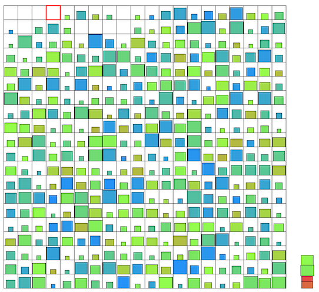

# トヨタ自動車プログラミングコンテスト2025#3(AHC049)

[TOC]

## 問題概要

- https://atcoder.jp/contests/ahc049
- N\*N(=20\*20)マスのオフィスがあり、左上のマスが出入り口になっている
- 各マスには、段ボール箱が置かれており、それぞれ重さw_{ij}と耐久力d_{ij}が定められている
- 出入り口から開始し、各ターンでは以下の操作を行うことができる
  - 持つ: 現在位置にある段ボール箱を手に持つ。すでに段ボール箱を持っている場合は、一番上に重ねる
    - 段ボール箱がなければこの操作は行えない
  - 置く: 手に持っている一番上の段ボール箱を置く
    - 段ボール箱がすでにあるマスではこの操作は行えない
  - 移動: 上下左右に移動する
    - 段ボール箱があっても移動できる
    - オフィスの外へは移動できない
- 段ボール箱はいくつでも手に持つことはできるが、持っている段ボール箱は移動のたびにその上に乗っている重量分耐久値が減り、耐久値が0以下になると潰れてしまう
- 操作は最大2\*N^3回まで行えるとき、できるだけ移動回数(!=操作回数)が少ない方法ですべての箱を潰さずに運び出す操作列を求めよ

## 時間

- 4 時間

## 個人的メモ

### アプローチ

#### 1個ずつ運び出す

- 1個ずつ運び出すと、段ボール箱は潰れないため、手数はかかるが、すべての段ボール箱を運び出すことができる
  - 744位 180,000点

#### 回収操作を繰り返す(置く操作なし)

- 「いくつかの段ボール箱を拾って、それを出入り口まで運ぶ」というのを1回の回収操作と考えると、それを繰り返すことですべての段ボール箱を運び出すことができる
- 途中で置く操作をしてしまうと、盤面の状態が変化してしまうが、置く操作をしない場合は、「1回の回収でどれをどの順番で拾うか？」を回収ごとに独立に考えることができる
- 今回、置く操作をしなくてもかなり高得点(1.8M点以上)を取ることができ、上位の多くはこの方針だった
  - 特に、焼きなましがかなり強く、上位はほぼこの方針だった

##### 運べるかの判定処理

- 回収する段ボール箱の集合と順番が決まると、シミュレーションすることで、実際に出口まで運べるか？がわかる
- 愚直にシミュレーションすると遅いが、回収の逆順に考えると、回収する個数の線形時間で求めることができる
  - 逆順に考えると、ある段ボール箱を回収したとき、それより上に載る段ボールの集合の重量と移動距離を一緒に計算できるので、耐久できるかわかる
- 回収する個数は、実際は平均的には4〜5個ぐらいなので、そんなに計算時間はかからない

##### 貪欲/ビームサーチ

- 出入り口から一番遠くにある段ボール箱は、いつかは運び出す必要はあるので、今回それを運び出すことを考える
  - 一番遠い段ボール箱を必ず含むような回収操作を考える
- 基本的には、一番遠い段ボール箱を回収してから、出入り口に向かう途中でできるだけ回収しつつ出入り口へ向かう、というのが考えられる
  - あまり回り道しないほうがよいとか、耐久力がない段ボールをあまりすぐに選ばないようにするなど、良し悪しがあるので貪欲などで選ぶことが考えられる
- 行きがけにも回収する
  - ある状況で、一番遠い段ボール箱を回収することを考えると、それを最初に回収すると、一番下になってしまい、耐久力がない段ボール箱だった場合、途中で回収できるものが少なくなってしまう
  - ここで、行きがけのときも回収することを考えると、より多くの段ボール箱をまとめて運べる可能性ができる
- 段ボールの選び方
  - 単純には、「手に持っている(複数の)段ボール箱の状態に対して、次に回収する(一番上に載せる)段ボールを選ぶ」が考えられる
  - ここで、一番上に載せるだけではなく、一番下に入れるや途中に入れる(過去改変的な感じ？)というのも考えることができる(解説放送)
    - ある状況で、一番遠い段ボールを基準に考えると、「一番下に入れる」は行きがけ順の方向の回収に相当、「一番上に入れる」は帰りがけ順の方向の回収に相当、するはず
- できるだけ多く回収するものを探す
  - 「遠くのから回収する」じゃなく、「できるだけ多く回収する」ようにしてもよいはず(一応雑でも本番1.7M以上は出た)

##### 焼きなまし

- 1回で回収する段ボール箱の集合(と順番)を1グループとして、複数のグループを状態して持つと、局所探索を考えることができる
  - ただし、invalid(途中で潰れてしまうよう)な動きは許可しない
- 状態
  - グループとグループ内順番
    - グループ内順番は、耐久値順や重さ順など順番を決め打つとかもでき、その場合はグループ番号だけ管理で済むので、グループ番号の行列だけ持つ、などできる
      - グループ内順番もまとめて探索の方がスコアがよさそう？
      - 耐久値順などが多少入れ替わっても移動距離が短くて潰れないケースがあるっぽい
- 近傍
  - グループ間move
    - 1点move、部分区間move
  - グループ間/グループ内のswap
    - ちなみに、グループ間だけでもかなり高いスコアが出る模様
  - tail-swap(suffix-swap, グループの後ろの方をまとめてswap)
    - (解説放送) 2つの回収ルートに対して、後半部分のルートを入れ替える感じにできる(2optになってる?)
- 初期解
  - イテレーションがかなり回るので、適当に、1個ずつ回収するやつを初期解にしても十分収束する
  - 貪欲解を初期解とした人も結構いた模様
- 高速化
  - 適当な実装でも数百万回ぐらいは回るが、いろいろ高速化の余地がある
    - 状態更新を後に持ってくるテク
      - スコア計算(移動距離の変化)を先に行って、更新されることがわかってから、それがvalidか？の判定や状態更新をすると、無駄な処理を減らすことができる
  - 延長戦を含めて、上位は1000万回〜5000万回ぐらい回るみたい
  - https://x.com/ymatsux_ac/status/1937481607889453162
- その他
  - 「グループの持ち方」で、「空になったグループを削除(選ばないようにする)」とかは結構重要かも
    - (解説放送) 空グループも保持すると、最適解に近づくほど空グループが増えて、近傍操作で無駄なものが増えてしまって、探索回数を無駄にしてしまう可能性がある
      - たとえば、初期解を1個ずつ回収するやつにしたらN\*N-1グループ考えることに成るが、ほとんどが空グループになる
  - 同じぐらいの耐久値の段ボール箱とswapするとかの方が採択率が高まる
    - (近くや軽いものは適当に選んでもなんとかなるが、遠いものや重いものは重要度が高いので、そういうのを選びやすくするとかも？)
  - 今回は、焼きなましを突き詰める方向でもかなりスコアが高くできたため、(4時間コンテストというのも考えると)、「置く操作」の活用を考えるよりも効果的だった

### 耐久力を使い切るような積み方について

- (解説放送)
- 理想的なことを考えると、出入り口のときにギリギリ耐久力が残っているような積み方がされているのがよいはず
  - 耐久力が残っているなら、もっと積んだほうがよいはず
- できれば「積まれた段ボールすべてで耐久力がギリギリ」になるようなのが理想だが、実際は下の方の段ボールだけが厳しくなることが多い
- 大雑把な見積もり
  - (移動距離とかは無視して、dはwの線形倍なのでwで考えると)、一番下の段ボールからw、w/2、w/4、・・・のようにできるのは理想的と考えられる
  - しかし、今回のwは、指数的( 1 / 2^x )ではなく、二乗( x^2 )で生成されているため、上記のようにはできず、比較的大きい段ボールが多い感じになる
  - 実際、焼きなましとかでグループの個数を見てみると、2個か3個しか回収しないようなグループがそこそこ発生してそう
    - もっとスコアが低い段階だと、もっと多いかも
- 基本、耐久力が余ることになるので、それを「置く操作」に活用することが考えられる
  - (ということが想定されていたらしい)
  - (が、1.8M後半がでるようなレベルでは、耐久力があまり余らないようで、置く操作での恩恵もあまりなかった模様)

### 置く操作(操作2)の活用

- 基本的には、「ゴールまでは運べないが、段ボールを出入り口に近づけておく」という使い方が考えられる
  - 回収の途中の状態で、回収する集合ではない段ボールについて、耐久力をあまり減らさずに移動できるなら移動させる、的な感じ
  - (本番の自分の解法だと、大きいやつを数個ずつ運ぶみたいなのが発生するので、手動で、置く操作をしながら運ぶと結構移動距離が減らせていた)
- ただ、実装が結構面倒で、移動後の盤面の状態も保つ必要があったり、置く場所などの探索も増えることになるので、いろいろ考えながら実装する必要がある
- (解説放送)
- 「出入り口の右か下のマスを置くマスとして、そこに一番上の段ボールを置く」というのを許す
  - 出入り口まではもたないが、その前に下ろすと間に合うようなものが許されるので、選択肢が増える
  - 実装も比較的楽
  - 一応、置く場所を増やしたり、複数下ろせるようにする、など考えられる
- 2周を1グループにする
  - 1周目で置く操作を行って2周目では必ずそれを回収する、とか
- 下の段ボール箱の耐久力が減ったら途中で入れ替える
  - 例えば、2つの荷物を持っているとき、下の耐久力が減ったら、置く→移動→置く→移動(戻る)→拾う→移動→拾う、とすると、移動回数2回の追加で入れ替えることができる

### ビジュアライザの箱

- ビジュアライザの段ボール箱は、幅が質量、高さが耐久力、色が耐久力/質量で、運んでいると高さが潰れて赤くなっていく仕様になっていた
  - 1つの長方形で、3つの情報が可視化されていた

### その他

#### 焼きなましの温度変化

- https://x.com/tsukammo/status/1936811030312808500
- https://x.com/theory_and_me/status/1936830675203805356

#### 類題

- https://x.com/tomerun/status/1936379257317646700
- HTTF2021予選 カードの回収
  - 散らばっているカードを番号順に取る移動距離を最小化する問題で、このときは、できるだけ固めてから順番拾う、というアプローチが強かった
    - 耐久度順が順番と考えると、似たような感じのイメージ
  - 今回は、1個ずつ運ぶのは効率が悪かったので、有効ではなかった、、、

#### AI活用

- https://x.com/ymatsux_ac/status/1936633273419202741
- https://x.com/keroru10/status/1936370600228065787

## 解説

(50位まで&発言を見つけられた方のみ)

- [AHCラジオ(解説放送)](https://www.youtube.com/watch?v=VFHwTq1N0kY)
- [解説(日本語)](https://atcoder.jp/contests/ahc049/editorial)
- [解説(英語)](https://atcoder.jp/contests/ahc049/editorial?editorialLang=en)

- [iwashi31さん](https://x.com/iwashi31/status/1936364971069497816)
  - https://x.com/iwashi31/status/1936368848183459889
- [Shun_PIさん](https://x.com/Shun___PI/status/1936364360135500016)
  - https://x.com/Shun___PI/status/1936365343955640433
  - https://x.com/Shun___PI/status/1936366129741709468
  - https://x.com/Shun___PI/status/1936366727069311382
  - https://x.com/Shun___PI/status/1936369797333455274
  - https://x.com/Shun___PI/status/1936371356800827578
- [rs02さん](https://x.com/rs02_hako/status/1936366501227057443)
- [terry_u16さん](https://x.com/terry_u16/status/1936365462318948746)
  - https://x.com/terry_u16/status/1936366829037101276
  - https://x.com/terry_u16/status/1936368355981828335
  - https://x.com/terry_u16/status/1936369063053406547
  - https://x.com/terry_u16/status/1936375453339803882
  - https://x.com/terry_u16/status/1936377295775957424
  - https://x.com/terry_u16/status/1936383258343997630
  - https://x.com/terry_u16/status/1936459895089586558
- [theory_and_meさん](https://x.com/theory_and_me/status/1936365459064148346)
  - https://x.com/theory_and_me/status/1936366792764784911
  - https://x.com/theory_and_me/status/1936368019204395073
  - https://x.com/theory_and_me/status/1936380136775114889
  - https://x.com/theory_and_me/status/1936624171314032687
- [yosupoさん](https://x.com/yosupot/status/1936367190309208573)
- [saharanさん](https://x.com/shr_pc/status/1936365173474042327)
  - https://x.com/shr_pc/status/1936366166693568585
  - https://x.com/shr_pc/status/1936368588417536212
  - https://x.com/shr_pc/status/1936369514033418600
  - https://x.com/shr_pc/status/1936370462323540393
  - https://x.com/shr_pc/status/1936371746409705770
- [Kiri8128さん](https://x.com/kiri8128/status/1936366241926770921)
  - https://x.com/kiri8128/status/1936367337730613496
  - https://x.com/kiri8128/status/1936369662918541343
  - https://x.com/kiri8128/status/1936378336521093502
  - https://x.com/kiri8128/status/1936381867080699925
  - https://x.com/kiri8128/status/1936385765728223587
- [takumi152さん](https://x.com/takumi152/status/1936366364501119160)
  - https://x.com/takumi152/status/1936367894021185922
  - https://x.com/takumi152/status/1936371623936106619
  - https://x.com/takumi152/status/1936376972659294432
- [tardigradeさん](https://x.com/akTARDIGRADE13/status/1936369056296357934)
  - https://x.com/akTARDIGRADE13/status/1936368029828534741
  - https://x.com/akTARDIGRADE13/status/1936372804179644420
- [ssaattooさん](https://x.com/myh9_f/status/1936365207192027552)
- [akidailyさん](https://x.com/akidai_ramen/status/1936367289798189197)
- [syndromeさん](https://x.com/syndro_6/status/1936366805150581187)
- [statiolakeさん](https://x.com/statiolake/status/1936374413441786348)
- [fuppy0716さん](https://x.com/fuppy_kyopro/status/1936365403187683333)
  - https://x.com/fuppy_kyopro/status/1936364990497435831
- [Moegiさん](https://x.com/mih28731325/status/1936365219560968686)
  - https://x.com/mih28731325/status/1936372785544401393
  - https://x.com/mih28731325/status/1936375617290952818
  - https://atcoder.jp/contests/ahc049/editorial/13384
- [shindanninさん](https://x.com/nico_shindannin/status/1936366390551957615)
  - https://x.com/nico_shindannin/status/1936373515399442932
- [itigoさん](https://x.com/itigo_purokonn/status/1936366480352059831)
  - https://x.com/itigo_purokonn/status/1936367171711668291
  - https://x.com/itigo_purokonn/status/1936368095385534622
  - https://x.com/itigo_purokonn/status/1936368776834130371
  - https://x.com/itigo_purokonn/status/1936370013872763347
  - https://x.com/itigo_purokonn/status/1936370475325915586
  - https://x.com/itigo_purokonn/status/1936371837694541925
- [toamさん](https://x.com/torii_kyopro/status/1936364051426329011)
  - https://x.com/torii_kyopro/status/1936364436757135683
  - https://x.com/torii_kyopro/status/1936364659294298157
  - https://x.com/torii_kyopro/status/1936367858537415138
- [Jinapettoさん](https://x.com/Jinapetto/status/1936366931726254425)
  - https://x.com/Jinapetto/status/1936378369257693241
- [E869120さん](https://x.com/e869120/status/1936364586070114429)
  - https://x.com/e869120/status/1936366337733099773
- [besukohuさん](https://x.com/besukohu/status/1936369562779635800)
- [bowwowforeachさん](https://x.com/bowwowforeach/status/1936404734522569190)
  - https://x.com/bowwowforeach/status/1936404928622465114
- [gasinさん](https://x.com/_gacin/status/1936364164773278152)
- [omochi_gyuhiさん](https://x.com/omochi_gyuhi/status/1936366545447665870)
  - https://x.com/omochi_gyuhi/status/1936368087500300746
  - https://sizu.me/omochi_gyuhi/posts/5mfzixt5o1iu
- [abbさん](https://x.com/iiljj/status/1936366870682284116)
  - https://x.com/iiljj/status/1936370169213026325
- [keroruさん](https://x.com/keroru10/status/1936365021594112372)
  - https://x.com/keroru10/status/1936365929115668893
  - https://x.com/keroru10/status/1936366350437667299
  - https://x.com/keroru10/status/1936368653156618282
  - https://x.com/keroru10/status/1936370600228065787
  - https://x.com/keroru10/status/1936376557435863474
  - https://x.com/keroru10/status/1936698706650419481
- [mec2さん](https://x.com/mec287117892/status/1936365910044057982)
  - https://x.com/mec287117892/status/1936369007810183633
  - https://x.com/mec287117892/status/1936421579510178298
  - https://mec2.hatenablog.com/entry/2025/06/22/170541
- [shotoyooさん](https://x.com/tooooyyo/status/1936372669722837481)

- 延長戦
  - https://x.com/tsukammo/status/1936392421929300442
  - https://x.com/10mlx10/status/1939672326192423329

## Links

- [twitter hashtag AHC049](https://x.com/hashtag/AHC049)

