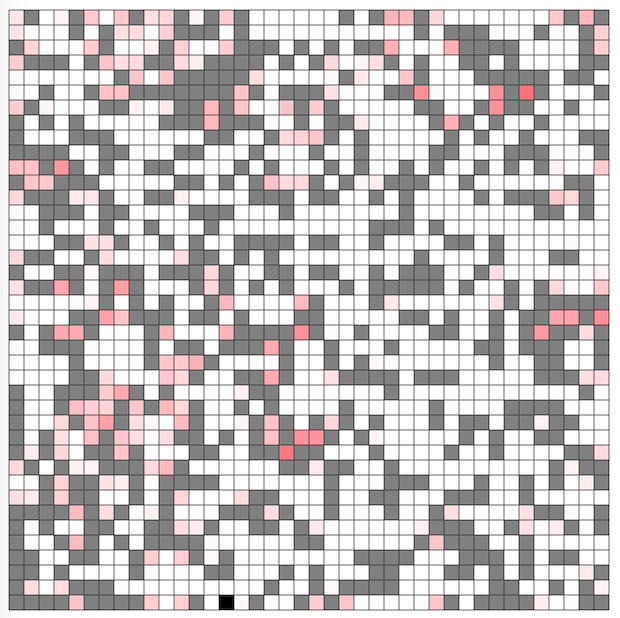

# AtCoder Heuristic Contest 050

- https://atcoder.jp/contests/ahc050

## 問題概要

- N\*N(=40\*40)のマス目からなるスケートリングがある
- 初期状態ではM個のマスに岩が置かれている
- 1体のロボットを使って、以下のゲームを行う
  - 岩のないマスすべて(N^2 - Mマス)について、岩を置いていく順番を決める
  - 岩のないマスからランダムに1マスが選ばれロボットが置かれる
  - ここから、すべてのマスに岩が置かれるまで以下を繰り返す
    - ターンiでは、ロボットは現在位置から4方向をランダムに決めて岩にぶつかるかスケートリングの端まで滑り、その後、決めておいたi番目のマスに岩を置く
    - もし、ターン終了後にロボットが潰されたらそこで終了し、潰れなかったら1円獲得して次のターンに進む
- 最終的に獲得賞金の期待値ができるだけ高くなるような岩の置く順番を求めよ

## 時間

- 4 時間

## 個人的メモ

### スコアの計算

- 各ターンでの得られる賞金の期待値は、あるマスの期待値が「そのマスにロボットがいる確率prob \* 1円」なので、それを全マスでの合計したものになる
  - 最終的に獲得できる賞金の期待値は、全ターンの賞金の期待値の合計
- ビジュアライザでいうと、岩を置く(黒マスにする)とそこのマスにあったprobが0になってしまうので、「できるだけprobの高い(赤い)マスを潰さないように岩を置いていけ」という感じ
  - ビジュアライザの下の線グラフでいうと、AUC(線の下にくる部分の面積)ができるだけ大きくなるようにしたい
    - 理想的には、ターンの最後の方までほぼ1.0を維持して、最後にガクッと下がる感じにできるとよい
    - これは「途中はほぼprob0のマスしか潰さず、最後に少数のprobが高いマスを潰す」ような動きになるはず
- テスター・ビジュアライザなどにスコア計算式があるので、参考にできる

#### スコア計算の高速化

- 単純に、「各マスについて、4方向の移動先マスを見つけて、現在のマスの確率の1 / 4を配布」とすると、移動先のマスを見つけるのにO(N)かかるので、各ターンでO( N^3 )、全体でO( N^5 )の計算量になる
  - N\=40なので結構厳しく、10回程度ぐらいしか試せない
- これは高速化が可能で、あるマスの移動先マスは、そのマスの間にあるマスもその移動先マスになるので、累積しながら走査することで、各ターンO( N^2 )、全体でO( N^4 )で求められる

### probの変化

- 「例を見る」などで観察してみると、ターンが進むごとにマスのprobが減ったり増えたりしていることがわかり、いくつか考察できる
- 連結成分ごとに独立
  - 岩によって領域が分断されてしまうと、ロボットの行き来ができないので、それぞれ独立になる
  - もし、領域内のprobの合計がほぼ0なら、その領域のマスはどの順番につぶしてもあまり関係ない
- probが高いマス、低いマス
  - 岩が隣接していないマスは、ロボットが止まれないので、probは0になる
  - また、岩が隣接している場合でも、領域内のprob合計が低ければprobは低い
  - ロボットが止まるのは岩にぶつかるかスケートリングの端なので、そこはprobが高くなりやすいはずだが、一方で、岩が隣接していてもprobが低いマスはいくつも存在している
    - 直線やL字、四角形領域などの角の部分が高くなりやすいのはわかる
- probが減っていくマス、増えていくマス
  - probが減っていくマスというのは、そのマスへ来る確率よりも出ていく確率の方が大きいマスで、probが増えていくマスはその逆
  - たとえば、4近傍のうち3つが潰されているマスの場合は、3 / 4で留まり、1 / 4は出ていくが、それ以上が入ってくると増えていくことになる
  - 岩を置くことで、経路が変化し、probの増減の仕方も変化する(させられる)

#### probの誘導

- 減っていくマスと増えていくマスがあり、うまく配置を作れると、少数のマスにprobをまとめることができる
- 基本的には、溜まって外に出ていかないようなsinkマスを作れるとそこに集まるので、それができるのを目指す
  - 最上位には、いくつもそういうのができないようにすることも必要

### アプローチ

#### 評価関数設計して貪欲

- 各ターンで、「どこのマスに置くか」を、評価関数を設計して、貪欲に選ぶようにする
  - 最初に「probが低いマスから埋めてったらどうか？」とかが考えやすいので、そこからの発展で考えやすい
  - だいたいは時間が余るので、微小な乱数を入れる or 上位n件をランダムに選ぶようにしたり、後半を局所改善する、などもできる
- 評価関数には、以下の要素などを組み込んで適当に重み付け
- 対象のマスのprob
  - そもそもprobが高いマスは選びたくない
  - ある程度小さいprobは0として扱う、など
- 通過が多いマスを潰さない、通路を塞がない
  - そのマスを通過しているprobが多いところは、そのマスを潰すことで、その隣接マスに溜まる(probが高いマスが増える)ことになるので、それを避ける
  - (「直線を残す」効果も)
- くぼみ(隣接で1箇所だけ空いている状態)を作る、隣接4マスの状態を考慮
  - 隣接が1箇所だけ空いているマスは、probのうち3 / 4がそこにとどまるので、そこに溜まりやすい
    - 他のマスにprobが散るよりも、くぼみのマスに集中しやすくなる
  - くぼみができるように、隣接マスを考慮して岩を置く
- 連結成分を増やさない
  - 連結成分が増えてしまうと分離してしまうので、それを避けるために、できるだけ連結成分が増えないマスを優先する
    - 厳密ではなく、隣接8マス判定とかでも
- 直線を残す
  - 岩がないマスが直線のようになっていると、「1ターンで長距離移動しやすい」「その両端マスに溜まりやすくなる」などよさそうなことが多そうに思われる
    - (解説放送) あまり良くない形である市松模様的なのが避けられる効果がある
  - 直線を残すようにしたり、行・列に重み付けしてタイブレーカーを導入するなどすると良い模様
  - 直線が最後に残ったとき、1マス飛ばしで埋めていってほしいが、適当に評価関数を書いているとそのようになってくれたりもする(なってくれないときは2マス先に岩があるとき加点など)

#### n手後の盤面状態(定常状態)を評価値にして貪欲

- n手後のマスの盤面がどうなっているか？をシミュレーションして、それを評価値にする
  - 岩は置かず、そのままほっといたときの状態(定常状態)
  - nは10とか
- 全候補マスでやるのは計算量的に厳しいので、probが低い何マスかだけ試す(10マスだけとか)で十分な模様
  - https://x.com/ymatsux_ac/status/1942262051046584793
- 評価値は、probができるだけ少ないマスに偏るとうれしいので、分散やエントロピー、各マスのx乗(x\=2とか10とか)の合計、とかを用いるとよいみたい

#### T字を作成してprobを誘導

- https://x.com/chokudai/status/1941862619125788692
- 「T字型」は、両端マスに入ったprobが外に出ていかなくなる(一方通行)ので、他のマスからprobを集める効果がある
- そのようなマスを用意してターンが進むとそこに集まるので、うまく塞がないように埋めていく
- これを極めると、「T字の溜まる部分が3マスになるような形」にprobをほぼすべて集約することができるようで、ほぼ理論値が達成できる(延長戦、解説放送)
  - https://x.com/Rafbill_pc/status/1941932151156437284

#### 置く順番を局所改善

- 最初に貪欲解作った後、置く順番を局所改善するというのができた
- 焼きなましは計算量的に厳しそうに見えるけど、隣接2点swapで結構回すこともできるみたい
  - https://x.com/noshi91/status/1941861076754481215
  - https://x.com/wata_orz/status/1941864690734465072
- (解説放送)
  - もともと原案はN\=20だったみたいで、これだと結構回せてせしまうためサイズが大きくなったらしい

### その他

#### 小さいNで試す

- 問題の制約ではNは固定だったが、ビジュアライザだとNを変更(「fix N」のところ)して生成させることができるようになっていて、小さいNにしてmanual modeで試す、ということができた
  - N\=40だと大きいが、N\=10ぐらいだと考えやすい

#### 理論値

- https://x.com/sig_255/status/1942007487378415755

#### 勇者のくせに生意気だ

- コケ地獄戦法
- https://x.com/yosupot/status/1941865828947001371
- https://x.com/tsukammo/status/1941863089663771117
- https://x.com/winter_kyopro/status/1941875238272409898

#### お絵かき

- https://x.com/prd_xxx/status/1941866224763502903

## 解説

(50位まで&発言を見つけられた方のみ)

- [AHCラジオ(解説放送)](https://www.youtube.com/watch?v=3D3BNf9ivDQ)
- [解説(日本語)](https://atcoder.jp/contests/ahc050/editorial)
- [解説(英語)](https://atcoder.jp/contests/ahc050/editorial?editorialLang=en)
- [writer解説](https://img.atcoder.jp/ahc050/editorial.pdf)
  - https://x.com/butsurizuki/status/1941862736784453793
  - https://x.com/butsurizuki/status/1943319098634703360
  - https://x.com/butsurizuki/status/1941867541158338949
  - https://x.com/butsurizuki/status/1941868073151291809
  - https://x.com/butsurizuki/status/1941868239811965011
- [wataさん](https://x.com/wata_orz/status/1941864690734465072)

- [yosupoさん](https://x.com/yosupot/status/1941861030809981048)
  - https://x.com/yosupot/status/1941865828947001371
- [c7c7さん](https://x.com/C7C7LL/status/1941860514071781864)
  - https://x.com/C7C7LL/status/1941861190772424841
  - https://x.com/C7C7LL/status/1941861936569979055
  - https://x.com/C7C7LL/status/1941862856452145406
- [chokudai社長](https://x.com/chokudai/status/1941720706380935416)
  - https://x.com/chokudai/status/1941862619125788692
  - https://x.com/chokudai/status/1941871494218629546
  - https://x.com/chokudai/status/1941887734614016045
  - https://x.com/chokudai/status/1941938615367655783
- [cuthbertさん](https://x.com/ethylene_66/status/1941860617687871826)
  - https://x.com/ethylene_66/status/1941860848437440840
  - https://x.com/ethylene_66/status/1941861989053284644
  - https://x.com/ethylene_66/status/1941862289659036052
  - https://x.com/ethylene_66/status/1941865036961701918
  - https://x.com/ethylene_66/status/1941866821587763688
  - https://x.com/ethylene_66/status/1941867997335011748
  - https://x.com/ethylene_66/status/1941876212269498795
- [yokozuna57さん](https://x.com/yokozuna_57/status/1941861997236351256)
  - https://x.com/yokozuna_57/status/1941863086979527132
- [tsukammoさん](https://x.com/tsukammo/status/1941861390349910231)
  - https://x.com/tsukammo/status/1941866846673871040
  - https://x.com/tsukammo/status/1941869562070483239
    - https://hackmd.io/@tsukammo/ByQ62wHHgx
  - https://x.com/tsukammo/status/1941918102276784173
- [itigoさん](https://x.com/itigo_purokonn/status/1941860947049730491)
  - https://x.com/itigo_purokonn/status/1941862180099690610
  - https://x.com/itigo_purokonn/status/1941863205929934892
  - https://x.com/itigo_purokonn/status/1941864111794729199
- [yunixさん](https://x.com/yunix91201367/status/1941860639569592536)
  - https://x.com/yunix91201367/status/1941862540847583709
  - https://x.com/yunix91201367/status/1941863963937153122
  - https://x.com/yunix91201367/status/1941870221247271206
- [milkcoffeeさん](https://x.com/milkcoffeen/status/1941862606882619735)
- [ygussanyさん](https://x.com/ygussany/status/1941859684371345916)
  - https://x.com/ygussany/status/1941862523948732629
- [wanuiさん](https://x.com/gmeriaog/status/1941861523477221885)
- [syndromeさん](https://x.com/syndro_6/status/1941862826517422435)
- [square1001さん](https://x.com/square10011/status/1941869299402195201)
- [maze1230さん](https://x.com/pazzle1230/status/1941859745469710420)
  - https://x.com/pazzle1230/status/1941861227430596884
  - https://x.com/pazzle1230/status/1941861811839762542
- [kaz49bzさん](https://x.com/kaz_d37/status/1941865575078350965)
- [uta_cccさん](https://x.com/uta_cccc/status/1941863361047883780)
  - https://x.com/uta_cccc/status/1941880372700332269
  - https://utac.hateblo.jp/entry/2025/07/07/234319
- [tomerunさん](https://x.com/tomerun/status/1941862201469579406)
  - https://x.com/tomerun/status/1941865438016831495
  - https://x.com/tomerun/status/1941873631195508879
  - https://x.com/tomerun/status/1942216188022669686
  - https://x.com/tomerun/status/1942574655745019973
- [MathGorillaさん](https://x.com/MathGorilla_cp/status/1941863516467798102)
- [merom686さん](https://x.com/merom686/status/1941861145188663425)
- [mekemeke_sanさん](https://x.com/mekemeke8865/status/1941908636365984035)
- [mikuさん](https://x.com/ekidenp/status/1941867777587122378)
- [sig_256さん](https://x.com/sig_255/status/1941865744914149538)
  - https://x.com/sig_255/status/1941868994593755171
  - https://x.com/sig_255/status/1942007487378415755
- [olpheさん](https://x.com/_olphe/status/1941867113595146295)
  - https://x.com/_olphe/status/1942188904234533280
- [Shun_PIさん](https://x.com/Shun___PI/status/1941860329476288602)
  - https://x.com/Shun___PI/status/1941861318279168279
  - https://x.com/Shun___PI/status/1941862247590154664
  - https://x.com/Shun___PI/status/1941863238511350216
  - https://x.com/Shun___PI/status/1941864847119172012
  - https://x.com/Shun___PI/status/1942001309097562291
  - https://x.com/Shun___PI/status/1942002360311857160
  - https://x.com/Shun___PI/status/1942181553771332024
- [yu_wさん](https://x.com/yu_wTLE/status/1941864666696933740)
- [besukohuさん](https://x.com/besukohu/status/1941870966025666706)
- [kotamanegiさん](https://x.com/small_onions/status/1941861591500394906)
- [sky58さん](https://x.com/skyaozora/status/1941862994184675532)
  - https://x.com/skyaozora/status/1941865089554059664
- [takumi152さん](https://x.com/takumi152/status/1941862562834137263)
- [throughさん](https://x.com/through__TH__/status/1941863405515911337)
- [omochi_gyuhiさん](https://x.com/omochi_gyuhi/status/1941863736693960937)
  - https://sizu.me/omochi_gyuhi/posts/9zds9n1z6tcw

- 延長戦
  - https://x.com/Rafbill_pc/status/1941932151156437284
  - https://x.com/terry_u16/status/1942629183794078163
  - https://x.com/ymatsux_ac/status/1944207164354310263

## Links

- [twitter hashtag AHC050](https://x.com/hashtag/AHC050)

