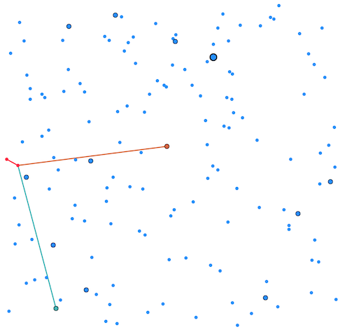

# THIRDプログラミングコンテスト2025夏(AHC051)


- https://atcoder.jp/contests/ahc051



## 問題概要

- N(\=5〜20)種類のゴミを分類して処理するゴミ処理場を建設する
  - ゴミ処理場全体は、2次元平面上の正方形で表される
- ゴミ処理場の搬入口(図の左真ん中の赤点)からゴミが運び込まれる
- ある1種類のゴミを処理する「処理装置」と、ゴミを確率的に分類する「分類器」を設置して、ゴミをできるだけ処理したい
  - 処理装置の候補地点は、N箇所あり、各ゴミの種類ごとに処理装置を1台設置する
  - 分類器の候補地点は、M(\=10N〜50N)箇所あり、K種類(\=N〜4N)の分類器のどれかを設置できる
  - 分類器は、分類器の出口が2つあり、他の分類器か処理装置にベルトコンベアで繋げる必要があり、このとき、他のベルトコンベアと重なってはいけない
    - 出口が同じ場合は、分類はされず、単にその先にゴミを運ぶような使い方ができる
- できるだけ搬入口から入ってくるゴミが対応する処理装置に送られるような配置を求めよ

## 時間

- 240 時間

## 個人的メモ

### 分類器の種類数

- 分類器は、出口を入れ替えると、確率を逆にしたもの(1-pにしたもの)として考えられるので、実際は2\*K種類あると考えられる

### 分類器の組み合わせ

- 各処理装置ではどれか1種類しか処理できないので、どれか1種類だけ確率が高くなるように分類器を組み合わせる必要がある
- 一旦、設置地点のことは忘れて、「分類器の組み合わせ」でどの程度分類できるのかを、小さいケースなどから考えるのがよい

#### 直列つなぎ

- 単純そうなのは、いくつかの分類器を直列につなぐ場合で、分類器の種類をうまく選ぶと、1種類だけ確率があってそれ以外がほとんど0に近いようなものが作れる
- アプローチの方向性として、これを各処理装置にうまく複数繋げられるとよさそう、と考えられる
  - https://x.com/terry_u16/status/1954847100082200817
  - https://x.com/kiri8128/status/1954923750014824934
- 分類器の種類は、全探索や局所探索などでもよさそうなものが見つけられる
- また、これに頂点を追加してみてみると、より改善する場合もあることがわかる

```
分類器を3つつなげた場合

 ● --exit1--> ● --exit1--> ● --exit1--> X
 |            |            |
exit2       exit2         exit2
 |            |            |
 |            v            |
 -----------> ● <-----------
              |
              v
              Y
```

#### 同じ分類器をメッシュ状・グリッド状・網目状につなぐ

- 同じ種類の分類器をメッシュ状・グリッド状・網目状みたいな感じにしたものを考えると、よりよい分類ができる可能性がある
- https://x.com/ToastUz/status/1955045403692515430
- https://x.com/risujiroh/status/1954848838516187342
- ただ、サイズが大きいと、埋め込むのは厳しくなる

#### 二分木、DAGを探索

- 単純に、入口から各処理装置までを二分木にすることを目標に、頂点の追加や辺の追加や張替えなどして木を作り、各頂点の分類器の割当を探索することも考えられる
  - 解説放送だと、サンプルの次の1手として想定されていたよう
  - これだけでは1つあたりの分類能力はそこまで高くないのでそこまでスコアはでない
- きれいな二分木だけでなく、辺の途中に頂点を追加して別の頂点に繋いだりなどをしてより複雑なDAGにしていくと、よりスコアが改善する可能性がある
  - 焼きなましやビームサーチなどで大きなものも探索できる

### 辺の交差判定

- 問題文の「ヒント」にある交差判定のコードは、問題文のベルトコンベアの条件とは異なっている
  - 線分の両端が同じ場合の処理の追加が必要
- 基本は、現在使われている辺すべてとの交差判定が必要になるため、結構計算が重い

#### 使う辺を制限する

- 三角形分割(ドロネー三角形分割など)して、その辺のみを使うと、交差チェックを省略できる
  - ただ、使える辺をかなり制限してしまうため、微妙な可能性はある
  - 今回はドロネー三角形分割している人が多かったようで、それでも十分スコアは取れていた模様

#### 辺の交差を高速に判定する

- データ構造などを使う
  - 線分集合が動的に変化するので、それにも対応できる必要はある
- (解説放送) 各辺について、交差する辺集合を事前計算しておき、各辺の交差数をカウントして判定
  - 辺が多い場合は適当に間引く、など
- 幾何的に判定
  - 偏角ソート順に、交差辺情報を活用しながら判定する
  - 無向グラフとして見て、同じ面の辺とだけ交差判定をする

### サイクル検出

- 単純には、DFSなどで求められる
  - 辺の構造が変化した場合のみ判定すれば良いので、スコアが悪化する場合や分類器の種類を変化させるだけの場合、頂点追加の場合などでは不要
- 頂点のトポロジカルソートを求めておく
  - あらかじめトポロジカルソート順が決まっていると、自分より後ろの頂点にしか繋がなければサイクルはできない
  - 現状のトポロジカルソート順は、辺の方向を変えなければ別のトポロジカルソートに変更できるので、あとからDFSなどで作り変えができる

### スコア計算の高速化

- テスターなどでは、トポロジカルソートしてからその順番で確率を求めていく感じでスコア計算を行っているが、そこそこ計算は重い

#### 差分DP

- DAGの場合、過去でも出てきている「前向き・後ろ向きで計算しておいて中間地点を差分計算するテク(差分DP)」が適用でき、ある頂点の分類器の種類を変えたり、辺を変えたりした場合のスコアの差分計算を高速に求めることができる
- 入口側から「その頂点xまで種類iがたどり着く確率(前向き)」と、処理装置側から「その頂点xから対応する処理装置までたどり着く確率(後ろ向き)」を求めておく
- すると、ある頂点や辺について、その前後での値から変更後の値を高速に求めることができる
- 値を更新した場合は、その変更地点以降の値が変化しているので、更新しなおす必要はある
  - ただ、ここも、更新順を工夫すると、片方の更新し直しを省略できる(解説放送)

#### SIMD

- AVX2/FMAを使って、float8要素をまとめて計算などで、配列の要素を並列計算できる

### アプローチ

- 上位はおおよそ「埋め込み解」か「局所探索解」が多かった模様

#### 二分木を探索

- あまり強いアプローチではないが、サンプルよりも強くなる解として、入口から各処理装置につなぐように二分木を作るアプローチが考えられる
  - 分類器を1つずつ増やしていく感じで作る
  - 分類器の種類は、一番良くなるものを選んだり、一緒に探索したり、など
  - 全部の処理装置につながる必要はないので、辺が交差せずにできるだけつながるものを探す
  - 結構これをやるだけでもいろいろ必要なので大変だったかも
- 「二分木」で終わらず、これを初期解として、さらに頂点や辺を増やして複雑なDAGにすることができるので、結構重要な解法だった

#### 組み合わせ分類器を埋め込み

- 「分類器の組み合わせ」にあるように、分類器を組み合わせると、特定の種類を取り出せる分類器が作れるので、それを埋め込む
  - ただ、これがあまり単純ではなく、処理装置の位置もランダムで変な位置や他の処理装置と近かったりするとうまくいかない可能性がある
- 上位だと、凸包や扇形の領域を用意して、その中の頂点で分類器の組み合わせを作り、それら同士をつなぐ、など
- また、1種類ずつ分類してパスにする以外も、最上位は部分集合で考えていい感じのものを探索して木で分類していく、などもしてた模様

#### 全体を局所探索

- 素直にグラフの構造や分類器の種類の割当など全部を局所探索する
- 単純にやろうとすると、変更した場合に「サイクル検出」「交差判定」「スコア計算」など遅い処理が多いため、高速化や近似計算を考える必要がある
- 今回、TIME LIMITを100倍とかに伸ばして実行してみると、高速化によってどの程度改善しそうか？がわかるため、これを確認してから高速化を頑張る方針があり得た
- 初期解の工夫や近傍設計、高速化などで取れるスコアの幅が大きいようだけど、かなり上位まで目指せた

##### 初期解

- 何もつながっていない状態からだと、他の辺が邪魔になって全部の処理装置に繋げられないなどあり得るので、処理装置につながる分類器を用意しておくとか(解説放送)、全部につながる二分木から始めるとかするとよかった模様

##### 近傍

- 頂点の追加
- 出口の変更
- 分類器の種類の変更
  - 同じ種類のものを組み合わせると良い傾向があるため、周りの種類に揃える近傍も有効
- 部分破壊再構築
- など

### その他

#### ぐるぐるパス

- https://x.com/oreha_senpai/status/1954847861985951947
- https://x.com/kiri8128/status/1954872188915404812

#### AI

- https://x.com/iwiwi/status/1953655475108818998

## 解説

(50位まで&発言を見つけられた方のみ)

- [AHCラジオ(解説放送)](https://www.youtube.com/watch?v=ubQicRsm7p0)
- [解説(日本語)](https://atcoder.jp/contests/ahc051/editorial)
- [解説(英語)](https://atcoder.jp/contests/ahc051/editorial?editorialLang=en)

- [writer解](https://x.com/wata_orz/status/1954848168920658112)
  - https://x.com/wata_orz/status/1954927948982784478

- [eijirouさん](https://speakerdeck.com/eijirou/ahc051jie-fa-shao-jie)
- [Shun_PIさん](https://x.com/Shun___PI/status/1954846087073907200)
  - https://x.com/Shun___PI/status/1954847456711127359
  - https://x.com/Shun___PI/status/1954848736166686773
  - https://x.com/Shun___PI/status/1954849534720532535
  - https://x.com/Shun___PI/status/1954851633357025280
  - https://x.com/Shun___PI/status/1954852466589155432
  - https://x.com/Shun___PI/status/1954858426539929862
  - https://x.com/Shun___PI/status/1954863518013874652
  - https://x.com/Shun___PI/status/1955098811602190715
- [Rafbillさん](https://x.com/Rafbill_pc/status/1954992554136760347)
- [sugarrrさん](https://x.com/sugarrr_med/status/1954847731828093151)
- [asi1024さん](https://x.com/asi1024/status/1954872942342631859)
- [rhooさん](https://x.com/rho__o/status/1954851707080315079)
  - https://x.com/rho__o/status/1954853265704911101
  - https://x.com/rho__o/status/1954854953593250087
  - https://x.com/rho__o/status/1954858504168387024
  - https://x.com/rho__o/status/1954894899150786932
  - https://trap.jp/post/2651/
- [ymatsuxさん](https://x.com/ymatsux_ac/status/1954846183740105011)
  - https://x.com/ymatsux_ac/status/1954848343059784097
  - https://x.com/ymatsux_ac/status/1954850744974061720
  - https://x.com/ymatsux_ac/status/1954853101921546299
  - https://x.com/ymatsux_ac/status/1954853566788579776
  - https://x.com/ymatsux_ac/status/1954850626556563958
  - https://x.com/ymatsux_ac/status/1954856168968315031
  - https://x.com/ymatsux_ac/status/1954857473543696794
  - https://x.com/ymatsux_ac/status/1954860220418826664
  - https://x.com/ymatsux_ac/status/1954861086689374346
  - https://x.com/ymatsux_ac/status/1954864523279827243
  - https://x.com/ymatsux_ac/status/1954866209742377138
  - https://x.com/ymatsux_ac/status/1954866392223621486
  - https://x.com/ymatsux_ac/status/1954869155641151817
  - https://x.com/ymatsux_ac/status/1954870277659410934
  - https://x.com/ymatsux_ac/status/1954874536886939836
  - https://x.com/ymatsux_ac/status/1955341033212088770
  - https://note.com/ymatsux/n/ne82d83292354
- [c7c7さん](https://x.com/C7C7LL/status/1954846243848630345)
  - https://x.com/C7C7LL/status/1954848517002080280
  - https://x.com/C7C7LL/status/1954850801974682090
- [fuppy0716さん](https://x.com/fuppy_kyopro/status/1954847052514369803)
  - https://x.com/fuppy_kyopro/status/1954847732411040185
  - https://x.com/fuppy_kyopro/status/1954850481253339593
  - https://x.com/fuppy_kyopro/status/1954854302515929185
  - https://x.com/fuppy_kyopro/status/1954855275447677253
  - https://x.com/fuppy_kyopro/status/1954899464545763533
- [gasinさん](https://x.com/_gacin/status/1954845586416439361)
  - https://x.com/_gacin/status/1954846906883907912
  - https://x.com/_gacin/status/1954847639918244154
  - https://x.com/_gacin/status/1955641151186460834
- [yokozuna57さん](https://x.com/yokozuna_57/status/1954852185948246360)
  - https://x.com/yokozuna_57/status/1954852421521576031
  - https://x.com/yokozuna_57/status/1954852691513073929
  - https://x.com/yokozuna_57/status/1954853138202316934
- [terry_u16さん](https://x.com/terry_u16/status/1954849074311532727)
  - https://x.com/terry_u16/status/1954847100082200817
  - https://x.com/terry_u16/status/1954855104458190980
  - https://x.com/terry_u16/status/1954855660291768500
  - https://x.com/terry_u16/status/1954856584804470935
  - https://x.com/terry_u16/status/1954857062053396634
  - https://x.com/terry_u16/status/1954858702529253452
  - https://x.com/terry_u16/status/1954859791953666348
  - https://x.com/terry_u16/status/1954862622408314937
  - https://x.com/terry_u16/status/1954864067572847080
  - https://x.com/terry_u16/status/1954865387134443822
  - https://x.com/terry_u16/status/1954866305280180494
  - https://x.com/terry_u16/status/1954866977123741721
  - https://x.com/terry_u16/status/1954870210860613737
  - https://x.com/terry_u16/status/1954871148531073508
  - https://x.com/terry_u16/status/1954872136671302038
  - https://x.com/terry_u16/status/1954905029544235084
  - https://x.com/terry_u16/status/1954905971719115214
  - https://x.com/terry_u16/status/1954911567423910249
  - https://x.com/terry_u16/status/1954915998429225348
  - https://x.com/terry_u16/status/1955104458569830569
  - https://x.com/terry_u16/status/1954868598838608092
  - https://x.com/terry_u16/status/1955228177384853761
  - https://x.com/terry_u16/status/1956199150284104022
  - https://www.terry-u16.net/entry/ahc051
- [bowwowforeachさん](https://x.com/bowwowforeach/status/1954852115211260289)
  - https://x.com/bowwowforeach/status/1954853010372472868
  - https://x.com/bowwowforeach/status/1954853605540077875
  - https://x.com/bowwowforeach/status/1954854326397968647
  - https://x.com/bowwowforeach/status/1955035262687514952
- [yowaさん](https://x.com/yowa/status/1955281655091892694)
  - https://x.com/yowa/status/1954735212254109765
  - https://x.com/yowa/status/1955303643680534772
- [tomerunさん](https://x.com/tomerun/status/1954845969637691419)
  - https://x.com/tomerun/status/1954851996323967254
  - https://x.com/tomerun/status/1954854727063069166
  - https://x.com/tomerun/status/1954872167805714664
  - https://x.com/tomerun/status/1954911015088574634
- [aaaaaaaaaa2230さん](https://x.com/mkmkmk76739807/status/1954857748408979825)
- [cuthbertさん](https://x.com/ethylene_66/status/1954888455030538338)
  - https://x.com/ethylene_66/status/1954889123338350981
  - https://x.com/ethylene_66/status/1954890011037597925
  - https://x.com/ethylene_66/status/1954890218814980413
  - https://x.com/ethylene_66/status/1954903057969615246
  - https://x.com/ethylene_66/status/1954903428003713407
  - https://x.com/ethylene_66/status/1954903940673495357
  - https://x.com/ethylene_66/status/1954907255033459044
  - https://x.com/ethylene_66/status/1955064336868933975
  - https://x.com/ethylene_66/status/1955579663218336104
  - https://x.com/ethylene_66/status/1955606712960110875
  - https://x.com/ethylene_66/status/1955634301816779010
  - https://x.com/ethylene_66/status/1955637665908641911
- [uta_cccさん](https://x.com/uta_cccc/status/1954847587925709113)
  - https://x.com/uta_cccc/status/1954850715777532235
  - https://x.com/uta_cccc/status/1955084581142478925
  - https://utac.hateblo.jp/entry/2025/08/11/192852
- [twins_fuyuさん](https://x.com/Fuyu348867/status/1954871390114390155)
- [shotoyooさん](https://x.com/tooooyyo/status/1954854845040787878)
  - https://x.com/tooooyyo/status/1954858864634937402
- [Ang107さん](https://x.com/Ang_kyopro/status/1954845320321662992)
  - https://x.com/Ang_kyopro/status/1954846010469236949
  - https://x.com/Ang_kyopro/status/1954847354273538517
  - https://x.com/Ang_kyopro/status/1954848427474592041
  - https://x.com/Ang_kyopro/status/1954849860412375228
  - https://x.com/Ang_kyopro/status/1954851498073981211
  - https://x.com/Ang_kyopro/status/1954857310490173912
  - https://x.com/Ang_kyopro/status/1954864465733734668
  - https://x.com/Ang_kyopro/status/1954879789258736104
  - https://x.com/Ang_kyopro/status/1955099433873363190
  - https://x.com/Ang_kyopro/status/1954899643747455262
  - https://x.com/Ang_kyopro/status/1955276726763733310
- [RinSakamichiさん](https://x.com/RinSakamichi/status/1954856481062269028)
  - https://x.com/RinSakamichi/status/1955097972179603752
- [FplusFplusFさん](https://x.com/FplusFplusF____/status/1954848036154478915)
  - https://x.com/FplusFplusF____/status/1954865523348447308
  - https://x.com/FplusFplusF____/status/1954901364422922430
    - https://x.com/moooaki/status/1954900446579155282
- [simanさん](https://x.com/_simanman/status/1954846001325318181)
  - https://x.com/_simanman/status/1954846343354364405
  - https://x.com/_simanman/status/1954847497299345742
  - https://x.com/_simanman/status/1954849373260496919
  - https://x.com/_simanman/status/1954850034526405056
  - https://x.com/_simanman/status/1954850393512370452
  - https://x.com/_simanman/status/1954851065112736162
  - https://x.com/_simanman/status/1954853531334455611
  - https://x.com/_simanman/status/1954854002803261798
  - https://x.com/_simanman/status/1954854521072677217
  - https://x.com/_simanman/status/1954855600187433273
  - https://x.com/_simanman/status/1954856764731490539
  - https://x.com/_simanman/status/1954857460831003097
  - https://x.com/_simanman/status/1954858752118526025
- [satoyukiさん](https://x.com/tomatokiraida52/status/1954848208179638568)
  - https://x.com/tomatokiraida52/status/1954854388075229312
  - https://x.com/tomatokiraida52/status/1954888079426326543
  - https://x.com/tomatokiraida52/status/1954930350435729800
- [saharanさん](https://x.com/shr_pc/status/1954848588900483242)
  - https://x.com/shr_pc/status/1954850214453375256
  - https://x.com/shr_pc/status/1954851122176229739
  - https://x.com/shr_pc/status/1954851816568655932
  - https://x.com/shr_pc/status/1954852624555192517
  - https://x.com/shr_pc/status/1954853150432932123
  - https://x.com/shr_pc/status/1954854881770053730
  - https://x.com/shr_pc/status/1954855364643406097
- [yochanさん](https://x.com/yochan_tech/status/1954858771424923698)
- [montplusaさん](https://x.com/montplusa/status/1954847073590739444)
  - https://x.com/montplusa/status/1954850064729272783
  - https://x.com/montplusa/status/1954870497172496772
  - https://x.com/montplusa/status/1954918694922109268
  - https://x.com/montplusa/status/1954957696626749524
- [mtmr_s1さん](https://x.com/mtmr_s1/status/1954855435241992587)
  - https://x.com/mtmr_s1/status/1954861939772813804
  - https://x.com/mtmr_s1/status/1955199143359717510
- [Kahukaさん](https://x.com/kahuka0005/status/1954853278711464169)
- [chokudai社長](https://x.com/chokudai/status/1954849408312348884)
  - https://x.com/chokudai/status/1954950080261394487
  - https://x.com/chokudai/status/1955144955799933390
- [hari64さん](https://x.com/hari64boli64/status/1954863811812598124)
- [besukohuさん](https://x.com/besukohu/status/1954860641874759741)

## Links

- [twitter hashtag AHC051](https://x.com/hashtag/AHC051)
- [twitter search AHC051](https://x.com/search?q=AHC051)
- [simanさん統計](https://siman-man.github.io/ahc_statistics/051/)
- [wataさんの詳細な順位表](https://img.atcoder.jp/ahc_standings/index.html?contest=ahc051)
