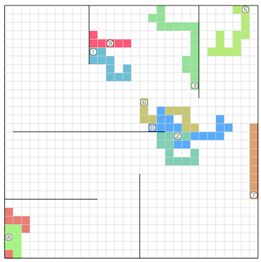

# AtCoder Heuristic Contest 052

- https://atcoder.jp/contests/ahc052

## 問題概要

- N \* Nマス(N\=30)のグリッドがあり、マスの外周に壁があり、一部のマスの間には壁が存在する場合がある
- M台(M\=10)のロボットを1つのコントローラで同時に操作する
  - 各ロボットの初期位置はあらかじめ与えられる
- コントローラにはK個(K\=10)のボタンがあり、各ロボットは個別にあるボタンが押されたときの行動を設定できる
  - 行動: 上下左右どれか隣接マスへ移動、または、その場で待機
- できるだけ少ない操作回数で、すべてのマスにどれか1台以上のロボットが訪問するように、各ロボットのボタンのアサイン、および、ボタンの操作列を求めよ

## 時間

- 4 時間

## 解説

- [AHCラジオ(解説放送)](https://www.youtube.com/watch?v=8NNjlan6AX0)
- [解説(日本語)](https://atcoder.jp/contests/ahc052/editorial)
- [解説(英語)](https://atcoder.jp/contests/ahc052/editorial?editorialLang=en)

- [AHC052勉強会レポート](https://zenn.dev/algoartis/articles/report_ahc052)
  - https://x.com/terry_u16/status/1965344668771909879
- [壁の持ち方(tomerunさん)](https://topcoder-tomerun.hatenablog.jp/entry/2025/08/25/092450)

## Links

- [twitter hashtag AHC052](https://x.com/hashtag/AHC052)
- [twitter search AHC052](https://x.com/search?q=AHC052)
