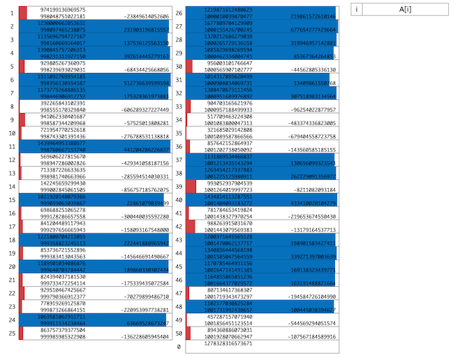

# 第12回Asprovaプログラミングコンテスト(AHC053)

- https://atcoder.jp/contests/ahc053

## 問題概要

- N(\=500)枚の何も書かれていないカードと、L以上U以下の一様ランダムかつ独立に整数値を生成する乱数生成器がある
  - L \= 10^15 - 2 \* 10^12
  - U \= 10^15 + 2 \* 10^12
- 最初、1以上U以下のN個の整数A_iを自由に選んでカードに書き込む
- 次に、乱数生成器によってM(\=50)個の整数B_jを生成する
- 最後に、生成された各整数B_jについて、カードの和がその整数値に近づくようにカードを割り当てる
  - このとき、割り当てないカードが存在しても良い
- できるだけ誤差が小さくなるように、整数A_iとカードの割当を求めよ
  - スコアは、誤差の和をEとしたとき、「round( (20 - log_10 (1+E) \* 5 \* 10^7 ) )」

## 時間

- 4 時間

## 個人的メモ

### アプローチ

#### LからUの一様乱数を1枚割り当てる

- もし、1枚ずつしか割り当てないとすると、LからUまでの一様乱数をN枚用意しておくことで、おおよそ近い値がある可能性がある
  - B_j はLからUが50個に分割されているのに対し、A_i は500個用意されるので、おおよそ、10^10 ぐらいのオーダーの誤差にできる

#### A_i を2進数的に用意する

- 自然な発想として、目標の B_j を2進数的に考えて、A_i を組み合わせで表現する方針が考えられる
- 各B_jについて考えると、1枚をLぐらいとすると、残りの9枚で4 \* 10^12 ぐらいの範囲を調整したい、ということになる
- この範囲を冪的( 40^x とか )に調整すると、大きいところでの誤差が大きくなってしまうので、2^x \* 10^9 とか、2^33 〜 2^42 とかで A_i を用意する
- このアプローチだと、誤差は 10^9 とかが限界のため、150ケースで80G点ぐらいが限界の模様

#### A_i を等比数列的に用意して、貪欲法で割当を決める

- 「A_i が大きい方から順番に、B_j (を超えず)に一番近づくやつに割り当てる貪欲」が強かった模様
- 貪欲法で、最初の方は大きく埋めたいが、最後の方では細かい調整をしたい、などを考えると指数的か等比数列的に用意したくなる
  - ただ、B_j はばらばらなので、同じ値を複数用意するより、すべて別の値で用意したほうが微調整ができる可能性がある
- この方向で個数や大きさなど調整するとかなり小さくできる模様
- (解説放送) シンプルそうでかなり強いアプローチ
  - Aの最初のM個を、Bを多めにシミュレーションして 各B_j の最小値にしておく
  - Aの残りは、4e12から0.96ぐらいの等比級数にしておく
  - 割当は上記の貪欲法で埋める

#### A_i をランダムに用意して、半分全列挙で割当を決める

- 今回、最上位では、K個の整数和がXになるようなものを見つける問題を考えて、半分全列挙で求めていたらしい
  - 順番に決めていく、両側探索する、ある山を一旦崩して残ってるA_iと合わせて再度最適に作り直す、など
  - A_i がランダムなのも重要そうで、また、\[L - α,U + α\)のように少し大きめで考えると良い模様
- Kは3、4枚ぐらいでもかなりよくなり、最上位は、うまく工夫して、6や8枚を使う場合でのアプローチができていた模様
- かなり強くで、ほぼ誤差0に近い答えが得られる

### 単純な近傍の焼きなましだとあまりうまくいかないかも

- 割当の部分は、雰囲気的には局所改善できそうに見える
- が、おそらく、A_i の種類や、近傍の用意の仕方(1点変更、2点swapだけとか)を結構気をつけないとちゃんと改善できないかも
  - A_i が指数的に用意していると、局所解から変化させるのが難しい
  - 温度調整・スケール調整や、複数個同士のswap、複数山を再構築、キックなどの大きめの近傍じゃないと改善できない
    - [AHC025](./ahc025.md)など参考

### 10^15スケールの調整方法

#### 各B_j に対して、 10^15 付近のカードを1枚用意しておく

- 各B_j について、1枚 10^15 付近のカードを入れておけば、残りは 10^12 の調整にできる
- 単純にL(やLよりちょっと小さいもの)を使うのもあるが、各 B_j よりちょっと小さいものが用意できると残りの誤差が小さくなるのでうれしい
- 何サンプルか B を生成して、各jについて最小値を採用するとかすると、各 B_j について小さめのものを用意できる

#### K枚使うことを前提とする

- 各B_jに割り当てるカードの枚数をK枚と決め打つと、「10^15 / K」ずつすべてのA_iに加算すればよいので、考えなくてよくなる
  - (指数的に用意する場合は枚数が固定だと厳しいかも)

### B_jの分布

- M個の整数B_jは、生成方法を見ると一様乱数をソートしたもので、一様分布の確率変数を順番に並べたk番目の値はベータ分布に従い、ベータ分布の期待値からk/(M+1)になる
  - [AHC044](./ahc044.md)
- なので、LからUの間で、おおよそ等間隔に近いB_jになる

### 誕生日攻撃

- [誕生日のパラドックス](https://ja.wikipedia.org/wiki/%E8%AA%95%E7%94%9F%E6%97%A5%E3%81%AE%E3%83%91%E3%83%A9%E3%83%89%E3%83%83%E3%82%AF%E3%82%B9)
- 「同じクラスに同じ誕生日の人がいる確率が50%を超えるには、クラスに何人いればよいか？」という問題で、366人いれば100%になるが、50%を超えるのにはわずか23人だけでよい
- これを応用した「誕生日攻撃」というものがあり、ある乱数(ハッシュ値)が同じもの(衝突)を効率的に探す
- 今回は、k個の和が目的の値B_jになるものを見つけたいが、それも研究されているらしい
  - https://www.iacr.org/archive/crypto2002/24420288/24420288.pdf

## 解説

- [AHCラジオ(解説放送)](https://www.youtube.com/watch?v=DiIGEzx8wgo)
- [解説(日本語)](https://atcoder.jp/contests/ahc053/editorial)
- [解説(英語)](https://atcoder.jp/contests/ahc053/editorial?editorialLang=en)

- [writer](https://x.com/t33f/status/1966866218130043283)
  - https://x.com/t33f/status/1966868458974703781
  - https://x.com/t33f/status/1966869144458142087
  - https://x.com/t33f/status/1966870241188937868
  - https://x.com/t33f/status/1966871246458769566
  - https://x.com/t33f/status/1966871833149591736
  - https://x.com/t33f/status/1966876460221952252
  - https://x.com/t33f/status/1966884238533554465
  - https://x.com/t33f/status/1967059309894004828
  - https://x.com/t33f/status/1967113729998549095
  - https://x.com/t33f/status/1967157424688951493
  - https://x.com/t33f/status/1967255123123708014

- [yosupoさん](https://x.com/yosupot/status/1966866154074550754)
  - https://x.com/yosupot/status/1966896981282087027
  - https://x.com/yosupot/status/1967140929632186733
  - https://x.com/yosupot/status/1967274321275240952
  - 満点解法: https://yosupo.hatenablog.com/entry/2025/09/15/213945
- [Rafbillさん](https://x.com/Rafbill_pc/status/1966880650440699938)
  - https://www.iacr.org/archive/crypto2002/24420288/24420288.pdf
- [olpheさん](https://x.com/_olphe/status/1966877643665797233)
  - https://x.com/_olphe/status/1966885785711636873
  - https://x.com/_olphe/status/1966887133161181681
  - https://x.com/_olphe/status/1966887346659618845
  - https://x.com/_olphe/status/1966891896305021196
  - https://x.com/_olphe/status/1966918612046016741
  - https://x.com/_olphe/status/1967043292681679075
  - https://x.com/_olphe/status/1967587093854781605
- [binapさん](https://x.com/kisara_splat/status/1966866167815156099)
  - https://qiita.com/binap/items/5ee61c1b87b78f9cb96c
- [riverwalk3さん](https://atcoder.jp/contests/ahc053/editorial/13861)
- [tomerunさん](https://x.com/tomerun/status/1966865949774278835)
  - https://x.com/tomerun/status/1966868013711573350
- [hitonanodeさん](https://x.com/rsat__m/status/1966871111062392911)
  - https://atcoder.jp/contests/ahc053/editorial/13877
- [HBitさん](https://x.com/toomerhs/status/1966866730002903277)
- [risujirohさん](https://x.com/risujiroh/status/1966866321062457398)
  - https://x.com/risujiroh/status/1966869405406724463
  - https://x.com/risujiroh/status/1966874410440421563
  - https://x.com/risujiroh/status/1966875546937422088
    - https://x.com/rsat__m/status/1966873259384991936
  - https://x.com/risujiroh/status/1966907947742884253
- [sig_256さん](https://x.com/sig_255/status/1966869596176363701)
  - https://x.com/sig_255/status/1966875474497507402
  - https://x.com/sig_255/status/1966886574479835186
- [semiexpさん](https://x.com/semiexp/status/1966866973306089853)
  - https://x.com/semiexp/status/1966868096737783856
- [yokozuna57さん](https://x.com/yokozuna_57/status/1966865080534134993)
  - https://x.com/yokozuna_57/status/1966868136843767905
- [Shun_PIさん](https://x.com/Shun___PI/status/1966864553679220774)
  - https://x.com/Shun___PI/status/1966865110284333401
  - https://x.com/Shun___PI/status/1966865490518905257
  - https://x.com/Shun___PI/status/1966866902430740590
  - https://x.com/Shun___PI/status/1966867436793479373
  - https://x.com/Shun___PI/status/1966870793188778107
  - https://x.com/Shun___PI/status/1966874368883257566
  - https://x.com/Shun___PI/status/1966877192383852830
  - https://x.com/Shun___PI/status/1966892787955351560
  - https://x.com/Shun___PI/status/1967916152040067192
- [FplusFplusFさん](https://x.com/FplusFplusF____/status/1966867004184515065)
- [uta_ccccさん](https://x.com/uta_cccc/status/1966867733238477206)
  - https://x.com/uta_cccc/status/1966868026898477479
- [Kahukaさん](https://x.com/kahuka0005/status/1966869545328713767)
- [nouka28さん](https://x.com/nouka28/status/1966869449350521217)
- [sashさん](https://x.com/sash277/status/1966866281984033037)
- [sky58さん](https://x.com/skyaozora/status/1966866260739961119)
- [tyokousagiさん](https://x.com/tyokousagi25/status/1966867477427876215)
  - https://note.com/tyokousagi/n/nfb84136655a9
- [kenchoさん](https://x.com/border_of_ymg/status/1966865015308534201)
  - https://x.com/border_of_ymg/status/1966867572886040783
  - https://x.com/border_of_ymg/status/1966874115115286739
  - https://x.com/border_of_ymg/status/1966874461057290751
- [jabeeさん](https://x.com/jabeeeeeeeeeee/status/1968187904162992147)
- [toamさん](https://x.com/torii_kyopro/status/1966864911042306110)
  - https://x.com/torii_kyopro/status/1966865813320986943
  - https://x.com/torii_kyopro/status/1966865874239058177
- [bresoさん](https://x.com/Carbon_so6/status/1966868871409004664)
  - https://x.com/Carbon_so6/status/1966865143041847318
- [kabipoyoさん](https://x.com/kabipoyo/status/1966866314087281139)
  - https://x.com/kabipoyo/status/1966873977093271604
- [takumi152さん](https://x.com/takumi152/status/1966867879896510650)
  - https://x.com/takumi152/status/1966948986985824562
  - https://x.com/takumi152/status/1966962570264539633
  - https://x.com/takumi152/status/1967094684444213355
  - https://x.com/takumi152/status/1967096372320154060
- [merom686さん](https://x.com/merom686/status/1966867664439283819)
- [mtsdさん](https://x.com/soiya_ksk/status/1966864714778243590)
  - https://x.com/soiya_ksk/status/1966866007051686365
  - https://x.com/soiya_ksk/status/1966869306815508842
- [yuuDotさん](https://yuudot.hatenablog.com/entry/2025/09/16/181100)
- [ocha_heavenさん](https://x.com/ocha_heaven/status/1966866709966712843)
  - https://x.com/ocha_heaven/status/1966864775369089527
- [saharanさん](https://x.com/shr_pc/status/1966867200817741982)
- [kotamanegiさん](https://x.com/small_onions/status/1966866667662962755)

## Links

- [twitter hashtag AHC053](https://x.com/hashtag/AHC053)
- [twitter search AHC053](https://x.com/search?q=AHC053)
