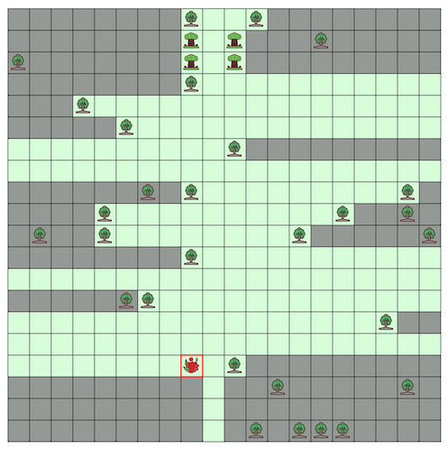

# ALGO ARTISプログラミングコンテスト2025夏(AHC054)

- https://atcoder.jp/contests/ahc054



## 問題概要

- N\*N (N\=20〜40)マスの森があり、範囲外は木で囲まれている
  - いくつかのマスには最初に木が存在している
- 森の入口から冒険者がやってきて、森の中に存在する花を見つけるまで行動する
- 冒険者の行動は、「現在位置」と「確認済みマス」を状態にして、未確認マスから1つ目的マスを選び、未確認マスは木がないものとして最短距離で移動する
  - 1ターンで1マス移動する
  - 各ターンの移動後、現在位置から上下左右に木のマスまでが確認済みマスとなる
  - 最短距離が同じ場合は、上下左右の優先順で移動先マスが選ばれる
  - 移動中に花が確認できたら目的マスを花のマスに変更して移動する
- ここで、各ターンごとに、未確認マスの空きマスに対して、木を設置できる
  - 順番としては、冒険者の位置がわかる→未確認マスに木を配置する→冒険者がマスを確認する、の順で処理される
  - 設置後は動かすことはできない
- 花が見つかるまでのターン数をできるだけ長くなるように、各ターンでの木の配置を考えよ

## 時間

- 240 時間

## 個人的メモ

### 迷路生成

- ターン数をできるだけ長くするためには、できるだけ冒険者が花を見つけられずに行ったり来たりするようにしたい
  - 雰囲気としては、毎ターン、離れたところに目的マスが設定されて、行ったり来たりする(右往左往させる)とターンが伸びそうと考えられる
  - また、できるだけ確認済みマスを増えないようにできると良さそうに思われる
- 今回は、配置だけでなく、インタラクティブ要素もあり、どのようにこれを実現するかがポイントだった

#### インタラクティブにガード

- (解説放送)
- 気持ちとしては、「できるだけ冒険者の確認済みマスが増えないほうが嬉しい」ので、冒険者の動きに合わせて、できるだけ確認済みマスが増えないように木を配置する、ことが考えられる
  - この場合、木を配置してしまうことで、訪問できないようになるマスができないようにする、ように注意
- 動き的に斜め移動のようになりやすく、かなり効率よい配置が生成される模様
  - 斜め方向への移動は手数がかかるので、冒険者のターン数を使わせるのに有効

#### 乱択生成

- 迷路を生成してシミュレーションで評価して良いものを選ぶ、ようにする
- 乱択DFS木(穴掘り法) (解説放送)
  - 迷路生成アルゴリズムとして、閉路ができないようランダムにDFSをすると木構造を作ることができる
  - 今回の場合、直線的に並ぶと、確認済みマスが一気に増えてしまう問題もあるため、できるだけ同じ方向に伸ばさないなどの工夫も

#### 局所改善

- シミュレーションが重いので、代理評価関数を用意して、それを最適化
  - 迷路生成後にシミュレーションして良いものを選ぶ、のも有効っぽい
- メインのパス(一本道)からサブのパス(L字っぽい感じ)がいくつも伸びていると考えると、メインのパスを行ったり来たりする問題と考えられる
- この場合、パス上の位置がわかると、期待値がパスの長さの線形時間で求められるので、これを最適化する、など
  - ただ、パスは入口と花を終端にしてしまうと、その終端付近でサブのパスをたくさん生やしたいが、スペースが足りないので、入口を終端にはしないほうがよさそう
  - 実際、探索とかしても、サブのパスはあんまり終端側によらず、メインのパスの全体に散らばるような感じになるみたい

#### 左右分割

- 真ん中付近で左右に分けるように木を設置して、左右を行ったり来たりするようにする
- このとき、外周に沿うようにパスを作ると、より長い経路を通って左右を行き来させることができる模様 (解説放送)
- それぞれの領域内をどうするかは、基本的には木構造な感じで、ルールや探索などで生成
- その他
  - 左右を先に用意して、その間はできるだけ長くなるようにパスを見つける
  - 斜め方向で分割して、左下と右上で領域を作る
  - など

### 花の防御

- いろいろ試していると、「花が移動途中で見つかってしまって、ターン数が少なくなる」(事故る)ケースがあることがわかる
  - これが起きると、うまくいくときは数千ターンとかなのに、これが起きると数十ターンとかになってしまうなどがあり得る
- 花をできるだけ冒険者から見えなくなるようにする必要があった
  - 花が目的マスになってしまった場合はどうしようもない

#### インタラクティブに防御

- 花の周囲4マスのうち、3マスは木で塞ぐことができる
- 各ターンで、冒険者の現在位置から花が見える場合に、それを防ぐように花の周囲を木で3回まで行うことができる
- また、以下のような配置で、左右どちらかから近づいたら塞ぐ、ようなパターンも (解説放送)

```
...TT
.TT..
T.f.T
..TT.
TT...
```


#### 配置パターンで防御

- 花(f)の周りを以下のように配置すると、花が見えるマスは、花の一つ下のマスだけなので、見つかりにくくできる

```
.T.
TfT
T..
.T.
```

- しかし、以下のように、左上付近が未確認状態のときに、冒険者が右下、目的マスが左上になると、花のところを通過して行こうとしてしまい、事故る可能性がある

```
.?.
?fT
T..
.T.
```

- 冒険者が右下に来る時点で、左上付近が先にすでに埋まっているのがわかっている状態になるよう、以下のように配置すると、より事故りにくくできる
  - 「の」の字のように1周させる

```
..TTT..
.T...T.
T..T..T
T.TfT.T
T.T...T
T..TTT.
.T.....
```

#### シミュレーションで確認

- シミュレーションを走らせてスコアを見ている場合は、事故るとスコアがかなり下がるので、事故りやすいパターンは採用されにくくなる

### シミュレーション

- テスターにコードがあるので、移植すれば、動かすことはできる

#### ランダム性への対処

- 目的マスの選び方にランダム性があり、かなりブレる可能性がある
- 上位の方では、目的マスの順を固定で複数個用意しておきそれらの平均を使うとか、多腕バンディット、などで選択してたみたい

#### 高速化

- テスターのコードある程度高速なので、そのままでも十分そう
- 毎ターン、BFSで最短距離を計算し直すと遅い
  - ターン数も数千〜数万とか行きうる
- BFSの結果が変わるのは確認済みマスが変化した場合だけなので、そのときだけ更新するようにすると高速化できる(テスターの方針)
- さらに、最短経路を求めてその経路上に木があった場合だけ経路が変わりうるので、その時だけ更新するようにするとより高速化される(解説放送)

### 解法間の比較、評価

- シミュレーションと同様に、ランダム性があるため、生スコアで解法の良し悪しを判断しようとすると、ブレなのか改善なのか判断が難しい
- 訪問順だけを変えて複数回実行して平均を見る、などしたほうが安定する
- https://x.com/kaede20203/status/1972823876121006258
  - https://x.com/shr_pc/status/1972987246187057503

### その他

#### 打ち切り出力

- 期間中、途中で仕様が更新されて、「-1」を出力すると、それ以降は0を出力したものとして処理される(しかもそのテスト時間が実行時間に含まれない)、打ち切り出力が追加された
- ターン数が増えると、「0」だけの出力がかなり増えて、テスターの(というより入出力)の時間がかかってしまう恐れがあった
- インタラクティブじゃない解法(最初に出力してあとは全部0にする解法)の場合は、これをやっておくべきだった

#### 長い経路を作る類題

- https://x.com/tomerun/status/1972608271174472138
  - 第2回RCO日本橋ハーフマラソン本戦

#### ルールベース、埋め込みを考える場合

- ルールベースやパターンの埋め込みなどの方針で考えるときに、最初からある木の配置によってはうまくいかない可能性がある
- 基本的には、木がない場合で考えて、うまくいくケースで割合やスコアを確認し、うまく行っていないケースへの対処(探索や調整、別処理、など)を考える

## 解説

(50位まで&発言を見つけられた方のみ)

- [AHCラジオ(解説放送)](https://www.youtube.com/watch?v=GYHbIZsT8iY)
- [解説(日本語)](https://atcoder.jp/contests/ahc054/editorial)
- [解説(英語)](https://atcoder.jp/contests/ahc054/editorial?editorialLang=en)

- [writerコメント](https://x.com/wata_orz/status/1972604096457953325)

- [saharanさん](https://x.com/shr_pc/status/1972605088113029354)
  - https://x.com/shr_pc/status/1972609322325770247
    - https://x.com/tomerun/status/1972608271174472138
  - https://x.com/shr_pc/status/1972611604727706052
  - https://x.com/shr_pc/status/1972613818565247439
  - https://x.com/shr_pc/status/1972614789680775651
  - https://x.com/shr_pc/status/1972615860587315528
  - https://x.com/shr_pc/status/1972616778569384257
  - https://x.com/shr_pc/status/1972620702152016306
  - https://x.com/shr_pc/status/1972625546178937306
  - https://x.com/shr_pc/status/1972626706713457130
  - https://x.com/shr_pc/status/1972635282509103196
  - https://x.com/shr_pc/status/1972739703733637199
  - https://x.com/shr_pc/status/1972987246187057503
  - https://blog.oimo.io/2025/10/05/ahc054/
- [Rafbillさん](https://x.com/Rafbill_pc/status/1972704986430841147)
- [bowwowforeachさん](https://x.com/bowwowforeach/status/1972625978326503919)
  - https://x.com/bowwowforeach/status/1972630878988939616
  - https://x.com/bowwowforeach/status/1973313078449283330
- [simanさん](https://x.com/_simanman/status/1972603340333982109)
  - https://x.com/_simanman/status/1972629553618342131
  - https://x.com/_simanman/status/1972607062015353307
  - https://x.com/_simanman/status/1973341487334301850
  - https://x.com/_simanman/status/1973342593665880298
  - https://x.com/_simanman/status/1975123153644073147
  - https://x.com/_simanman/status/1975135209294286999
  - https://x.com/_simanman/status/1976676072092787171
- [montplusaさん](https://x.com/montplusa/status/1972605579085660507)
  - https://x.com/montplusa/status/1972606884545966569
  - https://x.com/montplusa/status/1972608106694951231
  - https://x.com/montplusa/status/1972613413206716640
  - https://x.com/montplusa/status/1972650447015190922
  - https://x.com/montplusa/status/1972672981295096124
  - https://x.com/montplusa/status/1973005641884266893
  - https://x.com/montplusa/status/1973310059112440211
  - https://x.com/montplusa/status/1973400409940304149
  - https://x.com/montplusa/status/1975178004906262681
- [yunixさん](https://zenn.dev/algoartis/articles/ahc054_yunix_article)
  - https://x.com/yunix91201367/status/1974110828778651703
- [ymatsuxさん](https://x.com/ymatsux_ac/status/1972602564085731676)
  - https://x.com/ymatsux_ac/status/1972603099585081751
  - https://x.com/ymatsux_ac/status/1972603583058305108
  - https://x.com/ymatsux_ac/status/1972604455641391157
  - https://x.com/ymatsux_ac/status/1972604547811233871
  - https://x.com/ymatsux_ac/status/1972653973266895028
- [rhooさん](https://x.com/rho__o/status/1969326499846054396)
  - https://x.com/rho__o/status/1972610109571535330
  - https://x.com/rho__o/status/1972613977919361378
  - https://x.com/rho__o/status/1972614408422748339
  - https://x.com/rho__o/status/1973728629852127601
  - https://x.com/rho__o/status/1973728825495486598
  - https://x.com/rho__o/status/1973730268470186091
- [MathGorillaさん](https://x.com/MathGorilla_cp/status/1972603948382195895)
  - https://x.com/MathGorilla_cp/status/1972659343008076072
  - https://x.com/MathGorilla_cp/status/1972660981659566088
  - https://x.com/MathGorilla_cp/status/1972671729270190227
  - https://x.com/MathGorilla_cp/status/1972676310565871931
  - https://x.com/MathGorilla_cp/status/1972715196960714945
- [yochanさん](https://x.com/yochan_tech/status/1972604630774517781)
  - https://x.com/yochan_tech/status/1972616807514267844
- [Shun_PIさん](https://x.com/Shun___PI/status/1972610663420956847)
  - https://x.com/Shun___PI/status/1972611459508261251
  - https://x.com/Shun___PI/status/1972612493307703636
  - https://x.com/Shun___PI/status/1972612841984450793
  - https://x.com/Shun___PI/status/1972716422683123970
  - https://x.com/Shun___PI/status/1972718266817925315
  - https://x.com/Shun___PI/status/1973276628685037664
  - https://x.com/Shun___PI/status/1973277127995957686
- [semiexpさん](https://x.com/semiexp/status/1972614912846520620)
  - https://x.com/semiexp/status/1972615473285271965
  - https://x.com/semiexp/status/1972615583750598957
  - https://x.com/semiexp/status/1972616398271861245
  - https://x.com/semiexp/status/1972617290555498952
  - https://x.com/semiexp/status/1972617439633629515
  - https://x.com/semiexp/status/1972618084013031668
  - https://x.com/semiexp/status/1972628503007986091
  - https://x.com/semiexp/status/1972667485452218459
  - https://x.com/semiexp/status/1972668011413987737
  - https://zenn.dev/semiexp/articles/25305807dde94b
- [rabotさん](https://x.com/tanaka_a8/status/1972627391093862652)
- [kojimaさん](https://x.com/t33f/status/1972602848866439527)
  - https://x.com/t33f/status/1972603965704733169
  - https://x.com/t33f/status/1972607606687760851
  - https://x.com/t33f/status/1972609021476745240
  - https://x.com/t33f/status/1972610471359565899
  - https://x.com/t33f/status/1972647393360539826
  - https://x.com/t33f/status/1972662847575617840
  - https://x.com/t33f/status/1972663897598419217
  - https://x.com/t33f/status/1972665833915658397
- [yokozuna57さん](https://x.com/yokozuna_57/status/1972623981372113169)
- [terry_u16さん](https://x.com/terry_u16/status/1972607049717649803)
  - https://x.com/terry_u16/status/1972607420909441156
  - https://x.com/terry_u16/status/1972609227664543758
  - https://x.com/terry_u16/status/1972609909809381419
  - https://x.com/terry_u16/status/1972611349684654509
  - https://x.com/terry_u16/status/1972612976403427660
  - https://x.com/terry_u16/status/1972614532427301000
    - https://x.com/montplusa/status/1972613413206716640
  - https://x.com/terry_u16/status/1972615153876447269
  - https://x.com/terry_u16/status/1972616215098167410
  - https://x.com/terry_u16/status/1972655478812323962
  - https://x.com/terry_u16/status/1972666564785938577
  - https://x.com/terry_u16/status/1972690782705647980
  - https://x.com/terry_u16/status/1972710710124986753
- [mono_1729さん](https://x.com/mono_1729/status/1972621392215736590)
  - https://x.com/mono_1729/status/1972644037783179526
- [takytankさん](https://x.com/takytank/status/1972616203182264572)
  - https://x.com/takytank/status/1972620194825838776
  - https://x.com/takytank/status/1972621173923184747
  - https://x.com/takytank/status/1972659687335289332
  - https://x.com/takytank/status/1972829892279713924
  - https://x.com/takytank/status/1972830341758103868
  - https://x.com/takytank/status/1973735129236603030
- [twins_fuyuさん](https://x.com/Fuyu348867/status/1972609837143109727)
- [FplusFplusFさん](https://x.com/FplusFplusF____/status/1972605128680394844)
  - https://fplusfplusf.hatenablog.com/entry/2025/09/29/222251
- [hiro116sさん](https://x.com/hiro116s/status/1972603127670116852)
  - https://x.com/hiro116s/status/1972604580530954246
- [ossan343さん](https://x.com/ossan_343/status/1972697261072347192)
- [bird01さん](https://x.com/bird0148677302/status/1972610238730936349)
  - https://x.com/bird0148677302/status/1973405780935319923
- [Ang107さん](https://x.com/Ang_kyopro/status/1972602502194327670)
  - https://x.com/Ang_kyopro/status/1972610355710025859
  - https://x.com/Ang_kyopro/status/1972683757414162441
  - https://x.com/Ang_kyopro/status/1973268131239043436
  - https://x.com/Ang_kyopro/status/1973272764015583475
- [PrussianBlueさん](https://x.com/prussian_coder/status/1972605096291914202)
  - https://x.com/prussian_coder/status/1972642641927184847
  - https://prussianblue.hatenadiary.jp/entry/2025/09/29/223244
- [sh_unnnn_taroさん](https://x.com/sh_unnnn_taro/status/1972711351144603820)
  - https://x.com/sh_unnnn_taro/status/1972607283722117332
- [tardigradeさん](https://x.com/akTARDIGRADE13/status/1972603353806053873)
- [Moegiさん](https://x.com/mih28731325/status/1972606679645831338)
  - https://x.com/mih28731325/status/1972606813217677505
  - https://x.com/mih28731325/status/1972618880314138935
  - https://x.com/mih28731325/status/1972623791756022138
  - https://x.com/mih28731325/status/1972627413508251830
- [scat_nekoさん](https://x.com/ScatNeko/status/1972618897259147689)
  - https://x.com/ScatNeko/status/1972621375333662766
  - https://x.com/ScatNeko/status/1972627942875525541
  - https://x.com/ScatNeko/status/1972628305003381143
  - https://x.com/ScatNeko/status/1972631500547137711
  - https://x.com/ScatNeko/status/1972650841904664831
  - https://scat-neko.hatenablog.com/entry/2025/09/30/215805
- [wanuiさん](https://x.com/gmeriaog/status/1972608128719134871)
- [shira_111さん](https://note.com/shira_111/n/n7e35c98f6e25)
- [RinSakamichiさん](https://x.com/RinSakamichi/status/1972606587635372288)
- [kawateaさん](https://x.com/kawatea03/status/1972602919573983647)
  - https://x.com/kawatea03/status/1972605273820066169
- [fuppy0716さん](https://x.com/fuppy_kyopro/status/1972602906420633656)
  - https://x.com/fuppy_kyopro/status/1972606423709442389
  - https://x.com/fuppy_kyopro/status/1972610177309536696
  - https://x.com/fuppy_kyopro/status/1972608288014602476
  - https://x.com/fuppy_kyopro/status/1972676241183674454
    - https://x.com/montplusa/status/1972650447015190922
- [seicaさん](https://x.com/seica_at_se/status/1972611434644447696)
  - https://x.com/seica_at_se/status/1972612335631261755
- [tomerunさん](https://x.com/tomerun/status/1972604318609203693)
  - https://x.com/tomerun/status/1972608271174472138
  - https://x.com/tomerun/status/1972627776336490869
  - https://x.com/tomerun/status/1972633363753402472

## Links

- [twitter hashtag AHC054](https://x.com/hashtag/AHC054)
- [twitter search AHC054](https://x.com/search?q=AHC054)
- [simanさん統計](https://siman-man.github.io/ahc_statistics/054/)
- [wataさんの詳細な順位表](https://img.atcoder.jp/ahc_standings/index.html?contest=ahc054)
