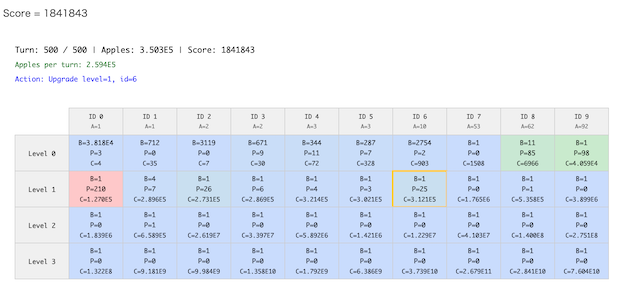

# ALGO ARTISプログラミングコンテスト2025師走(AHC058)

- https://atcoder.jp/contests/ahc058

## 問題概要

- N(\=10)種類のIDとL(\=4)種類のLevelからなるN\*L種類の機械がある
  - Level 0の機械は、りんごを生産する機械で、生産能力A_jがあらかじめ与えられる
  - Level i (i>0)の機械は、Level (i-1)の機械を生産する機械になっている
  - 各機械に対するコストC_{i,j}があらかじめ与えられる
  - 各機械には個数B_{i,j}とPower P_{i,j}の状態がある
- 最初、りんごはK(\=1)個あり、各ターンでは以下の手順で進行する
  - 機械(i,j)を強化するか、何もしない
    - 強化する場合は、C_{i,j}\*(P_{i,j}+1)個のりんごを消費し、P_{i,j}を1増やす
      - りんごの個数が負になる場合は強化できない
  - Level 0,1,2,3の順に、各IDの機械が生産する
    - Level 0の場合、りんごをA_j\*B_{i,j}\*P_{i,j}増加させる
    - Level i(i>0)の場合、個数B_{(i-1),j}をB_{i,j}\*P_{i,j}増加させる
- T(\=500)ターン終了時点でのりんごの数を最大化せよ

## 時間

- 4 時間

## 個人的メモ

### Cost Efficiency

- (ビジュアライザからも見れる)
- 入力生成方法のコストC_{i,j}は、C_{i,j}\=round(A_j \* 500^i \* 10^{rand_double(0,2)})となっており、乱数要素がある
- 10^rのrが小さいほど同じLevelでのコストが低く効率が良い

### 生産能力

- 生産能力A_jは、A_j\=round(10^{rand_double(0,2)})となっており、乱数要素がある
- j=0のときは1だが、最大100までありえるので、コストと合わせて生産能力も合わせて考える必要がある

### 強化の流れ

- 強化の仕方には自由度がありそうに見えるが、ターン数やりんごの数、Levelなどを考慮すると、大雑把は以下のような流れになる模様
- りんご数が少ないときは、Level 0の機械しかほとんど強化できない
  - コストC_{i,j}が低い機械がよいが、生産能力A_jが高い機械も選びたい
- ある程度りんごが溜まってきたら、Level 1の機械が強化できる
  - ここでもコストが低い機械を選びたいが、生産能力やLevel 2,3と強化することも考慮して選びたい
- さらにりんごが溜まってきたら、Level 2,3と機械を強化することで、生産数を増やせる
  - Level 3をできるだけ強化したいところだが、Powerが増えるほど必要りんご数も増えてしまい、それを回収しきれない場合は、Level 2以下を強化したするほうが最終的なりんご数は多くなりえる
  - Level i-1の機械のPowerが0の場合、Level iを先に強化しても意味がないため、基本的には、同じIDの機械のLevel 0,1,2,3のPowerを順番に上げる方が効率的な可能性が高い
    - 一つのIDに集中させるべきか、途中のLevelまでCost Efficiencyの低いIDでためて途中から生産能力の高いIDに注ぎ込んだ方が良いか、などは判断しにくい
- 探索空間で考えると、Levelを高めるIDをどれにするかで山(谷)がたくさんできまくる可能性がある

### アプローチ

#### 「それ以降"何もしない"にした時のりんご数」を評価値として貪欲

- 現在のターンで、どの機械を強化するか？を評価関数で選ぶ貪欲を考える
- ある機械を強化した後、それ以降"何もしない"を繰り返した場合はスコア下限値と考えられるので、これを評価関数として考えることができる
  - これは、単純にO(T N L)でシミュレーションしてもよい
- 最終ターンでのスコア最大のものを選ぶ貪欲は、団子解(437位 732,772,084点)になっていたみたい
- 最終ターンではなく、定数の場合は60ターン後ぐらい、変数の場合は現在のターンの半分ぐらいのターン数後でのスコアをみると良くなったりする
  - https://x.com/semiexp/status/2000150801122304255
- このアプローチだと、Levelを上げるIDの選び方が状況次第になってしまい、よくないIDでLevelを上げてしまおうとする問題がある
- Level 0はどのIDでも選んで良いとして、Level 1以上は決まったIDしか選べないようにする(そのIDは全探索)などすると、スコアが改善する(8.0G点ぐらい)
  - 決まったIDでは評価値を高めにする、なども

#### チェックポイントn段階貪欲

- (解説放送)
- ある(i,j)をチェックポイントとして、そこを強化するまでは「チェックポイントを取るまでに必要なターン数をできるだけ少なくする」、チェックポイントを強化したら「そのiのみに集中してできるだけ最終的なりんご数を多くする」のを目指す
  - 気持ちとしては、基本的には、集中投資したいIDに対して、Level 1を最速で取りに行くと、それ以降の投資に使えるターン数が増えてうれしい
- チェックポイント1つでi=1のみだと8.1G点ぐらい
- チェックポイントを複数用意することも可能で、チェックポイント2つの場合は、i_1=1 & i_2\=anyにして、チェックポイント通過後はその2つのIDだけ選べるようにしたりすると、8.31G点ぐらい
  - (スコア計算は高速化しないと厳しそうだし、ターン計算式やターンやスコアがタイの時の処理とか気をつけないと細かい部分で差がでそう)
- ハッシュで多様化、スコア計算を高速化などするとかなりビーム幅取れるようで、スコアがさらにあがるらしい
  - チェックポイントまでをビームにするとかも

#### 強化順を局所改善

- 今回、上位の方では、強化順(操作列)を焼きなましにした人が多かった模様
- 固定長の操作列ではなく、強化したい順の操作列にする
  - 「強化できるまで待つ」ようにする
  - https://x.com/montplusa/status/2000256800550183337
- 近傍は結構大事そうで、単純な1点の追加・削除・変更、隣接swap以外に、同じのが連続しやすいように1点複製や、後半のLevel上げするIDをまとめて変えるような大きい近傍を入れるとスコアが結構のびる(8.4G点〜ぐらい)
- その他の工夫
  - 区間を貪欲で作り変え
  - n段階にする
    - IDだけで強化できる最大Levelを強化する焼きなまし→(ID,Level)で焼きなまし
    - 時間を区切ってそれぞれを最適化→全体を最適化
  - Cost Efficiencyなどで重み付け
  - など

#### 他のアプローチ

- 各機械の強化回数上限を焼きなまし(状態の評価は高速な評価関数で貪欲)
- 貪欲やビーム解を焼きなましで改善
- Level高めるIDを決めてビムサ(そのLevelが強化できるまでskipする遷移)

### 「それ以降"何もしない"にした時のりんご数」の計算の高速化

- ある状態で、その後は「何もしない」を選択し続ける場合、増え方が規則的になるので、O(N L)で求められる
  - 各IDごとに独立にO(L)で求められる
- 真面目にやると面倒なので、AIなのに投げてコードを生成してもらう
- 導出メモ(真面目にやった場合)
  - あるIDについて、現時刻を0として、時刻tでの各機械数$B_{i}(t)$を考える
  - Level 3の機械の個数は変化しないので、ずっと$B_3(t) = B_3(0)$のまま
  - Level 2の機械は、Level 3の機械の影響を受けるので、$B_2(t) = B_2(0) + Σ_{k=0}^{t-1} B_3(t) P_3$ になる
    - これは単純に、
    - $B_2(t) = B_2(0) + B_3(0) P_3 t$
  - Level 1の機械は、Level 2の機械の影響を受けるので、漸化式的には $B_1(t) = B_1(0) + Σ_{k=0}^{t-1} B_2(k) P_2$ になる
    - ここで、$B_2(t)$をΣのところに代入すると、
    - $B_1(t) = B_1(0) + Σ_{k=0}^{t-1} (B_2(0) + B_3(0) P_3 k) P_2$
    - $B_1(t) = B_1(0) + ( t B_2(0) + t (t-1) / 2 \cdot B_3(0) P_3 ) P_2$
    - $B_1(t) = B_1(0) + t B_2(0) P_2 + t (t-1) / 2 \cdot B_3(0) P_3 P_2$ となる
  - Level 0の機械は、Level 1の機械の影響を受けるので、漸化式的には $B_0(t) = B_0(0) + Σ_{k=0}^{t-1} B_1(k) P_1$ になる
    - 同様に、上記の$B_1(t)$を代入すると、
    - $B_0(t) = B_0(0) + t B_1(0) P_1 + t (t-1) / 2 * B_2(0) P_2 P_1 + t (t-1) (t-2) / 6 \cdot B_3(0) P_3 P_2 P_1$
  - 最終的に、増えるりんご数は、$A Σ_{k=0}^{t-1} B_0(k) P_0$ で、同様に代入して整理すると、
    - $A P_0 ( t B_0(0) + t (t-1) / 2 \cdot B_1(0) P_1 + t (t-1) (t-2) / 6 \cdot B_2(0) P_2 P_1 + t (t-1) (t-2) (t-3) / 24 \cdot B_3(0) P_3 P_2 P_1 )$
    - $= A P_0 ( Comb(t,1) B_0(0) + Comb(t,2) B_1(0) P_1 + Comb(t,3) B_2(0) P_2 P_1 + Comb(t,4) B_3(0) P_3 P_2 P_1 )$

### りんごの数が64bit整数に収まるか

- Scoreでいうと、符号付きだと63bit分で、1ケース6,300,000ぐらいのスコアが出る場合は問題になる
  - 超えてもおかしくなさそうだが、実際超えるかどうか見積もりが難しい、、、
- 実際は、うまく調整されているためか、そこまでスコアはでないようで、符号付き64bit整数で十分だった
  - ただし、計算途中でT=500を超えて考えてたりすると超える可能性があるので注意

### その他

#### fishelene(AI)が1位

- ついにAIが1位に
- https://x.com/y_imjk/status/2000159477996376493
  - AIは合計5000回ぐらい呼び出しているみたいで、試行錯誤回数の桁が違う、、、
- https://x.com/y_imjk/status/2001544650159722816

#### 元ネタ

- 放置ゲー、Incremental Game
- https://x.com/TT_beginner/status/2000144107503788078
- https://x.com/tomerun/status/1998077581686636714

## 解説

(50位まで&発言を見つけられた方のみ)

- [AHCラジオ(解説放送)](https://www.youtube.com/watch?v=3Cl18fS3elk)
- [解説(日本語)](https://atcoder.jp/contests/ahc058/editorial)
- [解説(英語)](https://atcoder.jp/contests/ahc058/editorial?editorialLang=en)

- [writerコメント](https://x.com/itigo_purokonn/status/2000185123376070889)
  - https://x.com/itigo_purokonn/status/2000205084009873824
  - https://x.com/itigo_purokonn/status/2000212334204383545
  - https://x.com/itigo_purokonn/status/2000479799970795739
  - https://x.com/itigo_purokonn/status/2000507650367435033
  - https://x.com/itigo_purokonn/status/2000511552085262785

- [fishyleneさん](https://x.com/y_imjk/status/2000150504081662234)
  - https://x.com/iwiwi/status/2000152492479533221
  - https://x.com/wata_orz/status/2000448648556183627
  - https://x.com/y_imjk/status/2001544650159722816
  - https://sakanaai.github.io/fishylene-ahc058/
- [yosupoさん](https://x.com/yosupot/status/2000118854165602400)
  - https://x.com/yosupot/status/2000145325684916384
  - https://x.com/yosupot/status/2000164672398606512
  - https://x.com/yosupot/status/2000903467800662316
- [takumi152さん](https://x.com/takumi152/status/2000146915443565016)
  - https://x.com/takumi152/status/2000149079805080006
- [rhooさん](https://x.com/rho__o/status/2000145301982859735)
  - https://x.com/rho__o/status/2000146022274859087
  - https://x.com/rho__o/status/2000147213574603183
  - https://x.com/rho__o/status/2000148276742647882
  - https://x.com/rho__o/status/2000154155927900552
  - https://x.com/rho__o/status/2000161965889786358
  - https://x.com/rho__o/status/2000162572511928456
- [yochanさん](https://x.com/yochan_tech/status/2000145781878292657)
  - https://x.com/yochan_tech/status/2000154730761527451
- [Shun_PIさん](https://x.com/Shun___PI/status/2000145884445851735)
  - https://x.com/Shun___PI/status/2000146589512503524
  - https://x.com/Shun___PI/status/2000146935249060324
  - https://x.com/Shun___PI/status/2000155290738868539
  - https://x.com/Shun___PI/status/2000166232453206431
  - https://x.com/Shun___PI/status/2000171074399723550
  - https://x.com/Shun___PI/status/2000189723642630590
  - https://x.com/Shun___PI/status/2000191844458860667
  - https://x.com/Shun___PI/status/2000199402980581542
- [semiexpさん](https://x.com/semiexp/status/2000150801122304255)
- [montplusaさん](https://x.com/montplusa/status/2000256800550183337)
- [Moegiさん](https://x.com/mih28731325/status/2000145150006194668)
  - https://x.com/mih28731325/status/2000165023088623714
- [toamさん](https://x.com/torii_kyopro/status/2000144278916579472)
  - https://x.com/torii_kyopro/status/2000146193813471268
  - https://x.com/torii_kyopro/status/2000150167618810023
- [noimiさん](https://x.com/noimi_kyopro/status/2000143868713718021)
  - https://x.com/noimi_kyopro/status/2000144295832203350
  - https://x.com/noimi_kyopro/status/2000144770258399341
  - https://x.com/noimi_kyopro/status/2000145522703962269
  - https://x.com/noimi_kyopro/status/2000147488121188820
- [ganmodokixさん](https://x.com/AprilGanmo/status/2000155884547457124)
  - https://x.com/AprilGanmo/status/2000156832611115098
  - https://x.com/AprilGanmo/status/2000159027658215491
- [i_takuさん](https://x.com/i_taku0810/status/2000181419243639254)
- [wanuiさん](https://x.com/gmeriaog/status/2000147141311021446)
- [Jinapettoさん](https://x.com/Jinapetto/status/2000148372024614958)
- [E869120さん](https://x.com/e869120/status/2000147327458447850)
- [RinSakamichiさん](https://x.com/RinSakamichi/status/2000145235733884996)
- [maze1230さん](https://x.com/pazzle1230/status/2000144463654785082)
- [yunixさん](https://x.com/yunix91201367/status/2000144793134150010)
  - https://x.com/yunix91201367/status/2000145259247153459
- [mech_39さん](https://x.com/fuwaorune/status/2000146013961798069)
  - https://x.com/fuwaorune/status/2000147524582322445
- [cuthbertさん](https://x.com/ethylene_66/status/2000144076650512433)
  - https://x.com/ethylene_66/status/2000147998588936624
  - https://x.com/ethylene_66/status/2000160189560033340
  - https://x.com/ethylene_66/status/2000162875122606214
- [hakoshieさん](https://x.com/hakoshie_/status/2000147860961263835)
- [tnktsykさん](https://x.com/wtSkJVkk7x8433/status/2000144515911516613)
- [Qroさん](https://x.com/Qrowbis384/status/2000148645728162075)
  - https://x.com/Qrowbis384/status/2000152559483572595
  - https://x.com/Qrowbis384/status/2000166019151835141
- [maeda3さん](https://x.com/dj_maeda3/status/2000162219137634389)
  - https://x.com/dj_maeda3/status/2000162407763869953
- [scat_nekoさん](https://x.com/ScatNeko/status/2000147097371422821)
  - https://x.com/ScatNeko/status/2000150267766178249
  - https://scat-neko.hatenablog.com/entry/2025/12/15/222417
- [bowwowforeachさん](https://x.com/bowwowforeach/status/2000155641961410848)
  - https://x.com/bowwowforeach/status/2000157103072457203
- [mtmr_s1さん](https://x.com/mtmr_s1/status/2000147260487950525)
- [Ueddyさん](https://x.com/_kueda/status/2000167023259897890)
- [Boleroさん](https://x.com/10mlx10/status/2000146864860254336)
- [tomerunさん](https://x.com/tomerun/status/2000150368865710473)
  - https://x.com/tomerun/status/2000146590884094173
  - https://x.com/tomerun/status/2000165457014469033
  - https://x.com/tomerun/status/2000197416172282034
  - https://x.com/tomerun/status/2000513556429856858
- [nesyaさん](https://x.com/yuui_nesya/status/2000146063144190224)

## Links

- [twitter hashtag AHC058](https://x.com/hashtag/AHC058)
- [twitter search AHC058](https://x.com/search?q=AHC058)
