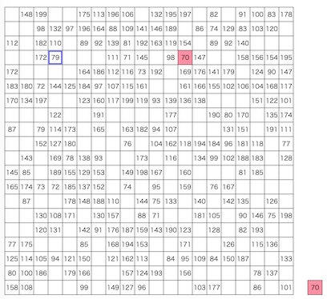

# AtCoder Heuristic Contest 059

[TOC]

## 問題概要

- https://atcoder.jp/contests/ahc059
- N\*N (N\=20)マスの盤面がある
- 0 〜 N^2 / 2 - 1までの番号が書かれたカードがそれぞれ2枚ずつあり、各マスにはいずれかのカードがちょうど1枚ずつ置かれている
- 初期状態として、左上のマスにからの山札を持った状態から開始し、以下の操作を繰り返す
  - 操作1: 現在位置の上下左右に隣接するマスに移動
  - 操作2: 現在位置にカードがある場合、そのカードを山札の一番上に移動させることができる。山札の上から2枚のカードが一致した場合はその2枚を取り除ける
  - 操作3: 現在位置にカードがない場合、山札の一番上のカードを現在位置に置くことができる。カードがすでにある場合は置くことはできない
- できるだけ移動回数が少ない操作手順を求めよ
  - 操作は最大で2 \* N^3 回行うことができる
  - 操作2と操作3は、操作回数の最大回数では考慮するが、評価には含まれないことに注意

## 時間

- 4 時間

## 個人的メモ

### 類題

- グリッド上の「移動」と「持つ/置く」の操作の類題として[AHC049](./ahc049.md)がある
- AHC049では「置く」操作がなくても良いスコアが出ていたのに対して、置くことでより改善する問題をリベンジ、だったとのこと
- ただ、コンテストでの上位はまたもや「置く」操作をしない人が多かった模様、、、

### アプローチ

#### 1ペアずつ処理する

- N^2 / 2 個の番号の順列を考えて、順番に、その番号の時は盤面上の該当するペアを回収する、ように考えることができる
- これは、TSPっぽく移動距離が少なくなる列を求めれば最適化できる
- これはスタックを全く使わず、ペア間の距離は絶対必要になるためそこがネックになってしまうが、ここから色々改善を考えることができる

#### ペアの片方を全部積む

- (解説放送)
- 上記のアプローチはスタックを全く使わなかったが、逆にフルで使うことを考える
- 同じく順列を考えるが、ペアの片方の番号をスタックを最大まで積んで、全部積んだら逆順に回収する
- 後半の回収は一意に決まるので、前半の回収順の順列を同様に焼きなましなどで最適化できる

#### 1ペアずつ貪欲に挿入

- (解説放送、writer想定解)
- X枚の回収するカード(ペアを区別)の列があるとき、そこに含まれない番号のペアをその列に入れることを考える
- それぞれを列のどこかの位置に番号を入れる場合は、その前後のカードとの距離だけ移動距離が増加する
  - 片方はどこでも入れられるが、もう片方はそれがスタックの一番上にあるときに回収する必要があるのでいくつかの位置に制約される
- カードx、カードyをその順で入れる場合の最適な位置の探索は、stackで、xをその位置に入れた場合の増加量を保持しながら、y側の計算時にstackの情報を参照しながら計算すればよい
- 残り全部から一番コストが小さくなるものを選ぶとか、距離が長い/近いペア順でいれるとか、ランダムシャッフルで時間いっぱい回すとか工夫の余地がある
  - ある程度入れて経路が決まっていてそこにペアを入れることを考えると、距離が短いペアは連続で取るような動きも取りやすいが、距離が長いペアはそれがしにくいので効果的な位置の候補が少ない可能性がある？
- これは操作3を使う場合にも拡張できて、置く位置など考える状態が増えるが、これはdpで最小コストな移動方法を計算できる(とはいえ結構難しく、細かい工夫は必要)

#### 局所改善系

- 操作2の対象となるカードの列(回収順序、訪問順)を考えて、それを局所改善できないか考える
- おそらく近傍の種類や高速化で結構差が大きそう？
  - 区間操作やほぼO(1)での検証など

##### 再挿入山登り(部分破壊再構築)

- ある解から、1ペア(または何ペアか)を除いても、残りについてはvalidな状態が保たれる
- 除いたものを再度貪欲に入れるようなことを山登りすると、より改善できる
- https://atcoder.jp/contests/ahc059/editorial/15052

##### カッコ列と考える

- カッコ列として考えると考えやすい
  - 「(3 (1 1) 3) (0 0) (2 2)」みたいなイメージ
- 双方向連結リスト＋各カードのポインタで持つと、高速に近傍操作ができる
- メモ
  - あるペアを除いて入れ直そうとした時、ペアの前括弧の位置を決めると、validの後ろ括弧の位置はいくつか候補ができるが、候補列挙などすると重い
  - 列挙などせずに、連続ペアとして入れる、あるペアの直前・直後に入れる、などvalidなものだけに限定してたくさん試すほうがよいかも

##### 木構造と考える

- 木の頂点に番号を持たせると、カードの列はオイラーツアーに対応する
- 木の頂点の変更として考えると、部分木の移動やリバース・回転操作、子ノードをいくつかまとめ上げつつそれらの親ノードとして追加(途中挿入)みたいな複雑な近傍なども考えやすくなる
  - 一旦、木から除いてから再度入れる、というふうにすると、ループなども起きないので考えなくて良い
  - 差分計算も高速にできるが、実装が結構大変

## 解説

(50位まで&発言を見つけられた方のみ)

- [AHCラジオ(解説放送)](https://www.youtube.com/watch?v=p1fH48FzirY)
- [解説(日本語)](https://atcoder.jp/contests/ahc059/editorial)
- [解説(英語)](https://atcoder.jp/contests/ahc059/editorial?editorialLang=en)

- [writer解](https://x.com/wata_orz/status/2009929854867976484)

- [chokudai社長](https://x.com/chokudai/status/2009929761506897946)
  - https://x.com/chokudai/status/2009932074460033054
- [hitonanodeさん](https://x.com/rsat__m/status/2009929903152738697)
  - https://x.com/rsat__m/status/2009930850222354745
  - https://atcoder.jp/contests/ahc059/editorial/15052
- [poteto167さん](https://atcoder.jp/contests/ahc059/editorial/15029)
- [cuthbertさん](https://x.com/ethylene_66/status/2009932902503756054)
  - https://x.com/ethylene_66/status/2009935414069735831
  - https://x.com/ethylene_66/status/2009936577301299666
  - https://x.com/ethylene_66/status/2009972849860325761
- [fuppy0716さん](https://x.com/fuppy_kyopro/status/2009930225837322635)
  - https://x.com/fuppy_kyopro/status/2009931943400620145
  - https://x.com/fuppy_kyopro/status/2009933320701022536
- [mtsdさん](https://x.com/soiya_ksk/status/2009931023220662564)
  - https://x.com/soiya_ksk/status/2010182039274958961
- [semiexpさん](https://x.com/semiexp/status/2009931017524858964)
  - https://x.com/semiexp/status/2009930857667297771
- [kawateaさん](https://x.com/kawatea03/status/2009930555031453975)
  - https://x.com/kawatea03/status/2009943741440897162
- [riantkbさん](https://x.com/rian_tkb/status/2009930127027913156)
  - https://x.com/rian_tkb/status/2009928699496542695
- [ponjuiceさん](https://x.com/PonponJuice0/status/2009930437272186999)
- [tmbさん](https://x.com/tombo_ac/status/2009931747027505276)
  - https://x.com/tombo_ac/status/2010039206018773100
- [MathGorillaさん](https://x.com/MathGorilla_cp/status/2009931965747925493)
  - https://x.com/MathGorilla_cp/status/2009933168330322102
  - https://x.com/MathGorilla_cp/status/2009942106857713771
  - https://x.com/MathGorilla_cp/status/2009946454908113187
- [syndromeさん](https://x.com/syndro_6/status/2009932064393703860)
- [Ueddyさん](https://x.com/_kueda/status/2009938973037342780)
- [G4NP0Nさん](https://x.com/G4NP0N/status/2009930451310518653)
  - https://x.com/G4NP0N/status/2009931837351834071
  - https://x.com/G4NP0N/status/2009931913516188010
  - https://x.com/G4NP0N/status/2009933538343432204
  - https://x.com/G4NP0N/status/2009934105543385574
  - https://x.com/G4NP0N/status/2009934368517828883
  - https://x.com/G4NP0N/status/2009941333637771340
- [sky58さん](https://x.com/skyaozora/status/2009929574944276706)
  - https://x.com/skyaozora/status/2009984586693112073
- [Jinapettoさん](https://x.com/Jinapetto/status/2009932061159964934)
- [maeda3さん](https://x.com/dj_maeda3/status/2009931391174357403)
  - https://x.com/dj_maeda3/status/2009931680514248746
  - https://x.com/dj_maeda3/status/2009933808116920470
- [tempura0224さん](https://x.com/tempuracpp/status/2009929130675187785)
  - https://x.com/tempuracpp/status/2009932917754212845
- [imurayaさん](https://x.com/rine_orz/status/2009932343692407163)
- [rabotさん](https://x.com/tanaka_a8/status/2009951465335599589)
- [paleApricotさん](https://x.com/paleApricot/status/2009931838312329493)
- [Ang107さん](https://x.com/Ang_kyopro/status/2009928654944690303)
  - https://x.com/Ang_kyopro/status/2009929236539421152
  - https://x.com/Ang_kyopro/status/2009929368643211386
  - https://x.com/Ang_kyopro/status/2009929966516089101
  - https://x.com/Ang_kyopro/status/2009934123440451632
  - https://x.com/Ang_kyopro/status/2009934743371178042
  - https://x.com/Ang_kyopro/status/2010419041475952827
  - https://x.com/Ang_kyopro/status/2010589407406080210
  - https://x.com/Ang_kyopro/status/2010596781701357679
  - https://x.com/Ang_kyopro/status/2010632363571818639
- [noimiさん](https://x.com/noimi_kyopro/status/2009928787362980342)
  - https://x.com/noimi_kyopro/status/2009933356591661265
- [PrussianBlueさん](https://x.com/prussian_coder/status/2009931671446139314)
  - https://x.com/prussian_coder/status/2009944559833493696
- [throughさん](https://x.com/through__TH__/status/2009931630908215743)
  - https://x.com/through__TH__/status/2009931052765368753
- [k1suxuさん](https://x.com/k1suxu/status/2009931806074880241)
- [nohtarayさん](https://x.com/nohtaray/status/2009932888612151384)
- [gasinさん](https://x.com/_gacin/status/2009930492347568506)

- [AA社勉強会レポート](https://zenn.dev/algoartis/articles/report_ahc059)
- 延長戦
  - https://x.com/Rafbill_pc/status/2009950467087081782

## Links

- [twitter hashtag AHC059](https://x.com/hashtag/AHC059)
- [twitter search AHC059](https://x.com/search?q=AHC059)
