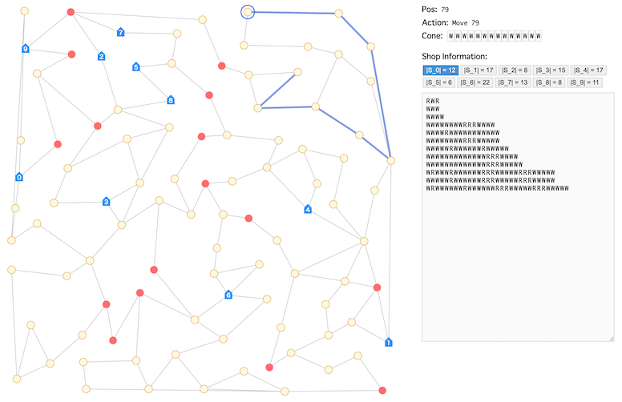

# RECRUIT 日本橋ハーフマラソン 2026冬(AHC060)

[TOC]

## 問題概要

- https://atcoder.jp/contests/ahc060
- N頂点M辺の無向グラフがあり、各頂点は「アイスクリームショップ」か「アイスクリームの木」になっている
- 「アイスクリームの木」では、その木に設定された種類(バニラアイスかストロベリーアイス)が収穫できる
- アイスクリームショップからスタートし、以下の行動をTターン繰り返す
  - 行動1(移動, 収穫/納品): 隣接頂点に移動(ただし、1つ前の頂点には戻れない)し、頂点に応じて、以下を行う
    - アイスクリームの木: アイスの収穫し、手元のコーンに積んで多段アイスにする(WとRからなる文字列で表現する)
    - アイスクリームショップ: 手元の多段アイスをすべて納品する
  - 行動2(味変): アイスクリームの木、かつ、設定がバニラアイスになっている場合、ストロベリーアイスに設定し直す(次の訪問から有効)
- 各アイスクリームショップに納品される多段アイスの種類数を最大化せよ

## 時間

- 4 時間

## 個人的メモ

### アイス文字列の長さ

- コンテスト開始後早い段階で15万点付近が出てたりして、おおよそ必要な納品時のアイス文字列の長さが見積もれる
- 順位表は150ケースでの結果なので、1ケースあたり1000点ぐらいで、T\=10000ターンなので、重複納品がないならば、アイス文字列の長さは平均長さ10以下ぐらいを狙う必要がある
  - 平均長さ9なら166667点、平均長さ8なら187500点ぐらい
- 味変にもターンを使うので、それを考えると、平均8〜9ぐらいの長さになる必要があり、アイス文字列を伸ばすことで重複しないようにするアプローチはあまり有効ではない

### Uターン禁止制約

- 「直前の頂点には戻れない」という制限がある
- (解説放送) もし許すと、長さ4のサイクルで任意のアイス文字列が生成可能

### アプローチ

- 「経路をどう選ぶか」と「味変タイミングはどうするか」をある程度分けて考えるのが良かった模様

#### 適当な確率で味変 + BFS

- あるショップにいるとき、他のショップまでのパスをBFSで生成し、できるだけ短い、かつ、そのショップにないアイス文字列が生成できるようにする
- 長さを制限して、そこまでで重複なし納品ができるパスが見つけられなければ、適当に味変を入れて移動、を繰り返す
- 見つけられない時その移動は無駄にしてしまうが、頂点を最後に訪問したタイミングを覚えておけば、その通った時に味変していたとして、今回のパスから有効にすることもできる(過去改変)
- ここらへんの貪欲をどうするかはバリエーションがありえて、やりかたによってかなり良いスコアが狙えた模様

#### 味変タイミングの探索

- 味変は、いつ・どこを、するとよいかがよくわからないし、その味変ペースも重要
- 「いつ赤に変えるか」を状態にして、焼きなましなどで探索する
  - tターン以降に訪問して頂点がWだったら必ずRにする
- ターンが多いので、試行回数があまりできない(1000回ぐらい？)が、それでもスコアがでるよう
- 前処理で、各ショップから11ターン以下で移動できるショップまでのパスを全列挙しておく、とか

#### 1手ずつ進める貪欲/ビームサーチ

- ショップ間パスではなく、1手ずつ進める貪欲/ビームサーチ
- 状態重いかも？と思ったけど、差分更新ビムサができるよう
- 評価関数の調整や重複排除など気をつける必要がある

#### その他

- 評価関数ベースでランダムウォーク
- 味変を「k手分」とみなして扱う
- ローリングホライズン的に解いていく
- 味変する確率を段階的に高くしていく
- ターンと頂点でDPする

### その他

#### アイス文字列の持ち方

- 文字列として持つと無駄が多いので、0,1のビット列で持つとサイズを小さくできる
  - 長さも長くしないなら、16bit整数(ちょっと怪しいかも)や32bit整数で持てる
- ただ、WとWWの区別がつかないので長さが分かる情報を入れる必要がある
  - 長さを別に持つ(32bitなどだと上の方は空きがあるのでそこにいれるとかも？)
  - (解説放送)
    - 先頭を1にして長さを区別する
    - 長さごとに別配列で管理する
    - bool配列で、該当する数字のindexのところを1にすることで保持

## 解説

(50位まで&発言を見つけられた方のみ)

- [AHCラジオ(解説放送)](youtube.com/watch?v=rlLQo-55_ss)
  - [解説スライド](https://img.atcoder.jp/ahc060/AHC060.pdf)
- [解説(日本語)](https://atcoder.jp/contests/ahc060/editorial)
- [解説(英語)](https://atcoder.jp/contests/ahc060/editorial?editorialLang=en)

- [writerコメント](https://x.com/tomerun/status/2017962209482301821)
  - https://x.com/tomerun/status/2017964280000495681
  - https://x.com/tomerun/status/2017973064953376954
  - https://x.com/tomerun/status/2017966225918468575
  - https://x.com/tomerun/status/2018992460568166900

- [Sweet_Sweet_Soulさん](https://zenn.dev/sweetsweetsoul/articles/993dc8e81fc55f)
  - https://x.com/amai_amai_taro/status/2017963463453364351
  - https://x.com/amai_amai_taro/status/2017966376879845861
- [Ang107さん](https://x.com/Ang_kyopro/status/2017962965195194837)
  - https://x.com/Ang_kyopro/status/2018001077845811346
  - https://x.com/Ang_kyopro/status/2018014063524216948
  - https://x.com/Ang_kyopro/status/2017976513979924580
- [Shun_PIさん](https://x.com/Shun___PI/status/2017961452708245578)
  - https://x.com/Shun___PI/status/2017962069279351175
  - https://x.com/Shun___PI/status/2017962723800502720
- [notkamonohasiさん](https://x.com/notkamonohasi_2/status/2017965363842195703)
- [tanakhさん](https://x.com/tanakh/status/2017966108419166322)
  - https://x.com/tanakh/status/2017967213458952472
  - https://x.com/tanakh/status/2017968645142691977
  - https://x.com/tanakh/status/2017980941994688905
  - https://x.com/tanakh/status/2017982198369186167
  - https://x.com/tanakh/status/2017982302920532107
  - https://x.com/tanakh/status/2018151745764155620
- [cuthbertさん](https://x.com/ethylene_66/status/2017962221037597042)
  - https://x.com/ethylene_66/status/2017965946720366698
- [yosupoさん](https://x.com/yosupot/status/2017965224058568927)
- [terry_u16さん](https://x.com/terry_u16/status/2017963786687373447)
  - https://x.com/terry_u16/status/2017964755324227929
  - https://x.com/terry_u16/status/2017965791845732860
  - https://x.com/terry_u16/status/2017966893429334213
- [Bondo416さん](https://x.com/bond_cmprog/status/2017965131007971417)
  - https://x.com/bond_cmprog/status/2017962517251948856
- [kawateaさん](https://x.com/kawatea03/status/2017963490317906274)
- [riantkbさん](https://x.com/rian_tkb/status/2017962636391182360)
- [syndromeさん](https://x.com/syndro_6/status/2017969573606436982)
- [SuppliLionさん](https://x.com/Suppli_Lion/status/2018086431252721700)
- [besukohuさん](https://x.com/besukohu/status/2017965470499148184)
- [tishii24さん](https://x.com/tishii2479/status/2017967122769703414)
  - https://x.com/tishii2479/status/2017972688879509512
- [semiexpさん](https://x.com/semiexp/status/2017962482661478465)
  - https://x.com/semiexp/status/2017963538866991512
  - https://x.com/semiexp/status/2017976397554397480
  - https://x.com/semiexp/status/2017976758797234366
- [kenchoさん](https://x.com/border_of_ymg/status/2017963925778919726)
  - https://x.com/border_of_ymg/status/2017966281425899590
- [tyokousagiさん](https://x.com/tyokousagi25/status/2017964730196148291)
- [bowwowforeachさん](https://x.com/bowwowforeach/status/2018092663959117867)
  - https://x.com/bowwowforeach/status/2018093612438032573
- [mikuさん](https://x.com/ekidenp/status/2017969427606827078)
- [hirakuuuuさん](https://x.com/hirakuuuuuuu/status/2017968894200422634)
- [iwashi31さん](https://x.com/iwashi31/status/2017963266270753143)
  - https://x.com/iwashi31/status/2017962606246674724
- [hiro116sさん](https://x.com/hiro116s/status/2017962946891325882)
- [tnktsykさん](https://x.com/wtSkJVkk7x8433/status/2017963986822877472)
- [hotpepsiさん](https://x.com/hotpepsi/status/2017963059579597209)
- [kaz49bzさん](https://x.com/kaz_d37/status/2017965511691403310)
- [takumi152さん](https://x.com/takumi152/status/2017963953348104607)
- [tetra4さん](https://x.com/tetra4_cp/status/2017964373160165591)
- [fuppy0716さん](https://x.com/fuppy_kyopro/status/2017961762327527731)
  - https://x.com/fuppy_kyopro/status/2017970312361775223
  - https://x.com/fuppy_kyopro/status/2018694576081379475
- [nohtarayさん](https://x.com/nohtaray/status/2017991748195352683)

- 延長戦
  - https://kcpc.hatenablog.com/entry/2026/02/02/162802

## Links

- [twitter hashtag AHC060](https://x.com/hashtag/AHC060)
- [twitter search AHC060](https://x.com/search?q=AHC060)
