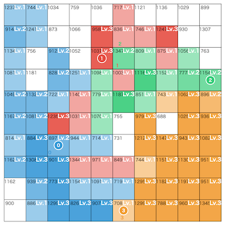

# THIRDプログラミングコンテスト2026(AHC061)

[TOC]

## 問題概要

- https://atcoder.jp/contests/ahc061
- N\*Nマスの土地があり、M人のプレイヤーが陣取りゲームを行う
- プレイヤー0は高橋くんで、それ以外はAIが操作する
- 各プレイヤーは、初期領土の1マスに駒がある状態からスタートする
- 各マスは価値VとレベルLを持ち、レベルはゲームの進行で変化しうる
  - 誰の領土でもない場合はレベル0で、誰かの領土になったら、行動によってレベルが変化する
- Tターンで以下の手順で進む
  - 各プレイヤーの移動先の決定
    - 自分の領土を経由して到達できるマス集合(到達可能領土)とその隣接するマス、かつ、他のプレイヤーの駒がないマスへ移動先を選ぶことができる
  - マスの競合解決
    - 移動先が被った場合は、マスの種類に応じた競合解決がされる
  - 領土の更新
    - 占領: 誰の領土でもないマスを選択した場合、自分の領土としてレベル1にする
    - 強化: 自分の領土の場合、レベルを1上げる(ただし、Uまでしか上げられない)
    - 攻撃: 他人の領土の場合、レベルを減少させる。レベルが0にできたら同時に自分の領土のレベル1にできる
  - 駒の復帰
- 各プレイヤーのスコアは、終了時の領土のΣ V_p \* L_p
- 自分のスコアをS_0、一番スコアが高いAIのスコアをS_Aとしたとき、S_0 / S_A をできるだけ大きくするように、各ターンの行動を設定せよ

## 時間

- 240 時間

## 個人的メモ

### 敵のスコアを落とす

- 今回の問題は、S_A(敵スコアトップ)が分母に来ているため、敵スコアトップが大きいと、自分のスコアが高くても、S_0 / S_A が大きくならない
  - 分子のS_0(自分のスコア)は、自軍マスの占領・強化したものから敵に攻撃されたものを引いた感じになっているので、できるだけ攻撃されない方が良い
- 分母が小さくなるためには、「敵同士が攻撃し合っている」ような状態か、「自分が敵を攻撃して敵のスコアを下げる」動きが必要になる
  - 誰にも攻撃されずに強化しまくる感じの敵がいると崩すのが難しく、スコアが落ちたりするので、ある程度妨害できるような陣形になっている必要がある
  - 自分が他のAIから閉じ込められたりするとひどいことになりうる

### 手元での評価

- 今回の問題は、ランダム要素があり、実行結果でスコアが結構ブレる
- 100ケース程度だとどっちの解法がよいのか判断しにくい
  - システムテストは3000ケースで、手元でも2000ケースぐらい以上で見てみないと判断しにくい
- 分散より小さい改善は良くなったかの判断もしにくいので、多めのテストケースで(高速に)検証できる環境の準備は大切だったかも
- 暫定順位表は100ケースでの値だったので、システムテストでは結構シェイクしていた
- 絶対スコアが増えたからといって相対スコアが高くなるとは限らない
- M\=2の評価
  - M\=2のときは敵陣地を小さくできるか否かで大きくスコアが変わってしまう
  - 自分の結果をベースに見積もるときも、うまくいったやつとそうでないやつがあって、そこの違いで良し悪しがよくわからなくなる可能性がある
    - (相対評価の絶対最大スコアの部分はなんらか固定値とか評価したほうが良かったかも)

### AIのパラメータ推定

- AIのパラメータがおおよそ分かると、次のAIの行動の予測精度が上がる

#### wの比率を推定するとよい?

- 貪欲行動では「V\*w」の最大値を使うため、wの絶対値というよりwの比率がわかればよい
  - wの絶対値がズレていても比率が同じなら行動は同じ
- 一つを固定して、他はその割り算したものを推定するとかで、1つ次元が落とせる
- ただ、各比率を独立に扱うのには若干問題があるようで、たとえばwaを固定した場合、waによって各比率は相関するけど、独立に扱うとそれが反映されない問題がある
  - waが0.3ぐらいの場合は各比率は1.0〜3.3、waが1.0ぐらいの場合は各比率は0.3〜1.0になるのに、独立に推定すると、0.3と3.3みたいな同時にはありえないような粒子も作成しうる
    - 特に最初の初期化時など

#### (推定結果の評価)

- 貪欲行動の観測結果は最大マスの情報だけなので、整合するwの組が複数ありえるため、真値の予測は難しい
- また、観測が限られているので、不十分なパラメータが異常な値になっていても、行動予測には影響しない可能性がある
- 推定パラメータの推定というより、行動予測ができるかの方を評価したほうがよいっぽい
  - 基本的には貪欲行動なので多少雑でも当たったり、epsがあるので予測が無理というのがあり、今回の問題ではある程度行動予測できていればよかった模様

#### パーティクルフィルタ(粒子フィルタ)

- 上位で多かった手法
- 各AIごとにそのAIのパラメータを粒子として持つパーティクルフィルタを用意
  - - https://ja.wikipedia.org/wiki/%E7%B2%92%E5%AD%90%E3%83%95%E3%82%A3%E3%83%AB%E3%82%BF
- 毎ターン、移動先と候補集合が得られるので、その粒子の場合の尤度が計算できる

#### その他

- 焼きなまし尤度最大化
  - 尤度が高くなるように焼きなましで調整
- グリッドベイズ
  - 各AIのパラメータの範囲を荒く分けて、その組み合わせについて、その組み合わせが正しい確率を持たせると、観測情報から事後確率を更新できる
- EMアルゴリズム
  - https://atcoder.jp/contests/ahc061/editorial/16465

### アプローチ

#### 貪欲行動だけを考慮したchokudaiサーチ/ビームサーチ

- M\=2やM\=3等向けに、chokudaiサーチやビームサーチでの探索が結構有効だった模様
- 敵の候補手は全部調べるわけではなく「(AIのパラメータを推定した上で)貪欲行動をしたと仮定した場合のマス1つ」に固定して、自分の候補手をchokudaiサーチやビームサーチで何ターン後かまで求めて一番良いものの最初の自分の手を毎ターン選ぶ、ような感じ
- 自分の手の良さ(良い手順)を評価するような感じで、相手が1人とかでそこまで深く読むわけでなければ、実際のズレも小さいので有効みたい
  - https://x.com/komakoko_X/status/2026165931802849316

#### 原始モンテカルロ

- 今回上位で多かった手法
- 毎ターン、自分の候補手について、何ターン分かランダム/貪欲にプレイ(ロールアウト、プレイアウト)を複数回実行して、一番良いものを選ぶのを繰り返す、感じ
  - 質の良いロールアウトで、大量に実行できることが重要だった
  - 上位は、毎ターン、15ターン前後ぐらいの深さまでを少なくとも500〜1000回以上ぐらいはロールアウトできていた模様
- 細かい改善ポイントがあって、そこら辺で差が結構出ていそう
  - ビット演算などで限界高速化する
  - ロールアウトの質を高める
  - 乱数をできるだけ揃えて分散を安定させる
  - UCB1やSuccessive Halvingで効率よく調べる
  - 関節点を攻撃するようにする
  - 無駄そうなマスは除外(敵の高Vマスや自軍の孤立低Vマスなど)
  - 初期位置をいい場所選ぶようにする
  - MやU、スコアトップの敵かどうか、など区別して細かくチューニングする
  - など
  - (スコアのスケールやバランスなど調整要素も多く、うまく噛み合わないとスコアが伸びないかも)
- ロールアウト終端での評価関数などは改善したくなるが、なかなかいじっても効果が出にくかったかも、、、
  - 数ターンだけしかやっていないと未来の情報がないので、なんらか評価関数に入れたい気持ちになるが、できるだけロールアウトを軽くして、たくさん試す方が有効だったかも
  - 評価関数や盤面評価値などをNNなどで学習させる、optunaなどで最適化させる、など
    - https://x.com/terry_u16/status/2025875792190996636
- ロールアウト時の貪欲
  - 自分の手を候補手からランダムに選ぶと、実際の流れと異なるシミュレーションをしてしまう可能性がある
  - マスの種類ごとに評価値(乱数要素あり)を決めて選ぶ貪欲などにすると良い模様
    - パラメータなどは良いものを探索
    - スコアトップの敵かどうか区別する
    - など
  - 自分もAIの動きと同じように決める(または少し改変)、敵の行動をThompsonサンプリングにする、なども
- スコアの変換
  - 問題では「S_0 / S_A」を最大化したいとなっているが、実際の得点(絶対スコア)は「10^5 \* log_2(1 + S_0 / S_A)」で異なっている
  - 局所探索やビームサーチなどで最大値を使う場合と違って、モンテカルロでは平均値を使うので、スコアの変換が違うと結果が変わりうる
    - logとると、外れ値が弱められて分散が小さいものが有利になりやすい模様
      - Jensenの不等式
    - https://ang107.hatenablog.jp/entry/2026/02/23/232701
- その他
  - MCTSなども有効みたい？

#### 強化学習

- 結構多くの人が強化学習で解こうと試みられたかも？
  - ただし、きちんと結果が出るところまでいけてた人が少なそう
- ざっくりとは、各種盤面情報(Vの(正規化)値、各プレイヤーの陣地、AIの次の手予測確率、など)を入力、最終スコアを報酬などにして、数百回のプレイをしてモデルを更新、を繰り返すようなイメージ
  - AIのパラメータ推定なしやランダムから学習を開始してもある程度のスコアは出る模様
- モデル選択、学習方法、入力の与え方(素性設計)、報酬設計、ハイパラ探索、サンプリング効率の改善、モデルをどうやってソースコードに埋め込むか、など、ベースラインが作れてもスコアを伸ばすためにはいろいろ工夫が必要
  - 学習アルゴリズムは、AlphaZero系や、Policy Gradient系(PPO、A2C、IMPALA)あたり？
  - モデルは、MLP、CNN、ResNetとか？
  - https://speakerdeck.com/kuto5046/kagglesimiyuresiyonkonpedeqiang-hua-xue-xi-niqu-rizu-mutokinotips
  - プレイやモデルの学習などを高速に回したくなるので、コア数の多いCPUやGPUが使いたい
  - 入力で、敵をスコア順ソートしてから与える、とかも有効みたい
- 1位の方はコードを公開してくださっている
  - https://github.com/chettub/AHC061-RL
  - ResNet + PPOの模様
- https://x.com/Shun___PI/status/2026243121248678280
- https://speakerdeck.com/shun_pi/ahc061jie-shuo?slide=31
- https://x.com/montplusa/status/2025881361215823972

#### その他

- U\=1は、殴り合い的になるが、低いVのマスからできるだけ埋める感じのアプローチも有効だった
- M\=2は、相手と1対1なので、相手の領土を潰しつつ、敵に接近し、攻撃と防御をうまくやって、抑え込むようにできると高スコアが狙えた
  - 自分は「Level2マスで囲むこと&囲めたら維持」を目指してしまったが、囲みを作るのが失敗したり、相手陣地が大きい状態で囲みを作るとスコアが伸びないため、実はそんなに良くなかった
    - 完全に囲めていなくても似たような状況にできたり、攻防をうまくできるような動きの方がよいケースなどがある

### ハイパラ調整

- 今回、入力は、M(プレイヤー数)とU(最大レベル)がいくつかあった(合計で35パターン)
  - M=2やU=1はやや特殊で、それ用のソルバーなどを考えても良かった
- 基本的には、解法にパラメータなどのチューニング要素がある場合、各MとUごとに探索して決めた方が良い
  - とはいえ結構大変なので、35パターンを100ケースずつとかで3500ケース用意して、パラメータを変えて試してみて、各パターンについてよさそうなものを選ぶ、とか
    - 各パターン独立に100ケースだけだとブレが大きいので、MやUごとだったり、ガウス過程回帰とかしてみたり、など

### 候補選択の効率化の調整

- (あまり言及されてないかもだけど、結構重要そうな部分)
- 原始モンテカルロなどの場合、自分の候補手を選ぶところで、効率よく探索する工夫をしていた人が多そうだが、結構人によって違いがありそうかも？
- UCB1系(固定Cを使う問題)
  - 「平均スコア(k) + C \* sqrt(ln N / n_k)」の形のUCB1を使っている場合、係数Cは平均スコアのスケールに合わせて調整する必要があるが、この調整がまずいと十分探索しないような挙動になる可能性がある
    - 例えば、候補手がたくさんあっても、ほぼtop1の手しか調べないような挙動
    - 特定の手順だと高スコアみたいな場合はその手順じゃない場合はスコアがでないので、最初の方で当たり手順を引けてないと見落とされてしまう可能性がありえそう
  - 全ケースで同じCを使うのはよくなさそうで、少なくともMやUごとに調整したほうがよさそうだし、同じテストケース内でも状況でスコアスケールが違う可能性があるので、そこら辺も考慮して調整できるとよいかも
    - 分散など考慮したスケール調整を入れる、平均分散を使って正規化する、状況ごとにCを変える、UCB1-tuned、など
- Successive Halvingなど段階的に候補を絞る系
  - UCB1での係数C調整の問題がないので、安定的に候補を絞り込めてそう
  - ラウンド数や候補の残し方など結構工夫の余地がある
- その他
  - トンプソンサンプリング

### ビット演算/SIMDによる高速化

- https://speakerdeck.com/shun_pi/ahc061jie-shuo?slide=28

#### bitboard

- 100マスなので、各マスで0/1なら、64bit整数2つ(か128bit整数1つ)で表現できる
- [AHC046](./ahc046.md)でも話題になっていたが、BFSが高速に計算できる
  - [bitboard](../Library/bitboard.md)

#### pdepによる「k番目の1になっているビットを取り出す」操作

- https://x.com/terry_u16/status/2025875792190996636
- pdep自体は、maskで1になっているところにsrcをばら撒くような操作
  - https://atcoder.jp/contests/abc269/editorial/4858
- `pdep(1<<k, b)`のようにすると、ビット列で1になっているk番目の位置のものが得られる
- 「1になっているものからどれかランダムに1つ選ぶ」ような操作をしたい場合、ループせずにO(1)で取得できるので高速化できる可能性がある
  - CPUによるみたいで、必ずしも高速になるかはやってみないとわからないらしい
- 3x3連結性(関節点)判定の高速化も
  - https://x.com/Ang_kyopro/status/2025944892644708481

#### SIMD計算

- 粒子フィルタなどで、float8つ分/double4つ分をSIMD(AVX2)でまとめて計算できる
- 自動ベクトル化に期待したいような気もするけど、条件とか次第でしてくれないみたいなので、やってくれてなさそうだったら自分で書くのがよさそう

### その他

#### 敵パラメータの真値を使った検証

- 敵のパラメータはローカルテスターではわかっているので、貪欲行動時のマスの推定が完璧にできた場合のスコアと比較することができる
  - 乱数まで見てランダム行動を含む動きまで完全に予測してしまうと違うゲームになってしまうようなので、そこまではしないほうがよさそう

#### Common Random Numbers(CRN)

- https://speakerdeck.com/shun_pi/ahc061jie-shuo?slide=27
- 分散を抑えるテクニック
- ロールアウトでのseedを揃えると、乱数によるブレの影響を抑えることができる
  - 改善しそうだけど、途中の行動での影響が大きそうなので、今回の問題だと限定的かも

#### Vの生成

- 入力生成方法での「Vの生成の方法」のところで、盤面がランダム気味か山や丘みたいなのができるかの違いがあった
  - m\=0は正規分布、m\=1は円傾斜、m\=2は円塗りつぶし、m\=3はひし形傾斜、m\=4はひし形塗りつぶし
- 傾斜などがあると徐々に敵が集まって攻撃し合う感じになり、スコアが取りやすい可能性があったかも

#### プレイヤー同士の対戦

- https://x.com/Carbon_so6/status/2025908217784737996

#### ビジュアライザ、ツール、お絵かき、など

- https://x.com/MohutonLab_comp/status/2025880613052669997
- https://x.com/_simanman/status/2025938438042820835
- https://x.com/Koi1583/status/2025873593859756093
- https://zubassyaaaaaaaaaaaaan.hatenablog.com/entry/2026/02/23/201428
- https://x.com/komakoko_X/status/2025881108982985046
- https://x.com/y_kawano/status/2025930305195188463
- https://x.com/pop_left/status/2025922227817115999

#### 詳細順位表

- 右上のUsageでいろいろ機能があることが確認できる
- scatterにして点をダブルクリックするとそのケースのビジュアライザが表示される

## 解説

(50位まで&発言を見つけられた方のみ)

- [AHCラジオ(解説放送)](https://www.youtube.com/watch?v=WruChw5_H5o)
  - [解説スライド](https://speakerdeck.com/shun_pi/ahc061jie-shuo)
- [解説(日本語)](https://atcoder.jp/contests/ahc061/editorial)
- [解説(英語)](https://atcoder.jp/contests/ahc061/editorial?editorialLang=en)

- [writerコメント](https://x.com/Shun___PI/status/2024463035944095999)
  - https://x.com/Shun___PI/status/2025861782141833460
  - https://x.com/Shun___PI/status/2025874216055443659
  - https://x.com/Shun___PI/status/2025874401221390833
  - https://x.com/Shun___PI/status/2025875110616510679
  - https://x.com/Shun___PI/status/2025878042971877702
  - https://x.com/Shun___PI/status/2025880293916442711
  - https://x.com/Shun___PI/status/2025882097198710860
  - https://x.com/Shun___PI/status/2025883048953467163
  - https://x.com/Shun___PI/status/2025886001751793925
  - https://x.com/Shun___PI/status/2025887804086186182
  - https://x.com/Shun___PI/status/2025898534403539304
  - https://x.com/Shun___PI/status/2026127592844411377
  - https://x.com/Shun___PI/status/2026130575791403022
  - https://x.com/Shun___PI/status/2026141271556046913
  - https://x.com/Shun___PI/status/2026163742053142695
  - https://x.com/Shun___PI/status/2026164373111353839
  - https://x.com/Shun___PI/status/2026245612283547754
  - https://x.com/Shun___PI/status/2026246194813636926
  - https://x.com/Shun___PI/status/2026243121248678280
  - https://x.com/Shun___PI/status/2026503172689412503
  - https://x.com/Shun___PI/status/2026510312015593477
  - https://x.com/Shun___PI/status/2026534450826457300
  - https://x.com/Shun___PI/status/2026677031925317772

- [cuthbertさん](https://x.com/ethylene_66/status/2025874266370232561)
  - https://x.com/ethylene_66/status/2025874818298695986
  - https://x.com/ethylene_66/status/2025875219395862871
  - https://x.com/ethylene_66/status/2025875735844712908
  - https://x.com/ethylene_66/status/2025876081992187996
  - https://x.com/ethylene_66/status/2025876785678987397
  - https://x.com/ethylene_66/status/2025873412363882918
    - https://github.com/chettub/AHC061-RL/blob/main/BLOG_ja.md
  - https://x.com/ethylene_66/status/2025880001485438988
  - https://x.com/ethylene_66/status/2025881289078034921
  - https://x.com/ethylene_66/status/2025881515734061193
  - https://x.com/ethylene_66/status/2025886237815648659
  - https://x.com/ethylene_66/status/2025887300245475736
  - https://x.com/ethylene_66/status/2025887628370100645
    - https://x.com/montplusa/status/2025887206792220847
  - https://x.com/ethylene_66/status/2025902721963016598
  - https://x.com/ethylene_66/status/2025923565967847432
  - https://x.com/ethylene_66/status/2025924674610442252
  - https://x.com/ethylene_66/status/2025934521997357160
  - https://x.com/ethylene_66/status/2025939730282783083
  - https://x.com/ethylene_66/status/2025879219000246560
  - https://x.com/ethylene_66/status/2026146156330496240
  - https://x.com/ethylene_66/status/2026191949888426000
  - https://x.com/ethylene_66/status/2026249273529262361
  - https://x.com/ethylene_66/status/2026452209333055770
- [nikajさん](https://atcoder.jp/contests/ahc061/editorial/16461)
- [terry_u16さん](https://x.com/terry_u16/status/2025873522875421120)
  - https://x.com/terry_u16/status/2025874302671921388
  - https://x.com/terry_u16/status/2025876345792979121
  - https://x.com/terry_u16/status/2025876877823684788
  - https://x.com/terry_u16/status/2025878925235433818
  - https://x.com/terry_u16/status/2025875400757506206
  - https://x.com/terry_u16/status/2025879644294217901
  - https://x.com/terry_u16/status/2025881931368603663
  - https://x.com/terry_u16/status/2025882267298799843
  - https://x.com/terry_u16/status/2025883608607867071
  - https://x.com/terry_u16/status/2025884149001974201
  - https://x.com/terry_u16/status/2025884916437966853
    - https://qiita.com/ocxtal/items/762ac3adbf145ce31250
  - https://x.com/terry_u16/status/2025885898676850844
  - https://x.com/terry_u16/status/2025887945400696885
  - https://x.com/terry_u16/status/2025888586273575289
  - https://x.com/terry_u16/status/2025889404469010748
  - https://x.com/terry_u16/status/2025893498323677525
  - https://x.com/terry_u16/status/2025896598509867267
  - https://x.com/terry_u16/status/2025902809099722891
  - https://x.com/terry_u16/status/2025904811368161529
  - https://x.com/terry_u16/status/2025908074578633102
  - https://x.com/terry_u16/status/2025911996064166384
  - https://x.com/terry_u16/status/2025919465620484392
  - https://x.com/terry_u16/status/2025942130519367832
  - https://x.com/terry_u16/status/2025960954538959307
  - https://x.com/terry_u16/status/2025967187903799732
  - https://x.com/terry_u16/status/2025977000868077709
  - https://x.com/terry_u16/status/2025978276792131960
  - https://x.com/terry_u16/status/2026132330319052893
  - https://x.com/terry_u16/status/2026163294487396356
  - https://x.com/terry_u16/status/2026208449869283369
  - https://x.com/terry_u16/status/2026419919785701549
- [Ang107さん](https://x.com/Ang_kyopro/status/2025873288954847638)
  - https://x.com/Ang_kyopro/status/2025875406344384633
  - https://x.com/Ang_kyopro/status/2025879942467293680
  - https://x.com/Ang_kyopro/status/2025880255014314070
  - https://x.com/Ang_kyopro/status/2025880829709398340
  - https://x.com/Ang_kyopro/status/2025882535147033037
  - https://x.com/Ang_kyopro/status/2025883132231364862
  - https://x.com/Ang_kyopro/status/2025883714014822442
  - https://x.com/Ang_kyopro/status/2025885426733683031
  - https://x.com/Ang_kyopro/status/2025890015386157176
  - https://x.com/Ang_kyopro/status/2025896282242556380
  - https://x.com/Ang_kyopro/status/2025900952684028078
  - https://x.com/Ang_kyopro/status/2025903373158154253
  - https://x.com/Ang_kyopro/status/2025907497777996229
  - https://x.com/Ang_kyopro/status/2025928202544435396
  - https://ang107.hatenablog.jp/entry/2026/02/23/232701
  - https://x.com/Ang_kyopro/status/2025944296739000825
  - https://x.com/Ang_kyopro/status/2025943531672732081
  - https://x.com/Ang_kyopro/status/2026145715593138480
  - https://x.com/Ang_kyopro/status/2026160011530190957
  - https://x.com/Ang_kyopro/status/2026161448720978323
  - https://x.com/Ang_kyopro/status/2026165334668185921
  - https://x.com/Ang_kyopro/status/2026324138575769756
  - https://x.com/Ang_kyopro/status/2026324995857891341
  - https://x.com/Ang_kyopro/status/2026325648692932761
  - https://x.com/Ang_kyopro/status/2026504757469392899
  - https://x.com/Ang_kyopro/status/2026991497942548531
- [sor4chiさん](https://x.com/sor4chi/status/2025876065890205739)
  - https://x.com/sor4chi/status/2025885192003711167
  - https://x.com/sor4chi/status/2026168802371891471
- [bowwowforeachさん](https://x.com/bowwowforeach/status/2025923502344491334)
- [titan23さん](https://titan-23.hatenablog.com/entry/2026/02/25/061131)
- [soto800さん](https://x.com/MohutonLab_comp/status/2025874615273460183)
  - https://x.com/MohutonLab_comp/status/2025875707663184118
  - https://x.com/MohutonLab_comp/status/2025875964727799842
  - https://x.com/MohutonLab_comp/status/2025876298980303204
  - https://x.com/MohutonLab_comp/status/2025876939630862640
  - https://x.com/MohutonLab_comp/status/2025877673730576405
  - https://x.com/MohutonLab_comp/status/2025877857847935127
  - https://x.com/MohutonLab_comp/status/2025878789495099706
  - https://x.com/MohutonLab_comp/status/2025880613052669997
  - https://x.com/MohutonLab_comp/status/2025882372949127356
  - https://x.com/MohutonLab_comp/status/2025882862260834360
  - https://x.com/MohutonLab_comp/status/2025883169032188097
  - https://x.com/MohutonLab_comp/status/2025883588252897757
  - https://x.com/MohutonLab_comp/status/2025883846173233648
  - https://x.com/MohutonLab_comp/status/2025885249100816704
  - https://x.com/MohutonLab_comp/status/2026425557337125158
- [simanさん](https://x.com/_simanman/status/2025874921138835744)
  - https://x.com/_simanman/status/2025875669759205380
  - https://x.com/_simanman/status/2025876741722697972
  - https://x.com/_simanman/status/2025877075744424145
  - https://x.com/_simanman/status/2025877442242744703
  - https://x.com/_simanman/status/2025880485227102493
  - https://x.com/_simanman/status/2025881119678427303
  - https://x.com/_simanman/status/2025882108582146138
  - https://x.com/_simanman/status/2025882794099159360
  - https://x.com/_simanman/status/2025928198589231505
  - https://x.com/_simanman/status/2025928533407858992
  - https://x.com/_simanman/status/2025938438042820835
  - https://x.com/_simanman/status/2026245532323328348
  - https://x.com/_simanman/status/2026248498702930412
  - https://x.com/_simanman/status/2026249129597559010
  - https://x.com/_simanman/status/2026445456461705233
- [rhooさん](https://x.com/rho__o/status/2025877272750944309)
- [G4NP0Nさん](https://x.com/G4NP0N/status/2025874865321033999)
  - https://x.com/G4NP0N/status/2025875536300622276
  - https://x.com/G4NP0N/status/2025876462776336817
  - https://x.com/G4NP0N/status/2025878179613995448
  - https://x.com/G4NP0N/status/2025876135733760498
  - https://x.com/G4NP0N/status/2025884882933891354
  - https://x.com/G4NP0N/status/2025891079489462549
  - https://x.com/G4NP0N/status/2025927022686646638
  - https://x.com/G4NP0N/status/2026350070908727446
- [HBitさん](https://x.com/toomerhs/status/2025874416153063589)
  - https://x.com/toomerhs/status/2025874962217910593
  - https://x.com/toomerhs/status/2025876565570343076
  - https://x.com/toomerhs/status/2025882998177136844
  - https://x.com/toomerhs/status/2026625913325236368
- [fuppy0716さん](https://x.com/fuppy_kyopro/status/2025874121188622819)
  - https://x.com/fuppy_kyopro/status/2025874445370528072
  - https://x.com/fuppy_kyopro/status/2025874830831255985
  - https://x.com/fuppy_kyopro/status/2025877877879894163
  - https://x.com/fuppy_kyopro/status/2026647446160654416
- [satoyukiさん](https://x.com/tomatokiraida52/status/2025532235626217675)
  - https://x.com/tomatokiraida52/status/2025885089549459456
  - https://x.com/tomatokiraida52/status/2025892947657675197
  - https://x.com/tomatokiraida52/status/2026163057161084977
  - https://x.com/tomatokiraida52/status/2026308511639240915
- [MathGorillaさん](https://x.com/MathGorilla_cp/status/2025868887506788474)
  - https://x.com/MathGorilla_cp/status/2025877242937856344
- [montplusaさん](https://x.com/montplusa/status/2025877518201544718)
  - https://x.com/montplusa/status/2025881361215823972
  - https://x.com/montplusa/status/2025882626926776745
  - https://x.com/montplusa/status/2025885006644826424
  - https://x.com/montplusa/status/2025887206792220847
  - https://x.com/montplusa/status/2025888548868817038
  - https://x.com/montplusa/status/2025905045888467223
    - https://x.com/ethylene_66/status/2025902721963016598
  - https://x.com/montplusa/status/2025907653965447672
  - https://x.com/montplusa/status/2027238464060789094
- [tomerunさん](https://x.com/tomerun/status/2026289999789092961)
  - https://x.com/tomerun/status/2025874392203612647
- [YUYUTAさん](https://x.com/kinako1183/status/2025876087289581726)
  - https://x.com/kinako1183/status/2025902021539418425
  - https://x.com/kinako1183/status/2025902581994950748
  - https://x.com/kinako1183/status/2025883878800625869
- [yochanさん](https://x.com/yochan_tech/status/2025877269324112058)
  - https://x.com/yochan_tech/status/2025890915890634761
- [throughさん](https://x.com/through__TH__/status/2025874168768807096)
- [notさん](https://x.com/not_522/status/2025877120053063756)
  - https://x.com/not_522/status/2025881727366058452
  - https://x.com/not_522/status/2025884667413754198
  - https://x.com/not_522/status/2025916220223246498
  - https://not522.hatenablog.com/entry/2026/02/24/000702
  - https://x.com/not_522/status/2026224657926627617
  - https://x.com/not_522/status/2027702027435094148
- [hitonanodeさん](https://x.com/rsat__m/status/2025902981112385938)
- [i_takuさん](https://x.com/i_taku0810/status/2025877685608841334)
  - https://x.com/i_taku0810/status/2025880733529903255
  - https://x.com/i_taku0810/status/2025925465232519358
- [noimiさん](https://x.com/noimi_kyopro/status/2025873481796407437)
  - https://x.com/noimi_kyopro/status/2025873731307078037
  - https://x.com/noimi_kyopro/status/2025874332694749305
  - https://x.com/noimi_kyopro/status/2025874469529743751
  - https://x.com/noimi_kyopro/status/2025875200022393007
- [tsukammoさん](https://x.com/tsukammo/status/2024106640459374937)
  - https://x.com/tsukammo/status/2025873834264666586
  - https://x.com/tsukammo/status/2025881249819377937
  - https://x.com/tsukammo/status/2025908151493775771
  - https://x.com/tsukammo/status/2025933608792547596
  - https://x.com/tsukammo/status/2026139366285013291
  - https://x.com/tsukammo/status/2026262916367053051
- [twins_fuyuさん](https://x.com/Fuyu348867/status/2025879559753879933)
  - https://x.com/Fuyu348867/status/2025894199141495011
- [zubaさん](https://zubassyaaaaaaaaaaaaan.hatenablog.com/entry/2026/02/23/201428)
- [Bondo416さん](https://x.com/bond_cmprog/status/2025873485382467806)
  - https://x.com/bond_cmprog/status/2025875604067987816
  - https://x.com/bond_cmprog/status/2025888229040455904
- [komakokoさん](https://x.com/komakoko_X/status/2025883060777234735)
  - https://x.com/komakoko_X/status/2026155894581662139
  - https://x.com/komakoko_X/status/2026165931802849316
  - https://x.com/komakoko_X/status/2025881108982985046
  - https://x.com/komakoko_X/status/2026170864069435474
  - https://x.com/komakoko_X/status/2026225528198545852
- [syndromeさん](https://x.com/syndro_6/status/2025877149207683111)

## Links

- [twitter hashtag AHC061](https://x.com/hashtag/AHC061)
- [twitter search AHC061](https://x.com/search?q=AHC061)
- [simanさん統計](https://siman-man.github.io/ahc_statistics/061/index.html)
  - https://x.com/_simanman/status/2026321904202875057
