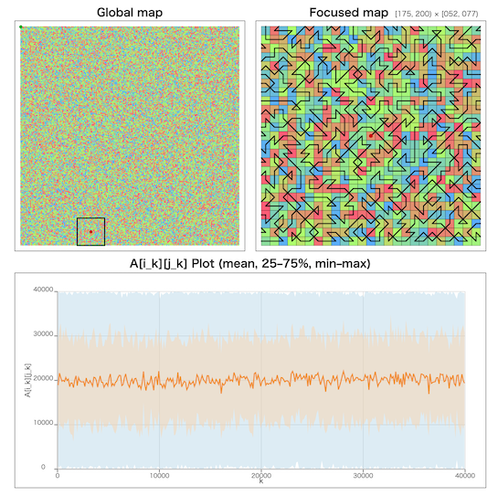

# ユニークビジョンプログラミングコンテスト2026春(AHC062)

[TOC]

## 問題概要

- https://atcoder.jp/contests/ahc062
- N\*N (N\=200)グリッドからなる王国があり、各マスには A_{i,j} 人の国民が住んでいる
  - A_{i,j} は、1〜N^2 を一様ランダムに並び替えて割り当てる
- 以下の条件を満たすような、各マスをちょうど1度ずつ訪問するツアーを考えたい
  - あるマスにいるとき、次の訪問するマスは、縦・横・斜めに隣接している必要がある
  - ツアーの開始マス、終了マスは任意に選んで良い
  - k番目に訪問した場合、そのマスの国民1人あたりkの好感度が得られる
    - ツアーでの好感度の総和はΣ k \* A_{i_k,j_k} のようになる
- できるだけ好感度の総和が大きくなるようなツアーを求めよ

## 時間

- 4 時間

## 個人的メモ

- Aが大きいマスを最後の方に訪れるようにしたいが、ハミルトンパス制約を満たすように構築するのが難しい問題

### アプローチ

#### ペア解法

- 盤面が 2\*w の場合で考えると、左から初めて、各列で、行きは小さい方を通って、帰りは大きい方を通って返ってくる、ような感じにすると、前半は小さく、後半は大きくするようにできる
- これを、蛇行(折り返し)的にして、端の折り返しをうまく処理すれば N\*N に拡張することができる
- 蛇行ではなく、渦巻き上にしている人も多かった模様
  - 渦巻きのほうが折り返し部分では2回方向変更が発生するところが渦巻きだと1回の方向変更ですむ分少し有利な模様
- (コンテスト中、方向性として「サイクルにして2周」を考えてたけど、特に違いはないし、方針がAIに伝わらない問題があったので、できるだけ単純化したもので手を付けるべきだった)

#### ペア解法を3重、4重にする

- (解説放送)
- 2\*wを拡張して、3列、4列にするなど分け方を細かくすると、よりスコアが高くできる
  - 大、中、小のラインなどにする
  - 期待値計算ができて、そこからできた場合のスコアの見積もりがおおよそ出せた
- ペアの場合と違って、隣接にならないケースがあるので、DPで求める

#### 小ブロック内を最適化

- (解説放送)
- 4\*4ぐらいのサイズのブロック内で、(隣接ブロックとつなげるために)スタートとゴールを固定した大・小のパスの最適パスはbitDPで求められる
  - 訪問済みマスのマスクmaskと現在位置xを状態に持って、開始位置sからxまでの単純パスがあるかをそれぞれのパス用に求めておけば、片方がmaskなら、その反転したものでパスがあれば全部を通る2本のパスがわかる
    - けど、個別に計算すると時間がかかりそうなので、うまく前計算＆使いまわしをしないといけないかも

#### 列全体を最適化

- (解説放送)
- ペア解法で、列ごとではなく、列全体(4\*Nとか)をまるごと最適化を考えることを考える
  - パスが行ったり来たりするのも許せばもっといいものが見つかる可能性がある
- 4\*Nぐらい(行ったり来たりできる程度のサイズ)で、大・小のパスを考えると、それぞれのスタートとゴールを固定するれば、連結成分DP/フロンティアDPと呼ばれるもので求めることができる
  - https://atcoder.jp/contests/tdpc/tasks/tdpc_grid
  - ただし、復元も必要で結構実装が大変

#### 焼きなまし

- 上記の解法の後に焼きなましする以外に、最初から全部焼きなまししても最上位が狙えた模様
- 近傍
  - おそらく、2opt近傍だけだとそこまで伸びないが、区間swap近傍(\[a,b\)と\[b,c\)の入れ替え)とかをまぜると結構伸びるっぽい
    - https://speakerdeck.com/terryu16/ahc028jie-shuo?slide=20 ([AHC028](./ahc028.md))みたいなやつ
    - (今回は「高Aマスを後ろに送りたい」が、2optだと区間全体が反転してしまうところ、区間swap近傍だと特定の高いマスを後ろにまとめて移動できるので効果的？)
      - とはいえ、それぞれ単独だと、隣接マス移動の制約があるのでうまく調整できないのか、あまりスコアはのびないとかかも
- 差分計算
  - 2opt近傍を想定すると、スコアはΣi\*A\[path\[i\]\]で、ある区間を反転させた場合の差分を高速に計算したい
  - 単純にその区間をループするとO\(区間の長さ\)で重いが、前計算しておくとO(1)で差分を求めることができる
  - 「sum_A \= ΣA\[path\[i\]\]」と「sum_iA \= Σi\*A\[path\[i\]\]」がある場合、区間\[a,b\)を反転させた場合の差分は、delta \= (a+b-1)\*(sum_A\[b-1\] - sum_A\[a-1\])-2\*(sum_iA\[b-1\]-sum_iA\[a-1\])で求められる
  - 適用した場合はsum_Aとsum_iAは更新する必要があるが、sum_iAの方は、適用した区間以降にもdeltaの差分がでるため、適用区間以降すべての更新が必要になる
    - ここもパスをブロックに分割してそのブロック全体に加算する値を別途保持するようにすると高速化できる
  - 区間swap近傍も、似たようにO(1)差分計算ができる
- 区間の選び方
  - 適当に区間を決めて反転・入れ替えるだと、適用後に区間の両端が隣接マスになっている制約をほぼ満たせないので、うまくいかない
  - 別途マスからインデクスに直す配列も用意した上で、インデクスaを適当に選んだ場合、インデクスb-1のマスは繋げられるように、aのマスの隣接マスから選ぶようにする
  - またこのとき、同時に、インデクスbのマスも、インデクスa+1の隣接マスになっているか確認する

### はずれ方針

#### 貪欲にパスを伸ばす

- 途中まで伸びているパスがあるとき、残りの未訪問マスでハミルトンパスが作れるかは判定が難しい

#### 小ブロックに区切ってブロックを辿る順番を最適化

- 盤面が大きいので、全体をブロックに区切って平均が低いブロックから順番に回る、ような感じも考えられる
  - [AHC039](./ahc039.md)のように段階的に細かくしていくなども
- しかし、実際に試してみると、Aの分布がランダムなので、ブロックの平均値に差があまりでず、スコアの上限も結構下がってしまう
- 差が出るようにブロックサイズを小さくすると計算量も増えてしまうので、ブロックに分ける効果があまりなかった

### その他

#### お絵かき

- https://x.com/prd_xxx/status/2032758745353290053

## 解説

(50位まで&発言を見つけられた方のみ)

- [AHCラジオ(解説放送)](https://www.youtube.com/watch?v=uANI9RbCkqo)
- [解説(日本語)](https://atcoder.jp/contests/ahc062/editorial)
- [解説(英語)](https://atcoder.jp/contests/ahc062/editorial?editorialLang=en)

- [writerコメント(Kiri8128さん)](https://x.com/kiri8128/status/2032760685999042596)
  - https://x.com/kiri8128/status/2032763012050993232
- [testerコメント(wataさん)](https://x.com/wata_orz/status/2032760077405532546)
  - https://x.com/wata_orz/status/2032760983635300795

- [bayashikoさん](https://x.com/bayashiko_kpr/status/2032760004571443631)
  - https://x.com/bayashiko_kpr/status/2032762536031039654
  - https://x.com/bayashiko_kpr/status/2032779151808278730
  - https://x.com/bayashiko_kpr/status/2032788703194869825
  - https://x.com/bayashiko_kpr/status/2033497803364933692
- [hteさん](https://x.com/9busters16/status/2032763259967914345)
- [hitonanodeさん](https://x.com/rsat__m/status/2032787447000809494)
- [Jinapettoさん](https://x.com/Jinapetto/status/2032762528305230071)
  - https://x.com/Jinapetto/status/2032766011494322227
- [syndromeさん](https://x.com/syndro_6/status/2032761210886906212)
- [Levixiさん](https://x.com/levi_kyopro/status/2032765929936101505)
- [poisonkumaaさん](https://x.com/dokukumao/status/2032762486668275937)
  - https://x.com/dokukumao/status/2032764842592137645
- [ymatsuxさん](https://x.com/ymatsux_ac/status/2032759689403068834)
  - https://x.com/ymatsux_ac/status/2032762650162278669
- [yunixさん](https://x.com/yunix91201367/status/2032759208769449993)
  - https://x.com/yunix91201367/status/2032761307896885515
- [Psyhoさん](https://x.com/FakePsyho/status/2032774122078454020)
- [kozimaさん](https://x.com/t33f/status/2032759383084658724)
  - https://x.com/t33f/status/2033051046466252940
- [Rice_tawara459さん](https://x.com/rice_tawara459/status/2032759668637151312)
- [ponjuiceさん](https://x.com/PonponJuice0/status/2032760328778637473)
- [itigoさん](https://x.com/itigo_purokonn/status/2032759530132840524)
  - https://x.com/itigo_purokonn/status/2032760978451075311
  - https://x.com/itigo_purokonn/status/2032761340620882202
  - https://x.com/itigo_purokonn/status/2032761737859183020
  - https://x.com/itigo_purokonn/status/2032765752605044750
- [jabeeさん](https://x.com/jabeeeeeeeeeee/status/2032761839097155822)
- [arimattiさん](https://x.com/pg_ariii/status/2032763086961258802)
- [nohtarayさん](https://x.com/nohtaray/status/2032762821885431840)
  - https://x.com/nohtaray/status/2032766253983740033
- [mogura20さん](https://x.com/beans_crypto/status/2032763400758137059)
- [maeda3さん](https://x.com/dj_maeda3/status/2032762832664862855)
- [simanさん](https://x.com/_simanman/status/2032763367346274695)
  - https://x.com/_simanman/status/2032764036719456759
- [hakoshieさん](https://x.com/hakoshie_/status/2032765290581471694)
- [blue_jamさん](https://x.com/blue_jam/status/2032767082501386598)
- [yochanさん](https://x.com/yochan_tech/status/2032763479078367629)
  - https://x.com/yochan_tech/status/2032768914346885599
- [kabipoyoさん](https://x.com/kabipoyo/status/2032761261377859840)
  - https://x.com/kabipoyo/status/2032770541380345887
- [komakokoさん](https://x.com/komakoko_X/status/2032772760796311629)

- その他
  - https://x.com/gojira_kyopro/status/2032759891342012672
  - https://x.com/butsurizuki/status/2032764646206341513

## Links

- [twitter hashtag AHC062](https://x.com/hashtag/AHC062)
- [twitter search AHC062](https://x.com/search?q=AHC062)
