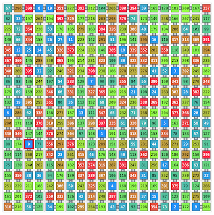

# AtCoder Heuristic Contest 065

[TOC]

## 問題概要

- https://atcoder.jp/contests/ahc065
- N\*N マスの倉庫があり、(0, N/2)のマスが搬出口になっている
- 倉庫の各マスには0からN^2 - 1までの番号がついた箱が置かれており、順番に搬出口から運び出したい
  - もし倉庫内に残っている箱で一番小さい番号の箱が搬出口にある場合、運び出される
- 倉庫内最大N^2個のループ状のベルトコンベアを設置することができ、1回の操作で、ベルトコンベアと回転方向を指定すると1マス分だけ回転させることができる
  - ただし、各マスについて含まれるベルトコンベアは高々2個まで
  - また、ベルトコンベアはサイズ2が許される(2マスをswapする感じ)
- できるだけ少ない操作回数で運び出せるようなベルトコンベアの配置と操作を求めよ

## 時間

- 4 時間

## 個人的メモ

### アプローチ

#### 1本のハミルトンサイクル(サンプル)

- サンプルは、1本のハミルトンサイクルを用意する解法
- 1周する間に目的の番号の箱が搬出口を必ず通るので、操作回数はかかるが、すべての箱を運び出せる

#### 幅2レーン敷き詰め

- 「2\*H」と「W\*2」のベルトコンベアを、横方向・縦方向に敷き詰めるように並べる
- こうすると、目的の箱に注目した時、搬出口とのマンハッタン距離分の操作回数で搬出口に動かすことができる
- 単純に、目的の番号の箱だけに注目して1つずつ運び出すと、マンハッタン距離の合計分の操作回数で運び出せる
- ここで、箱iを運び出すときに、もし箱i+1も一緒に搬出口方向に近づくように運べると、次の番号の箱を運ぶときの操作回数が減らせる可能性がある

#### ビームサーチ

- 箱iを運び出すときに箱i+1以降もいくつか搬出口に近づくように動かせると手数が減らせる可能性がある
- 評価値でそれ以降のいくつかの箱の位置を考慮して、ビームサーチなどでよいものを探す
- 箱iを運び出す操作だけで考えても、搬出口までの経路は複数ありえるので、どの経路を通ると箱i+1以降の距離をついでに減らせるか、を考える感じかも
- 箱i+1以降(何個かまで)を運び出す操作も操作で許したり、評価関数、レーンの形状や配置を変える、など、バリエーションがある模様

#### 過去改変貪欲

- (解説放送)
- 箱iまでを運び出す手順があるとき、それに箱i+1を運び出す手順を追加することを考える
  - ベースは、箱iまでを運び出す手順の最後に箱i+1を運び出す手順を追加するもので、箱iまでを運び出す手順の途中に追加することで、最後の方の手順が減ることが期待される
- i以下の箱は、操作を追加した場合に位置が変わってしまうと搬出に失敗してしまうので、位置を動かさないようにしておけば、自由に操作を追加できる
- 移動操作を何処かに入れる
  - 箱iまでを運び出す手順の途中のどこかに箱i+1の移動操作を追加することを考える
  - 運び出す手順を逆順に考えると、ある時刻で、あるマスにいた場合に、箱iを運び出した段階でゴールからの距離がどのぐらいか？を計算することができる
  - なので、箱i+1をそのマスまで移動させれた場合、箱iまでを運び出す手順の後ろにその距離分の操作が追加されることになるので、最小になるところを採用すれば良い
- 時空間BFS
  - 上記のアプローチはどこか1箇所に移動操作を入れる感じだが、箱iまでを運び出す操作のインデクスもキーにしてcost\[index\]\[y\]\[x\]を求める
    - 操作indexのタイミングで、位置\(y,x\)に移動するために追加操作回数をコストとする
  - 01BFS等で最小コストのパスを見つけて復元すると、上記のアプローチより自由度が高く移動操作を追加できる

#### ペア解法(回転寿司解法)

- サイズ2(幅2ではなく2マス)のベルトコンベアは、2つの隣接マスの箱をswapするようなことができる
- メインの長いサイクル(搬出口を含む)に、大量のサイズ2のベルトコンベアがついているようなものを考える
- メインのサイクルの各位置について置きたい番号を決めると、サイズ2のベルトコンベアで退避させておき、置きたい位置が来たらswapして置く、的なイメージ
  - 基本は、0から順番に割り当てて、搬出したら次の番号を割り当てる
  - 同じ方向にのみサイクルが回転しているとすると、乗り遅れが起きた場合、もう1周しないと目的の位置に入れられないなどの問題があるが、基本は数周すれば搬出できる
- 上記の時空間BFSを適用するでも解ける(解説放送)
- サイクルやサイズ2のベルトコンベアの形状は最適化の余地がある模様

### その他

#### お絵かき

- https://x.com/prd_xxx/status/2055589336138289290

## 解説

(50位まで&発言を見つけられた方のみ)

- [AHCラジオ(解説放送)](https://www.youtube.com/live/Sl7r3OslUWs)
- [解説](https://atcoder.jp/contests/ahc065/editorial)

- [writer解](https://x.com/wata_orz/status/2055591484272038170)

- [rabotさん](https://qiita.com/tanaka-a/items/c286e1d03fd7d7b419ac)
  - https://x.com/tanaka_a8/status/2055596095288553483
  - https://x.com/tanaka_a8/status/2055611795013042459
- [Kiri8128さん](https://x.com/kiri8128/status/2055590082292453495)
  - https://x.com/kiri8128/status/2055608578912997671
  - https://x.com/kiri8128/status/2055923318268854767
  - https://x.com/kiri8128/status/2055594547510702183
- [rhooさん](https://x.com/rho__o/status/2055613105183605199)
- [yunixさん](https://x.com/yunix91201367/status/2055589790754697331)
  - https://x.com/yunix91201367/status/2055590675996156210
- [googologyさん](https://x.com/kammyu_unfixed/status/2055591438256345126)
  - https://x.com/kammyu_unfixed/status/2055672607459127704
- [moldauさん](https://x.com/moldau205205/status/2055599119352389992)
  - https://x.com/moldau205205/status/2055609354389504003
- [Jinapettoさん](https://x.com/Jinapetto/status/2055592085710086164)
- [asi1024さん](https://x.com/asi1024/status/2055632490325557744)
- [Illedanさん](https://x.com/erik_kvanli/status/2055590112868585842)
- [Piiiiiさん](https://x.com/AcPiiiii/status/2055594452660752727)
- [Sweet_Sweet_Soulさん](https://x.com/amai_amai_taro/status/2055594661402857493)
- [chokudai社長](https://x.com/chokudai/status/2055594275438792934)
- [pokaさん](https://x.com/poka_cp/status/2055591874170331329)
- [Moegiさん](https://x.com/mih28731325/status/2055589888905621609)
  - https://x.com/mih28731325/status/2055590523692544244
  - https://x.com/mih28731325/status/2055592689954070669
  - https://x.com/mih28731325/status/2055598063683862769
- [riantkbさん](https://x.com/rian_tkb/status/2055589871851634847)
  - https://x.com/rian_tkb/status/2055590336043581682
  - https://x.com/rian_tkb/status/2055590889939186014
  - https://x.com/rian_tkb/status/2055592309375586694
  - https://x.com/rian_tkb/status/2055597176047419441
  - https://x.com/rian_tkb/status/2055598550852243872
- [bio4etaさん](https://x.com/bio4eta_/status/2055592209614020614)
  - https://x.com/bio4eta_/status/2055594253120843967
- [bayashikoさん](https://x.com/bayashiko_kpr/status/2055591342022213841)
  - https://x.com/bayashiko_kpr/status/2055601076947267898
  - https://x.com/bayashiko_kpr/status/2055601458423492666
  - https://x.com/bayashiko_kpr/status/2055602763544002745
- [iehnさん](https://x.com/arimasenu/status/2055589290823008674)
- [mech_39さん](https://x.com/fuwaorune/status/2055591518937981303)
  - https://x.com/fuwaorune/status/2055593110286315734
  - https://x.com/fuwaorune/status/2055595160856404014
  - https://x.com/fuwaorune/status/2055851939339157950
- [cuthbertさん](https://x.com/ethylene_66/status/2055591299433349210)
- [toamさん](https://x.com/torii_kyopro/status/2055589694151475699)
- [terry_u16さん](https://x.com/terry_u16/status/2055589261915873541)
  - https://x.com/terry_u16/status/2055590465484005376
  - https://x.com/terry_u16/status/2055591011498508337
  - https://x.com/terry_u16/status/2055591746940317951
  - https://x.com/terry_u16/status/2055592062960152637
  - https://x.com/terry_u16/status/2055592329684390337
  - https://x.com/terry_u16/status/2055592839392964907
  - https://x.com/terry_u16/status/2055606877703299319
  - https://x.com/terry_u16/status/2055607789175918851
- [kawateaさん](https://x.com/kawatea03/status/2055591947281273050)
- [k1suxuさん](https://x.com/k1suxu/status/2055596226117325016)
  - https://x.com/k1suxu/status/2055600510120673299
- [itigoさん](https://x.com/itigo_purokonn/status/2055590325775925344)
  - https://x.com/itigo_purokonn/status/2055592012469190778
- [MathGorillaさん](https://x.com/MathGorilla_cp/status/2055590412719624488)
  - https://x.com/MathGorilla_cp/status/2055592425868140790
  - https://x.com/MathGorilla_cp/status/2055595887523766666
- [fuppy0716さん](https://x.com/fuppy_kyopro/status/2055591849646239977)
  - https://x.com/fuppy_kyopro/status/2055594440698499297
- [edamame0さん](https://x.com/evex_dev/status/2055590307690127520)
- [chun1182さん](https://x.com/carat1182/status/2055596923772686369)
- [Koi51さん](https://x.com/Koi1583/status/2055589967091613903)
- [RinSakamichiさん](https://x.com/RinSakamichi/status/2055589964336050665)
- [tomerunさん](https://x.com/tomerun/status/2055591164032778657)

## Links

- [twitter hashtag AHC065](https://x.com/hashtag/AHC065)
- [twitter search AHC065](https://x.com/search?q=AHC065)
- [wataさん詳細順位表](https://img.atcoder.jp/ahc_standings/index.html?contest=ahc065)
