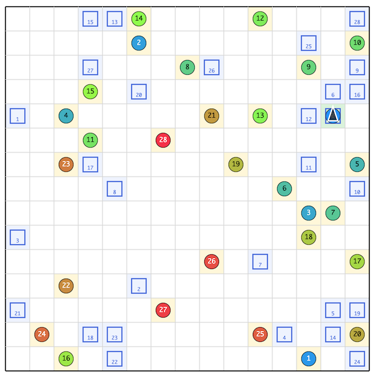

# AtCoder Heuristic Contest 066

[TOC]

## 問題概要

- https://atcoder.jp/contests/ahc066
- N\*N マスの盤面上に、M種類のボールと各ボールに対応したかごがある
- 盤面は外周は壁で、マスの間にも壁が存在する可能性がある
- ロボットが、初期状態として(0,0)マスで右を向いており、操作することでボールをすべて対応したかごにいれたい
- 操作は、基本操作とマクロ操作がある
- 基本操作
  - F: 現在の向きに1マス進む。壁の場合は動かない
  - R: 現在のマスで時計回りに90度向きを変える
  - L: 現在のマスで反時計回りに90度向きを変える
  - S: ボールの交換操作を行う
    - ボールを持っていて、現在のマスにボールがある場合は、持っているボールと置いてあるボールを交換する
    - ボールを持っていて、現在のマスにボールがない場合は、持っているボールを置く
    - ボールを持っておらず、現在のマスにボールがある場合は、置いてあるボールを掴む
    - ボールを持っておらず、現在のマスにボールがない場合は、何も置きない
- マクロ操作
  - M: 現在マクロ記録中でなければマクロ記録を開始する。記録中であればマクロ記録を停止し、新たに登録する
  - P: 最後に登録が完了したマクロを再生する。登録マクロがなければ何もしない
- マクロ展開後の基本操作は最長でT回までしか実行されず、途中で終わる
- できるだけ短い操作列ですべてのボールを対応するかごに入れよ

## 時間

- 239 時間
- (直前で修正が入ったみたいで開始が1時間遅れた)

## 個人的メモ

### 壁の数W

- 今回は、「壁の数W」が少ないか多いかで、有効なアプローチが違っていた模様
  - (ただ、なぜ差がつくのかはあまりよくわからない)
- 詳細順位表のInput Filterで`W==0`とか`W==10`とかにしてSubRank順で見ると、結構順位が変わる

### アプローチ

#### 良いマクロを探す

(壁多めのケースで強かった解法)

- マクロ(操作P)は1手で遠くの位置に移動できるので、ボールやかごマスへの移動で活用できると操作回数を減らすことができる
- 良い感じのマクロを先に構築しておき、マクロは固定した状態で各ボールを順番に運ぶようにすることを考える
- 候補マクロの準備
  - マクロの形状をビームサーチ/Chokudaiサーチ・焼きなまし・乱択/kick・GAなどで探す
    - だいたいは「方向変換＋直進＋方向変換＋直進＋・・・」のような感じのマクロだと遠くに移動できるので嬉しい可能性がある
      - (ただし、形を制限してしまうのでこれ以外の形の良いマクロがある場合は取りこぼすリスクもある)
    - ボールとかご間の最短パスや事前によく出てくる良いマクロを埋め込んでおいたり、なども
  - 「このマクロは良いか？」の評価が難しく、実際に使ってみてどうなるかシミュレーションしてみないと判断しにくいが、訪問順・経路をどうするかの問題もあるので、ちゃんとやろうとすると時間をかなり使ってしまってたくさんのマクロを試すことが難しい
  - 1段階目はざっくり評価して、2段階目でちゃんと評価、みたいなことをしている人が多かった模様
    - 「ボールからかご」への移動は必ず発生するので、その操作回数合計とかターゲットまでの距離を近似評価に使う、など
    - ただ、雰囲気的には「ボールからかご」への移動だけでも十分近似できそうにも見えるが、実際試してみると「かごからボール」の移動も考慮しないと、あんまりよくなかったかも
  - 候補探索時の訪問順最適化は、訪問順もいっしょに局所探索する、最近傍貪欲で処理する、訪問順固定してシミュレーションする、など
- 訪問順最適化
  - ボールの処理順(訪問順)の最適化
  - Mが小さいときはbitDP、Mが大きいときは局所改善系でよい最適解が見つけられる
    - TSPというか、有向グラフなので、訪問順の部分をrotateする(segmentに分けてswapする)タイプの近傍が有効
      - [AHC028](./ahc028.md)
- 区間経路最適化、圧縮
  - ボールやかごなどの目的地への移動をする場合、複数の最短経路がありえる
    - 経路違い、目的地マスでの向きの違い、Pを使うタイミング、など
    - 最短経路でなくても、1、2手程度のロスがあっても再マクロ化しやすい経路が選べたほうが得な場合もある
  - 後半で同じパターンが何度も出現する場合は、そこを再マクロ化し直すことで手数が減らせる可能性がある(圧縮)
    - 多少違いがあってもマクロの操作のキャンセルで対応できる可能性があり、結構詰める要素がある
  - https://x.com/Ang_kyopro/status/2063933912091656668
    - https://x.com/Ang_kyopro/status/2064404316803539338
- マクロの多段構築
  - 単一マクロの場合でも、マクロ中によく出てくるものがある場合は、それをマクロ登録して2段階構築することで、マクロの構築手数を減らせる
  - 今回は良さげなマクロにFの連続が出やすかったのもあり、それを先にマクロ登録して、次に目的のマクロ作成をPを使って作る、感じにできる
    - 3段階以上も考えられるが、有効なケースは少なかったかも
  - また、1段階目がFFかFFFかで、構築の総操作回数が同じになる場合があるが、1段階目の違いで構築後の位置・方向が変わる
- 可変マクロ
  - 後から圧縮するときに再マクロ化するとかではなく、最初から2段階以上(4段階とか)のマクロ変化を想定して探索
- S入りマクロ
  - ボールを掴む・置くためにはSを2回実行する必要があるが、マクロにSが入っている場合はそれを省略できる可能性がある
  - しかし、マクロの中間あたりにSを入れてしまうと、ボールを運んでいる途中で離してしまうことになるので運びにくい
  - マクロの最初か最後であれば、Pの前か後にSをつけることで操作をキャンセルすることができるので、使いやすい可能性がある
    - たとえば、Sをマクロの最初につける場合、SPと実行すればSを打ち消せるし、MSPMを実行すればPのときに最初にSするかを切り替えることができる(マクロの操作のキャンセル)
  - 「S...」や「...S」ではなく「S...S」というパターンも有効っぽい？
    - Pを使った場合は、ボールを掴んで移動して置く、まで含まれる
- 良いマクロの埋め込み
  - [第三回マスターズ選手権予選](./masters2026-qual.md)のように、あらかじめ良さそうなマクロを求めておき、それを埋め込んでおく、というのが有効だったみたい
    - ケースに依りそうな感じもするが、短すぎのマクロを探索しないようにできたり、長めのマクロを探すための探索が省略できるなどの効果があったのかも
- ボールの一時置き(再配置)
  - 「ボールiを掴んでかごiまで移動」を1単位で考えると考えやすいが、移動のついでにボールを動かすと良い可能性もある、が、このアプローチの場合は、うまく活用するのが難しかったかも
  - 掴む・置くにSを2回(ボールを交換するなら1回)余分に必要なので、それよりも取りに行く手数が減る必要があるが、手数を詰めていくと得になるケースがほぼないみたいだった
    - [AHC059](./ahc059.md)とかの木構造とかで考えるやつ
  - (ただし、過去改変ビームの場合は、結構一時置きしてるみたい)

#### 過去改変ビーム

(壁がない〜少ないケースで強かった解法)

- 1手ずつ操作を決めるビームサーチ
- ただし、操作に「過去のある区間をマクロ化したとしてPする」という仮想的な過去改変操作を許すことで、細かくマクロの作り直し・活用ができるようにする
  - 最後にMを実行した後＆最後に使ったPが変わらなければ、任意の区間をMで挟んだことにすればPでその操作を使うことができる
  - コスト3(M2つ＋P)でかなり移動のバリエーションを増やせる
- 順番にボールを運ぶことを考えるというより、各ボールの対応するかごまでの距離、などの評価関数を用意して良い状態を探索する感じにするのがよい模様
  - ボールを持ってFすればそのボールだけ差分計算できたり、ボールの一時置きやPのときの複雑な状況変化にも対応しやすい
  - 距離計算は今のマクロに依存せずに事前計算しておけるので軽い
- ただ、実際試してみると、Tを超えないようにする調整が大変だったり、過去改変操作が重く(候補が多く)、操作回数がそこそこあるので差分更新や高速化ができないと結構厳しそう、、、
- マクロの途中にSを何個も含んで、かつ、ボールの再配置なども許すので、そこで手数に差がついてそうかも

### (位置,向き)のグラフ

- グリッド上での(位置,向き)を頂点としたグラフを考えると、F,L,R操作はコスト1の頂点移動(有向辺)になる
  - 操作Pもコスト1の有向辺とみなせる
    - 遠くに移動できるショートカット辺と考えることができる
- 現在地から目的マスの方向の4頂点のどれかへの最短経路は、BFSをすれば求められる
  - 双方向BFSにすると、探索量を減らせる可能性もある
- (操作Sも上記のグラフをさらに頂点倍化してあげればすべてグラフ上で考えることもできる)

### マクロの操作のキャンセル

- もし、マクロの最初か最後が、LならR、RならL、SならS、をPの前か後に置くことでその操作を打ち消すことができる
- マクロの途中にSを入れてしまうと、Pを使うとボールをかごに運ぶときに途中で置いてしまうが、マクロの最初か最後であれば打ち消しができるので、少しだけならマクロでの操作を短くするような感じのことができる

### Pをしたときの次の位置の高速計算

- ある操作列について、`next[y][x][d]` := 操作列を実行したときの次の(位置,向き)、みたいなのを考える
- F連続の圧縮
  - たとえば、連続するF(FF...FFみたいなもの)について、前計算しておくと、1回で次の位置が求められる
  - マクロに採用される操作列は、向き変更、S、F連続、あたりで構成され、向きやSが連続しているものは正規化すると2手以下になり、F連続も上記の前計算をしておくことで、省略することができる(多少高速化になる)
- 操作列の合成
  - ある操作列2つがあるとき、それぞれのnext配列がある場合は、連続で適用すれば次の位置がわかる
  - next配列全体についても、4 N^2 回で更新すれば、合成した操作列のnext配列が得られる

### (コストの先払い)

- 先にマクロ構築の手数コストを払っておき、マクロ構築を省略してPのみを考えて、操作列を求めた後に、最初に出てきたPをM...Mに置き換える、みたいなことをやるとやや扱いやすかった
- 過去改変ビームでも、コスト3を使うのではなく、先にMを予約しておく(コスト1ずつ払っておく)的な感じにすると都合がよいかも(変化がなだらかになっているのかも)

### その他

#### ボールがかごに入ったら消える & Tの制限がない場合

- (解説放送)
- もし、ボールが目的のかごに入ったら消える、かつ、Tの制限がない場合は、すべてのボールとかごを順番は気にせずにSをしながら周回するマクロを登録した場合、P1回でボールの位置をずらすことができ、何回か実行すればすべてのボールを運ぶことができる
  - [AHC065](./ahc065.md)のペア(回転寿司)解法的な感じ
- https://x.com/yUbde54/status/2063939310181810587
- https://x.com/kiri8128/status/2063936862402822144
- https://x.com/kiri8128/status/2063979827238248870

#### ビジュアライザ、ツール自作

- 公式ビジュアライザだと、マクロを展開した操作列で実行されるため、Pは1手分で見たい、マクロを実行したときの行き先、操作列の色分け、などの情報も見たくなったりして、自作ビジュアライザやツールを用意していた人が結構いた
- https://x.com/Fuyu348867/status/2063932194012487765
- https://x.com/mkmkmk76739807/status/2063951500678959177
- https://x.com/kiri8128/status/2064158410535481757
- https://x.com/keroru10/status/2063926893905342905
- https://x.com/ikoma_3/status/2063968740610555972
- https://x.com/hiro116s/status/2063941691854503992
- https://x.com/carat1182/status/2063948962625974487

## 解説

(50位まで&発言を見つけられた方のみ)

- [AHCラジオ(解説放送)](https://www.youtube.com/watch?v=MVNikDoOmUg)
- [解説](https://atcoder.jp/contests/ahc066/editorial)

- [kurakuraさん](https://x.com/mochi_pako/status/2063929328732340454)
  - https://x.com/mochi_pako/status/2063933366173643157
  - https://atcoder.jp/contests/ahc066/editorial/21476
- [asi1024さん](https://x.com/asi1024/status/2063925391807652124)
  - https://x.com/asi1024/status/2063928751482892509
- [Rafbillさん](https://x.com/Rafbill_pc/status/2065115618760602088)
- [Ang107さん](https://x.com/Ang_kyopro/status/2063924155918201116)
  - https://x.com/Ang_kyopro/status/2063926260657766805
  - https://x.com/Ang_kyopro/status/2063927732950724862
  - https://x.com/Ang_kyopro/status/2063928110756909379
  - https://x.com/Ang_kyopro/status/2063928812417737081
  - https://x.com/Ang_kyopro/status/2063929553010229439
  - https://x.com/Ang_kyopro/status/2063930416755818752
  - https://x.com/Ang_kyopro/status/2063933912091656668
  - https://x.com/Ang_kyopro/status/2063948864055620094
  - https://x.com/Ang_kyopro/status/2063952885357113615
  - https://x.com/Ang_kyopro/status/2063975619055210774
  - https://x.com/Ang_kyopro/status/2064021647263490105
  - https://x.com/Ang_kyopro/status/2064028664308875660
  - https://x.com/Ang_kyopro/status/2064176095851942176
  - https://x.com/Ang_kyopro/status/2064524548796756006
  - https://x.com/Ang_kyopro/status/2064566055029322183
  - https://x.com/Ang_kyopro/status/2064566599173145019
  - https://ang107.hatenablog.jp/entry/2026/06/11/222216
- [mtmr_s1さん](https://x.com/mtmr_s1/status/2063954693832028521)
  - https://x.com/mtmr_s1/status/2064347575306858520
- [twins_fuyuさん](https://x.com/Fuyu348867/status/2063932194012487765)
  - https://x.com/Fuyu348867/status/2063973255028019534
  - https://x.com/Fuyu348867/status/2064265687787593914
- [saharanさん](https://x.com/shr_pc/status/2063930067261223244)
  - https://x.com/shr_pc/status/2063931774804365622
  - https://x.com/shr_pc/status/2063932696448168357
  - https://x.com/shr_pc/status/2063926132291022984
  - https://x.com/shr_pc/status/2063935039046660425
  - https://x.com/shr_pc/status/2063937176673611815
  - https://x.com/shr_pc/status/2063939137544372543
    - https://x.com/t33f/status/2063938427587019170
- [bowwowforeachさん](https://x.com/bowwowforeach/status/2063955980652818874)
  - https://x.com/bowwowforeach/status/2063956598922613017
  - https://x.com/bowwowforeach/status/2063960216480403600
- [MathGorillaさん](https://x.com/MathGorilla_cp/status/2063927008485310675)
  - https://x.com/MathGorilla_cp/status/2063927609889870252
  - https://x.com/MathGorilla_cp/status/2063928307712921807
  - https://x.com/MathGorilla_cp/status/2063931237694382340
  - https://x.com/MathGorilla_cp/status/2063925996190040510
  - https://x.com/MathGorilla_cp/status/2064501161374466291
  - https://x.com/MathGorilla_cp/status/2064654226387869747
- [Shun_PIさん](https://x.com/Shun___PI/status/2063926058039267605)
  - https://x.com/Shun___PI/status/2063926645313212537
  - https://x.com/Shun___PI/status/2063927175141851162
  - https://x.com/Shun___PI/status/2063929536639844662
  - https://x.com/Shun___PI/status/2063931851912458508
  - https://x.com/Shun___PI/status/2063934252287397907
  - https://x.com/Shun___PI/status/2063938951979888971
- [fuppy0716さん](https://x.com/fuppy_kyopro/status/2063926581425590389)
  - https://x.com/fuppy_kyopro/status/2063929678835118226
  - https://x.com/fuppy_kyopro/status/2064561450979623415
  - https://x.com/fuppy_kyopro/status/2064561826227192080
  - https://x.com/fuppy_kyopro/status/2063931518066811249
- [tomerunさん](https://x.com/tomerun/status/2062909497509880131)
  - https://x.com/tomerun/status/2063925105064120380
  - https://x.com/tomerun/status/2063927388250189918
  - https://x.com/tomerun/status/2063931640548929965
  - https://x.com/tomerun/status/2063938608923603197
  - https://x.com/tomerun/status/2064201492664656013
  - https://x.com/tomerun/status/2064202730315616386
  - https://x.com/tomerun/status/2065076514677555458
  - https://x.com/tomerun/status/2065082062831517753
- [YuuuTさん](https://x.com/meromeriin/status/2063927242410033559)
  - https://x.com/meromeriin/status/2063929591023260143
  - https://x.com/meromeriin/status/2063931628242821169
  - https://x.com/meromeriin/status/2063934613186343110
  - https://x.com/meromeriin/status/2063935065026175016
  - https://x.com/meromeriin/status/2063935565628940704
  - https://x.com/meromeriin/status/2063936684115497056
  - https://x.com/meromeriin/status/2064504044719366191
  - https://x.com/meromeriin/status/2064558566246330822
  - https://x.com/meromeriin/status/2065056589497999431
  - https://x.com/meromeriin/status/2065061143937437914
  - https://x.com/meromeriin/status/2065065294893367723
  - https://yukun-py.hatenablog.com/entry/2026/06/12/195932
- [bayashikoさん](https://x.com/bayashiko_kpr/status/2063924935094136971)
  - https://x.com/bayashiko_kpr/status/2063925235955773509
  - https://x.com/bayashiko_kpr/status/2063925519557743025
  - https://x.com/bayashiko_kpr/status/2063925765016834078
  - https://x.com/bayashiko_kpr/status/2063926205880078668
  - https://x.com/bayashiko_kpr/status/2063927349410988225
  - https://x.com/bayashiko_kpr/status/2063927912760570123
  - https://x.com/bayashiko_kpr/status/2063928952910176603
  - https://x.com/bayashiko_kpr/status/2063930598016868796
  - https://x.com/bayashiko_kpr/status/2063942192419463359
  - https://x.com/bayashiko_kpr/status/2063942478613606658
  - https://x.com/bayashiko_kpr/status/2063944565258916183
  - https://x.com/bayashiko_kpr/status/2063970307719958701
  - https://x.com/bayashiko_kpr/status/2063990472415351003
  - https://x.com/bayashiko_kpr/status/2063991433082868072
  - https://x.com/bayashiko_kpr/status/2064288887024083167
  - https://x.com/bayashiko_kpr/status/2064302677199327573
  - https://x.com/bayashiko_kpr/status/2064544930715128151
  - https://x.com/bayashiko_kpr/status/2064655764636266939
  - https://x.com/bayashiko_kpr/status/2065068867827966367
  - https://x.com/bayashiko_kpr/status/2065074139770343478
- [aaaaaaaaaa2230さん](https://x.com/mkmkmk76739807/status/2063951500678959177)
- [montplusaさん](https://x.com/montplusa/status/2063944464192897279)
- [satoyukiさん](https://x.com/tomatokiraida52/status/2063924927993139615)
  - https://x.com/tomatokiraida52/status/2064345782824898967
  - https://x.com/tomatokiraida52/status/2064348106481959028
- [titan23さん](https://x.com/titan_230/status/2063926192869421100)
  - https://x.com/titan_230/status/2063930979765620789
  - https://x.com/titan_230/status/2064073728867360899
  - https://x.com/titan_230/status/2064395145836220763
  - https://x.com/titan_230/status/2064397307769237717
  - https://x.com/titan_230/status/2064421447154716883
  - https://x.com/titan_230/status/2064580349796200937
  - https://x.com/titan_230/status/2064580581447675975
  - https://x.com/titan_230/status/2065067526019776826
  - https://x.com/titan_230/status/2065068393024426106
- [simanさん](https://x.com/_simanman/status/2063942132831059978)
- [melo25さん](https://x.com/melo_atc/status/2063928568091185470)
- [tyokousagiさん](https://x.com/tyokousagi25/status/2063930592882995441)
- [hiro116sさん](https://x.com/hiro116s/status/2063938117669884341)
  - https://x.com/hiro116s/status/2063941691854503992
- [mtsdさん](https://x.com/soiya_ksk/status/2063926970455625751)
  - https://x.com/soiya_ksk/status/2063927491908313146
  - https://x.com/soiya_ksk/status/2063928816649773421
  - https://x.com/soiya_ksk/status/2063928328571289776
  - https://x.com/soiya_ksk/status/2063929936361275558
  - https://x.com/soiya_ksk/status/2063931730533437864
- [Illedanさん](https://x.com/erik_kvanli/status/2063928586738819480)
- [yochanさん](https://x.com/yochan_tech/status/2063924443991400474)
  - https://x.com/yochan_tech/status/2063925601971638680
- [mya3さん](https://atcoder.jp/contests/ahc066/editorial/21433)
- [Jinapettoさん](https://x.com/Jinapetto/status/2063926359500726287)
- [syndromeさん](https://x.com/syndro_6/status/2063932910307356733)
- [edon8618さん](https://x.com/4C3pfotQDj26958/status/2063957179435233584)
- [Pech1さん](https://x.com/Pechi_kyopro/status/2063941942514475492)
- [keroruさん](https://x.com/keroru10/status/2063924346683609111)
  - https://x.com/keroru10/status/2063924658123239618
  - https://x.com/keroru10/status/2063926374197493985
  - https://x.com/keroru10/status/2063926893905342905
  - https://x.com/keroru10/status/2063928582666338478
  - https://x.com/keroru10/status/2063932724906541185
  - https://x.com/keroru10/status/2063933885294272784
  - https://x.com/keroru10/status/2063949524566216777
  - https://x.com/keroru10/status/2063957728209588386
  - https://x.com/keroru10/status/2063966946635460974
  - https://x.com/keroru10/status/2063985331641422189
  - https://x.com/keroru10/status/2063999554476003762
  - https://x.com/keroru10/status/2064206247021424658
  - https://x.com/keroru10/status/2064552185657221566
- [xyz600さん](https://x.com/xyz600600/status/2063933567638585653)
  - https://x.com/xyz600600/status/2063933908136448175

## Links

- [twitter hashtag AHC066](https://x.com/hashtag/AHC066)
- [twitter search AHC066](https://x.com/search?q=AHC066)
- [wataさん詳細順位表](https://img.atcoder.jp/ahc_standings/index.html?contest=ahc066)
- [simanさん統計](https://siman-man.github.io/ahc_statistics/066/index.html)
