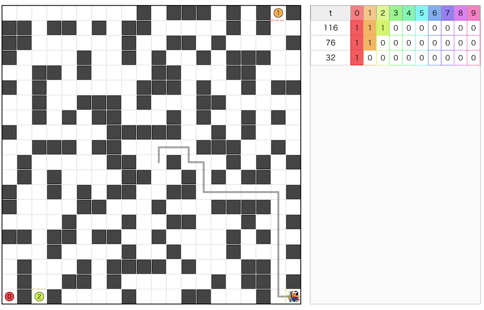

# AtCoder Heuristic Contest 067

[TOC]



## 問題概要

- https://atcoder.jp/contests/ahc067
- N\*N マスの魔王城がある
  - マスは、空きマスか障害物マスからなる
  - 範囲外はすべて障害物とする
- 勇者が(0,0)マスから侵入してくるので、城内に「扉」と「スイッチ」を設置することでできるだけ(N-1,N-1)にある玉座までの移動回数が多くなるようにしたい
  - 扉
    - マスの間に1枚設置できる
    - 2K個の型がある
    - 合計で最大M枚設置できる
    - 同じ種類を何個でも設置できる
  - スイッチ
    - マスに設置できる
    - K個の種類がある
    - 同じ種類を何個でも設置できる
  - 扉2kと扉2k+1がスイッチkによって制御される
    - 初期状態で2kが空いていて、2k+1が閉じている
    - スイッチを押すと開閉状態が入れ替わる
  - 勇者は、最小回数で玉座にたどり着くルートで行動する
    - 最小回数Tは、O(2^k N^2)で計算でき、そのコードは実装例が与えられる
  - スコアは、round(10^6 \* log_2 T/N)で計算される
    - もし玉座に到達できない場合は、スコアは1点になる

## 時間

- 4 時間

## 個人的メモ

### アプローチ

- できるだけ勇者を遠回りさせたいが、単純に扉を設置して遠回りさせるだけでは大して増やすことはできない
- そこで、スイッチを活用して、「スイッチを押さないと次に進めない」ようにすることを考える

#### スイッチをO(N)回押させる

- いろいろ考えられるが、「スイッチの周りを扉で囲んで、スイッチiの周りの扉はスイッチi-1を押さないと開けない」ようにする
- すると、スイッチを順番に全部押させて、最後に玉座が開くようにできる
- スイッチをできるだけ離れて配置することで操作回数は稼げるが、上位には遠く及ばない

#### スイッチをO(N^2)回押させる

- 「スイッチiの前に扉をi枚設置して、スイッチ0からi-1までを押し直させる」
  - スイッチiの前に扉をi枚設置して、その扉をスイッチ0からi-1までの押し直しで開くようにすることで、一応、スイッチを押す回数をO(N^2)にはできる
  - 扉の設置枚数は最低45枚なので、50枚制限以下には収まるが、盤面によっては1枚で塞げない可能性もあるので調整は必要
- 「スイッチiの前に扉を2枚設置して、スイッチ0からi-1までを押し直させる」
  - (解説放送)
  - 上記よりもっと効率的にすることができるよう
  - スイッチiの前に、「スイッチi-1で開閉する扉」と「スイッチi-2で開閉する扉」の2枚をうまく設置することでもO(N^2)を実現できる
  - スイッチiを押したい場合、たとえば「スイッチi-1がON、かつ、スイッチi-2がOFF」で開くように扉を設置すると、スイッチi-1をONにするためにスイッチi-2もONになってしまっているのでそれをOFFにさせるために繰り返すことを強制できる
  - これだと扉の必要枚数がかなり少なくなるので、残りの扉は壁などに利用することができる
- これらの方法だと2000〜3000ターンぐらいまでは伸ばせるが、コンテスト中だと上位は数万ターンぐらいになっていたので、全然届かない

#### スイッチをO(2^N)回押させる

```
     switch k-1    switch k
        |             |
      door g        door h
        |             |
...-----+-- door g' --+-- door h' -----...(玉座)
```

- 簡単のために、上記のような、一本道に横道が出ているようなケース(本線・脇道構成)を考える
  - 横道の奥にスイッチを置き、それぞれの通路の途中に扉を設置する
  - スイッチ側と一本道側で開閉状態が入れ替わるように対応する相補扉(gとg'、hとh')を設置すると、どちらかだけしか通れないようにできる(分岐器、ポイント)
- 扉h,h'が一つ前のスイッチk-1で開閉状態を入れ替えられるようにした場合、もし扉hが閉じていて、開けたい場合はスイッチk-1を押す必要があるが、扉hを開けた時点ではそれまでのスイッチ側の扉が閉じている状態なはずなので、スイッチkを押せても、扉h'を開けるためには(閉じている)スイッチk-1まで再度開け直す必要がある
- 玉座も最後のスイッチと考えて、すべてのスイッチが閉じた状態を初期状態とすると、扉の枚数を抑えつつ、スイッチを押す回数をO(2^K)回にできる
- グレイコード
  - スイッチの状態をbit列として考えると、途中の状態は[グレイコード](https://ja.wikipedia.org/wiki/%E3%82%B0%E3%83%AC%E3%82%A4%E3%82%B3%E3%83%BC%E3%83%89)になっている
- 盤面への埋め込み
  - この一本道をどう埋め込むか?が問題になるが、結構難しい
  - 玉座を根としたランダムDFS木などで木構造を作って、壁(下記参照)などを設置するのが扱いやすかった模様
    - とはいえ結構実装が大変
- スイッチ0を離して置く
  - スイッチ0をできるだけスイッチ1以降から遠い位置に配置すると、操作回数を伸ばすことができる
- スイッチを9個使うか10個使うか
  - スイッチ1個を使わないと常に開かない扉(壁)を作れるので、思い切ってスイッチ9個しか使わないようにする、でも結構戦えてたみたい
  - 実際、スイッチ10個でも最後の方で壁にしていた扉が消えてショートカットされてしまう
  - うまく壁を作ることでショートカット阻止できる場合、ざっくりターンが倍にできるので結構上位では重要なポイントだったのかも？

#### 貪欲、局所改善系

- 今回は、上記のO(2^N)回の解法が強く、単純に扉やスイッチの位置を状態にした貪欲や局所改善では全然ダメだった模様

### 壁を作る

- スイッチがあまり押されない扉は壁として利用できる
  - O(2^N)回の解法とかでは、スイッチ9は最後にしか押されないので、扉19とかはずっと閉じたままになるので壁として利用できる
  - ただし、スイッチ9を押してしまうと壁がすべて消えてしまうため、勇者にショートカットされてしまう恐れがある
  - とはいえ、完全に壁にできなくても、スイッチ0を押したら壁が出現するようにするとかでも距離は伸びるので有効
- 相補扉(扉2kと扉2k+1)を設置すると常に通れないマスを作れる
  - 例えば、左右が障害物の橋マスで上下に相補扉を設置すると、どっちの状態でも通れないようにできる
- ある領域でスイッチの状態が確定する場合は、そのスイッチの扉を使うことで壁にできる
  - (解説放送)
  - 上記のO(2^N)回の解法の例とかで、扉g'が開いている場合はそれより右側の領域では常に扉gは閉じていることが確定するので、壁として利用できる

### 領域を分割する

- https://x.com/montplusa/status/2069072432321986677
- 領域ごとに領域間を移動できるようにするスイッチを用意して、「領域Aから領域Bに行くための扉を領域Aのどこかにあるスイッチで切り替えると、その扉は開くが領域Bから領域Cに行く扉は閉じる」ようにしておくと、領域B内のどこかにあるスイッチを押して扉を開き直させるよう強制できる
- スイッチををできるだけ遠回りさせるように配置しておくと、移動回数を伸ばすことができる

### その他

#### AIの影響

- 今回はAIに問題だけ渡しておまかせでもO(2^N)回の解法を考え出せたようで、実装の面倒なところも含めて手間なく実装できてしまっていた人もそこそこいたらしい？
  - (メモリなのか、指示の仕方なのか、reasoningレベルやAIの種類なのか、、、)
- https://x.com/FakePsyho/status/2068675710504280560
- 最近のAIの動向を受けて、AHCの生成AIルール変更予定が発表された
  - https://atcoder.jp/posts/ahc_new_ai_rule_ja
  - https://x.com/wata_orz/status/2069622011522089128

#### 挨拶テク(リセットタイミング調整)

- claude codeやcodexなど、5時間rate limitがあるとき、4時間コンテストの3時間前にcodexを利用しておくことで、コンテストが半分過ぎた時点でリセットされるよう調整するテク
  - コンテストの前半の試行錯誤でトークン消費すると、後半でトークンが足りなくなる恐れがある
- 一般的にも、朝に挨拶しておくとお昼ごろにリセットタイミングを持ってこれて都合がいい的な？
- 開始の判定が簡単な挨拶でされるか微妙かもなので、ちゃんとリセットのタイミングが期待通りになったか確認したほうがよさそう
- https://x.com/chokudai/status/2065252573926527481

#### 関連したパズル、ゲーム

- [チャイニーズリング(九連環)](https://ja.wikipedia.org/wiki/%E3%83%81%E3%83%A3%E3%82%A4%E3%83%8B%E3%83%BC%E3%82%BA%E3%83%AA%E3%83%B3%E3%82%B0)
- ハノイの塔
- 王の行進
  - https://x.com/kiri8128/status/2070341075324305683
- Veggie Quest: The Puzzle Game
  - https://x.com/satanic0258/status/2068698007491805572
- 勇者のくせになまいきだ

## 解説

(50位まで&発言を見つけられた方のみ)

- [AHCラジオ(解説放送)](https://www.youtube.com/watch?v=MmtDPoffLe0)
- [解説](https://atcoder.jp/contests/ahc067/editorial)

- [writerコメント](https://x.com/wata_orz/status/2068695963594842117)
  - https://x.com/wata_orz/status/2068698371863523771
  - https://x.com/wata_orz/status/2068717653024543030
  - https://chatgpt.com/share/6a3800ef-4020-83ee-899d-3cd0f2c18a1c

- [kenchoさん](https://x.com/border_of_ymg/status/2068701169254580502)
  - https://x.com/border_of_ymg/status/2068705881848778950
  - https://x.com/border_of_ymg/status/2068707684204105991
  - https://x.com/border_of_ymg/status/2068717894087909629
- [Moegiさん](https://x.com/mih28731325/status/2068697013668245899)
  - https://x.com/mih28731325/status/2068701571026940237
- [sounansyaさん](https://x.com/nasya_AC/status/2068697616939192472)
- [rhooさん](https://x.com/rho__o/status/2068699225370837276)
  - https://x.com/rho__o/status/2068700068409180468
  - https://x.com/rho__o/status/2068710714425102541
  - https://x.com/rho__o/status/2068717007722439031
  - https://x.com/rho__o/status/2068718170987462768
  - https://x.com/rho__o/status/2069040984164630904
  - https://x.com/rho__o/status/2069080863464366148
- [kaliafluoridoさん](https://x.com/kaliafluorido/status/2068697762968015117)
  - https://x.com/kaliafluorido/status/2068698527036014783
- [noimiさん](https://x.com/noimi_kyopro/status/2068696400981115070)
  - https://x.com/noimi_kyopro/status/2068698290154258873
  - https://x.com/noimi_kyopro/status/2068698958332047422
  - https://x.com/noimi_kyopro/status/2068699250444440058
  - https://x.com/noimi_kyopro/status/2068701081929199978
  - https://x.com/noimi_kyopro/status/2068703204897079806
  - https://x.com/noimi_kyopro/status/2068705188991717498
- [terry_u16さん](https://x.com/terry_u16/status/2068716660476043668)
  - https://x.com/terry_u16/status/2068720375459099010
  - https://x.com/terry_u16/status/2069077352441938240
- [physics0523さん](https://x.com/butsurizuki/status/2068698122885427435)
  - https://x.com/butsurizuki/status/2068698408400134371
  - https://x.com/butsurizuki/status/2068698982482899295
  - https://x.com/butsurizuki/status/2068699455029907872
  - https://x.com/butsurizuki/status/2068743210688819641
  - https://x.com/butsurizuki/status/2068744402324083169
- [Bondo416さん](https://x.com/bond_cmprog/status/2068697308720680988)
- [mech_39さん](https://x.com/fuwaorune/status/2068698380545687601)
  - https://x.com/fuwaorune/status/2068700310953165172
- [k1suxuさん](https://x.com/k1suxu/status/2068700911304937770)
- [keroruさん](https://x.com/keroru10/status/2068700614780211410)
  - https://x.com/keroru10/status/2068703000689078432
  - https://x.com/keroru10/status/2068718400550093300
  - https://x.com/keroru10/status/2068897701245354024
  - https://x.com/keroru10/status/2068910680976351522
- [MoSooNさん](https://x.com/Mo_SoooN2/status/2068698022452896106)
  - https://x.com/Mo_SoooN2/status/2068698608514531535
  - https://x.com/Mo_SoooN2/status/2068699921365217348
- [satanic0258さん](https://x.com/satanic0258/status/2068695853339185637)
  - https://x.com/satanic0258/status/2068696993644597511
  - https://x.com/satanic0258/status/2068698007491805572
  - https://x.com/satanic0258/status/2068700309548048467
- [bresoさん](https://x.com/Carbon_so6/status/2068696061049467286)
  - https://x.com/Carbon_so6/status/2068701457235529765
  - https://x.com/Carbon_so6/status/2068710678224158773
  - https://x.com/Carbon_so6/status/2068711797130236261
  - https://x.com/Carbon_so6/status/2068720572490781095
  - https://x.com/Carbon_so6/status/2068696671471698331
- [bayashikoさん](https://x.com/bayashiko_kpr/status/2068634738416570632)
  - https://x.com/bayashiko_kpr/status/2068667813498355798
  - https://x.com/bayashiko_kpr/status/2068695848507326527
  - https://x.com/bayashiko_kpr/status/2068696125767606467
  - https://x.com/bayashiko_kpr/status/2068697944476537308
  - https://x.com/bayashiko_kpr/status/2068700121269952638
  - https://x.com/bayashiko_kpr/status/2068704953284297059
  - https://x.com/bayashiko_kpr/status/2068705623139844536
  - https://x.com/bayashiko_kpr/status/2068708146898731348
  - https://x.com/bayashiko_kpr/status/2068729484522697190
  - https://x.com/bayashiko_kpr/status/2068743925352075520
- [montplusaさん](https://x.com/montplusa/status/2069039721280602334)
- [ohuton_laboさん](https://x.com/MohutonLab_comp/status/2068634328486322365)
  - https://x.com/MohutonLab_comp/status/2068701157187559491
  - https://x.com/MohutonLab_comp/status/2068704404937855081
  - https://x.com/MohutonLab_comp/status/2068705205055852660
  - https://x.com/MohutonLab_comp/status/2068707952815731186
- [shindanninさん](https://x.com/nico_shindannin/status/2068702768362320304)
  - https://www.youtube.com/live/2IXsuyuoVOU
- [ei13333さん](https://x.com/ei1333/status/2068696262950711491)
  - https://x.com/ei1333/status/2068697374768476404
- [asi1024さん](https://x.com/asi1024/status/2068698760390279187)
  - https://x.com/asi1024/status/2069071248056086602
- [kurigenさん](https://x.com/kurig15/status/2068634701125013618)
  - https://x.com/kurig15/status/2068697332162715690
  - https://x.com/kurig15/status/2068699154096984241
- [mtsdさん](https://x.com/soiya_ksk/status/2068695743955877942)
  - https://x.com/soiya_ksk/status/2068696066288206130
  - https://x.com/soiya_ksk/status/2068696647568335248
  - https://x.com/soiya_ksk/status/2068699066360643738
  - https://x.com/soiya_ksk/status/2068699383898763598
  - https://x.com/soiya_ksk/status/2068700223552270608
  - https://x.com/soiya_ksk/status/2068703534099611737
  - https://x.com/soiya_ksk/status/2068704923521540128
  - https://x.com/soiya_ksk/status/2069812882943127560
- [ymduuさん](https://x.com/ymduu/status/2068703649111666855)
  - https://x.com/ymduu/status/2068705494513168871
- [yunixさん](https://x.com/yunix91201367/status/2068695591962759305)
  - https://x.com/yunix91201367/status/2068697674187149737


- https://x.com/tsukammo/status/2068752405865611633
- https://x.com/e869120/status/2068715359151304840

## Links

- [twitter hashtag AHC067](https://x.com/hashtag/AHC067)
- [twitter search AHC067](https://x.com/search?q=AHC067)
