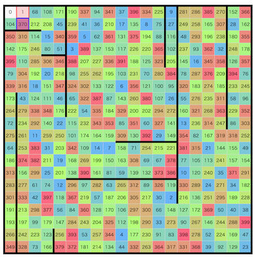

# estieプログラミングコンテスト2026(AHC068)

[TOC]

## 問題概要

- https://atcoder.jp/contests/ahc068
- N\*N マスの盤面があり、外周は壁に囲まれていて、隣接するマスの間には壁が存在する場合もある
- 各マスには、0からN^2 - 1の番号が書かれたカードがランダムに並び替えられて置かれている
- 以下の操作を繰り返して、すべてのカードが順番に並ぶように並び替えたい
- 操作は、「向き」と「長方形」を選び、長方形内部を2つのブロックに分けてブロックを入れ替える(注: 線対称ではない)、ような感じ
  - 向きは縦か横で、その方向にブロックを入れ替える
  - 向きに応じて、高さか幅が偶数であるように指定する必要がある
  - 長方形は、盤面内、かつ、壁がないように選ぶ必要がある
- できるだけ少ない操作回数で目的の配置を達成せよ

## 時間

- 4 時間

## 個人的メモ

### 端から揃える

- 基本的には、壁がないケースで考えると、途中に動かせない(動かしたくない)マスが存在してしまうと、使える長方形が減ってしまうので、できれば端から揃えていきたい
- また、端からでも、実際には壁があるため、一旦揃ったら確定させて動かさない、みたいなことをしてしまうと非連結になって詰むケースがある
- おそらく(個人的には)結構重要なポイントで、「盤面真ん中付近からBFSして逆順に揃える」的なのが一番良かった模様
  - 適当にやると壁などによって細長い道みたいなのが残ってしまって、そこが効率的に動かせなくなってしまうので、できるだけ大きな塊が残るようにするのが良かった模様
  - https://x.com/terry_u16/status/2078425766824735126
- また、距離タイ(か、同じぐらいの距離)のマスのどれから処理するか、とかの自由度もある
- 中心の選び方
  - 適当に壁を考えずに真ん中付近のマスを選ぶ
  - 各マスについて、「最も遠いマスまでの距離」が一番小さいマスを選ぶ
  - など

### アプローチ

#### 1x2で移動させる

- 長方形は最小で1x2で隣接swapができるので、目的のカードを1つずつ移動させることができ、全部揃えることはできる
  - サンブルがこれの0と1だけ揃えたものになっている
- ただ、手数がかかるため、あまりスコアはでない

#### 1xnで移動させる

- (解説放送)
- カードを目的位置まで動かすとき、1xnの長方形を考えると、1手で縦方向か横方向に長距離移動させることができる
- これは単純にBFSなどすれば最短手順が求められるので、順番にそれを繰り返す

#### カードの目的地への移動方法を評価関数+ビームサーチ

- 未確定のあるカードを目的の位置に動かす時、長方形の位置や形など自由度があり、それによって巻き込まれる目的のカード以外の動きに変化がある(副作用がある)
- これを評価関数で評価しつつ、ビームサーチで一番よい動かし方を選ぶことを考える
  - 操作回数、目的カードの位置などに加えて、近い内に確定させる予定のカードの位置などを考慮することで、将来の操作回数が減るようにする
- 使用可能な長方形を全部列挙したり、1xnベースの最短経路の長方形を拡張させて考える、など

#### 過去改変貪欲

- (解説放送)
- 上記の1xnの拡張で、すべて操作列をそれまでの操作列の後ろに追加していく形にしていたが、これをこれまでの操作列の途中にも操作を挿入できるとした場合を考える
- どこにどういう操作を挿入すると操作列の長さが抑えられるか？が問題になるが、それは「時空間BFS」で考えることができる
  - 長方形は1xnで動かす場合のみを考える
- 時空間BFS
  - これまでの操作列に対して、今回動かしたいカードについて、dp\[t\]\[y\]\[x\]:=元の操作列での時刻tで目的のカードを(y,x)に持ってくるまでに必要な挿入数、を考える
  - ある時刻で、新しく操作列を追加する場合は移動先に+1で更新する、もし既存の操作列で移動する場合は+0で更新する、ことになる
    - これは01BFSなので効率的に処理できる
  - ただし、条件として、すでに確定させたカードが挿入によってズレてはいけないので、それが変わらないこと
- 実際やってみると、盤面によっては、ターンが進むと使えるマスが減るとはいえ、ターン数が伸びるとBFSの探索量も増えてしまうため、TLEする可能性がある
  - 最後の方は途中に挿入しなくてもあまり末尾のみでもあまり操作列が多くならないため末尾追加のみで処理する、とか、挿入できるのは直近の500操作以内のみにする、など

##### mxnで移動させる

- (解説放送)
- 「1xnの長方形で動かす」を「mxnの長方形で動かす」に拡張したい
- 1xnをベースに考えると、あるカードを移動させるとき、同じカードの移動を実現する長方形は移動方向とそれの垂直方向それぞれに自由度がある
- そこで、既存の操作列の長方形で、目的のカードが含まれる/含まれないを考慮できるよう、長方形の形について自由度を持たせる
- 「操作列への末尾追加のみ」で考える
  - 過去の長方形の形が変わると目的のカードの位置が動いたり動かなかったりするので、操作を追加する盤面において、複数の開始地点があり得る感じになる
  - 一番操作回数が少なくなるような、過去の長方形の修正＋新しく追加、を考えれば良い
- 「過去改変」で考える
  - https://x.com/wata_orz/status/2078421070101795133

### その他

#### 盤面全体を評価関数で揃えるアプローチ

- 単純に、各カードのターゲットとの距離(の2乗)とかの合計を評価関数として、最小化するように長方形を選ぶ、みたいなことは考えられる
- 実際試すと、ターゲットマスの近くまでは移動させられるが、きれいに揃えるのが難しい
  - 揃える部分での"文脈"が強いので、探索が必要
- そこから微調整をするとさらに手数がかさんでしまい、手数を下げるのは難しい
  - 行だけ揃えて、その行内は最短で揃える、みたいなこともできなくはないが、同じ行に揃えるのもあまり簡単ではないし、揃えるのに数手はかかってしまう
- また、途中で揃ったカードがあると、それを含む長方形の操作は評価関数を悪化させる方向になりやすいので、自由度が減ってしまい扱いにくい

#### 話題に出ていた類題

- [AHC021](./ahc021.md)
  - https://x.com/terry_u16/status/2078423023649206750
- [AHC065](./ahc065.md)
  - 時空間BFS・過去改変
  - https://x.com/prussian_coder/status/2078420474590339531

#### 生成AI利用のルール

- 今回は、生成AI利用ルール20250616版適用の最後の短期コンテストとのこと
- これまでのに加えて、問題文の一番下や、(わかりにくい気がするが)コンテストのトップページの一番下に、AGENTS.mdなどへの追加指示文が追記されていた

#### ブロックswapではなく反転だった場合

- (解説放送)
- もし、ブロックswapではなく、反転(線対称に入れ替える)だった場合、壁がなければ、同じ行・列の任意の2点が2手でswapできる
  - 交換したい2つを端に含むブロックを反転し、その2つを除いた内側を反転する
  - 一応、ブロックswapの場合は、3手かかる
    - 交換したい2つを端に含むブロックをswapし、真ん中にその2つがくるのでswapし、もう一度最初と同じswapをする
    - 最初、ここらへんを考えてたけど3手が結構重く、使える感じではなかった

#### お絵かき

- https://x.com/prd_xxx/status/2078425199758959008

## 解説

(50位まで&発言を見つけられた方のみ)

- [AHCラジオ(解説放送)](https://www.youtube.com/watch?v=UC0D55sc9CU)
- [解説](https://atcoder.jp/contests/ahc068/editorial)

- [writerコメント](https://x.com/wata_orz/status/2078421070101795133)
  - https://x.com/wata_orz/status/2078499922849177621

- [PrussianBlueさん](https://x.com/prussian_coder/status/2078420474590339531)
  - https://x.com/prussian_coder/status/2078660946223083913
  - https://x.com/prussian_coder/status/2079899099831361908
  - https://x.com/prussian_coder/status/2078430002216071368
- [G4NP0Nさん](https://x.com/G4NP0N/status/2078420594379645393)
  - https://x.com/G4NP0N/status/2078420837049450697
  - https://x.com/G4NP0N/status/2078421303418347573
  - https://x.com/G4NP0N/status/2078421593223831929
  - https://x.com/G4NP0N/status/2078422037824180563
  - https://x.com/G4NP0N/status/2078422632861708492
  - https://x.com/G4NP0N/status/2078425062651425215
  - https://x.com/G4NP0N/status/2078426363191799849
  - https://x.com/G4NP0N/status/2078432849813024849
  - https://x.com/G4NP0N/status/2078438695372533958
- [mtsdさん](https://x.com/soiya_ksk/status/2078420002869547057)
  - https://x.com/soiya_ksk/status/2078420963721711938
- [rhooさん](https://x.com/rho__o/status/2078420199930515584)
  - https://x.com/rho__o/status/2078420682636214488
  - https://x.com/rho__o/status/2078429600687030293
- [naniwazuさん](https://x.com/naniwazu_cp/status/2078421566409654569)
- [chokudai社長](https://x.com/chokudai/status/2078358841839014071)
  - https://x.com/chokudai/status/2078419972431450516
  - https://x.com/chokudai/status/2078421945796985036
  - https://x.com/chokudai/status/2078423509290962958
  - https://x.com/chokudai/status/2078438846635925601
  - https://x.com/chokudai/status/2078467604470251944
  - https://x.com/chokudai/status/2078469385258508502
  - https://x.com/chokudai/status/2078492608188547075
  - https://x.com/chokudai/status/2078495347597566079
  - https://x.com/chokudai/status/2078740399410368656
- [kaz49bzさん](https://x.com/kaz_d37/status/2078430357930803339)
- [winter_2521さん](https://x.com/winter_kyopro/status/2078421162149982391)
- [physics0523さん](https://x.com/butsurizuki/status/2078356035748917680)
  - https://x.com/butsurizuki/status/2078429599571345644
  - https://x.com/butsurizuki/status/2078431975325773950
  - https://x.com/butsurizuki/status/2078432171992440891
  - https://x.com/butsurizuki/status/2078432726030684339
  - https://x.com/butsurizuki/status/2078434814697574413
  - https://x.com/butsurizuki/status/2078430600906821815
  - https://x.com/butsurizuki/status/2078442146047336957
  - https://x.com/butsurizuki/status/2078446212240551990
  - https://x.com/butsurizuki/status/2078512257429041474
  - https://x.com/butsurizuki/status/2078537450113351851
- [bio4etaさん](https://x.com/bio4eta_/status/2078425413261627640)
- [Moegiさん](https://x.com/mih28731325/status/2078420100705898640)
- [Nachiaさん](https://x.com/NachiaVivias/status/2078431394779582864)
- [tyokousagi25さん](https://x.com/tyokousagi25/status/2078424103242084558)
  - https://x.com/tyokousagi25/status/2078428794420121822
  - https://x.com/tyokousagi25/status/2078440676627558834
  - https://x.com/tyokousagi25/status/2078466581403984061
  - https://x.com/tyokousagi25/status/2078473953560191160
- [sounansyaさん](https://x.com/nasya_AC/status/2078422571717202239)
- [mech_39さん](https://x.com/fuwaorune/status/2078420840820146252)
  - https://x.com/fuwaorune/status/2078421117254209882
- [uta_cccさん](https://x.com/uta_cccc/status/2078424581417959500)
  - https://x.com/uta_cccc/status/2078456924228735436
- [noimiさん](https://x.com/noimi_kyopro/status/2078323553553019175)
  - https://x.com/noimi_kyopro/status/2078420497151479903
  - https://x.com/noimi_kyopro/status/2078423720167977054
  - https://x.com/noimi_kyopro/status/2078426662023381261
  - https://x.com/noimi_kyopro/status/2078432620950736931
- [tsukammoさん](https://x.com/tsukammo/status/2078423528450429008)
  - https://x.com/tsukammo/status/2078426964491477072
  - https://x.com/tsukammo/status/2078428286041165876
  - https://x.com/tsukammo/status/2078453359938502707
- [Kiri8128さん](https://x.com/kiri8128/status/2078422709311262922)
  - https://x.com/kiri8128/status/2078485532737524180
- [square1001さん](https://x.com/square10011/status/2078424321660424507)
- [E869120さん](https://x.com/e869120/status/2078423050836713571)
  - https://x.com/e869120/status/2078487936727994460
- [milkcoffeeさん](https://x.com/milkcoffeen/status/2078421785993990317)
- [cuthbertさん](https://x.com/ethylene_66/status/2078420142422454323)
  - https://x.com/ethylene_66/status/2078420462699418043
  - https://x.com/ethylene_66/status/2078421710249009422
  - https://x.com/ethylene_66/status/2078422333417771325
  - https://x.com/ethylene_66/status/2078423398141898773
  - https://x.com/ethylene_66/status/2078424063484256380
- [binapさん](https://x.com/kisara_splat/status/2078421037339848908)

## Links

- [twitter hashtag AHC068](https://x.com/hashtag/AHC068)
- [twitter search AHC068](https://x.com/search?q=AHC068)
- [あとこちゃん観戦記](https://chokudai.github.io/atoco-cp/post/2026-07-18-ahc068/)
