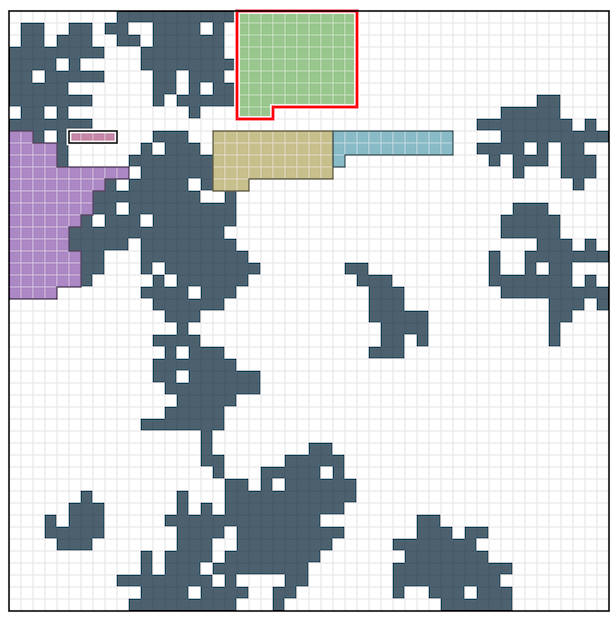

# RECRUIT日本橋ハーフマラソン　2026夏(AHC069)

[TOC]



## 問題概要

- https://atcoder.jp/contests/ahc069
- N\*N マスの公園があり、各マスは芝生か池のいずれかである
- M個のグループがやってくるので、他のグループや池とかぶらないように連結な領域に割り当てるか、断るかを決める
- グループは、到着時間S_i、退去時間T_i、人数P_i、基本支払額V_iが決まっている
  - すべてのS_i, T_iは異なる
- 領域は、領域外と接する境界の長さから計算される「コンパクト度C」があり、グループを割り当てた場合はV_i \* Cが退去時に利用料として得られる(所持金が増える)
- また、配置済みのグループは「移動」することもでき、これはV_j \* Rだけ支払う(所持金から減る)
- もし、グループが「移動」でコンパクト度が悪化していた場合は、一番小さかったコンパクト度Cが適用される
- 所持金0からスタートし、できるだけ最終的な所持金が大きくなるようにしたい

## 時間

- 240 時間

## 個人的メモ

- 今回は丁寧に列挙・高速化・調整をできるかが大切だった模様
  - あまり、1つのアイデアで大きく伸びるという感じではなかったようで、組み合わせや調整など詰めていくことでスコアを伸ばす必要があったみたい
  - しかもそれぞれの要素に詰める要素が複数あって、どこを攻めるかも難しい
- 考える必要があるのは「領域の形状・位置」「再配置をどうするか」「採用判断」あたり

### 高コンパクト度な領域形状

- 支払金額がC倍になるので、seed\=1のような、芝生が広く空いているようなところがある場合は、できれば高いコンパクト度な形状でいれたい
- Pに対して最良コンパクト度になるような形は、以下のような、長方形＋余り、のような形になる

```
######
######
######
######
######
##....
```

- ただし、以下のような2段になるようなものもある

```
######
######
######
######
####..
####..
```

- この形状でできるものはバリエーションが結構あるので、テンプレートとして用意して全部チェックする、というのだとまあまあ時間がかかってしまう可能性があるので、高速に探索するのも課題

#### 長方形を高速に探索

- ビット演算
  - ビット演算で複数マスを並列で処理する
- 2次元累積和
  - 累積和を求めておくと、知りたい長方形内に芝生以外のマスが何マスあるか？が高速に求められる(更新には時間がかかる)
  - 参照が多いので、更新に時間をかけても参照速度が速いほうがよかったかも

#### 内接長方形に余りを足す

- 「P \= h \* w + r」と考えて、確認すべき(h,w)を求めておいて、残りのrを4方向についてつけられるかなど試せる
  - rは、単純に1直線だけを考えると、上記のように2段になるケースは取りこぼすことに注意

#### 外接長方形から削る

- 「P \= h \* w - r」と考えて、確認すべき(h,w)を求めておき、余分なrを4つ角から削ることを考える
  - rは、因数分解した形

### 愚形生成

- seed\=2など、池マスが多い部分などでは、上記のようなきれいに長方形を確保するのが難しい
- とはいえ、単純なBFSだと段々になって周長が増えてしまい、コンパクト度が小さくなってしまう
- いろんなアプローチが考えられるが、良いコアから形状に合わせて領域を成長させる感じの作り方が良いアプローチの1つかも

#### 成長型

- ある1点とか小さい正方形/長方形から初めて、領域サイズがPになるまで領域にマスを追加して成長させる
  - チェビシェフ距離でBFS/仮想的なバウンディングボックスを考えてできるだけ大きくしないようにする
  - 1マスずつではなく、まとめて辺を足す
  - など

#### 生成後の形状の局所探索

- 成長型での開始位置が悪いとかで領域の形状が微妙になりうる
- 生成後に局所探索でコンパクト度や隣接具合を改善できる場合があるので、それを試せる

### 配置候補の多様性確保

- 置ける配置や形状が多いため、うまくいろんな位置のものを選ぶようにするなどの多様性を確保すると有効な模様

### 配置位置の評価

- ビンパッキング的な感じで考えると、空き領域が広く残るように端や池マス、他のグループ領域沿いに寄せたい
  - コンパクト度がよいもの、空き領域の残し具合/断片化し具合、などを考えて候補を選びたい
- ただ、グループには退去時間があるため、今いるグループがどういう消え方をして領域がどう空くかまで考慮することができる
  - 他のグループに隣接する場合は、そのグループが似たような退去時間ならほぼ同じタイミングで広く領域を空けることができる可能性がある
  - 隣接する壁が途中でなくなる場合とかは壁が0.5個換算にするとか、時間も考慮した隣接していない表面積が少なくなるようにするとか
- また、大きな正方形を残すようにする、というのも有効だった模様
  - 高コンパクト度が置ける可能性があるので、正方形で近似して考えて、それで評価
  - 基本的に処理が重いので、候補を絞って調べるとか、ビット演算でうまく高速に見つける必要はある
- ここらへんをうまく組み込んで高速に候補を見つけるのが難しい

### グループ再配置

- 再配置は、「後に来たグループを先に置いてから、すでに置いたグループを置く」という配置順番入れ替えを低コストで行え、置けるグループを増やせる可能性があり重要な要素
  - メタ読みすると、移動コストRが低めに設定されているので、再配置をどうするかがキモっぽくも見えるが、そこまで複雑なものまでは必要なかったかも
  - 効率の良い再配置アルゴリズム・データ構造的なものがあるかと思ったけど、上位でも枝刈りや時間調整などで頑張る感じだった模様
    - 収益上界などをみて無駄になるなら打ち切る、重要なグループだけに時間を書けるように調整する、など
- 新規グループ以外に既存のグループについてもどうするか考える必要があるためバリエーションが増え、探索も必要になるが、制限時間的に網羅的な探索は厳しい
- 基本は、「今来たグループを良い位置に配置し、被るグループをできるだけ良い別の場所へ移動」を考える
  - この場合、「新規グループの利用料 - 移動コスト - コンパクト度減少による減額分」で考えられる
- 玉突き移動(再帰的)まで考えるとかなり探索量が増えてしまうが、実行時間を見つつ制御する、など
  - 最上位はうまく探索範囲を絞りつつ考慮できていたみたい

### グループの採用判断

- 基本的に受け入れたほうが利益がでるが、貪欲に採用してしまうと後から来た高価値なグループが入れなくなる可能性があるため、採用を見送るなど調整する必要がある
  - ただ、この調整が結構難しく、また、配置の方も十分できていないとスコアがでなさそうで、なかなか点数が伸びず、難しい・・・
- また、実際の配置候補が良くないから見送る、などの判断もあり得るため、色んな要素が絡み合ってしまう可能性がある

#### 地価(機会費用、影価格)ベース

- グループのVにはガウス乱数があり、その値によって結構差がでるので、基本的には、選べるグループが限られるなら、この部分が当たりの方から選びたい
- グループ単価
  - 実際の利用料にはコンパクト度も含まれるので、単位マス時間あたりの単価は`(V * C) / (P * (T-S))`と考えられる
- 地価(機会費用、影価格)
  - 単純には、グループ単価が上位のものから空き容量が埋める感じで選んだ時の採用できる最低価格が地価単価と考えられる
  - ただ、素直に計算するのはできないので、近似的に以下の要素などを考慮して地価を考える
    - 今後来るグループ数
    - 平均人数
    - 平均滞在時間
    - 配置済みのグループの退去時間
    - 盤面の利用可能容量
    - これまでの実績情報
    - など
  - あとは、パラメータ調整や補正をいれる余地がある
  - また、計算式というより調整した閾値として表として埋め込むなども
- グループが来た時、その滞在時間中について地価を考えて、それよりグループ単価が大きければ採用する、感じ
- 単価ではなく収益・費用で考えてもだいたい同じ(式変形すれば同等と考えられそう？)
  - rhooさんが丁寧な解説記事を公開してくださっている
    - https://atcoder.jp/contests/ahc069/editorial/24200
    - 配置した場合に得られる収益に対して、配置しなかったことで将来得られる収益を推定して引くことで、負の収支にならないなら採用する、感じ

#### 機械学習ベース

- 配置や採用判断の評価関数を、NN系や遺伝的アルゴリズム、決定木系など埋め込む
- 強化学習

### パラメータ推定

- θ、num_cluster, num_pondあたりは問題の性質を変えるパラメータだったが数値としては与えられないので、求める必要がある
- θは、それまでのグループの滞在時間情報を使って推定できる
- num_cluster, num_pondも盤面情報から計算しておける

### オフライン問題で解く

- 全部のグループ情報を先に読み込んで解くオフライン問題として考えると、目指すべき上限的になスコアが求められる可能性がある
  - 計算時間を気にせずに長時間焼きなましなどで良さそうな解を見つけて、それを参考にできる可能性がある
- (ただ、先読み効果があまりなかったかもで、そんなにオフラインで解く利点がなかったかも)

### その他

#### グリッドグラフでの部分グラフのまとまり度計算

- https://atcoder.jp/contests/ahc069/editorial/24200
- マスの4近傍の次数に応じて重み付けしたマスの得点の和で考える(差分計算も可能)

#### 類題

- ハル研プロコン2018
- メモリアロケーション系

#### ビジュアライザ

- https://x.com/ymduu/status/2086764463198531604
- https://x.com/MathGorilla_cp/status/2086764003242713089
- https://x.com/mkmkmk76739807/status/2086773569942655107
- https://x.com/yurikada49333/status/2086764081537781945
- https://x.com/keroru10/status/2086760662823526831
- https://x.com/nike2882ekin/status/2086770168043303378/photo/1

#### AI利用による影響

- https://x.com/chokudai/status/2086808630297559165

## 解説

(50位まで&発言を見つけられた方のみ)

- [AHCラジオ(解説放送)](https://www.youtube.com/watch?v=jHkiegR7suc)
  - [解説スライド](https://img.atcoder.jp/ahc069/AHC069.pdf)
- [解説](https://atcoder.jp/contests/ahc069/editorial)


- [writerコメント(tomerunさん)](https://x.com/tomerun/status/2086756517269930063)
  - https://x.com/tomerun/status/2086758250926792874
  

- [asi1024さん](https://x.com/asi1024/status/2087033269229678947)
- [Ang107さん](https://x.com/Ang_kyopro/status/2086756223643435120)
  - https://x.com/Ang_kyopro/status/2086756807180247254
  - https://x.com/Ang_kyopro/status/2086765725352636819
  - https://x.com/Ang_kyopro/status/2086785930967539981
  - https://x.com/Ang_kyopro/status/2086786983784062990
  - https://x.com/Ang_kyopro/status/2086789462441554017
  - https://x.com/Ang_kyopro/status/2086801969143058529
  - https://x.com/Ang_kyopro/status/2086805289593180202
  - https://x.com/Ang_kyopro/status/2086827483492765795
  - https://x.com/Ang_kyopro/status/2086831157703008374
  - https://x.com/Ang_kyopro/status/2086835719889387721
  - https://x.com/Ang_kyopro/status/2086994027610804450
  - https://x.com/Ang_kyopro/status/2086996567475822598
- [throughさん](https://x.com/through__TH__/status/2086756262935765331)
  - https://x.com/through__TH__/status/2086760780486369594
  - https://x.com/through__TH__/status/2086768700947157195
- [kurakuraさん](https://x.com/mochi_pako/status/2086765217728639302)
- [mech_39さん](https://x.com/fuwaorune/status/2086760345704796355)
  - https://atcoder.jp/contests/ahc069/editorial/23927
- [rhooさん](https://x.com/rho__o/status/2086759397972410569)
  - https://x.com/rho__o/status/2086760451258593293
  - https://x.com/rho__o/status/2086759098499105102
  - https://x.com/rho__o/status/2086769543465378254
  - https://x.com/rho__o/status/2086773015820595365
  - https://x.com/rho__o/status/2086766535188906310
  - https://x.com/rho__o/status/2086993738782613555
  - https://x.com/rho__o/status/2086997026202702170
  - https://x.com/rho__o/status/2087012033594343855
  - https://x.com/rho__o/status/2087461318412681373
  - https://atcoder.jp/contests/ahc069/editorial/24200
- [saharanさん](https://x.com/shr_pc/status/2086761353415733471)
  - https://x.com/shr_pc/status/2086763826427621773
  - https://x.com/shr_pc/status/2086766235476513200
  - https://x.com/shr_pc/status/2086774340113363199
- [twins_fuyuさん](https://x.com/Fuyu348867/status/2086759156686753882)
- [nikajさん](https://x.com/nikaitsu/status/2086759888907042948)
- [Jinapettoさん](https://x.com/Jinapetto/status/2086752660099862757)
  - https://x.com/Jinapetto/status/2086760573732327880
- [tanakhさん](https://x.com/tanakh/status/2086762275084587428)
  - https://x.com/tanakh/status/2086764312019026392
  - https://x.com/tanakh/status/2086765781753176266
  - https://x.com/tanakh/status/2086772286062018677
  - https://x.com/tanakh/status/2087025816358236386
  - https://x.com/tanakh/status/2087027255566553346
  - https://x.com/tanakh/status/2087028069890744796
  - https://x.com/tanakh/status/2087028747627315470
  - https://x.com/tanakh/status/2086760954696708105
  - https://x.com/tanakh/status/2087034298423751122
  - https://x.com/tanakh/status/2087035175461077471
  - https://x.com/tanakh/status/2087035635194532204
  - https://x.com/tanakh/status/2087046048082727146
  - https://x.com/tanakh/status/2087046834275618827
  - https://x.com/tanakh/status/2087047400548696471
  - https://x.com/tanakh/status/2087047753860088259
  - https://x.com/tanakh/status/2087048634840080803
  - https://x.com/tanakh/status/2087049025803767848
  - https://x.com/tanakh/status/2087135045962314153
  - https://x.com/tanakh/status/2087204026786132303
- [scat_nekoさん](https://x.com/ScatNeko/status/2086756032064450749)
  - https://x.com/ScatNeko/status/2086756444012257627
  - https://x.com/ScatNeko/status/2086758536013656455
  - https://x.com/ScatNeko/status/2086763888243314732
  - https://x.com/ScatNeko/status/2086790660221468840
  - https://x.com/ScatNeko/status/2086790727586222492
  - https://x.com/ScatNeko/status/2086997719231734235
- [bayashikoさん](https://x.com/bayashiko_kpr/status/2086754778651250867)
  - https://x.com/bayashiko_kpr/status/2086755642778546318
  - https://x.com/bayashiko_kpr/status/2086757750651154576
  - https://x.com/bayashiko_kpr/status/2086758399073788049
  - https://x.com/bayashiko_kpr/status/2086766620496871850
  - https://x.com/bayashiko_kpr/status/2086766918711865646
- [MathGorillaさん](https://x.com/MathGorilla_cp/status/2086755029202211142)
  - https://x.com/MathGorilla_cp/status/2086758966269501638
  - https://x.com/MathGorilla_cp/status/2086764003242713089
- [montplusaさん](https://x.com/montplusa/status/2086782280786473066)
- [BinomialSheepさん](https://x.com/BinomialSheep/status/2086760616933708180)
  - https://x.com/BinomialSheep/status/2086762036978139263
  - https://x.com/BinomialSheep/status/2086776226686046503
  - https://x.com/BinomialSheep/status/2086792404921921569
  - https://x.com/BinomialSheep/status/2086794120811741308
  - https://x.com/BinomialSheep/status/2086772102871523717
- [Illedanさん](https://x.com/erik_kvanli/status/2086757607671280102)
- [Moegiさん](https://x.com/mih28731325/status/2086760412490674555)
  - https://x.com/mih28731325/status/2086761938567184749
- [plcherrimさん](https://x.com/plcherrim/status/2086763920363229509)
  - https://x.com/plcherrim/status/2086768089514033634
  - https://x.com/plcherrim/status/2086772891702681870
  - https://x.com/plcherrim/status/2086781992595759224
- [fuppy0716さん](https://x.com/fuppy_kyopro/status/2086454974016532970)
  - https://x.com/fuppy_kyopro/status/2086757046603669952
  - https://x.com/fuppy_kyopro/status/2086759388099043717
- [small_koalaさん](https://x.com/pic_minister/status/2086905004745695335)
- [satoyukiさん](https://x.com/tomatokiraida52/status/2086755364662591720)
  - https://x.com/tomatokiraida52/status/2087038265543319863
  - https://x.com/tomatokiraida52/status/2087051100973326465
- [bowwowforeachさん](https://x.com/bowwowforeach/status/2086764035308220798)
- [aaaaaaaaaa2230さん](https://x.com/mkmkmk76739807/status/2086773569942655107)
- [Yurikadaさん](https://x.com/yurikada49333/status/2086764081537781945)
  - https://x.com/yurikada49333/status/2086784740754182650
- [chun1182さん](https://x.com/carat1182/status/2086776859329708485)
  - https://x.com/carat1182/status/2086844689249149076
  - https://x.com/carat1182/status/2087015165279834133
- [Shun_PIさん](https://x.com/Shun___PI/status/2086755793110736955)
  - https://x.com/Shun___PI/status/2086756582298423497
  - https://x.com/Shun___PI/status/2086757075078836427
  - https://x.com/Shun___PI/status/2086757769538154948
  - https://x.com/Shun___PI/status/2086759666844041667
  - https://x.com/Shun___PI/status/2086762774710165806
  - https://x.com/Shun___PI/status/2086764050814554488
  - https://x.com/Shun___PI/status/2086769301017792513
  - https://x.com/Shun___PI/status/2086773814525141025
- [mogura20さん](https://x.com/beans_crypto/status/2086782656038220085)
  - https://x.com/beans_crypto/status/2086787645158682903
- [winter_2521さん](https://x.com/winter_kyopro/status/2086779530707153404)
- [castle_さん](https://x.com/castle_cp/status/2086766750268596446)
  - https://x.com/castle_cp/status/2086774022336024746
  - https://x.com/castle_cp/status/2086777692415000928
  - https://x.com/castle_cp/status/2086785130404946215
  - https://x.com/castle_cp/status/2086785393605943690
  - https://x.com/castle_cp/status/2086786515678674948
  - https://x.com/castle_cp/status/2086850920512647628
- [G4NP0Nさん](https://x.com/G4NP0N/status/2086760308199301382)
  - https://x.com/G4NP0N/status/2086760455851352425
  - https://x.com/G4NP0N/status/2086760537803894887
  - https://x.com/G4NP0N/status/2086762442953216442
  - https://x.com/G4NP0N/status/2086763882899751086
  - https://x.com/G4NP0N/status/2086767379409998098

## Links

- [twitter hashtag AHC069](https://x.com/hashtag/AHC069)
- [twitter hashtag rcl_procon](https://x.com/hashtag/rcl_procon)
- [twitter search AHC069](https://x.com/search?q=AHC069)
- [wataさん詳細順位表](https://img.atcoder.jp/ahc_standings/index.html?contest=ahc069)
