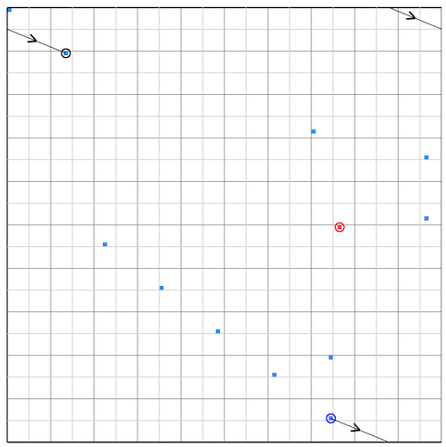

# 第13回Asprovaプログラミングコンテスト(AHC070)

[TOC]

## 問題概要

- https://atcoder.jp/contests/ahc070
- N\*N マスからなるトーラス状の村がある
- N^2 ターンの間、各ターンで怪異が発生するマスの座標があらかじめ入力として与えられる
  - 発生するマスはすべて異なる
- 最初に「ある位置にいるときに次の相対的な移動先(ベクトル)」を3つまで定めておき、(0,0)からスタートして、毎ターンではそれらのどれかを使って移動し、移動先に御札を設置するのを繰り返す
- 各ターンでは、御札を設置した後に怪異が発生し、その怪異と一番マンハッタン距離が近い御札との距離をdとすると、危険度はfloor(d\*sqrt(t+1))で計算される
  - tは何ターン目かを表す
  - dの計算時はトーラス状であることは考慮されず、単純に盤面上のマンハッタン距離で計算する
- すべてのターンが終了した時点での危険度の合計をできるだけ小さくせよ

## 時間

- 4 時間

## 個人的メモ

### アプローチ

#### 御札をできるだけ等間隔に設置する

- 近似的に「怪異は盤面に一様ランダム発生する」と考えた場合、御札はできるだけ盤面に等間隔・均等に設置したほうがよさそうに見える
  - どのマスで出現しても御札が近くにあるようにしたいので
- また、一度御札を置いたマスに再度御札を置いても意味がないので、できるだけ、等間隔、かつ、全マスを通るように置けないか？を考えるのは一つの方向性
- 2つベクトルで実現する
  - ベクトルv1で移動を繰り返して、1周期したら、ベクトル2で位置をずらして、これを繰り返す、的な感じを考える
  - Nは100なので、全探索すると、このようなものはいくつも見つかるので、埋め込んで使うというのができる
    - 全マスを通るためにv1が100回で1周するようにするには、x軸もy軸も100回で1周するように、100とy1とx1が互いに素になる必要がある
    - v1で1周した後でv2を使って場所をずらしたいが、これがすでに周回済みのところに入らないようにするためには、v1とv2の行列式と100が互いに素、のような条件になる
      - (解説放送でも解説されている)
      - (が、条件を考えるよりも、単純に探索して見つけるで良さそう)
  - ただ、結構みんな思いつく感じで、ここらへんだけだと500Mもいかないぐらいが限界で、上位は難しい
    - 解の形を限定してしまっているのもあって探索空間が小さくなってしまっている

#####  1ターン目だけ変える

- (解説放送)
- v3を使って、1ターン目の開始位置をいろいろ変えるとスコアが改善する模様

##### 怪異出現済みマスをスキップ(skip解法)

- ある程度御札を設置した後の中盤〜後半などは、出現した怪異の近くに御札がある場合が多くなり、御札を設置することで距離dが短くなる効果は小さくなっていく
- そのため、どちらかというと、御札を設置するマスに出現する怪異の危険度を0にできるか？が重要になってくる
- その場合、怪異が未出現のマスの方をできるだけ優先して御札設置することで、危険度0にできる怪異を増やせる可能性がある
  - 怪異が出現済みマスはそれ以降は発生しないので、無視してもスコアはかわらない
- 怪異が出現済みのマスだったらスキップして次のマスへ移動する、というのがかなり強い
  - 使っていなかったベクトルv3を、v1での移動を2回した場合のものにしておくことで、v1での移動後が怪異出現済みならv3を使うことでスキップできる

#### ペア解法

- https://x.com/tempuracpp/status/2093646423535599637
- https://atcoder.jp/contests/ahc070/editorial/25340
- AHC062のようなペア解法も考えられた模様
- 2レーン間を相互に移動できるベクトルを用意して、どっちを取った方がよいかを選ぶような感じにする
- (解説放送)
  - 各マスに対して、そのマスのペアになるマスを考える
    - これは、例えば(0,50)みたいなベクトルを考えると、2回足せば(0,0)になるので、同じベクトルでペア間を往復できる
    - このとき、(y,x)のペアのマスは(y,(x+50)modN)になる
  - v0を「レーン上での1歩進めるベクトル」とすると、「v0+ペア間移動ベクトル」のベクトルv1は「ペアのレーンに切り替えながら1歩進めるベクトル」にできる
  - なので、v0とv1を使い分けることでレーン間を移動しながら選ぶような動きが実現できる
  - ただし、1周目した後は、1周目で通らなかった方のペアのマスを辿るようにしたい
    - これは、一旦v1を使わずに、「v0を99回、v2を1回」を繰り返す場合を考えると、1周目が終わる5000手後の位置は「50セット\*(v0\*99回+v2\*1回) mod 100」でこれは「50\*(v2-v0) mod 100」なので、(v2-v0)の偶奇から考えられる
    - 最初が(0,0)なら、もう片方は(0,50)なので、y座標側が偶数、x座標側が奇数であればよい
  - v2は、この偶奇の条件と、全マスを1回ずつ訪問できるという条件を両方満たすものを見つければ良い
  - ペアのどちらを使うか？は、解説だと山登りで求めている
    - 周囲のマスの怪異の距離が変わってしまうので、毎回厳密にスコアを求めている

#### ブロックDP解

- (解説放送)
- 雰囲気としては、ペア解法の発展として見ると、レーンを100レーンに増やして、今レーンaにいるとして1手進めるときに「同じレーンa」「別のレーン(a+X)」「別のレーン(a+Y)」の3種類の遷移があるとして、dp\[t手後\]\[レーンg\]:=価値合計の最大値、を繰り返していく感じ
  - 御札をそのマスに置く価値は、今後の怪異の危険度がどれだけ減らせそうか？を考えて評価値を求めている

#### d\=0の怪異数を最大化する局所改善

- ある時点でのベクトルを変更(1点変更)してしまうと、移動先が変わってしまってそれ以降がすべてズレてしまう
- しかし、2つの連続するベクトルを交換する操作(隣接swap)だと、v1\+v2もv2\+v1も同じなので、局所的な変更ができ、差分更新ができる
- 全マスに到達可能なランダムな3つのベクトル、および、ランダムな操作列から開始して、距離0にできる怪異数などを最大化することなどを考える
  - 高速化や距離1以上のものを考慮したりもするとスコアが伸びる
- (メモ)
  - ランダムな操作列の場合、隣接する操作が異なる確率は2 / 3なので、かなり多くの時刻で隣接swapすることでスコアが変化する
  - 隣接swapで変わる訪問マスが、そもそも出現済み・訪問済みの場合はスコアが変わらない(ので、操作の個数の調整になったり、ほとんどスコアを悪化させずに長距離の移動みたいなのも実現できる)

#### ビームサーチ

- 全マスに到達可能な3つのベクトルを用意してビームサーチ
- 評価関数は、「現在までの怪異が出現したところのd合計」＋「将来の怪異が出現するところのd\*割引の合計」、など
  - 距離合計ではなく危険度合計の方が自然なような気もするけど、試してもあんまり変わらないみたい
- ただし、「割引」(減衰)のところは結構重要かもで、割引なしだと今の距離で計算するが、御札は増え続けて後半になるほど距離は小さくなるはずなので、その分の考慮が必要
  - 1000ターン後で半分ぐらいになるように0.9993ぐらいの数値で調整するのがよいみたい？
- ターンがかなり長いので、数手先先読みなども？

### スコア計算の高速化

- 怪異を中心に考える
  - 出現した怪異に一番近い御札を探すのに、怪異の位置から一番近い御札までをBFSして見つける
- 御札を中心に考える
  - 各空マスについて、一番近い御札までの距離をテーブルとして持っておき、御札を置いたらそこからBFSで距離情報を更新する
- 前半は探索/更新するマスが多いが、後半は御札が近くに見つかることが多いので、そこまで探索が増えず、ナイーブに計算するよりも高速に見つけられる

### その他

#### 桂馬飛びで設置すると2000ターンですべてのマスの距離が1以下にできる

- https://x.com/rian_tkb/status/2093642870209282500
- https://x.com/Koi1583/status/2093641948896837767

#### AI禁止

- 今回から短期コンは、一部の例外除いて、基本禁止になった
- コンテスト後に何人がBANを受けているようだった
  - 終了直後1位だった人もBANされていた

#### AtCoder Japan Open Heuristic部門予選

- https://atcoder.jp/posts/japanopen2026_heuristic
- ここ数回の短期コンはAtCoder Japan Open Heuristic部門の予選を兼ねている
  - 決勝に進むためには、登録やPC録画が必要

## 解説

(50位まで&発言を見つけられた方のみ)

- [AHCラジオ(解説放送)](https://www.youtube.com/watch?v=Gwt3Uan7RcQ)
  - [解説スライド](https://img.atcoder.jp/ahc070/editorial.pd)
- [解説](https://atcoder.jp/contests/ahc070/editorial)

- [tester解(kozimaさん)](https://x.com/t33f/status/2093640540156031412)
  - https://x.com/t33f/status/2093643455469961364
- [tester解(Koi51さん)](https://x.com/Koi1583/status/2093641948896837767)

- [Rafbillさん](https://x.com/Rafbill_pc/status/2093650892381732996)
- [E869120さん](https://x.com/e869120/status/2093642697735356465)
  - https://x.com/e869120/status/2093654172369621273
- [square1001さん](https://x.com/square10011/status/2093646205666619800)
  - https://x.com/square10011/status/2093647178053071311
  - https://x.com/square10011/status/2093655056310751636
- [Shun_PIさん](https://x.com/Shun___PI/status/2093640996055867872)
  - https://x.com/Shun___PI/status/2093642027561099582
  - https://x.com/Shun___PI/status/2093642314732454024
  - https://x.com/Shun___PI/status/2093642991193960864
- [mtsdさん](https://x.com/soiya_ksk/status/2093642343861928373)
  - https://x.com/soiya_ksk/status/2093991290727973346
  - https://x.com/soiya_ksk/status/2094439323747901526
- [besukohuさん](https://x.com/besukohu/status/2093643023100023159)
- [notさん](https://x.com/not_522/status/2093642782200279363)
  - https://x.com/not_522/status/2093647137540288803
  - https://x.com/not_522/status/2093656703317528868
- [FplusFplusFさん](https://x.com/FplusFplusF____/status/2093644511390101990)
  - https://x.com/FplusFplusF____/status/2093646051064631372
- [fuppy0716さん](https://x.com/fuppy_kyopro/status/2093643717475520761)
  - https://x.com/fuppy_kyopro/status/2093644374592852452
- [tempura0224さん](https://x.com/tempuracpp/status/2093646423535599637)
  - https://x.com/tempuracpp/status/2093652396237054300
- [saharanさん](https://x.com/shr_pc/status/2093644420721803588)
  - https://x.com/shr_pc/status/2093653111860806060
- [twins_fuyuさん](https://x.com/Fuyu348867/status/2093650496980758806)
- [plcherrimさん](https://x.com/plcherrim/status/2093641871004450910)
  - https://x.com/plcherrim/status/2093648228831182979
  - https://x.com/plcherrim/status/2093649413529026629
  - https://x.com/plcherrim/status/2093650545638854823
  - https://x.com/plcherrim/status/2093651209836241001
- [satoyukiさん](https://x.com/tomatokiraida52/status/2093527206257672485)
  - https://x.com/tomatokiraida52/status/2093642128752824696
  - https://x.com/tomatokiraida52/status/2093645361017655655
- [cointさん](https://x.com/_coint/status/2093649180501922095)
- [throughさん](https://x.com/through__TH__/status/2093643138611154974)
- [chokudai社長](https://x.com/chokudai/status/2093578077553193128)
  - https://x.com/chokudai/status/2093640489929187418
  - https://x.com/chokudai/status/2093640786399429071
  - https://x.com/chokudai/status/2093654440847028495
- [riantkbさん](https://x.com/rian_tkb/status/2093641330551566653)
  - https://x.com/rian_tkb/status/2093642870209282500
  - https://x.com/rian_tkb/status/2093647508413276637
- [PrussianBlueさん](https://x.com/prussian_coder/status/2093572888477798482)
  - https://x.com/prussian_coder/status/2093602602634428838
  - https://x.com/prussian_coder/status/2093641385337569412
  - https://x.com/prussian_coder/status/2093642940208005540
  - https://x.com/prussian_coder/status/2094405880188190997
  - https://atcoder.jp/contests/ahc070/editorial/25340
- [hitonanodeさん](https://x.com/rsat__m/status/2093644824000036923)
  - https://x.com/rsat__m/status/2093668627681808645
  - https://x.com/rsat__m/status/2093669319465222454
- [yunixさん](https://x.com/yunix91201367/status/2093661068757459223)
- [Piiiiiさん](https://x.com/AcPiiiii/status/2093647518727020977)
- [shingo0909さん](https://x.com/shingo_kyopro/status/2093647406290387129)
- [tmbさん](https://x.com/tombo_ac/status/2093646218929041675)
- [titan23さん](https://x.com/titan_230/status/2093641698601832543)
  - https://x.com/titan_230/status/2093642122897539472
  - https://x.com/titan_230/status/2093645417124901038
  - https://x.com/titan_230/status/2093645832059031630
- [Moegiさん](https://x.com/mih28731325/status/2093643449463607439)
  - https://x.com/mih28731325/status/2093643931229782428
  - https://x.com/mih28731325/status/2093645097485418947
- [yuuDotさん](https://x.com/yuuDot_kyopro/status/2093652272760918143)
  - https://x.com/yuuDot_kyopro/status/2093654299851264427
  - https://x.com/yuuDot_kyopro/status/2093655360586588605
  - https://x.com/yuuDot_kyopro/status/2093656088172515329
- [kurigenさん](https://x.com/kurig15/status/2093642332159819868)
  - https://x.com/kurig15/status/2093643802884108373
- [ryuusagiさん](https://x.com/ryuusagi/status/2093648054931038287)
- [LyricalMaestroさん](https://x.com/maestro_L_jp/status/2093642102710378728)
- [Ang107さん](https://x.com/Ang_kyopro/status/2093640810680250714)

- 延長戦
  - https://x.com/fuwaorune/status/2094769912195752150
  - https://atcoder.jp/contests/ahc070/editorial/25369

## Links

- [twitter hashtag AHC070](https://x.com/hashtag/AHC070)
- [twitter search AHC070](https://x.com/search?q=AHC070)
- [あとこちゃん観戦記](https://chokudai.github.io/atoco-cp/post/2026-08-29-ahc070/)
