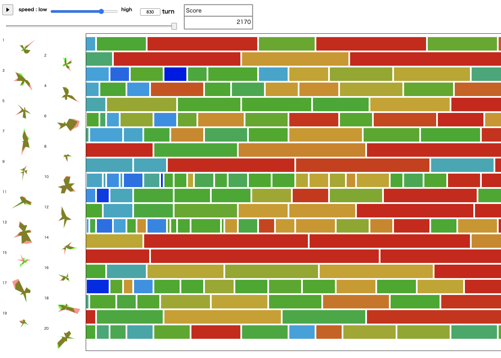

# HACK TO THE FUTURE 2022 予選

- https://atcoder.jp/contests/future-contest-2022-qual

## 問題概要

- N=1000 個のタスクを M=20 人のチームメンバーに割り振りたい
  - 各タスクは高々 1 人に割り振る
  - タスクは割り当てられると、そのタスクが終わるまで他のタスクは割り当てられない
- 各メンバーは K 種類の技能レベルがあり、ベクトル s で表されるが、入力としては与えられない
- 各タスクは各技能に対する要求レベルが決まっており、ベクトル d で表され、入力として与えられる
  - また、タスク間には依存関係(1000<=R<=3000 個の有向辺で与えられる)があり、あるタスクを割り振るためにはそれに依存するすべてのタスクが前日までに終わっている必要がある
- メンバー j がタスク i を行った場合、「各技能の要求レベルに満たない分」の合計を w として、w=0 なら 1 日、w>0 なら w±r(-3 ～ 3 の一様乱数)日だけかかる
- できるだけ短い日数ですべてのタスクが終わるように、各日のタスクの割り当てを求めよ
  - interactive 問題で、各日ごとに、完了したタスクを受け取り、その日の割当を返却するプログラムを作成せよ

## 時間

240 時間

## 個人的メモ

- ざっくり「スキル推定」と「タスク割当」パート
- 特に、「タスク割当」は、手が空いている人に割り当てだと良くないケースがあり、タスク中の人にも割り当てを考える部分がどの程度できたかで差が出ていた模様

### スキル推定

- それまでに選択したタスクとかかった時間を保持して、絶対誤差/二乗誤差(MSE)あたりが最小になるように山登り/焼きなましなど
  - 自由度があるので、正則化項(L2 ノルムとか)なども
- 最初の方は、あえて探索要素をいれるなど
- ベイズ推定、MCMC

### タスク割り当て

- クリティカルパス(一番時間がかかるタスクのパス)がボトルネックになるので、そのようなパスを重視するなどは必要
  - 深さ、などでも良い
  - クリティカルパス分析
- greedy なタスク割当で難しいところは、人が余ってないときや強い人がタスク中のときに、タスクが終わったからといってその人が不得意な仕事を割り当てることになりえること
  - そこで、「人(全員)と、割り当て可能なジョブ」の組み合わせに対して評価値を考える
    - 手が開いてる人に対してだけだと、評価関数をちゃんとやってても、活かされないような割り当てする可能性がある
    - タスク中でも、終わってからタスクをやった場合というのを考える
    - ここが、R が大きいときに重要で、暫定 97k 点台と 101k 点台ぐらいの差がでていたキモ
  - 反省: 自分は「終わりが近い人も含めて割当を考える」だけをしていた(全員ではない)
  - 人 i にタスク j を割り当てるときの評価関数
    - パスの重み/最長経路/要求技能レベルの総和
    - かかる時間(タスク終了見込み時間)
    - 自分にどのぐらい向いている仕事か
    - あえて少し待ってから仕事をするペナルティ
    - 全タスクが終わるまでにかかる最短時間(可能であれば。終盤だけでも)
    - 先読みしたときのコスト(依存が強い場合)
    - などで調整
  - 実際の割り当て方は、評価関数をもとに、貪欲、山登り/焼きなましなど
- 割り当て方は、最小費用流＋アドホックや、LP ソルバで計算していた方も
  - マッチングを最小費用流で解くやつで、かかる時間の合計が小さくなるような割り当てを求める
    - s->人の部分で辺を複数本に分けてそれぞれコストを分けることで均等になるような工夫(terry_u16さん)
  - 能力が低い人は別処理、など

### その他

- R によって問題の性質が違っていた
  - R が小さい(1000 付近)と、依存が少ないので、やれるタスクが多い → 自分が得意な仕事ができる
  - R が大きい(3000 付近)と、依存が多く、やれるタスクが少なく、暇になっている人が多い → 得意な人が全部やったほうが早いのに、手があいてるからと不得意な人が手をつけてしまうと逆に遅くなる(あえてやらないほうがよい)
- 「R ごとに調整」するとよかった可能性
  - 3 つぐらいに分割してそれぞれでパラメータを分ける、など
  - ローカルの評価でも、それぞれの R ごとに評価データを分けて確認するなどしたほうが良かった可能性
    - https://twitter.com/_phocom/status/1460164219006259201
    - https://twitter.com/iwashi31/status/1460192127338508292
    - テストケースが少ないと偏りやすい
    - 3000 ケースで評価していればそこまで偏らないのでよいか
  - ヒートマップを見る
    - https://tsutaj.hatenablog.com/entry/2021/11/13/190712

### Heterogeneous earliest finish time (HEFT)

- https://x.com/ymatsux_ac/status/1899104622138265777
- https://en.wikipedia.org/wiki/Heterogeneous_earliest_finish_time

## 解説

(50 位まで&発言を見つけられた方のみ)

- [解説放送(終了直後)](https://www.youtube.com/watch?v=H_MuLN6L-r4)
- [解説まとめ(公式)](https://atcoder.jp/contests/future-contest-2022-qual/editorial/2931?lang=ja)
- [eivourさん](https://twitter.com/contramundum2/status/1459478557210537985)
  - https://twitter.com/contramundum2/status/1459487317631012865
  - https://qiita.com/contramundum/items/52609b5a4c943bc6a275
- [phocomさん](https://twitter.com/_phocom/status/1459461706619699201)
- [toameさん](https://twitter.com/41Toame/status/1459861272049041412)
- [bowwowforeachさん](https://twitter.com/bowwowforeach/status/1459466965433470977)
  - https://twitter.com/bowwowforeach/status/1459490991153422336
- [ValGrowthさん](https://twitter.com/ValGrowth/status/1459465199216652289)
  - https://twitter.com/ValGrowth/status/1459463370781097987
- [c7c7さん](https://twitter.com/C7C7LL/status/1459462826930552836)
- [Shun_PIさん](https://twitter.com/Shun___PI/status/1459463013832880133)
- [iehnさん](https://twitter.com/arimasenu/status/1459461165969395712)
- [NKTさん](https://twitter.com/inani_waon/status/1459461945615020032)
  - https://twitter.com/inani_waon/status/1459479269453623302
  - https://twitter.com/inani_waon/status/1459542680073957376
  - https://inaniwa.hatenablog.com/entry/2021/11/15/072751
- [iwashi31さん](https://twitter.com/iwashi31/status/1459461324287582210)
  - https://twitter.com/iwashi31/status/1459462724547579907
  - https://twitter.com/iwashi31/status/1459463107860844547
  - https://twitter.com/iwashi31/status/1459465190890631173
  - https://twitter.com/iwashi31/status/1459466272383504389
- [yochanさん](https://twitter.com/yochan_tech/status/1459462014615851008)
  - https://twitter.com/yochan_tech/status/1459466656225558528
- [gazelleさん](https://twitter.com/gzlcp/status/1459462267331051521)
  - https://twitter.com/gzlcp/status/1459463457900998658
  - https://twitter.com/gzlcp/status/1459463747970682880
  - https://twitter.com/gzlcp/status/1459464174070038528
  - https://twitter.com/gzlcp/status/1459464947822624768
  - https://twitter.com/gzlcp/status/1459465248499716097
- [rabotさん](https://qiita.com/tanaka-a/items/dc50b224f984335ab986)
- [kawateaさん](https://twitter.com/kawatea03/status/1459464321768259585)
- [hokekyo1210さん](https://twitter.com/_hokekyo1210/status/1459479032932990977)
- [EmKさん](https://twitter.com/EmKjp/status/1459465646371053572)
- [shibh308さん](https://twitter.com/shibh308/status/1459469659468877825)
- [assyさん](https://twitter.com/assy1028/status/1459461980347985924)
- [terry_u16さん](https://twitter.com/terry_u16/status/1459462317771747328)
  - https://twitter.com/terry_u16/status/1459470465354076167
- [sumoooruさん](https://twitter.com/sumoooru/status/1459478589309550596)
- [yupiteruさん](https://twitter.com/yupiteru_kun/status/1459461186466975751)
- [kensさん](https://twitter.com/kens_kyopro/status/1459462599339556866)
- [ebicochinealさん](https://twitter.com/ebicochineal/status/1459487058087407617)
- [yowaさん](https://twitter.com/yowa/status/1459985209949302784)
  - https://twitter.com/yowa/status/1460116477097680896
- [tokotoko7777さん](https://twitter.com/whimsicott_opu/status/1459472590796308484)
- [itigoさん](https://twitter.com/itigo_purokonn/status/1459466863201587202)
  - https://twitter.com/itigo_purokonn/status/1459469271629582343
- [Trineutronさん](https://twitter.com/trineutron/status/1459471474805198848)
- [uminorosujinさん](https://uminorosu.hatenablog.com/entry/2021/11/23/151939)
- [wanuiさん](https://twitter.com/gmeriaog/status/1459480733433548802)
- [keep_OCさん](https://twitter.com/keep_OC/status/1459462090713088000)
- [takumi152さん](https://twitter.com/takumi152/status/1459464409651171334)
  - https://twitter.com/takumi152/status/1459465554402889728
  - https://takumi152.hatenablog.jp/entry/2021/11/13/191713
- [takoshiさん](https://twitter.com/takoshiiiiiiiii/status/1459464790489780225)
- [kozimaさん](https://twitter.com/t33f/status/1459464692405915651)
  - https://twitter.com/t33f/status/1459467052263952385
  - https://twitter.com/t33f/status/1459467759335575554
  - https://twitter.com/t33f/status/1459478143136256003
- [nagissさん](https://twitter.com/lgeuwce/status/1459461720624095232)
  - https://twitter.com/lgeuwce/status/1459469988838862851
  - https://twitter.com/lgeuwce/status/1459475887724789760
  - https://twitter.com/lgeuwce/status/1460106180005564416
  - https://twitter.com/lgeuwce/status/1459677513970434050

## Links

- [agwさん Twitter まとめ](https://togetter.com/li/1802420)
- [Twitter hashtag HTTF](https://twitter.com/hashtag/HTTF)

