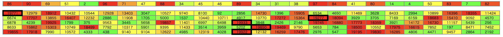

# Introduction to Heuristics Contest

[TOC]

## 問題概要

- https://atcoder.jp/contests/intro-heuristics
- 26 種類のコンテストがあり、ユーザーの満足度ができるだけ高くなるようにしたい
  - 満足度は開催すると増加するが、開催タイミングで増加量は変動する
  - また、特定のタイプのコンテストがしばらく開催されないと下がる
- 毎日 1 つのコンテストを開催する想定で、満足度ができるだけ大きくなるよう D 日分の日程を用意せよ

## 時間

120 分

## 解説

- https://img.atcoder.jp/intro-heuristics/editorial.pdf

- visualizer
  - https://x.com/cologne1723/status/1916071823592329580
    - https://thun-c.github.io/visualizer/introduction/Visualizer.html

- https://qiita.com/thun-c/items/fd82d1fb8131746bd347
- https://qiita.com/thun-c/items/c8f72927ff0fbe3aa705
- https://qiita.com/thun-c/items/797662754b521e22c49b

## Links

- [agwさん Twitter まとめ](https://togetter.com/li/1550502)
