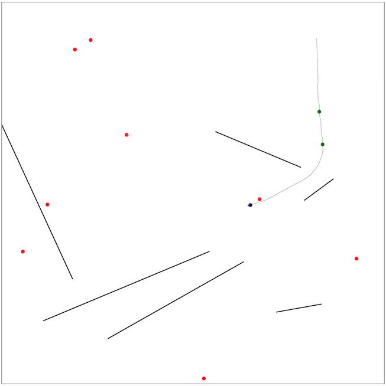

# 第一回マスターズ選手権-決勝-

[TOC]

## 問題概要

- https://atcoder.jp/contests/masters2024-final/
- 2次元平面上で飛行ドローンを操作し、N箇所の目的地をすべて訪れたい
  - 操作は、「加速」と「計測」が行える
- いくつか壁があったり、風による影響で速度が変化したり、計測には誤差がのる
  - 壁にぶつかる場合、ぶつかる前のターンの位置のままで、速度は0にリセットされる
- スコア0から開始し、5000ターン経つか、すべての目的地を訪れた時点までの最大スコアを得点としたとき、得点を最大化せよ
  - 毎ターンスコアが2減少する
  - 壁に衝突したら100減少する(同時に複数の壁に衝突しても100減少)
  - 初めて到達した目的地にある場合は、1つにつき1000点得られる
- 問題ごとの違い
  - A問題(60ケース): 壁なし＋風の影響あり＋計測誤差あり
  - B問題(60ケース): 壁10個＋風の影響小＋計測誤差小
  - C問題(80ケース): 壁あり＋風の影響あり＋計測誤差あり

## 時間

- 360 分

## 個人的メモ

- 幾何＋推定＋制御＋インタラクティブ＋オンサイト＋短期(6時間)＋チーム戦と、いろんな要素・状況が詰まっていた

### チームでの分担

- 今回の問題は、A問題\+B問題\=C問題のような感じで、チームでの分担がやや難しかった
  - 予選の問題は、傾向の違う入力ごとに分担とかができた
- うまく「全員で各モジュールを開発して1つのソルバーを作る」みたいなチームプレイができればよいが、連携も難しいので練習が必要そうかも
- 1位チームはうまくチームプレイができていたみたい(どういう分担だろう？)
  - https://twitter.com/wata_orz/status/1781650278246490427

### 自己位置推定

- ロボットなどでの自己位置推定手法が使える
- 今回の場合、1位はパーティクルフィルタで自己位置推定していた模様

#### 計測のタイミング

- 何ターンかに1回ずつ計測
- 推定精度が低いときに計測(ただし、計測ばかりにならないように調整)
- など

#### 計測値とのズレをそのまま位置にフィードバック

- 計測した値には誤差があるが、そのまま扱っても誤差が小さいケースなどではうまく動く
- 誤差があることも想定して、計測のたびに、その差分の何%分かだけを現在の位置に加える、なども
  - (平均的には実際の値なので、ある程度うまくいくみたい)

#### パーティクルフィルタ(粒子フィルタ)

- 今回の場合、いろんな状態(位置、速度)のドローンを粒子として何個か用意し、測定結果などで各粒子の尤度を計算して可能性の高い粒子を作り直すことを繰り返すことで、その粒子から自己位置推定を行える
  - 粒子の平均や分散を推定値として使う
- パーティクルフィルタの手続き
  - 初期位置で粒子をK個用意する
  - 各ターンについて以下を繰り返す
    - 加速操作の場合は、各粒子に対してその加速および速度・風の影響を適用する
    - 計測操作の場合は、計測値に対して、各粒子で尤度を計算し、その尤度を重みとして、重み付きサンプリングをしてK個の粒子を作り直し(リサンプリング)、速度・風の影響を適用する
- リサンプリングのタイミング
  - 計測操作以外にも、壁にぶつかった場合、目的地に到達した場合も、おおよその位置が確定するので、尤度計算＆リサンプリングできる
- 尤度の計算
  - 真の距離がdとして、得られる値はd\*α倍になっている
  - したがって、dで割ったものは、α〜N(1.0,δ^2)になるので、αをこの正規分布の確率密度関数にいれた値が尤度になる
  - 各粒子に対して、その位置から計測した場合に得られる距離で割ってあげたもので尤度計算する
  - (または、正規分布のパラメータが変わるだけだと思うので、d倍されたものをそのまま扱うでも)
- 計測方向
  - A問題の場合は外壁しかないので、一番近い外壁に対して距離を取得し、各粒子の位置での距離
    - x軸、y軸に並行な方向に測定する
  - 壁がある場合は、現在位置から壁(半直線)に直角になるようなものなどを列挙して、一番近い位置ものを採用
    - または、各粒子の方向の偏りなども考慮して、列挙した方向の中で、各粒子での計測距離がバラけそうな(粒子を選別できそうな)方向を選ぶとかもありっぽい(writer解)
- 粒子が全滅した場合
  - 全滅前の粒子に対して、再度速度などを適用しなおす
  - または、その付近を広めにリサンプリングする、一様にばらまいてリサンプリングする

#### カルマンフィルタ

- 自己位置推定の別の方法として、カルマンフィルタの適用なども考えられる
  - システムの状態に対して、次の状態の予測と観測値からの最適カルマンゲインを計算し状態の推定値を更新する
- しかし、今回、壁などがあったりもするので、パーティクルフィルタの方が扱いやすかったかも

### ドローン制御

- 理想的には、速度を落とさずに目的地をスムーズに通り過ぎる、途中経路は曲線的に動く、などができれば良さそうかもしれないが、とても短期では難しいので、速度制限ありで、目的地に向かうように速度制御するだけでも十分

#### 目的地に向かうようにだけ速度制御

- 現在位置から目的位置までのベクトル上に速度ベクトルがのるように加速度ベクトルを決める
- 速度上限は決めておく
- 推定誤差や風の影響で、目的位置を通り過ぎる場合があるが、目的地に向かうのを繰り返すので、(推定位置がある程度妥当なら)多少ターン数がかかってもたどり着ける

#### PID制御

- 1つの目的地に一直線に向かうことを考えると、これは、1次元で制御対象を目標値にする古典的なフィードバック制御の問題と考えられる
  - A問題1位はPID制御していたらしい
- PID制御は、P(比例)制御、I(積分)制御、D(微分)制御からなる制御方法
- P制御
  - 目的位置と現在位置の差(偏差)に対して、K_p倍したものを制御入力にする
  - 速度が出すぎていたり、目的地で速度が0になるように制御していないと、オーバーシュートや振動が起きたりしている
- D制御
  - 目標位置での速度と、現在の速度の差に対して、K_d倍したものを制御入力にする
    - 目標速度で目的位置に移動できるように制御
- I制御
  - 目的位置と現在位置の差を積分したもの(誤差の蓄積)に対して、K_i倍したものを制御入力にする
    - P制御だけだと最終的な定常値が目標値にならない場合で、その差分を埋めるように制御
- 今回の場合、目的地点付近で速度0にする必要性はあまりなく、I制御もあまりいらないようで、P制御、PD制御だけで十分っぽい
  - なので、「位置の目標値との差分」と「現在の速度と目的地での速度との差分」に対していい感じの速度になるように制御してあげればよい

### その他

#### パーティクルフィルタ関連

- https://ja.wikipedia.org/wiki/%E7%B2%92%E5%AD%90%E3%83%95%E3%82%A3%E3%83%AB%E3%82%BF
- https://www.ieice.org/jpn/books/kaishikiji/2005/200512.pdf
- https://twitter.com/terry_u16/status/1781698819132117109

#### ゲーム化

- https://x.com/kiri8128/status/2086825121571078537
  - https://x.com/kiri8128/status/2086827874636726435

## 解説

(発言を見つけられた方のみ)

- [writer](https://twitter.com/wata_orz/status/1781650278246490427)
  - https://twitter.com/wata_orz/status/1781666787731583182
  - https://twitter.com/wata_orz/status/1781908386344497190
  - https://twitter.com/wata_orz/status/1781907709258051745

- [Imusu](https://twitter.com/semiexp/status/1781661110460166515)
  - https://twitter.com/japlj/status/1781666007733678416
  - https://twitter.com/semiexp/status/1781696689067479189
  - https://twitter.com/semiexp/status/1781700451966374026
  - https://twitter.com/semiexp/status/1781703201005396302
  - https://twitter.com/semiexp/status/1781704027614609490
  - https://twitter.com/semiexp/status/1781706471585251638
  - https://twitter.com/semiexp/status/1781721755163488416
  - https://twitter.com/semiexp/status/1781724715599736909
- [Pink Rose](https://twitter.com/skyaozora/status/1781597099794260444)
  - https://twitter.com/nico_shindannin/status/1781680527789199528
  - https://twitter.com/laycrs/status/1781652206330245457
- [astrea](https://twitter.com/threecourse/status/1781720825957331341)
  - https://twitter.com/yunix91201367/status/1781717597731647771
  - https://twitter.com/yunix91201367/status/1781597010937966691
  - https://twitter.com/yunix91201367/status/1781695458429305044
- [https://jag-icpc.org/?Join](https://twitter.com/TumoiYorozu/status/1781499186523099594)
  - https://twitter.com/TumoiYorozu/status/1781596794780295564
  - https://twitter.com/TumoiYorozu/status/1781598791927472428
  - https://twitter.com/TumoiYorozu/status/1781695481502130645
  - https://twitter.com/rian_tkb/status/1781690499512041663
  - https://twitter.com/rian_tkb/status/1781691341266936136
  - https://twitter.com/smiken_61/status/1781598482392088666
  - https://twitter.com/smiken_61/status/1781687426475524442
- [Optimization I.G](https://twitter.com/tsukammo/status/1781945274841411914)
  - https://twitter.com/tsukammo/status/1781945784906453297
    - https://tsukammo.hatenablog.com/entry/2024/04/21/161831
  - https://twitter.com/omi_UT/status/1781622653830463754
  - https://twitter.com/omi_UT/status/1781938419549254134
  - https://twitter.com/omi_UT/status/1782018108137591198
  - https://omizatta.hatenablog.com/entry/2024/04/29/210411
- [実装をしない](https://twitter.com/shr_pc/status/1781499727852478676)
  - https://twitter.com/shr_pc/status/1781597149937189091
  - https://twitter.com/shr_pc/status/1781597318984380881
  - https://twitter.com/shr_pc/status/1781647339129848029
  - https://twitter.com/_simanman/status/1781708196287246654
  - https://twitter.com/_simanman/status/1781731984026583284
    - https://twitter.com/bowwowforeach/status/1781666445153456428
  - https://twitter.com/_simanman/status/1781809867147358672
- [わくわくわくわく](https://twitter.com/takoshiiiiiiiii/status/1781502246213275863)
  - https://twitter.com/fuppy_kyopro/status/1781597850583097590
  - https://twitter.com/rsat__m/status/1781641126027624751
- [Garden Tellers](https://twitter.com/phyllo/status/1781663560466362710)
  - https://twitter.com/sash277/status/1781671192770015266
- [ジャムおじさん](https://twitter.com/darjeeling743/status/1781637816348528913)
- [FIRST](https://twitter.com/colun/status/1781945272438079539)
  - https://twitter.com/bowwowforeach/status/1781662695043067934
  - https://twitter.com/bowwowforeach/status/1781666445153456428
    - https://www.codingame.com/multiplayer/bot-programming/mad-pod-racing
  - https://twitter.com/bowwowforeach/status/1781820272670306462
  - https://twitter.com/Shun___PI/status/1781618543039234324
  - https://twitter.com/Shun___PI/status/1781975987619803168
- [3人に勝てるわけないだろ！🐑🍃🤪](https://twitter.com/leaf_1415/status/1781626804597653750)
  - https://twitter.com/yuuki_n_n/status/1781598313659412752
- [パズル解放軍](https://twitter.com/shibuyapprocon/status/1782219796303733151)
- [焼肉](https://twitter.com/ichyo/status/1781632979993002380)
- [焼きなマシーン改](https://twitter.com/takumi152/status/1781688090308010330)
  - https://twitter.com/takumi152/status/1781701493399355439
  - https://twitter.com/takumi152/status/1781708952356712933
  - https://twitter.com/terry_u16/status/1781599105153966190
  - https://twitter.com/terry_u16/status/1781689081464017318
  - https://twitter.com/terry_u16/status/1781692363192348923
  - https://twitter.com/terry_u16/status/1781698819132117109
  - https://twitter.com/terry_u16/status/1781705385013137665
  - https://twitter.com/terry_u16/status/1781872003617800378
  - https://twitter.com/terry_u16/status/1781880915888931148
  - https://twitter.com/terry_u16/status/1781883076593021252
  - https://twitter.com/terry_u16/status/1781883996131201528
  - https://twitter.com/terry_u16/status/1781884174624075893
  - https://twitter.com/terry_u16/status/1781892871534317832
  - https://twitter.com/terry_u16/status/1781893528706269364
  - https://twitter.com/terry_u16/status/1781895907702931777
  - https://twitter.com/terry_u16/status/1781910232995877183
  - https://twitter.com/terry_u16/status/1781910930542194886
  - https://twitter.com/terry_u16/status/1781921357003190474
  - https://twitter.com/terry_u16/status/1782013300475367500
  - https://twitter.com/terry_u16/status/1782066933753647241
  - https://twitter.com/terry_u16/status/1782069390416244818
  - https://twitter.com/terry_u16/status/1782071910324731970
  - https://twitter.com/terry_u16/status/1782073123669750103
  - https://twitter.com/terry_u16/status/1782075318188310778
  - https://twitter.com/terry_u16/status/1782095263592857844
- [年末恒例の餅](https://twitter.com/tokumini_ss/status/1781652142224523292)
  - https://twitter.com/tokumini_ss/status/1781650300778275142
  - https://twitter.com/merom686/status/1781651714887864645
- [CAT'S EYE](https://twitter.com/tanakh/status/1781727734433264097)
  - https://twitter.com/koyumeishi_/status/1781649214344462515
  - https://twitter.com/yuki_prog/status/1781666371035955281
- [マアヂマシィン](https://twitter.com/blue_jam/status/1781671102177255732)
  - https://twitter.com/blue_jam/status/1781910704339272132
- [中本會](https://twitter.com/komora71_/status/1781599707988701284)
  - https://twitter.com/komora71_/status/1781661079711724020
  - https://twitter.com/komora71_/status/1781706222254923969
  - https://twitter.com/___kyskyskyskys/status/1781721063925420369
  - https://twitter.com/___kyskyskyskys/status/1781668695607243063
  - https://twitter.com/MasaakiMitsuo/status/1781647718664016018
  - https://twitter.com/MasaakiMitsuo/status/1781681497487069483
  - https://twitter.com/MasaakiMitsuo/status/1781682166998651372
  - https://twitter.com/MasaakiMitsuo/status/1781695837640540616
- [uff](https://twitter.com/fmhr__/status/1781598806557233342)
- [half_centuries](https://twitter.com/ToastUz/status/1781683730358415717)
  - https://twitter.com/ToastUz/status/1781848577515688184
  - https://twitter.com/tanaka_a8/status/1781675651361317254
  - https://twitter.com/tanaka_a8/status/1781675973706231901
  - https://twitter.com/tanaka_a8/status/1781705919660986397
  - https://twitter.com/tanaka_a8/status/1781947487424852079
  - https://twitter.com/tanaka_a8/status/1782389022217970112
  - https://twitter.com/zach_leee/status/1781697302866088216
  - https://twitter.com/zach_leee/status/1781696486604161461
  - https://qiita.com/toast-uz/items/e17873fadcc8866ae453
- [今日も一日よろしくです](https://twitter.com/iwashi31/status/1781496039922675763)
  - https://twitter.com/iwashi31/status/1781651328068121047
  - https://twitter.com/iwashi31/status/1781852691939152275
- [やほー🍑🍤](https://twitter.com/tempuracpp/status/1781696236791505292)
- [O](https://twitter.com/WniKwo/status/1781598674033795298)
  - https://twitter.com/WniKwo/status/1781678922939396204
  - https://twitter.com/WniKwo/status/1781865478081954167
  - https://twitter.com/omurice__/status/1781597057322725886
  - https://twitter.com/omurice__/status/1781624724923310370
  - https://twitter.com/omurice__/status/1781659385930154197
- [manarimo](https://twitter.com/kawatea03/status/1781707224093741464)
- [駆け込み寺](https://twitter.com/hamko_intel/status/1781601099923026164)
  - https://twitter.com/nekomimimi/status/1782396010947649920
- [BABA_IS_AC](https://twitter.com/yusapon_/status/1781675718776377372)
- [寿司処「松の」愛好会](https://twitter.com/rine_orz/status/1781644616594559205)
- [ITなんもわからん](https://twitter.com/uuuus17/status/1781650702143807850)
  - https://twitter.com/uuuus17/status/1781671104949743735
  - https://twitter.com/_bo9chan/status/1781822139886375101
  - https://twitter.com/_bo9chan/status/1785962925221638336
  - https://twitter.com/negoto_coder/status/1781640897656184949
- [ウルトラ山のぼリスト集団](https://twitter.com/gmm_tea_cpg/status/1781646683845378548)
- [infOtaKU](https://twitter.com/ygussany/status/1781649514962858471)
  - https://twitter.com/trilink0725/status/1781852239864480181
- [そうゆうさくせん](https://twitter.com/cexen/status/1781678632970358864)
- [Re: PSF](https://twitter.com/yos1up/status/1781653560259977686)
- [Monocari](https://twitter.com/drken1215/status/1781886915454910747)
  - https://twitter.com/drken1215/status/1781889317247602881
  - https://twitter.com/tsutaj/status/1781641508208406842
  - https://twitter.com/tsutaj/status/1782094223292158191
  - https://twitter.com/tsutaj/status/1782096511586934799
  - https://twitter.com/monkukui/status/1781598096394432530
- [無職](https://twitter.com/Jirosho111/status/1781641801562296340)
- [最適ゴリラ理論](https://twitter.com/theory_and_me/status/1781713105074139452)
  - https://twitter.com/theory_and_me/status/1781846501293244788
- [えびますたーどわん](https://twitter.com/ebicochineal/status/1782034523091595371)
  - https://twitter.com/ebicochineal/status/1782205294799708276
- [天才貪欲マシーン](https://twitter.com/prussian_coder/status/1781685333173907460)
  - https://twitter.com/prussian_coder/status/1782316345826394250
  - https://twitter.com/bird0148677302/status/1781969934287024260
  - https://twitter.com/bird0148677302/status/1782327303969841352
- [VRC競プロ部](https://twitter.com/amb_vrc/status/1781873510710964613)
  - https://twitter.com/amb_vrc/status/1781896135852061079
    - https://amentorimaru.hatenablog.com/entry/2024/04/21/034648
  - https://twitter.com/amb_vrc/status/1781958239741223268

- 延長戦
  - https://eijirou-kyopro.hatenablog.com/entry/2024/05/06/185111
  - https://zenn.dev/algoartis/articles/kalmanfilter_masters_2024

## Links

- [Twitter hashtag AtCoderマスターズ選手権2024](https://twitter.com/hashtag/AtCoder%E3%83%9E%E3%82%B9%E3%82%BF%E3%83%BC%E3%82%BA%E9%81%B8%E6%89%8B%E6%A8%A92024)

