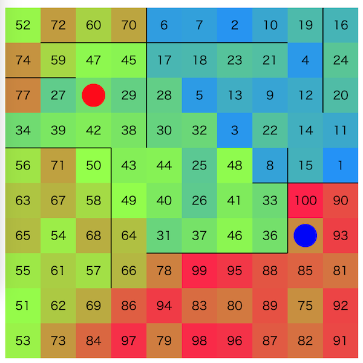

# 第一回マスターズ選手権-予選-

- https://atcoder.jp/contests/masters-qual

## 問題概要

- N\*Nマスの盤面があり、マスの間には壁がある場合がある
- 各マスには1〜N^2 の数字が1つずつ書かれており、以下の一連の操作を最大で4N^2 回行う
  1. 高橋くんと青木くんの現在位置にかかれているマスを交換したければ交換する
  1. 高橋くんを現在の位置の移動可能な隣接マスへ移動したければ移動する
  1. 青木くんを現在の位置の移動可能な隣接マスへ移動したければ移動する
- スタート地点は好きな場所に設定できる
- 隣接マス(壁がない隣接)の数字の差の二乗和をスコアとするとき、これをできるだけ小さくせよ

## 時間

- 360 分

## 個人的メモ

### 問題固有の性質

- 移動回数の4N^2回から、1マスあたりを修正するの使える手数は平均4回
- 隣接マスとの差が大きいマスを直す方が改善の寄与が大きい

### アプローチ

- 貪欲(強い貪欲)
  - 任意の2地点について、「その2地点をswapしたときのスコアの改善度合い/現在地からそこまでの移動距離」(ターンあたりの改善量)で最大のものを貪欲に選ぶ
    - 盤面が大きいと厳しいので、それぞれの一定距離内のマスについてだけ計算

- 理想状態を作って、クイックソート的に処理
  - 焼きなましで理想状態を作る(大域的に良い状態にできる)
    - 近傍は2点swap、など
    - 目的関数を2段階にして、最初は差の和で、次に実スコアで最適化、とかも？
  - クイックソートのように、番号の範囲を半分に分けて、範囲内の数字が矛盾する地点を交換するのを再帰的に繰り返す
    - 矛盾する地点への移動経路は、近いところに移動するgreedyか、TSP、など

- 経路を固定してswapするかどうかを焼きなまし
  - DFS木、オイラーツアー、などで全部のマスを通るパス生成
  - 問題の制約から、全部のマスを通る、行って戻って来るパスを2周できる

- 経路を固定しないで焼きなまし
  - swapする地点のペアをリストに持って追加削除交換を焼きなまし＋移動経路は最短経路(or TSP)

- 目標盤面との二乗誤差を評価関数とした先読み木上ビームサーチ

### tの生成

- 盤面は、20種類
- 解説放送によると、形状については以下のようなものが用意されていた
  - 直線
  - 木
  - 十字、部屋
  - 渦巻き、2x2マスで渦巻き
  - 過去の問題での壁生成方法

## 解説

(50位まで&発言を見つけられた方のみ)

- [AHCラジオ(解説放送)](https://www.youtube.com/watch?v=iibxHGTVvQA)
  - 前半はコンテスト形式の紹介
  - [公式ビジュアライザ(コンテスト後公開)](https://img.atcoder.jp/masters-qual/ak2uQT08.html)
- [解説(日本語)](https://atcoder.jp/contests/masters-qual/editorial)
- [解説(英語)](https://atcoder.jp/contests/masters-qual/editorial?editorialLang=en)

- [writer解](https://twitter.com/wata_orz/status/1764231106931675179)
  - https://atcoder.jp/contests/masters-qual/submissions/50877167
  - https://atcoder.jp/contests/masters-qual/submissions/51009422

- [1位Re:PSF](https://medium.com/karakuri/%E7%AC%AC%E4%B8%80%E5%9B%9E%E3%83%9E%E3%82%B9%E3%82%BF%E3%83%BC%E3%82%BA%E4%BA%88%E9%81%B8-%E5%8F%82%E5%8A%A0%E8%A8%98-8f605012aa4a)
  - https://twitter.com/not_oohikata/status/1764234635071074689
  - https://twitter.com/yos1up/status/1764239250118361546
- [2位Rafbillさん](https://twitter.com/Rafbill_pc/status/1764237826810425490)
- [3位真心こもった評価関数](https://twitter.com/rho__o/status/1764231204772237440)
  - https://twitter.com/rho__o/status/1765350033325793593
  - https://twitter.com/ethylene_66/status/1764230842094846057
  - https://twitter.com/ethylene_66/status/1765589023811375146
  - https://twitter.com/ethylene_66/status/1764245224367571416
- [4位焼きなマシーン改](https://twitter.com/takumi152/status/1764232927758721401)
  - https://twitter.com/takumi152/status/1764235190212362677
  - https://twitter.com/terry_u16/status/1764232355114606858
  - https://twitter.com/terry_u16/status/1764234495698624617
  - https://twitter.com/terry_u16/status/1764235025242046716
  - https://twitter.com/takumi152/status/1764238925198180407
  - https://twitter.com/terry_u16/status/1764247079977984219
  - https://twitter.com/terry_u16/status/1764651534108037397
  - https://twitter.com/terry_u16/status/1764666595987927203
  - https://twitter.com/terry_u16/status/1764676052671156663
  - https://twitter.com/terry_u16/status/1764687166750457999
  - https://twitter.com/terry_u16/status/1764694637909020679
  - https://twitter.com/terry_u16/status/1764696547634343937
  - https://twitter.com/terry_u16/status/1764806587515068753
  - https://twitter.com/terry_u16/status/1765005194444865912
  - https://twitter.com/terry_u16/status/1765381767178182737
  - https://twitter.com/terry_u16/status/1765386556620308503
- [5位monk1](https://twitter.com/montplusa/status/1764241196506140708)
  - https://twitter.com/montplusa/status/1764342999813890534
  - https://twitter.com/montplusa/status/1765352099565752522
  - https://twitter.com/montplusa/status/1764251403164512473
  - https://twitter.com/statiolake/status/1764252506086109266
- [6位Imusu](https://twitter.com/semiexp/status/1764232122863390812)
- [7位toyoharu](https://twitter.com/tooooyyo/status/1764242529619484689)
- [8位駆け込み寺](https://twitter.com/hamko_intel/status/1764235652005347709)
  - https://twitter.com/pes_magic/status/1764238189701861565
- 9位寿司処「松の」愛好会
- [10位えびますたーどわん](https://twitter.com/gmeriaog/status/1764237152047763535)
  - https://twitter.com/hotpepsi/status/1764254250295771508
  - https://twitter.com/hotpepsi/status/1764254981644062986
  - https://twitter.com/ebicochineal/status/1764538406296854775
  - https://twitter.com/ebicochineal/status/1765328711401001041
  - https://twitter.com/ebicochineal/status/1764237356222329252
- [11位manarimo](https://twitter.com/kawatea03/status/1764231934463648080)
  - https://twitter.com/osa_k/status/1764254861313597518
- [12位Monocari](https://twitter.com/drken1215/status/1765196496734171517)
  - https://twitter.com/drken1215/status/1764236432959516919
  - https://twitter.com/drken1215/status/1764251496605266311
  - https://twitter.com/tsutaj/status/1764231398293115288
  - https://twitter.com/monkukui/status/1764230356277006576
- [13位実装をしない](https://twitter.com/tomerun/status/1764237172352356684)
  - https://twitter.com/tomerun/status/1765397607478968608
  - https://twitter.com/shr_pc/status/1764236753928618140
  - https://twitter.com/_simanman/status/1764238295717064983
  - https://twitter.com/_simanman/status/1764329878915268915
  - https://twitter.com/_simanman/status/1764331806776811540
  - https://twitter.com/_simanman/status/1764332423620460802
  - https://twitter.com/_simanman/status/1764344793704870242
  - https://twitter.com/_simanman/status/1764345015931687371
  - https://twitter.com/_simanman/status/1764351103972647043
  - https://twitter.com/_simanman/status/1764329220472488118
- [14位eijijou57](https://twitter.com/eijirou_kyopro/status/1764264029957288318)
  - https://twitter.com/eijirou_kyopro/status/1764278803243888905
  - https://twitter.com/square10011/status/1764232512740724858
- [15位焼肉](https://twitter.com/ichyo/status/1764232702616858670)
- 16位DiamondPrincess
- [17位grammis](https://twitter.com/hogloid/status/1764234128076218748)
- [18位Bue World](https://twitter.com/soiya_ksk/status/1764240454433083399)
  - https://twitter.com/soiya_ksk/status/1764231992974225690
  - https://twitter.com/soiya_ksk/status/1764230354410590294
  - https://twitter.com/soiya_ksk/status/1764314973755601310
- [19位やほー🍑🍤](https://twitter.com/tempuracpp/status/1764229877593686100)
  - https://twitter.com/tempuracpp/status/1764232623499669751
  - https://twitter.com/tempuracpp/status/1764236603109802197
  - https://twitter.com/tempuracpp/status/1764302002316890286
  - https://twitter.com/tempuracpp/status/1764310555744174502
  - https://twitter.com/tempuracpp/status/1764323971724706071
- 20位Sleep Deprived Masters
- 21位ふくろうさんチーム
- [22位パズル解放軍](https://twitter.com/ks4m/status/1764268096767037520)
  - https://twitter.com/shibuyapprocon/status/1764276010814746961
- [23位ゲーム出汁](https://twitter.com/TangentDay/status/1764238875025940579)
- [24位FIRST](https://twitter.com/bowwowforeach/status/1764236862166909435)
  - https://twitter.com/bowwowforeach/status/1764261410065031407
  - https://twitter.com/bowwowforeach/status/1765329235026264465
  - https://twitter.com/bowwowforeach/status/1765359508774383643
  - https://twitter.com/bowwowforeach/status/1765362272824852705
- 25位IMKY
- 26位VRC競プロ部
- [27位三人衆](https://twitter.com/wafrelka/status/1764238058592076131)
- [28位チピチピChatGPT](https://twitter.com/AT274_/status/1764231910350598208)
- 29位ei1333
- [30位無職](https://twitter.com/Jirosho111/status/1764238178163245068)
- [31位グリグリのつよーディー](https://twitter.com/raclamusi/status/1764234726976709088)
- [32位最適ゴリラ理論](https://twitter.com/theory_and_me/status/1764235817860661326)
  - https://twitter.com/MathGorilla_cp/status/1764237641162350801
  - https://twitter.com/MathGorilla_cp/status/1764244878995918995
  - https://twitter.com/MathGorilla_cp/status/1764633796706771023
  - https://twitter.com/MathGorilla_cp/status/1764635137546088497
  - https://twitter.com/MathGorilla_cp/status/1765053289157263814
  - https://twitter.com/MathGorilla_cp/status/1765364008813727773
  - https://twitter.com/MathGorilla_cp/status/1765752219729871109
  - https://twitter.com/opt_misc/status/1764249199330361425
- [33位3人に勝てるわけないだろ！🐑🍃🤪](https://twitter.com/aplysiaSheep/status/1764232213342892244)
  - https://twitter.com/leaf_1415/status/1764232725949526060
  - https://twitter.com/yuuki_n_n/status/1764239818014511122
- [34位中本會](https://twitter.com/komora71_/status/1764234181280973286)
  - https://twitter.com/komora71_/status/1764235602466357699
  - https://twitter.com/komora71_/status/1764247916271833094
- [35位マアヂマシィン](https://twitter.com/blue_jam/status/1764429952240263438)
- [36位わくわくわくわく](https://twitter.com/takoshiiiiiiiii/status/1764233980155695282)
  - https://twitter.com/takoshiiiiiiiii/status/1764237241172492772
  - https://twitter.com/fuppy_kyopro/status/1764229913484423441
  - https://twitter.com/fuppy_kyopro/status/1764232268124750136
  - https://twitter.com/fuppy_kyopro/status/1764232600565236041
  - https://twitter.com/fuppy_kyopro/status/1764238950263296241
  - https://twitter.com/fuppy_kyopro/status/1764245397923680522
  - https://twitter.com/rsat__m/status/1764237796762681397
- 37位もちもちコーダーズ
- [38位赤緑黒白木](https://twitter.com/fumin_29/status/1764236440798671049)
- [39位ジャムおじさん](https://twitter.com/darjeeling743/status/1764229728549081519)
  - https://twitter.com/darjeeling743/status/1764318717226393985
- [40位BABA_IS_AC](https://twitter.com/yusapon_/status/1764233631374217356)
- [41位Optimization I.G](https://twitter.com/tsukammo/status/1764233166892708226)
  - https://twitter.com/omi_UT/status/1764231515540791579
- 42位NoInteractive
- [43位天才貪欲マシーン](https://twitter.com/prussian_coder/status/1764251226353664492)
  - https://twitter.com/bird0148677302/status/1764253923538567600
  - https://twitter.com/Suppli_Lion/status/1764254543968371156
- [44位H#](https://twitter.com/takytank/status/1764249566717817060)
  - https://twitter.com/takytank/status/1764144784787329376
- 45位Pink Rose
- [46位uff](https://twitter.com/uwitenpen/status/1764234571493835202)
- [47位https://jag-icpc.org/?Join](https://twitter.com/TumoiYorozu/status/1764235316750405872)
  - https://twitter.com/rian_tkb/status/1764235423352803530
- 48位negainoido
- 49位ねこちゃん
- 50位achapi

## Links

- [agwさんTwitterまとめ](https://togetter.com/li/2328855)
- [Twitter hashtag AtCoderマスターズ選手権2024](https://twitter.com/hashtag/AtCoder%E3%83%9E%E3%82%B9%E3%82%BF%E3%83%BC%E3%82%BA%E9%81%B8%E6%89%8B%E6%A8%A92024)
- [Twitter hashtag AtCoderマスターズ選手権2024チーム募集](https://twitter.com/hashtag/AtCoder%E3%83%9E%E3%82%B9%E3%82%BF%E3%83%BC%E3%82%BA%E9%81%B8%E6%89%8B%E6%A8%A92024%E3%83%81%E3%83%BC%E3%83%A0%E5%8B%9F%E9%9B%86)
- [チームコンに色をつけるuserscript](https://twitter.com/rian_tkb/status/1761046269169164404)
- [simanさん統計](https://siman-man.github.io/ahc_statistics/masters-qual/)
  - https://siman-man.github.io/ahc_statistics/masters-qual/merged_score.html
