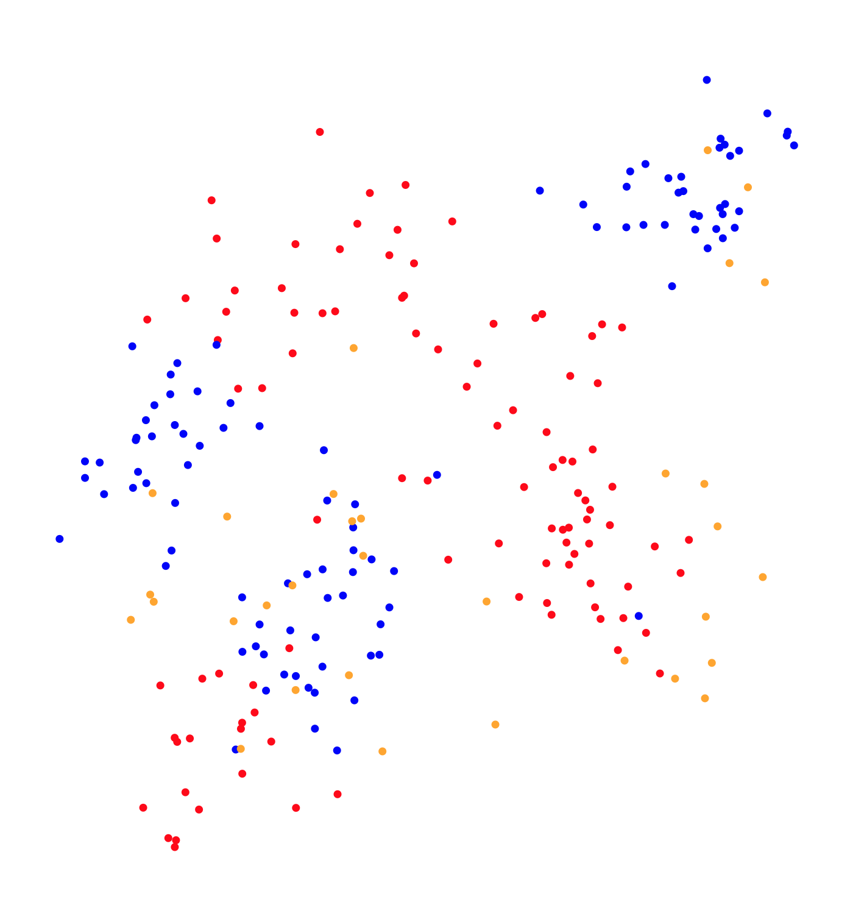

# 第二回マスターズ選手権-決勝-

- https://atcoder.jp/contests/masters2025-final

## 問題概要

- 平面上(10\^6 \* 10\^6)に、X個の燃えるゴミ、Y個の燃えないゴミ、Z個の資源ゴミが点として表されている
- 1回の指示で、2人がそれぞれ両手の座標を指定した位置に動かし、動かした範囲内のゴミをすべて回収する
  - 簡単のため、1人目の左手、1人目の右手、2人目の左手、2人目の右手の順で動かしたときの範囲や優先順で回収される
  - 開始地点は任意
- このとき、移動時間は、それぞれの両手の移動距離の和で大きい方だけかかる
- できるだけ移動時間が短くなるように、資源ゴミを回収せず、1人目はすべての燃えるゴミのみ、2人目はすべての燃えないゴミのみを回収するような指示の出し方を求めよ
- 問題ごとの違い
  - A問題: X=100, Y=0, Z=10〜100
  - B問題: X=100, Y=100, Z=0
  - C問題: X=100, Y=100, Z=1〜100 (D問題で提出された各チームの自作ケースからなる)
  - D問題: C問題向け自作ケース生成

## 時間

- 360 分

## 個人的メモ

### 「移動距離を最小化」

- 移動距離を小さくするのが目的なので、微小移動が多い(手数が多い)ような操作でも移動距離が小さければあまり問題はない
- 手の位置が行ったり来たりが発生するようなアプローチだと、移動距離が増えてしまい、スコアがあまりでない
  - 取りこぼしを取りに行ったりや、資源ゴミを避けるために大きく動く必要がある、など
  - 適当に次の手の位置を探索するような貪欲・ビームとかはあまり良い方針ではなかった模様
- また、2人のうち、移動距離が大きい方のみスコアに影響するので、移動距離が短い方はいい感じに位置調整する余地もある

### 自作ケース(D問題)

- 今回、各チームが前半にD問題に提出した自作ケース(4つ)からC問題のテストケースが作られるという形式になっていた
  - 決勝進出チームのみ
  - そのため、C問題は提出は後半から可能
  - 4ケース中1ケースが別途質問ページから公開されていた
  - 未提出や提出失敗している場合は、自動生成のものが使われる
  - 自チームのケースは事前にわかるので、埋め込みなども許されていた
- 回収に失敗したりすると結構スコアに差がでたりもするため、地獄のような配置へのケアも考慮する必要があった
  - パターンに対応した解法、失敗しない解法、など
  - 特に、外周や直線上に配置されるケースなどは、避けたり、回収順番など気をつけないとかなり厳しい
- パターン
  - 直線上に並べる
  - 外周上に並べる
  - 4つ角に固める
  - 最長ケース
    - https://x.com/iwashi31/status/1913604627024719907
  - 等間隔・グリッド的に配置する
  - 少数だけ離れた場所に配置する
  - 円形・ミラー的に配置する
  - 資源ごみを壁として利用する

### アプローチ

#### TSP(1本道)ベース

- 手を点で考えると、全点を訪問する最小距離の問題になるので、TSP(1本道)を作って回収することが考えられる
- 片手で回収
  - 片手を固定して、もう片手だけを動かして回収できるなら、片手分だけの移動距離で済むので、移動距離が減る可能性がある
  - 凸包、クラスタリング、など
- 並列化
  - 辿るときに、他の拾いたくないゴミを回収しないならば、それぞれの手が分担して並列に回収することで、移動距離が減る可能性がある
- 最短距離で動かす
  - 必ずしもゴミの位置に手を持っていく必要はないので、もし2個先に直線的に動かしても(中点を経由しても)拾えるなら、移動距離が減る可能性がある

#### スキャンベース

- B問題について、「左手を平面の左端、右手を平面の右端に沿って下に動かす」というような動きを考えると、上のゴミから順番に回収することができる
- このとき、移動距離の合計がかなり小さくできるため、B問題で1G点を超えることができる
- これを応用して、点群を囲む最小の長方形(斜めも許す)で動かすなどするとかなり移動距離を抑えることができる模様
  - https://x.com/tsukammo/status/1913510032966369708
- また、A問題にも応用して、上下の動き以外に横の動きもしてスキャンするように動かすアプローチもかなり強かった模様
  - https://x.com/yunix91201367/status/1913609526600700164
- さらに平行ではなく、片手を動かすアプローチも(偏角ソートベースに近い?)
  - https://x.com/kiri8128/status/1913634985141293192
- 左手と右手で逆方向に動かす、みたいなのが有効なケースも作れた模様
  - https://x.com/osa_k/status/1913578097540042773

#### 偏角ソートベース

- 1点を選んで、そこからゴミの点を偏角ソートして、片手のみを動かして回収するのがかなり強かった模様
  - https://x.com/shr_pc/status/1913560881469751434

### その他

#### 2名以上が参加している所属機関一覧

- https://x.com/gojira_kyopro/status/1913390469377135037

#### 出展企業紹介

- https://x.com/atcoder/status/1913510893394206846
- https://x.com/atcoder/status/1913513170117042192
- https://x.com/atcoder/status/1913514381364875751
- https://x.com/atcoder/status/1913515065707499704
- https://x.com/atcoder/status/1913515557854367991
- https://x.com/atcoder/status/1913516100236837340
- https://x.com/atcoder/status/1913517111240212660
- https://x.com/atcoder/status/1913517619128471917
- https://x.com/atcoder/status/1913518023950143561

#### お絵かき

- https://x.com/bird0148677302/status/1913779283316859233
- https://x.com/yunix91201367/status/1913621952658542636

## 解説

(発言を見つけられた方のみ)

- [manarimo](https://x.com/kawatea03/status/1913580876018892922)
  - https://x.com/osa_k/status/1913578097540042773
- [Pythonerいますか・・？](https://x.com/kiri8128/status/1913620146448662745)
  - https://x.com/kiri8128/status/1913634985141293192
  - https://x.com/yunix91201367/status/1913607980601246179
  - https://x.com/yunix91201367/status/1913619571187335648
  - https://x.com/yunix91201367/status/1913621952658542636
  - https://x.com/yunix91201367/status/1913629492389777769
  - https://x.com/yunix91201367/status/1913773843476521214
- [焼きなマシーンtemp](https://x.com/tempuracpp/status/1913414669244776791)
  - https://x.com/tempuracpp/status/1913391733897105682
  - https://x.com/tempuracpp/status/1913600171637948434
  - https://x.com/tempuracpp/status/1913601369455673349
  - https://x.com/tempuracpp/status/1913604449148260508
  - https://x.com/tempuracpp/status/1913608377663643968
  - https://x.com/tempuracpp/status/1913616466668298348
  - https://x.com/tempuracpp/status/1913805930296443022
  - https://x.com/tempuracpp/status/1913819799781884266
  - https://x.com/takumi152/status/1913402813151125770
  - https://x.com/takumi152/status/1913552082939805834
  - https://x.com/takumi152/status/1913592505377128804
  - https://x.com/terry_u16/status/1913408403801780609
  - https://x.com/terry_u16/status/1913586899752796349
  - https://x.com/terry_u16/status/1913589872587317590
  - https://x.com/terry_u16/status/1913595395965698155
  - https://x.com/terry_u16/status/1913585546775134700
- [tk62nd](https://x.com/rian_tkb/status/1913608149787119908)
  - https://x.com/rian_tkb/status/1913610894761758736
  - https://x.com/rian_tkb/status/1913612384050253954
  - https://x.com/rian_tkb/status/1913620288086155452
- [貪欲から逃げない](https://x.com/tomerun/status/1913401332914069744)
  - https://x.com/tomerun/status/1913404660385485216
  - https://x.com/tomerun/status/1913505750451933282
  - https://x.com/tomerun/status/1913592715041792480
  - https://x.com/tomerun/status/1913780019115221285
  - https://x.com/shr_pc/status/1913560881469751434
  - https://x.com/shr_pc/status/1913581679207497735
  - https://x.com/_simanman/status/1913616016124371303
  - https://x.com/_simanman/status/1913622248839401958
- [Optimization I.G](https://x.com/tsukammo/status/1913413012259479949)
  - https://x.com/tsukammo/status/1913510032966369708
  - https://x.com/tsukammo/status/1913595882609741883
  - https://x.com/tsukammo/status/1913606823934083154
  - https://x.com/tsukammo/status/1913621024761151819
  - https://tsukammo.hatenablog.com/entry/2025/04/22/113824
  - https://x.com/omi_UT/status/1913399621952696353
  - https://x.com/omi_UT/status/1913528174178373764
  - https://x.com/omi_UT/status/1913603069012787527
  - https://omizatta.hatenablog.com/entry/2025/04/19/214609
- [FIRST](https://x.com/Shun___PI/status/1913525564193087896)
  - https://x.com/Shun___PI/status/1913542968914661559
  - https://x.com/Shun___PI/status/1913543482725310843
  - https://x.com/Shun___PI/status/1913563412476674512
  - https://x.com/Shun___PI/status/1913564895125377239
  - https://x.com/Shun___PI/status/1913611038886601126
  - https://x.com/Shun___PI/status/1913762531321270628
- [Pink Rose](https://x.com/skyaozora/status/1913601720715808964)
  - https://x.com/laycrs/status/1913553103288217681
  - https://x.com/nico_shindannin/status/1913408305214746747
  - https://x.com/nico_shindannin/status/1913620341030785189
- [H#](https://x.com/takytank/status/1913411853709107668)
  - https://x.com/takytank/status/1913412521966620805
  - https://x.com/takytank/status/1913516047300546713
  - https://x.com/takytank/status/1913609397282197844
  - https://x.com/takytank/status/1913611483499676055
  - https://x.com/takytank/status/1913619209764131323
  - https://x.com/takytank/status/1913787946463072372
  - https://x.com/takytank/status/1913813030120673787
  - https://x.com/G4NP0N/status/1913588191334154328
  - https://x.com/G4NP0N/status/1913589003078766918
  - https://x.com/G4NP0N/status/1913604596766851560
  - https://x.com/G4NP0N/status/1913605472957157690
- [Let's think step by step](https://x.com/SP1_winter/status/1913510818358206596)
  - https://x.com/SP1_winter/status/1913574142265241782
  - https://x.com/SP1_winter/status/1913575212165304343
  - https://x.com/SP1_winter/status/1913603150164201725
  - https://x.com/SP1_winter/status/1913602360930361662
- [Bue World](https://x.com/soiya_ksk/status/1913596401147171164)
- [meip2017](https://x.com/smiken_61/status/1913556869517590814)
  - https://x.com/smiken_61/status/1913629574375838087
- [SECOND](https://x.com/colun/status/1913401896645362058)
  - https://x.com/colun/status/1913403665505001497
  - https://x.com/colun/status/1913412578526765211
  - https://x.com/colun/status/1913413792609996947
  - https://x.com/colun/status/1913441349745139976
  - https://x.com/colun/status/1913505277254541561
- [VRC競プロ部](https://amentorimaru.hatenablog.com/entry/2025/04/21/181233)
- [half_centuries](https://x.com/ToastUz/status/1913394152345313339)
  - https://x.com/ToastUz/status/1913411229433151774
  - https://x.com/ToastUz/status/1913411958923296908
  - https://x.com/ToastUz/status/1913509961302524006
  - https://x.com/ToastUz/status/1913595736413139224
  - https://x.com/ToastUz/status/1913648092752273794
  - https://x.com/ToastUz/status/1913805507904905533
  - https://x.com/ToastUz/status/1913806347424157842
  - https://x.com/zach_leee/status/1913397927990771955
  - https://x.com/zach_leee/status/1913612747801330134
  - https://x.com/zach_leee/status/1913618261356298634
  - https://x.com/tanaka_a8/status/1913595451586257197
- [toyoharu](https://x.com/tooooyyo/status/1913552048148381882)
- [futon](https://x.com/fuppy_kyopro/status/1913547708431745039)
  - https://x.com/kyort0n/status/1913412456938111443
  - https://x.com/kyort0n/status/1913413785991405656
  - https://x.com/kyort0n/status/1913543553034170711
- [駆け込み寺](https://x.com/nekomimimi/status/1913401487864332628)
  - https://x.com/nekomimimi/status/1913636183500071086
  - https://x.com/nekomimimi/status/1913847300725899429
  - https://x.com/nekomimimi/status/1913849569403928803
- [nono](https://x.com/tsukasa__diary/status/1913586344179499213)
  - https://x.com/tsukasa__diary/status/1913604329895866831
  - https://x.com/tsukasa__diary/status/1913837072458387597
- [TAK-san Fan Club](https://x.com/plcherrim/status/1913554702404288872)
  - https://x.com/plcherrim/status/1913573014010286095
- [アキレスと亀と羊と栗](https://x.com/takus4649/status/1913587955131928608)
  - https://x.com/takus4649/status/1913743836817571913
  - https://x.com/maron_rta/status/1913588691181982001
  - https://x.com/BinomialSheep/status/1913527546932855125
  - https://x.com/BinomialSheep/status/1913596461448872430
  - https://x.com/BinomialSheep/status/1913607863324286993
  - https://x.com/BinomialSheep/status/1913608017163289073
  - https://x.com/BinomialSheep/status/1913609221951967710
- [引きこもり](https://x.com/ebicochineal/status/1913401563714118007)
  - https://x.com/ebicochineal/status/1913557635770769618
  - https://x.com/ebicochineal/status/1913562007661674607
  - https://x.com/C7C7LL/status/1913408472613625949
  - https://x.com/t33f/status/1913636683100377507
- [infOtaKU](https://x.com/ygussany/status/1913413477257105896)
- [当日即席チーム](https://x.com/TumoiYorozu/status/1913395527905149094)
  - https://x.com/TumoiYorozu/status/1913599274266624262
- [サイゼリヤ 六本木店](https://x.com/kenkoooo/status/1913412434095997389)
  - https://x.com/kenkoooo/status/1913598570734957020
- [!!!](https://x.com/bird0148677302/status/1913779283316859233)
  - https://x.com/beans_crypto/status/1913545029202624984
- [🐑🍃🤪](https://x.com/leaf_1415/status/1913408191490306214)
  - https://x.com/aplysiaSheep/status/1913528510267985975
  - https://x.com/aplysiaSheep/status/1913528532850155557
  - https://x.com/yuuki_n_n/status/1913399068610744609
  - https://x.com/yuuki_n_n/status/1913403780487631046
  - https://x.com/yuuki_n_n/status/1913405744705421771
- [BABA_IS_AC](https://x.com/ryo_n_code/status/1913586372902031672)
- [0.3フルーツポンチ](https://x.com/r3yohei/status/1913590737410859324)
  - https://x.com/r3yohei/status/1913591044744290448
  - https://x.com/r3yohei/status/1913794729210236993
  - https://x.com/r3yohei/status/1913801025699586135
  - https://x.com/nurupo1530/status/1913182237492658269
  - https://x.com/nurupo1530/status/1913596890563965371
- [寿司処「松の」愛好会](https://x.com/rine_orz/status/1913547013142302895)
- [早起きに自信あります](https://x.com/iwashi31/status/1913577112902242427)
  - https://x.com/iwashi31/status/1913597859254997203
  - https://x.com/iwashi31/status/1913604627024719907
- [最適ゴリラ理論](https://x.com/theory_and_me/status/1913617918128173347)
  - https://x.com/theory_and_me/status/1913628362981138653
  - https://x.com/theory_and_me/status/1913732597307564267
  - https://x.com/MathGorilla_cp/status/1913390016132522044
  - https://x.com/MathGorilla_cp/status/1913552681454785006
  - https://x.com/MathGorilla_cp/status/1913555189212348901
  - https://x.com/MathGorilla_cp/status/1913555449091350804
  - https://x.com/MathGorilla_cp/status/1913562797965013330
  - https://x.com/MathGorilla_cp/status/1913609571589128423
  - https://x.com/MathGorilla_cp/status/1913613201369157724
  - https://x.com/MathGorilla_cp/status/1913630001636974984
  - https://x.com/MathGorilla_cp/status/1913831853435588949

- open参加
  - https://x.com/eijirou_kyopro/status/1913527833168937078
  - https://x.com/through__TH__/status/1913512428304011715

- [chokudai社長](https://x.com/chokudai/status/1913506507377045967)

## Links

- [Twitter hashtag AtCoderマスターズ選手権2025](https://x.com/hashtag/AtCoder%E3%83%9E%E3%82%B9%E3%82%BF%E3%83%BC%E3%82%BA%E9%81%B8%E6%89%8B%E6%A8%A92025)

