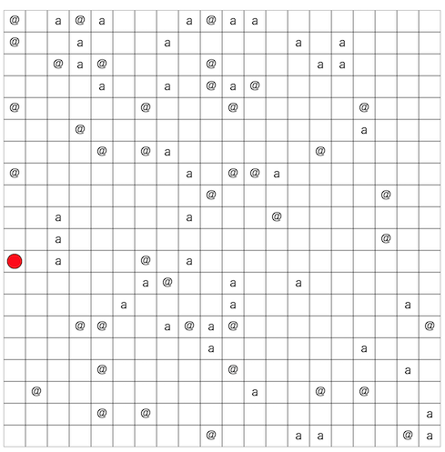

# 第二回マスターズ選手権-予選-

[TOC]

## 問題概要

- https://atcoder.jp/contests/masters2025-qual
- N\*Nマスの盤面があり、マスには鉱石(1種類or3種類)か岩、または鉱石に対応した穴がある
  - 初期位置は1種類目の穴
- 操作として、各ターンでは、4近傍への移動、4近傍への運搬、4方向へぶつかるまで転がす、ができる
- できるだけ少ないターン数で、鉱石をすべて対応する穴に落としたい
- 問題は以下の性質の違いがある
  - 問題A: 鉱石は1種類で、鉱石と岩がまばらに散らばっている
  - 問題B: 鉱石は3種類で、岩は存在しない
  - 問題C: 鉱石は1種類で、岩が多い

## 時間

- 360 分

## 個人的メモ

### 「転がす」

- 「転がす」と、長距離移動ができるので、これを活用できると手数が大きく減らせる
  - ただし、1つ転がした後、それを追いかけるように移動してしまうと、運搬するのと変わらない
  - 近くの鉱石を複数転がす→追いかける、のようにすると、1つずつ運ぶよりも移動回数を減らせる
- さらに、うまく他の鉱石や岩を配置しておくと、転がりすぎてしまうのが抑えられる可能性がある

### 一部の岩を鉱石として考える

- 邪魔な一部の岩を鉱石として考えると、いろいろ考えやすかったり、実装を省略できる可能性がある

#### 穴の上下左右方向はあけておく

- 穴の上下左右方向をすべてあけておくと、そこまで移動したらそこから転がせば1手で入れられる
- 岩も鉱石とみなして穴にいれておく

#### すべての鉱石が連結になるように岩を鉱石とみなす

- 問題Cでは、岩が多く、岩を動かさないと鉱石をすべて運ぶことができない
- あらかじめすべての鉱石にたどり着けるように一部の岩を鉱石とみなしておくようにしておくことで、少なくとも近くから貪欲に穴に運べばすべて運ぶことができる
  - 問題Aでも、岩に囲まれて運び出せない場合は岩を動かす手順がないと詰むので、そういうのを回避できる

### アプローチ

- 問題の性質が違うが、結構似たアプローチでも対応可能だった模様

#### 一旦全部を上下左右どこかに寄せる

- 雰囲気的に、穴に近い方向に「転がす」を使ってよせると、鉱石が固まっているので、穴までの距離が減ってよさそうな気がする
  - イメージとしては、HACK TO THE FUTURE 2021予選 https://posfie.com/@masashinakata/p/r6oncxU?page=22
- しかし、基本的には、20\*20=400ターン以下を使ってよせて、20ターン以下で移動して、そこから穴に入れていく、という感じになるため、無駄を削っても結構ターンを使うため、ハズレなアプローチだった

#### 鉱石を1つずつ穴に運ぶ

- 各鉱石を「転がして入れられるところまで運んで、転がす」のを繰り返すことで1つずつ穴に入れられる
  - 穴の上下左右のラインをすべて開けておけば、そのラインまでの移動で済むので結構移動距離が減る可能性がある
- どの鉱石の順番で運ぶかだったり、穴じゃなくてもうまく転がすことを考えると、より改善ができる
  - 各鉱石に対する行動で距離減少量/行動数が最大のものを選ぶ
    - https://x.com/tomerun/status/1896144724739899845
- 貪欲、ビームサーチ、乱択、など

#### 評価関数を作って貪欲、ビームサーチ

- 盤面の評価関数を考えると、「鉱石や岩の数」「穴までの距離」「プレイヤーの位置に鉱石か岩があるか」などの要素を組み合わせたものが考えられる
  - 貪欲でプレイアウトしたものを評価値とするなども
- うまく、評価関数が小さくなるように、ビームサーチなどで操作を求められる
  - どの鉱石を選ぶか(基本は一番近くのもの)、鉱石を1つずつ穴に運ぶまでの操作列の1手目や途中までや転がした場合を1回の操作にする、などいろいろ考えられる
  - 重複盤面の除外はしておかないと無限ループする可能性もある

#### 鉱石・岩の訪問順を焼きなまし

- 動かす予定の鉱石と岩が1回以上現れる列を考えて、途中なら転がす、最後に出現するなら運ぶ・転がすをする場合で焼きなまし
  - https://x.com/Shun___PI/status/1896139984622768203

### その他

#### 「穴までの距離」にチェビシェフ距離を加える

- max(dy,dx)に小さい重みをかけたものを距離に加えると、距離が同じになってしまうところに傾斜がつけられる

#### 類題

- https://x.com/iwashi31/status/1896155989344440393

## 解説

(50位まで&発言を見つけられた方のみ)

- [貪欲から逃げない](https://x.com/tomerun/status/1896144724739899845)
  - https://x.com/shr_pc/status/1896146424716493183
  - https://x.com/_simanman/status/1896141316024885602
  - https://x.com/_simanman/status/1896145119713312786
  - https://x.com/_simanman/status/1896147401460830439
- [Pythonerいますか・・？](https://x.com/kiri8128/status/1896148197250351456)
  - https://x.com/neterukun_cd/status/1896144406807445605
  - https://x.com/neterukun_cd/status/1896145396529004910
  - https://x.com/yunix91201367/status/1896140298579026142
  - https://x.com/yunix91201367/status/1896157333233033609
  - https://x.com/yunix91201367/status/1896157432755499385
- [最適ゴリラ理論](https://x.com/theory_and_me/status/1896141558925373914)
  - https://x.com/MathGorilla_cp/status/1896141949406732648
  - https://x.com/MathGorilla_cp/status/1896142913547251991
  - https://x.com/MathGorilla_cp/status/1896144436620599325
  - https://x.com/MathGorilla_cp/status/1896149828356526186
  - https://x.com/MathGorilla_cp/status/1896151063767732365
  - https://x.com/MathGorilla_cp/status/1896180179866968562
  - https://x.com/MathGorilla_cp/status/1896181956091765230
  - https://x.com/MathGorilla_cp/status/1896229391585468699
  - https://x.com/MathGorilla_cp/status/1896419051469177034
- [FIRST](https://x.com/Shun___PI/status/1896139984622768203)
  - https://x.com/Shun___PI/status/1896142309147979929
- [みーとみと愉快な仲間たち](https://x.com/miiitomi/status/1896141146071699687)
  - https://x.com/miiitomi/status/1896183968170697140
  - https://x.com/miiitomi/status/1896189531390652593
- [焼きなマシーンtemp](https://x.com/tempuracpp/status/1896142508687761913)
  - https://x.com/tempuracpp/status/1896157152076878189
  - https://x.com/tempuracpp/status/1896157449922777335
  - https://x.com/takumi152/status/1896160011044458796
  - https://x.com/takumi152/status/1896166957432643685
  - https://x.com/terry_u16/status/1896047554208641143
  - https://x.com/terry_u16/status/1896139051465597053
  - https://x.com/terry_u16/status/1896139542551478544
  - https://x.com/terry_u16/status/1896142282438611388
  - https://x.com/terry_u16/status/1896145417018167570
  - https://x.com/terry_u16/status/1896147248976928877
  - https://x.com/terry_u16/status/1896155347825615323
  - https://x.com/terry_u16/status/1896155784331091975
- [tk62nd](https://x.com/rian_tkb/status/1896172707039129910)
  - https://x.com/rian_tkb/status/1896174623278137509
  - https://x.com/rian_tkb/status/1896172394756366345
- [TAK-san Fan Club](https://x.com/plcherrim/status/1896144434762596564)
  - https://x.com/MohutonLab_comp/status/1896142871230873794
  - https://x.com/MohutonLab_comp/status/1896143602830688691
  - https://x.com/MohutonLab_comp/status/1896144286737207778
  - https://x.com/MohutonLab_comp/status/1896145047525130410
  - https://x.com/MohutonLab_comp/status/1896148949138112648
  - https://x.com/MohutonLab_comp/status/1896150728181424305
  - https://x.com/MohutonLab_comp/status/1896153867651575877
- [manarimo](https://x.com/kawatea03/status/1896140996335055279)
- [チーム子育て](https://x.com/kyuridenamida/status/1896166631740690572)
  - https://x.com/uwitenpen/status/1896141474846384518
  - https://x.com/ponyopoppo/status/1896175853714989351
- [H#](https://x.com/takytank/status/1896143517543809158)
  - https://x.com/takytank/status/1896143344616755236
  - https://x.com/takytank/status/1896158917153132842
  - https://x.com/takytank/status/1896179371096072587
  - https://x.com/takytank/status/1896179698578964854
  - https://x.com/takytank/status/1896206609023656410
  - https://x.com/takytank/status/1896366652582924351
  - https://x.com/G4NP0N/status/1896142193175429300
  - https://x.com/G4NP0N/status/1896143941994692920
  - https://x.com/G4NP0N/status/1896144591835087321
  - https://x.com/G4NP0N/status/1896145169457762610
  - https://x.com/G4NP0N/status/1896155319732170829
  - https://x.com/G4NP0N/status/1896156286527688713
- [有り余る才能でカバーします命に変えてもやります](https://x.com/eijirou_kyopro/status/1896175050572849371)
- [Maximum](https://x.com/a01sa01to/status/1896140022103035939)
  - https://x.com/through__TH__/status/1896141665846579361
- [negainoido](https://x.com/flowlight_/status/1896141934286221607)
- [サイゼリヤ 六本木店](https://x.com/kenkoooo/status/1896141817877504190)
- [SECOND](https://x.com/colun/status/1896152426580983939)
- [引きこもり](https://x.com/ebicochineal/status/1896141809212121184)
  - https://x.com/C7C7LL/status/1896138590780047549
  - https://x.com/C7C7LL/status/1896142499967840319
  - https://x.com/C7C7LL/status/1896152965448364036
  - https://x.com/t33f/status/1896164461809115199
  - https://x.com/t33f/status/1896152975623721161
  - https://x.com/t33f/status/1896214100851716129
- [half_centuries](https://x.com/ToastUz/status/1896145154832220351)
- [Belated Valentine's Day](https://x.com/halc_kyopro/status/1896141748537270659)
- [kumansky](https://x.com/kyon2326/status/1896145103292706865)
- [🐑🍃🤪](https://x.com/leaf_1415/status/1896144377988444232)
  - https://x.com/aplysiaSheep/status/1896140274549796940
  - https://x.com/aplysiaSheep/status/1896733636206174317
  - https://x.com/yuuki_n_n/status/1896139378730455435
- [年末恒例の餅](https://x.com/merom686/status/1896158210832445934)
- [駆け込み寺](https://x.com/nekomimimi/status/1896365038686097469)
  - https://x.com/darjeeling743/status/1896140998427943327
- [toyoharu](https://x.com/tooooyyo/status/1896210703452967052)
- [futon](https://x.com/fuppy_kyopro/status/1896142405965127986)
- [0.3フルーツポンチ](https://x.com/r3yohei/status/1896139498494493001)
  - https://x.com/r3yohei/status/1896197297157115979
  - https://x.com/r3yohei/status/1896372129144451527
  - https://x.com/nurupo1530/status/1896149548327960779
- [疑似乱数の芸術展](https://x.com/threecourse/status/1896140699311165705)
- [AAAチーム](https://x.com/xyz600600/status/1896161366081507510)
- [route-D-dev](https://x.com/catupper/status/1896151566324990225)
- [🎯Three in the black🎯](https://x.com/yoniha428/status/1896146762194424226)
- [ねこちゃんとなかまたち](https://x.com/wand125/status/1896149561338692089)
- [!!!](https://x.com/bird0148677302/status/1896161155615531191)
  - https://x.com/beans_crypto/status/1896164727790899270

## Links

- https://x.com/hashtag/AtCoder%E3%83%9E%E3%82%B9%E3%82%BF%E3%83%BC%E3%82%BA%E9%81%B8%E6%89%8B%E6%A8%A92025
