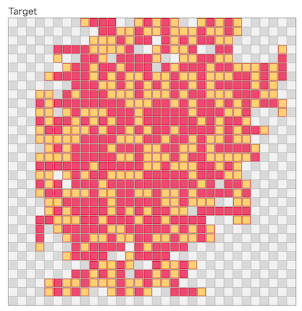

# 第三回マスターズ選手権-決勝-

[TOC]

## 問題概要

- https://atcoder.jp/contests/masters2026-final
- https://atcoder.jp/contests/masters2026-final-open
- 32 \* 32のピクセルからなるレイヤーがK枚ある
- 使用できる色はC色あり、各ピクセルは0なら透明、1〜Cならその色であることを示す
- 目標画像が与えられるので、レイヤー0にその画像を作ることを目指す
- 初期状態はすべてのレイヤーで透明で、1回の操作で以下が行える
  - paint(k,i,j,x): レイヤーkの(i,j)の色をxにする(x\=0なら透明にする)
  - copy(k,h,r,di,dj): レイヤーhをr回時計回りに90度回転したものをh'として、(di,dj)だけずらしたものをレイヤーkに上書きする
    - k\=hであってもよい
    - 範囲外に色を塗るような場合は不正
  - clear(k): レイヤーkのすべてのピクセルを透明にする
- できるだけ少ない操作回数で目標画像を完成させよ
- 問題ごとの違い
  - A問題: あらかじめ決められた入力生成方法に従って生成されたものがテストケースになる
  - B問題: 参加者が用意した入力がテストケースになる(開始2時間後から提出可能)
  - C問題: 参加者が用意した入力の提出用(開始2時間まで提出可能)

## 時間

- 360 分

## 個人的メモ

### 入力生成方法(A問題)

- paintとcopyを使って連結を維持して大きくしていって、十分大きくなったらそのレイヤーを採用する、ような感じ
- パラメータによって、比較的似たような色の塊だったり、ノイジーな感じだったりバリエーションがある
- 生成時に使えるレイヤー数は、Kの2倍までありえるため、そういうケースでは生成方法と同じ手順がわかったとしても再現できない

### アプローチ

- いろんなアプローチが考えられるし、ぱっとよさそうなアプローチも見えないし、大方針を決めたとしても細かいところでも選択肢がたくさんあるので、6時間で詰め切るのはかなり厳しい、、、
- 入力生成方法が平均40〜50ターンぐらいで作れそうで、100ターン切れるぐらいまでは目指せそうに見えるけど、実際はそんなにいけなかった

#### 目標画像からパターン抽出する系?

- 入力生成方法的にも、複数レイヤーでcopyしあって、パターンの組み合わせて作られているため、似たようなパターンが見られるので、共通のそういうパターンを見つける方針が考えられる
  - 画像処理っぽい感じもあり、マッチングや特徴量などそっちの知見からも攻められそう
  - 入力生成の逆手順とか見つけられないか、とか
- ただ、このパターンを見つける方針は、うまく見つけられればターン数は少なくできそうだが、おそらくかなり厳しい方針だったっぽい
- https://x.com/Shun___PI/status/2045498778426524125

#### スタンプ解法

- おそらく、小さめのスタンプを作ってそれをレイヤー0に何度か押す感じがコスパよいアプローチだったっぽい
- とはいえ、探索方法、選び方、レイヤーの使い方など、かなりバリエーションがある

##### 必要ターン数

- ざっくりと、「スタンプを作るのに必要なターン数＋スタンプを押す回数＋不一致ピクセルを修正する回数」ぐらいと考えられる
  - 小さめのスタンプは作るのにターン数が少なくてすむので、押す回数が多少増えてもそこまで変わらない可能性がある

##### スタンプの形状

- 1\*nサイズ(行単位列単位で考える)・小サイズ・長方形などに限定して考えるとかは考えやすかったかも
- ただ、局所探索などでスタンプ形状を探索したり、貪欲に目標画像を参考に広げるとかしてるチームが多いかも？

##### スタンプを押す位置・向き

- ランダムに選ぶか、探索する、貪欲に決めるか、あたりがありそう
  - A問題とかは色数が少ないケースも多いので、比較的ランダムに選んでも不一致がが少なくなる位置・向きが多そうでなんとかなっている可能性がありそう
  - 色数が多くノイジーなケースや、B問題などだと、ちゃんと探さないと不一致がが少なくなる位置・向きが見つけられない可能性がありそう
- スタンプは、押すと上書きになるので、押す順番を逆順に考えると、確定したピクセルを変えずにスタンプを押す的なことを考えることもでき、不一致が少なくなる位置・向きを貪欲に選んでいくなどもできる

##### (自チームのアプローチのメモ)

- 基本的に、スタンプ形状も押し方、順番も全部まとめて焼きなまし
  - 近傍もかなり単純な「形状の1ピクセル変更、押すところの追加/削除/変更、押す順番のswap」ぐらい
- 素直に実装するとそこまでスコアは出ないので判断が難しいところだけど、以下の工夫を入れたらそこそこ効いてそうで、改善策も見えやすいのでこちらの方法を検討
  - スタンプ形状は既存のピクセルの近傍ピクセルを選ぶようにしてできるだけ塊になるようにする
  - レイヤー1を作るためにレイヤー2が使えるときは、若干時間を使って同様に局所探索でスタンプを作って押す(階層化)
  - 最後の不一致ピクセルで1\*2マスがまとめて塗れるときは塗る
  - 近傍の採用確率をハイパラ探索
- 逆に、以下は試したけどミスったのかうまくいかず捨ててしまったもの(他チームはやれてそうなので実装ミスってた可能性が高い・・・)
  - スタンプ押す位置を貪欲に選ぶ
  - 目標画像から部分集合を拾ってくる近傍
  - 階層全部をまとめて焼きなまし
  - 複数レイヤーが使える時は、異なるスタンプを作る
  - パターン生成の仕方を変える
  - 高速化
  - など
- 延長戦ではA問題は500M点までは伸ばせたとのこと
  - https://x.com/sash277/status/2045677949857472952
  - https://atcoder.jp/contests/masters2026-final/submissions/75099993
    - できるだけレイヤーの中央付近を使うようにする
    - 高速化
    - 多点スタート
    - レイヤー2でレイヤー1向けにスタンプ作っていたところをレイヤー0で代用して実現(レイヤー1ができたらレイヤー0をclear)
- おそらく色数が少ないケースでターン数が少なくできててそこで稼いでいるかも
  - 全部探索任せなので、スタンプ形状やスタンプを押す位置がうまく見つけられない色数が多いノイジーなケースなどだととあまりうまくいかず、そこをちゃんと探索や貪欲で決められていた他チームと差がついてしまっていたかも
  - 初期解などを工夫するなどが効いてそうだったけど、かなりスタンプ形状の近傍が限定的だったので局所解から抜け出せなかった可能性も高い

### C問題(テストケース提出)

- 得点の式は $10^6 ( 1 + log_2 U / T )$ の形で、Uは全部埋まっているケースが最大でU\=1024にでき、他チームとのターン数差が大きいほど加点が大きい
  - たとえば、他チームが300ターン(2.7M点/ケース)かかるところを20ターン(6.7M点/ケース)ぐらいでできたりすると、3ケース分で12M点ぐらい差をつけられる可能性があった
    - 実際、最後の解説で紹介されていたけど、10M点差ぐらいつけられていたチームがいたっぽい？
- コンテスト中、どういうケース強いか判断つかなかったけど、結局少ターンの解を見つけるのが難しかったので、入力生成方法(K固定)で生成して埋め込むでも十分だったかも
- C問題で提出したケースは、コードに目標画像と手順を埋め込んでおいて、画像をチェックし、該当する場合はその手順を返せば良い
- https://x.com/gojira_kyopro/status/2045446205484982554

### その他

#### 自己copy

- copy操作は同じレイヤーが指定できるので、ピクセル数を1,2,4,8,16,...と倍々にすることができる

#### 2名以上が参加している所属機関一覧

- https://x.com/gojira_kyopro/status/2045106288070381670

#### 出展企業紹介

- https://x.com/atcoder/status/2045417566886391864
- https://x.com/atcoder/status/2045418130961494199
- https://x.com/atcoder/status/2045418591374504101
- https://x.com/atcoder/status/2045419460925018166
- https://x.com/atcoder/status/2045420603184967822
- https://x.com/atcoder/status/2045425208539164800

#### お絵かき

- https://x.com/hiromi_ayase/status/2045453241887125653

## 解説

(発言を見つけられた方のみ)

- https://x.com/tempuracpp/status/2045533156095443123
- https://x.com/tempuracpp/status/2045534247386292683
- https://x.com/tempuracpp/status/2045534701662900280
- https://x.com/tempuracpp/status/2045733318331892038
- https://x.com/neterukun_cd/status/2045529221930622996
- https://algo-artis.com/news/260430
- https://x.com/tomerun/status/2045306725864255600
- https://x.com/tomerun/status/2045531776312103313
- https://x.com/_simanman/status/2045532099608998383
- https://x.com/_simanman/status/2045532938583056678
- https://x.com/_simanman/status/2045535201665876138
- https://x.com/sash277/status/2045506654331163134
- https://x.com/sash277/status/2045677949857472952
- https://x.com/_haruki_K/status/2045705309961044211
- https://x.com/tsukammo/status/2045325860627185981
- https://x.com/tsukammo/status/2045328284280611257
- https://x.com/tsukammo/status/2045356380312547479
- https://x.com/tsukammo/status/2045395069914828884
- https://x.com/tsukammo/status/2045423335304221095
- https://x.com/tsukammo/status/2045423913849794979
- https://x.com/tsukammo/status/2045442038011945091
- https://x.com/tsukammo/status/2045504319760576824
- https://x.com/tsukammo/status/2045507931240902747
- https://x.com/tsukammo/status/2045514223644766423
- https://x.com/omi_UT/status/2045312586846224655
- https://x.com/omi_UT/status/2046210641577542140
  - https://blog.omizatta.com/post/260420_atc_masters/
- https://x.com/ei1333/status/2045318565914698183
- https://x.com/ei1333/status/2045442968300187659
- https://x.com/ei1333/status/2045448569096896678
- https://x.com/ei1333/status/2045459804861411663
- https://x.com/takus4649/status/2045296278926737610
- https://x.com/takus4649/status/2045305248873623555
- https://x.com/takus4649/status/2045539540761538650
- https://x.com/BinomialSheep/status/2045331462061502776
- https://x.com/BinomialSheep/status/2045451163643044126
- https://x.com/AK_KA3333/status/2045465716284084638
- https://x.com/xyz600600/status/2045472675565560316
- https://x.com/xyz600600/status/2045481358890537426
- https://x.com/jabeeeeeeeeeee/status/2045460366520721597
- https://x.com/jabeeeeeeeeeee/status/2045459779313889457
- https://x.com/pg_ariii/status/2045470731665129714
- https://x.com/IHa_ProCon/status/2045728810109399094
- https://x.com/prussian_coder/status/2045459910666932336
- https://x.com/cheMMath6021023/status/2045318932022898994
- https://x.com/cheMMath6021023/status/2045361384314306645
- https://x.com/cheMMath6021023/status/2045442054550167661
- https://x.com/gridpredict/status/2048937780223623204
  - https://note.com/gridpredict/n/nf30b56f97eab
  - https://note.com/gridpredict/n/n69db2177513f
- https://x.com/hotpepsi/status/2045330044088951096
- https://x.com/hotpepsi/status/2045703962071105793
- https://x.com/ebicochineal/status/2045516458780963077
- https://x.com/ikoma_3/status/2045512250606383507
- https://x.com/kyuridenamida/status/2045685290942243029
- https://x.com/kyuridenamida/status/2046208679645778110
- https://x.com/sigma425/status/2045504910968734193
- https://x.com/kanra8241/status/2045424116925346275
- https://x.com/kanra8241/status/2045478978186805715
- https://x.com/tanakh/status/2045486209234010610
- https://x.com/tanakh/status/2045486347234992454
- https://x.com/tanakh/status/2045487541516906659
- https://x.com/nico_shindannin/status/2045450995837423839
- https://x.com/bio4eta_/status/2045324822193086953
- https://x.com/ScatNeko/status/2045424140958757373
- https://x.com/nrvkpr/status/2045325178910146648
- https://x.com/nrvkpr/status/2045438258386174023
- https://x.com/takumi152/status/2045330817925403129
- https://x.com/takumi152/status/2045422763121484083
- https://x.com/takumi152/status/2045423660379590946
- https://x.com/takumi152/status/2045462799338631582
- https://x.com/terry_u16/status/2045330763214909579
- https://x.com/terry_u16/status/2045422684427956433
- https://x.com/terry_u16/status/2045494204525334560
- https://x.com/terry_u16/status/2045498539598594399
- https://x.com/kaliafluorido/status/2045314898335563822
- https://x.com/bowwowforeach/status/2045628982855630865
- https://x.com/Shun___PI/status/2045425015659835581
- https://x.com/Shun___PI/status/2045457085450895400
- https://x.com/Shun___PI/status/2045498778426524125
- https://x.com/Shun___PI/status/2045499372797141275
- https://x.com/mih28731325/status/2045519706694848568
- https://x.com/mih28731325/status/2045523523360440809
- https://x.com/soiya_ksk/status/2045314419757101431
- https://x.com/soiya_ksk/status/2045318574936609175
- https://x.com/soiya_ksk/status/2045328833436590480
- https://x.com/soiya_ksk/status/2045508391645389307
- https://x.com/soiya_ksk/status/2045510939882262857
- https://x.com/tooooyyo/status/2045464689979908607
- https://x.com/ichyo/status/2045323517714162118
- https://x.com/Edomonndo365/status/2045499351624286383
- https://x.com/hiromi_ayase/status/2045326927473631330
- https://x.com/hiromi_ayase/status/2045446947390276046
- https://x.com/hiromi_ayase/status/2045453241887125653
- https://x.com/hiromi_ayase/status/2045458332706910371
- https://x.com/hiromi_ayase/status/2045507525873922558
- https://x.com/iwashi31/status/2045492490577514933
- https://x.com/iwashi31/status/2045498890150179021
- https://x.com/iwashi31/status/2045670765954302139
- https://x.com/yunix91201367/status/2045320440961487159
- https://x.com/yunix91201367/status/2045479219661357536
- https://x.com/semiexp/status/2045312563672748474
- https://x.com/colun/status/2045422108055101752
- https://x.com/colun/status/2045422747229286515
- https://x.com/colun/status/2045460701687513167
- https://x.com/shift_neji/status/2045310453950394408
- https://x.com/shift_neji/status/2045479075041669491
- https://x.com/mtmr_s1/status/2045289304919015462
- https://x.com/mtmr_s1/status/2045311696840142853
- https://x.com/mtmr_s1/status/2045513799881683245
- https://x.com/gojira_kyopro/status/2045281189595160611
- https://x.com/gojira_kyopro/status/2045290709943796029
- https://x.com/gojira_kyopro/status/2045307116760752173
- https://x.com/gojira_kyopro/status/2045307116760752173
- https://x.com/gojira_kyopro/status/2045308141764743168
- https://x.com/gojira_kyopro/status/2045309083922923953
- https://x.com/gojira_kyopro/status/2045309822355345523
- https://x.com/gojira_kyopro/status/2045313318051824058
- https://x.com/gojira_kyopro/status/2045317664214769862
- https://x.com/gojira_kyopro/status/2045319392884584641
- https://x.com/gojira_kyopro/status/2045321041233445206
- https://x.com/gojira_kyopro/status/2045322513908109817
- https://x.com/gojira_kyopro/status/2045326175585866075
- https://x.com/gojira_kyopro/status/2045328361959149826
- https://x.com/gojira_kyopro/status/2045329157530492970
- https://x.com/gojira_kyopro/status/2045329311822188552
- https://x.com/gojira_kyopro/status/2045329450766864789
- https://x.com/gojira_kyopro/status/2045329659257344442
- https://x.com/gojira_kyopro/status/2045329925390184856
- https://x.com/gojira_kyopro/status/2045330005572698526
- https://x.com/gojira_kyopro/status/2045330419370078482
- https://x.com/gojira_kyopro/status/2045330539385893337
- https://x.com/gojira_kyopro/status/2045330957121798562
- https://x.com/gojira_kyopro/status/2045335574438162930
- https://x.com/gojira_kyopro/status/2045400540428095894
- https://x.com/gojira_kyopro/status/2045405522967638281
- https://x.com/gojira_kyopro/status/2045422529779794082
- https://x.com/gojira_kyopro/status/2045422612202099130
- https://x.com/gojira_kyopro/status/2045423485045088637
- https://x.com/gojira_kyopro/status/2045423798472913262
- https://x.com/gojira_kyopro/status/2045426529203871968
- https://x.com/gojira_kyopro/status/2045428680630186301
- https://x.com/gojira_kyopro/status/2045440261044732176
- https://x.com/gojira_kyopro/status/2045441317354996208
- https://x.com/gojira_kyopro/status/2045441982458364220
- https://x.com/gojira_kyopro/status/2045442822955008296
- https://x.com/gojira_kyopro/status/2045443773128438183
- https://x.com/gojira_kyopro/status/2045444054650147288
- https://x.com/gojira_kyopro/status/2045444379436036530
- https://x.com/gojira_kyopro/status/2045444472394407957
- https://x.com/gojira_kyopro/status/2045446205484982554
- https://x.com/gojira_kyopro/status/2045457571088306425
- https://x.com/gojira_kyopro/status/2045459155146985780
- https://x.com/gojira_kyopro/status/2045458579550011406
- https://x.com/gojira_kyopro/status/2045740702940946694
- https://x.com/gojira_kyopro/status/2045499035314970629
- https://x.com/sumochiP/status/2045445879734337947
- https://x.com/sumochiP/status/2045467037485678847
- https://x.com/sumochiP/status/2045508907041481172
- https://x.com/bird0148677302/status/2045278181217935772
- https://x.com/bird0148677302/status/2045308435026350200
- https://x.com/bird0148677302/status/2045480084015022337
- https://x.com/bird0148677302/status/2045500812915552515
- https://x.com/beans_crypto/status/2045519005843423416
- https://x.com/beans_crypto/status/2045321657817219506
- https://x.com/Suppli_Lion/status/2045314205809889398
- https://x.com/tsukasa__diary/status/2045507134142681461
- https://x.com/TechFaru/status/2045548220005458412
- https://x.com/blue_jam/status/2045312246193217746
- https://x.com/blue_jam/status/2045492315675111595
- https://x.com/blue_jam/status/2045581150031417628
- https://x.com/blue_jam/status/2045584155019509790
- https://x.com/prd_xxx/status/2045297634026610807
- https://x.com/prd_xxx/status/2045309271857127775
- https://x.com/prd_xxx/status/2045316025571537223
- https://x.com/prd_xxx/status/2045317646875603335
- https://x.com/prd_xxx/status/2045319445183390188
- https://x.com/prd_xxx/status/2045319987733405872
- https://x.com/prd_xxx/status/2045321826621161644
- https://x.com/prd_xxx/status/2045423665983209549
- https://x.com/prd_xxx/status/2045427211642257553
- https://x.com/prd_xxx/status/2045428063857746235
- https://x.com/prd_xxx/status/2045442350886109473
- https://x.com/prd_xxx/status/2045446553847074938
- https://x.com/prd_xxx/status/2045448800060535213
- https://x.com/prd_xxx/status/2045459587554578831
- https://x.com/prd_xxx/status/2045461215082905751
- https://x.com/prd_xxx/status/2045426857923977698
- https://x.com/prd_xxx/status/2045426631796523391
- https://x.com/prd_xxx/status/2045446553847074938
- https://x.com/prd_xxx/status/2045510765785014419
- https://x.com/recuraki/status/2045318907414839342
- https://x.com/recuraki/status/2045457316338905413
- https://x.com/t33f/status/2045503569709891880
- https://x.com/t33f/status/2045507468193874302
- https://x.com/keroru10/status/2045324767075643588
- https://x.com/keroru10/status/2045422135712317574
- https://x.com/keroru10/status/2045526751875674410
- https://x.com/keroru10/status/2045531272450347088
- https://x.com/nurupo1530/status/2045298339441492416
- https://x.com/nurupo1530/status/2045467277907431756
- https://x.com/miiitomi/status/2045310107639329222
- https://x.com/miiitomi/status/2045309963254505699
- https://x.com/takytank/status/2045331098188877836
- https://x.com/G4NP0N/status/2045300164974493739
- https://x.com/G4NP0N/status/2045301784764449161
- https://x.com/G4NP0N/status/2045314134573813927
- https://x.com/G4NP0N/status/2045314287091196021
- https://x.com/G4NP0N/status/2045325114666004541
- https://x.com/G4NP0N/status/2045331085173907536
- https://x.com/G4NP0N/status/2045422996899455268
- https://x.com/G4NP0N/status/2045489739613262022
- https://x.com/G4NP0N/status/2045488896189075780
- https://x.com/kaede20203/status/2045515085037363205
- https://x.com/chokudai/status/2045463051328254164

- open参加
  - https://x.com/mono_1729/status/2045439682499277047
  - https://x.com/hirakuuuuuuu/status/2045439974238265400
  - https://x.com/syndro_6/status/2045438468252438694
  - https://x.com/Jinapetto/status/2045427146248896865
  - https://x.com/border_of_ymg/status/2045432615424160015
  - https://x.com/Koi1583/status/2045426943148097732
  - https://x.com/Koi1583/status/2045422558913405216
  - https://x.com/fuwaorune/status/2045424918419161090

- https://x.com/atcoder/status/2045312269442240635

## Links

- [Twitter hashtag AtCoderマスターズ選手権2026](https://x.com/hashtag/AtCoder%E3%83%9E%E3%82%B9%E3%82%BF%E3%83%BC%E3%82%BA%E9%81%B8%E6%89%8B%E6%A8%A92026)

