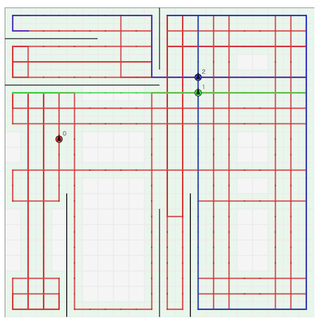

# 第三回マスターズ選手権-予選-

[TOC]

## 問題概要

- https://atcoder.jp/contests/masters2026-qual
- N\*Nマスの盤面があり、すべてのマスを警備できるように、ロボットを導入したい
- ロボットは最大で N^2 台導入できる
  - 各ロボットは、それぞれ最大で4\*N^2通りの内部状態を設定できる
    - 前方に壁があるとき/ないときの「行動」と「遷移先」を設定できる
  - 初期状態として、位置と向きを自由に決めることができる
- ロボットが周期的な行動中に訪れるマスが警備対象マスとなる
- また、盤面には壁があり、追加することもできる
- 導入するロボットの台数をK、内部状態の総和をM、追加壁の本数をWとして、コストV \= A_K \* (K-1) \+ A_M \* M \+ A_W \* W とする
  - A_K, A_M, A_W はそれぞれ問題ごとに異なる
  - 問題A: 台数の制限なし、追加壁コストが大きい
  - 問題B: 台数コストが大きい、内部状態数コストや追加壁コストは小さめ
  - 問題C: 台数コストと追加壁コストが大きい
- できるだけ導入コストが低い方法を求めよ

## 時間

- 360 分

## 個人的メモ

### 手でパターンを作る

- 典型的なものは手で作って考えることができる
- その場で回転(1マス)
  - 「L 0 L 0」などその場で回転するようにすれば、そのマスに留まる
- 長方形ぐるぐる
  - 「F 0 L 0」のようにすると、どこかで長方形をぐるぐる回る(または直線を入ったり来たりする)ような感じになる
- 1列往復
  - 「F 0 L 1」「L 0 L 0」のようにすると壁の範囲で上下に往復するような動きができる
- 蛇腹往復
  - 6状態ぐらいを使って列をずらしながら行ったり来たりする動きをさせることができる
  - 盤面を短冊上など領域分割してそこを少ない状態のロボット1台で担当する、など
- 右手法(左手法)
  - 迷路などで、壁に右手を当てて沿うように動くとゴールできるというのを活用して、壁に沿うように動かすことができる
  - 5状態とかで作れる

### 1台で全面カバー

- 問題Aでもロボットの台数が増えると状態総数は増えてしまうので、問題B、Cも含めて、ロボット1台でカバーできないか検討する余地がある

#### マスを頂点として木を作って辺上を移動する

- 状態数を気にしなければ、マスを頂点とした木を作って、その木の辺を移動すると1台でカバーできる
  - 壁以外で方向転換するには状態が必要になってしまうので、できるだけ直進が多いとうれしい
  - dfs木、パスや木構造を探索する、など
- 状態自体はループするはずだが、圧縮できるかはあまり自明でなくて、難易度高いかも

#### 少ない状態数で全面カバーできるオートマトンを探す

- (コンテスト中、開始2時間ぐらいで上位がロボット1台で「平均状態数が9」、開始4時間で「平均状態数が6」みたいなことになっていた)
- 少ない状態数でどれだけカバーできるか？を調べようとすると、結構カバーできる可能性があることがわかる

##### オートマトンの探索

- 全探索(初期状態含む)は状態数m\=3でも結構厳しいので、ある程度効率的に探索することを考える必要がある
- 局所改善(オートマトンの一部の変更(ある状態の一部分だけ変えるとか、何箇所かまとめて変えるとか))が結構効くようで、ベスト解を保持してそれを変えるのをたくさん試す感じだったり、焼きなまし(多点？)などで結構見つかる模様
  - 全部をランダムにオートマトンを生成してチェックするよりは、かなり見つけられる
  - 焼きなましよりランダム生成の方がよいという話も
    - https://x.com/square10011/status/2028049661689516282
- 状態数が多い場合は、遷移しない状態/遷移したら抜け出せない状態(吸収状態)が含まれる場合があり、それらは削る余地がある

##### 初期状態の探索、全面カバーチェック

- 「周期的な動き」は、単純にマスでの状態をメモしながらシミュレーションして、同じ状態がでたら繰り返しとわかるので、それで求めることができ、全面カバーしているかは、もう一周して確かめるか、カウントして求めるなどできる
  - AIに任せたら全状態空間前計算方式なるもので計算してくれていたが、短く終わってしまうオートマトンなどもあり、無駄が多いためか遅い
- ロボットは初期状態として(初期位置, 向き)が設定できるため、4\*N^2 の探索が必要そうに見える
- しかし、もし全面カバーしているならば、周期的動きをしているとき、あるマスの4方向いずれかをいずれかの状態indexで必ず通過するはずなので、そこからスタートすると考えると、全マスで調べる必要がない
  - (0,0)の場合は、上と左が壁でマスの移動ができるのは下か右だけなので、2方向 & いずれかの状態index(M通り)の2\*M通りだけを調べればよい
  - 開始状態indexが0でない場合は、初期位置を(0,0)にするなら、出力時に状態の順番やindexを入れ替えるようにする必要がある

##### 状態数m\=4で全面カバー

- テストケースにもよるが、状態数m\=4で全面カバーできるものがある
- 動きとしては、壁がないとき、斜めにジグザグに動くような感じ(「F 1 ? ?」「L 2 ? ?」「F 3 ? ?」「R 0 ? ?」のようなもの)など、いくつかある模様
  - 上のFLFR1230パターン(4096個？)であれば短い時間で全列挙＆確認できる(テストケースの60%ぐらいに対応できるっぽい)
  - https://x.com/tsukammo/status/2028465134679851295

##### 強いパターン

- 激強m\=6解もあるようで、テストケースの95%ぐらいに対応できている
  - https://x.com/shr_pc/status/2028048915153797330 (Text形式提出)
    - 左手法\+往復
  - https://x.com/keroru10/status/2028420105533837404
- FLFRLR型、FLFRFLR型
  - https://x.com/Shun___PI/status/2028048301669716108

##### 問題B

- m\=4,5あたりと追加壁1,2枚ぐらいでも結構カバーできる模様

##### 埋め込み解

- 見つかったm\=4,5,6あたりの解をできるだけ多くの解をそのままコードに埋め込んで、全面カバーできているか試す、というのが結構有効だったようで、上位は埋め込み解が多かった模様
  - 初期状態(位置や向き)は気にせず、全部そのまま埋め込んで試す
    - (初期状態などのケースごとへの対応が必要かや、汎用度の高い解をどうするか、など考えてしまって手が止まってしまったが、何も考えずに試してみるべきだった)

### その他

#### 想定アプローチ

- https://x.com/wata_orz/status/2028049780539314424
  - できるだけ状態の少ないオートマトンを用意して、以下のように分かれる想定だったとのこと
    - 問題A: 複数オートマトンで対応
    - 問題B: 壁を増やして対応
    - 問題C: 状態多いのを短くするのを頑張る

## 解説

(50位まで&発言を見つけられた方のみ)

- [writerコメント](https://x.com/wata_orz/status/2028048408242753606)
  - https://x.com/wata_orz/status/2028049780539314424
  - https://x.com/wata_orz/status/2028051793373180179

- [三人衆](https://x.com/sigma425/status/2028049363197657345)
  - https://x.com/yosupot/status/2028055837089169779
- [全国共通おこめ券](https://x.com/border_of_ymg/status/2028051067968328111)
  - https://x.com/border_of_ymg/status/2028055757305082330
  - https://x.com/border_of_ymg/status/2028056656593268821
  - https://x.com/border_of_ymg/status/2028096535519732039
  - https://x.com/fuwaorune/status/2028050953140928540
  - https://x.com/Koi1583/status/2028049531464728950
- [プリン焼きなま縛りマシーン](https://x.com/takumi152/status/2028049187720593505)
  - https://x.com/yochan_tech/status/2028048757020070345
  - https://x.com/terry_u16/status/2028049173044691354
  - https://x.com/terry_u16/status/2028049466557890706
  - https://x.com/terry_u16/status/2028051355940843756
  - https://x.com/terry_u16/status/2028052772965564523
  - https://x.com/terry_u16/status/2028054179156226288
- [FIRST](https://x.com/bowwowforeach/status/2028077175333867864)
  - https://x.com/Shun___PI/status/2028048301669716108
  - https://x.com/Shun___PI/status/2028049528721744308
  - https://x.com/Shun___PI/status/2028052546762469514
  - https://x.com/Shun___PI/status/2028053333253267677
  - https://x.com/mih28731325/status/2028070018047783096
- [チーム子育て](https://x.com/kyuridenamida/status/2028122358318617007)
- [貪欲から逃げない](https://x.com/tomerun/status/2028050942940401677)
  - https://x.com/shr_pc/status/2028048915153797330
  - https://x.com/_simanman/status/2028048034391875891
  - https://x.com/_simanman/status/2028048290147917955
  - https://x.com/_simanman/status/2028048998427447419
  - https://x.com/_simanman/status/2028049392239002040
  - https://x.com/_simanman/status/2028054462053695881
- [pray to win](https://x.com/nrvkpr/status/2028051290501402937)
  - https://x.com/kiri8128/status/2028078131748474945
- [早起きに自信ありません](https://x.com/iwashi31/status/2028081071192145937)
  - https://x.com/iwashi31/status/2028085824638849130
  - https://x.com/iwashi31/status/2028086276193403205
  - https://x.com/iwashi31/status/2028130910806380958
  - https://x.com/yunix91201367/status/2028051630256763357
- [厳選和牛 焼肉食べ放題 眞牛館 赤坂本店](https://x.com/ei1333/status/2028050968152302010)
  - https://x.com/ei1333/status/2028054324824375507
- [青二才と天才](https://x.com/3keymikky/status/2028049059458793730)
- [てんぷら大好きねっしーくん](https://x.com/tempuracpp/status/2028049242326225026)
  - https://x.com/tempuracpp/status/2028053353939575049
- [最適ゴリラ理論](https://x.com/theory_and_me/status/2028056380519899345)
  - https://x.com/MathGorilla_cp/status/2028083940431688142
- [MIMAME](https://x.com/mayocornsuki/status/2028107839366152205)
- [Sugar_Moon_Oath](https://x.com/rho__o/status/2028049931123171480)
  - https://x.com/rho__o/status/2028049272416157729
  - https://x.com/Ang_kyopro/status/2028049211640709297
  - https://x.com/Ang_kyopro/status/2028050654217011708
  - https://x.com/Ang_kyopro/status/2028051146724790337
  - https://x.com/Ang_kyopro/status/2028053473674318312
- [Maximum](https://x.com/sor4chi/status/2028058488308650420)
  - https://x.com/kosumo77/status/2028105745758290172
- [Optimization I.G](https://x.com/tsukammo/status/2028053059050582241)
  - https://x.com/tsukammo/status/2028061744682438897
  - https://x.com/tsukammo/status/2028191813962788993
  - https://x.com/tsukammo/status/2028465134679851295
  - https://x.com/omi_UT/status/2028049079897649636
  - https://x.com/omi_UT/status/2028051447431168425
  - https://x.com/omi_UT/status/2028051553853321610
- [アヒル・クサネコ・ネズミ](https://x.com/ScatNeko/status/2028050271616880918)
  - https://x.com/bio4eta_/status/2028048812980507127
- [NIDS!23](https://x.com/Jinapetto/status/2028050355725181408)
- [ichyokozuna](https://x.com/yokozuna_57/status/2028050293523660908)
  - https://x.com/yokozuna_57/status/2028049832141869329
- [AlcoHoliC](https://x.com/t33f/status/2028428883104850042)
  - https://x.com/keroru10/status/2028050248887935480
  - https://x.com/keroru10/status/2028420105533837404
  - https://x.com/nurupo1530/status/2028051312919892340
- [Monday is almost here](https://x.com/hiromi_ayase/status/2028271847629001172)
- [#みてるぜKOP7th](https://x.com/square10011/status/2028049661689516282)
  - https://x.com/square10011/status/2028061383850615043
  - https://x.com/butsurizuki/status/2028048493152219226
  - https://x.com/butsurizuki/status/2028052859829494209
- [Async Error Squad](https://x.com/BinomialSheep/status/2028053717669519444)
  - https://x.com/BinomialSheep/status/2028055234501922884
- [Bue World](https://x.com/soiya_ksk/status/2028052007656022270)
  - https://x.com/soiya_ksk/status/2028060029295923472
  - https://x.com/soiya_ksk/status/2028109881484644820
- [Soft Constraints](https://x.com/mtmr_s1/status/2028058425872240831)
- [Spacecat](https://x.com/tanakh/status/2028053436168798515)
  - https://x.com/tanakh/status/2028053848628302166
  - https://x.com/tanakh/status/2028055212213293057
  - https://x.com/tanakh/status/2028055535879381467
  - https://x.com/tanakh/status/2028059189868962054
  - https://x.com/tanakh/status/2028470705080447238
- [sumohiro](https://x.com/gojira_kyopro/status/2028048421547049270)
  - https://x.com/gojira_kyopro/status/2028049080765866219
  - https://x.com/gojira_kyopro/status/2028049439341068608
  - https://x.com/gojira_kyopro/status/2028051295127687637

## Links

- https://x.com/hashtag/AtCoder%E3%83%9E%E3%82%B9%E3%82%BF%E3%83%BC%E3%82%BA%E9%81%B8%E6%89%8B%E6%A8%A92026
