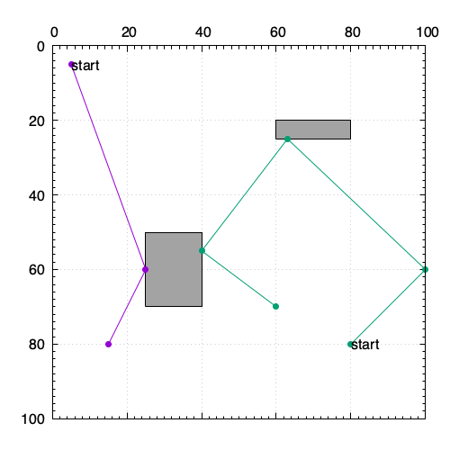

# gnuplotで簡易ビジュアライザ

[TOC]

## 概要

- gnuplotは、2次元や3次元のグラフを作成するツールだが、簡単なビジュアライザとしても利用できる
  - c++でプログラムを書いてpltファイルを出力してプロットして確認、みたいな利用
  - pythonならmatplotlib
- AHCやTopcoder MMでは公式ビジュアライザが用意されており、そちらで十分な場合が多いが、より細かい情報や焼きなましの過程など確認したい場合、自分で用意したほうが良い
- よく使う機能をまとめておく
- (4系と5系での違いがあったりするので、使っているバージョンの本家マニュアルを参照したほうが良い)

## Usage
簡単な使い方としては、gnuplotのコマンド書いたファイル(例えば`vis.plt`)を用意して、`$ gnuplot vis.plt`と実行する。



```
# vis.pltの中身の例
set terminal pngcairo size 500,500
set output "output.png"
set size ratio 1
set grid
set nokey
set xrange [0:100]
set yrange [100:0]
set format x ""
set x2tics
set mxtics 10
set mx2tics 10
set mytics 10

set label 1 "start" at 5,5 front
set label 2 "start" at 80,80 front
set object 3 rect from 25,50 to 40,70 fc "#a3a3a3"
set object 4 rect from 60,20 to 80,25 fc "#a3a3a3"

plot "-" w lp pt 7, "-" w lp pt 7
5.0 5.0
25.0 60.0
15.0 80.0
e
80.0 80.0
100.0 60.0
63.0 25.0
40.0 55.0
60.0 70.0
e
```

## コマンドメモ

### set関連

```
# pngで出力、画像サイズ
set terminal pngcairo size 500,500

# 出力ファイル名
set output "output.png"

# サイズ比を1にする
set size ratio 1

# 大きな目盛の表示
set xtics 10
set ytics 10

# 小さな目盛の表示
set mxtics 10
set mxtics 10

# 軸の数字の非表示
set notics
または
set format x ""

# 格子の表示
set grid

# 凡例の非表示
set nokey

# 表示範囲
set xrange [0:100]
set yrange [0:100]
反転させる場合は、(5系からreverseは使えない)
set yrange [100:0]

# ラベルの表示
set xlabel "label x"
set ylabel "label y"

# タイトルの表示
set title "graph title"

# 上または右の目盛り
set x2tics
set y2tics
```

### object関連
`<id>`は連番でかぶらないように振っておく。

```
# 長方形の表示
set object <id> rect from 25,50 to 40,70 fc "#a3a3a3"

# 円(楕円)、多角形なども表示できる
(省略)

# 文字の表示(frontは描画要素より前に表示される)
set label <id> "start" at 5,5 front

# 文字を中央揃えで表示
set label <id> "start" center at 5,5 front
```

### font関連

```
set title "hoge" font "Times-Roman,20"
```

### plot関連

```
# file.datの1列目と3列目をx,yにプロット
plot "file.dat" using 1:3

# 線の種類(withなどはwと省略可能)
plot "file.dat" using 1:2 with 線の種類 linecolor rgb 色 ...

## 線の種類
lines: 直線
docs: 点
points: 記号
lp: lines+points
impluses: x軸に垂線を下ろす(棒グラフ)
steps,fsteps,histsteps: ヒストグラム
boxes: 棒グラフ
yerrorbars,xerrorbars,xyerrorbars: 誤差付きデータ点
vector: ベクトル

# インラインデータ(データを埋め込む場合、"-"を指定してeまでがデータとして扱われる)
plot "-" w lp
0 0
1 2
e

# 複数データ(同じファイルに、2行以上の空行を区切りとして複数データがある場合、0-indexで指定できる)
plot "file.dat" index 0, "" index 1

# インラインで複数データ
plot "-" w lp, "-" w lp
5.0 5.0
25.0 60.0
15.0 80.0
e
80.0 80.0
100.0 60.0
63.0 25.0
40.0 55.0
60.0 70.0
e
```

## プロットタイプ別

### グリッド

- `vis.plt`をダンプ、または、`vis.plt`を生成するスクリプトを用意
- `noborder`、`noxtics`、`noytics`して、各セルを長方形objectとして表示

### アニメーション

- 一応、pltファイル内でループを書くこともできるが、複数pltファイルを出力して、あとでまとめたほうがよいかも

```
# pltファイル内でループを書く場合の例
if(exist("n")==) n=0
filename = sprintf("out_%03d.png", n)

# plot ...

n=n+1
pause 0.1
if(n<50) reread
```

## ファイルを経由しないで直接実行

```c++
FILE* gp;
if ((gp = popen("gnuplot", "w")) == nullptr) {
    cerr << "error: pipe open error." << endl;
    return;
}
std::stringstream ss;
ss << "set terminal png size 512,512\n";
ss << "set output \"" << filename << "\"\n";
ss << "set size ratio 1\n";
ss << "set title \"" << title << "\"\n";
ss << "set grid\n";
ss << "set nokey\n";
ss << "unset xtics\n";
ss << "unset ytics\n";
ss << "set xrange [0:10000]\n";
ss << "set yrange [10000:0] reverse\n";
//...
ss << "\n";
ss << "plot \"-\" w p\n";
ss << "-1 -1\n";
ss << "e\n";

fprintf(gp, ss.str().c_str());
fflush(gp);
fprintf(gp, "exit\n");
pclose(gp);
```

```c++
// gnuplot.hh
#pragma once

#include <cassert>
#include <cstdio>
#include <memory>
#include <sstream>
#include <string>

class Gnuplot {
    std::unique_ptr<FILE, decltype(&pclose)> gp;
    int obj_id;

   public:
    Gnuplot() : gp(popen("gnuplot", "w"), pclose), obj_id(1) {
        assert(gp);
    }
    ~Gnuplot() {
        print("exit");
    }

    void print(const std::string& line) {
        fprintf(gp.get(), line.c_str());
        fprintf(gp.get(), "\n");
        fflush(gp.get());
    }

    void set_label(int y, int x, const std::string& label, bool center = true) {
        std::stringstream ss;
        ss << "set label " << obj_id++ << " \"" << label << "\" ";
        if (center) ss << "center ";
        ss << "at " << x << "," << y << " front";
        print(ss.str());
    }

    void set_rect(int y1, int x1, int y2, int x2, const std::string& color) {
        std::stringstream ss;
        ss << "set object " << obj_id++ << " ";
        ss << "rect from " << x1 << "," << y1 << " to " << x2 << "," << y2 << " ";
        ss << "fc \"" << color << "\"";
        print(ss.str());
    }

    // 以下、設定例・サンプル
    void initialize(const std::string& file_path, const std::string& title) {
        std::stringstream ss;
        ss << "set terminal pngcairo size 800,800\n";
        ss << "set output \"" << file_path << "\"\n";
        ss << "set size ratio 1\n";
        ss << "set title \"" << title << "\"\n";
        ss << "set grid\n";
        ss << "set nokey\n";
        ss << "set xrange [0:100]\n";
        ss << "set yrange [100:0]\n";
        ss << "set format x \"\"\n";
        ss << "set x2tics\n";
        ss << "set mxtics 10\n";
        ss << "set mx2tics 10\n";
        ss << "set mytics 10\n";
        print(ss.str());
    }

    void set_grid(int H, int W, int size) {
        for (int h = 0; h < H; h++) {
            for (int w = 0; w < W; w++) {
                std::string color = "#ffffff";
                if (h % 2 == 0)
                    color = "#ff7f7f";
                else if (w % 4 == 0)
                    color = "#7fff7f";

                set_rect(h * size, w * size, (h + 1) * size, (w + 1) * size, color);
                std::stringstream ss;
                ss << "(" << h << "," << w << ")";
                set_label(h * size + size / 2, w * size + size / 2, ss.str());
            }
        }
    }

    void set_sample_plot() {
        print("plot \"-\" w lp pt 7");
        print("5.0 5.0");
        print("25.0 60.0");
        print("e");
    }

    void set_sample_plot2() {
        print("plot \"-\" w l lw 3 lc rgb \"gray\"");
        print("5 5");
        print("5 15");
        print("");
        print("5 5");
        print("15 5");
        print("");
        print("e");
    }

    void set_sample_plot3() {
        print("plot \"-\" w l lw 3 lc rgb \"gray\", \"-\" w l lw 3 lc rgb \"red\"");
        print("5 5");
        print("5 15");
        print("");
        print("5 5");
        print("15 5");
        print("");
        print("e");

        print("15 15");
        print("15 25");
        print("");
        print("15 15");
        print("25 15");
        print("");
        print("e");
    }
};
```

## Links

- [公式ページ](http://www.gnuplot.info/)
